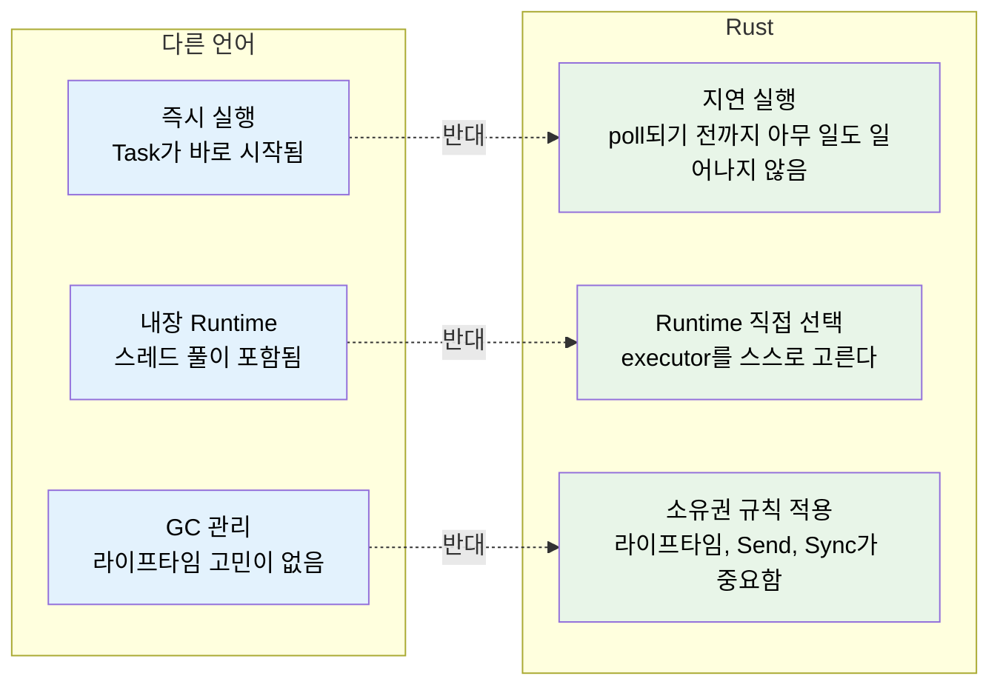
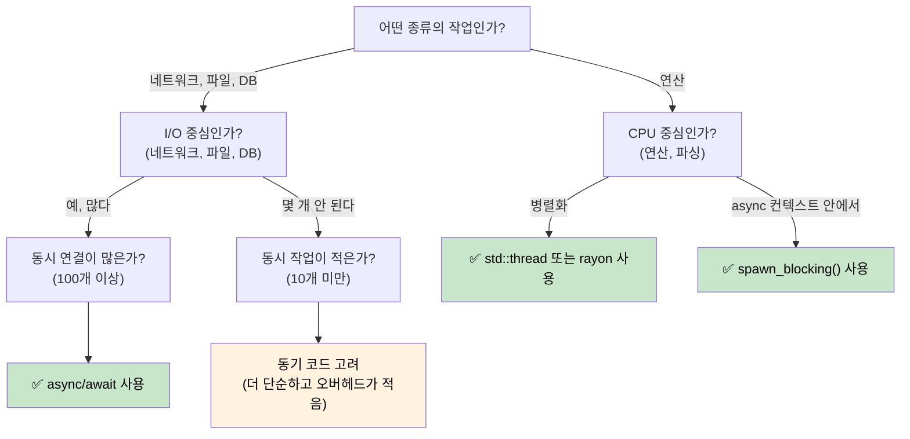

<a id="why-async-is-different-in-rust"></a>
# 1. Rust에서 Async가 다른 이유 🟢

> **이 장에서 배울 내용:**
> - Rust에 내장 async runtime이 없는 이유와 그것이 실제로 뜻하는 바
> - 세 가지 핵심 특징: 지연 실행, runtime 부재, zero-cost abstraction
> - async가 맞는 경우와 오히려 더 느릴 수 있는 경우
> - Rust의 모델을 C#, Go, Python, JavaScript와 비교하는 방법

<a id="the-fundamental-difference"></a>
## 근본적인 차이

`async/await`를 지원하는 대부분의 언어는 내부 동작을 감춥니다. C#에는 CLR 스레드 풀이 있고, JavaScript에는 이벤트 루프가 있으며, Go에는 runtime에 내장된 goroutine과 스케줄러가 있고, Python에는 `asyncio`가 있습니다.

**Rust에는 그런 것이 없습니다.**

내장 runtime도, 스레드 풀도, 이벤트 루프도 없습니다. `async` 키워드는 zero-cost 컴파일 전략일 뿐이며, 함수를 `Future` 트레잇을 구현하는 상태 머신으로 변환합니다. 그리고 그 상태 머신을 실제로 앞으로 진행시키는 역할은 다른 누군가, 즉 *executor*가 맡아야 합니다.

<a id="three-key-properties-of-rust-async"></a>
### Rust Async의 세 가지 핵심 특징



<a id="no-built-in-runtime"></a>
### 내장 Runtime이 없다

```rust
// 이 코드는 컴파일되지만 아무 일도 하지 않는다:
async fn fetch_data() -> String {
    "hello".to_string()
}

fn main() {
    let future = fetch_data(); // Future를 만들지만 실행하지는 않는다
    // future는 그저 스택 위에 놓인 구조체일 뿐이다
    // 출력도 없고, 부작용도 없고, 아무 일도 일어나지 않는다
    drop(future); // 조용히 drop된다 — 작업은 시작조차 하지 않았다
}
```

`Task`가 즉시 시작되는 C#과 비교해 보면:

```csharp
// C#에서는 이 호출이 즉시 실행을 시작한다:
async Task<string> FetchData() => "hello";

var task = FetchData(); // 이미 실행 중!
var result = await task; // 완료될 때까지 기다리기만 한다
```

<a id="lazy-futures-vs-eager-tasks"></a>
### 지연 Future와 즉시 시작되는 Task

이것이 가장 중요한 사고방식의 전환입니다:

| | C# / JavaScript / Python | Go | Rust |
|---|---|---|---|
| **생성** | `Task`가 즉시 실행을 시작함 | goroutine이 즉시 시작됨 | `Future`는 poll되기 전까지 아무 일도 하지 않음 |
| **drop 시** | 분리된 task는 계속 실행됨 | goroutine은 반환될 때까지 실행됨 | `Future`를 drop하면 취소됨 |
| **Runtime** | 언어/VM에 내장됨 | 바이너리에 내장됨(M:N 스케줄러) | 직접 선택함(tokio, smol 등) |
| **스케줄링** | 자동(스레드 풀) | 자동(GMP 스케줄러) | 명시적(`spawn`, `block_on`) |
| **취소** | `CancellationToken`(협력적) | `context.Context`(협력적) | future를 drop함(즉시) |

```rust
// Future를 실제로 실행하려면 executor가 필요하다:
#[tokio::main]
async fn main() {
    let result = fetch_data().await; // 이제 실행된다
    println!("{result}");
}
```

<a id="when-to-use-async-and-when-not-to"></a>
### Async를 써야 할 때와 그렇지 않을 때



**실전 감각으로 기억할 규칙**: async는 CPU 병렬성(한 가지 일을 더 빨리 끝내기)이 아니라 I/O 동시성(기다리는 동안 여러 일을 동시에 처리하기)을 위한 도구입니다. 네트워크 연결이 10,000개라면 async가 빛을 발합니다. 숫자 계산이 주된 작업이라면 `rayon`이나 OS 스레드를 쓰세요.

<a id="when-async-can-be-slower"></a>
### Async가 더 느릴 수 있는 경우

async는 공짜가 아닙니다. 동시성이 낮은 워크로드에서는 동기 코드가 async보다 더 빠를 수 있습니다:

| 비용 | 이유 |
|------|-----|
| **상태 머신 오버헤드** | `.await`를 하나 추가할 때마다 enum variant가 늘어나며, 깊게 중첩된 future는 크고 복잡한 상태 머신을 만든다 |
| **동적 디스패치** | `Box<dyn Future>`는 간접 참조를 추가해 inlining을 방해한다 |
| **컨텍스트 전환** | 협력적 스케줄링도 비용이 있다 — executor는 task queue, waker, I/O 등록을 관리해야 한다 |
| **컴파일 시간** | async 코드는 더 복잡한 타입을 생성하므로 컴파일이 느려질 수 있다 |
| **디버깅 난이도** | 상태 머신을 통과하는 스택 트레이스는 읽기가 더 어렵다(12장 참고) |

**벤치마킹 가이드**: 동시에 처리하는 I/O 작업이 대략 10개보다 적다면, async로 확정하기 전에 먼저 프로파일링하세요. 현대 Linux에서는 연결마다 `std::thread::spawn` 하나를 쓰는 단순한 방식도 수백 개 스레드까지는 충분히 잘 버팁니다.

<a id="exercise-when-would-you-use-async"></a>
### 연습문제: 언제 Async를 써야 할까?

<details>
<summary>🏋️ 연습문제 (클릭해서 펼치기)</summary>

각 상황에서 async가 적절한지 판단하고, 그 이유를 설명해 보세요:

1. 동시 WebSocket 연결 10,000개를 처리하는 웹 서버
2. 하나의 큰 파일을 압축하는 CLI 도구
3. 서로 다른 데이터베이스 5개를 조회한 뒤 결과를 합치는 서비스
4. 60 FPS로 물리 시뮬레이션을 돌리는 게임 엔진

<details>
<summary>🔑 해답</summary>

1. **Async** — I/O 중심이고 동시성이 매우 크다. 각 연결은 대부분의 시간을 데이터를 기다리며 보낸다. 스레드로 처리하면 1만 개 스택이 필요하다.
2. **동기/스레드** — CPU 중심의 단일 작업이다. async는 이점 없이 오버헤드만 더한다. 병렬 압축이 필요하다면 `rayon`을 쓰면 된다.
3. **Async** — 동시에 기다려야 하는 I/O가 다섯 개 있다. `tokio::join!`으로 다섯 쿼리를 한꺼번에 진행할 수 있다.
4. **동기/스레드** — CPU 중심이며 지연 시간에 민감하다. async의 협력적 스케줄링은 프레임 흔들림을 만들 수 있다.

</details>
</details>

> **핵심 정리 — Rust에서 Async가 다른 이유**
> - Rust future는 **지연(lazy)** 되어 있으며 executor가 poll하기 전까지 아무 일도 하지 않는다
> - **내장 runtime이 없다** — 직접 선택하거나 직접 만들어야 한다
> - async는 상태 머신을 만들어 내는 **zero-cost 컴파일 전략**이다
> - async는 **I/O 중심 동시성**에 강하며, CPU 중심 작업에는 스레드나 `rayon`이 더 적합하다

> **참고:** [2장 — Future 트레잇](ch02-the-future-trait.md), [7장 — Executor와 Runtime](ch07-executors-and-runtimes.md)

***


