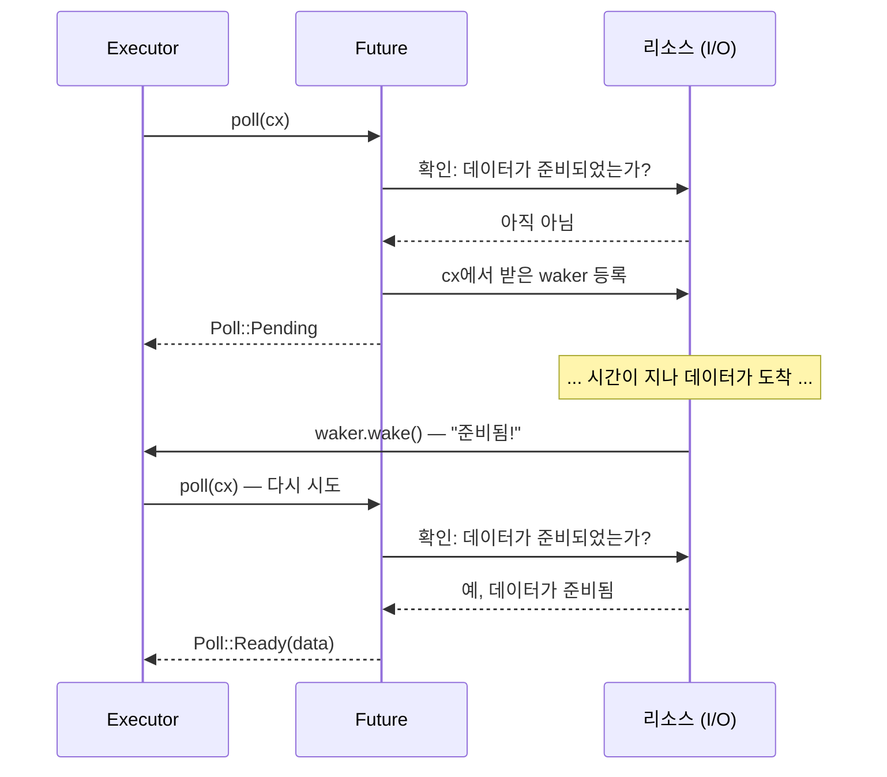

<a id="the-future-trait"></a>
# 2. Future 트레잇 🟡

> **이 장에서 배울 내용:**
> - `Future` 트레잇의 구성 요소: `Output`, `poll()`, `Context`, `Waker`
> - waker가 executor에게 "나를 다시 poll해 달라"고 알리는 방법
> - `wake()`를 호출하지 않으면 프로그램이 조용히 멈추는 이유
> - 실제 future를 손으로 구현해 보기(`Delay`)

<a id="anatomy-of-a-future"></a>
## Future의 구성

Async Rust의 모든 것은 결국 이 트레잇을 구현합니다:

```rust
pub trait Future {
    type Output;

    fn poll(self: Pin<&mut Self>, cx: &mut Context<'_>) -> Poll<Self::Output>;
}

pub enum Poll<T> {
    Ready(T),   // future가 값 T와 함께 완료되었다
    Pending,    // 아직 준비되지 않았다 — 나중에 다시 호출해 달라
}
```

정말 이게 전부입니다. `Future`란 *poll할 수 있는* 모든 것이며, "끝났니?"라고 물었을 때 "응, 결과는 이거야" 혹은 "아직 아니야, 준비되면 깨워 줄게"라고 답하는 값입니다.

<a id="output-poll-context-waker"></a>
### Output, poll(), Context, Waker



이제 각 조각을 하나씩 보겠습니다:

```rust
use std::future::Future;
use std::pin::Pin;
use std::task::{Context, Poll};

// 즉시 42를 반환하는 future
struct Ready42;

impl Future for Ready42 {
    type Output = i32; // future가 최종적으로 만들어 내는 값

    fn poll(self: Pin<&mut Self>, _cx: &mut Context<'_>) -> Poll<i32> {
        Poll::Ready(42) // 항상 준비되어 있음 — 기다릴 필요가 없다
    }
}
```

**구성 요소**:
- **`Output`** — future가 완료되었을 때 만들어 내는 값의 타입
- **`poll()`** — executor가 진행 상황을 확인하려고 호출하며, `Ready(value)` 또는 `Pending`을 반환한다
- **`Pin<&mut Self>`** — future가 메모리에서 이동하지 않도록 보장한다(이유는 4장에서 다룸)
- **`Context`** — `Waker`를 담고 있어, future가 다시 진행 가능해졌을 때 executor에 신호를 보낼 수 있게 한다

<a id="the-waker-contract"></a>
### Waker 계약

`Waker`는 콜백 메커니즘입니다. future가 `Pending`을 반환한다면, 나중에 반드시 `waker.wake()`가 호출되도록 준비해 두어야 합니다. 그렇지 않으면 executor는 그 future를 다시 poll하지 않으며, 프로그램은 그대로 멈춥니다.

```rust
use std::task::{Context, Poll, Waker};
use std::pin::Pin;
use std::future::Future;
use std::sync::{Arc, Mutex};
use std::thread;
use std::time::Duration;

/// 일정 시간이 지난 뒤 완료되는 future(장난감 구현)
struct Delay {
    completed: Arc<Mutex<bool>>,
    waker_stored: Arc<Mutex<Option<Waker>>>,
    duration: Duration,
    started: bool,
}

impl Delay {
    fn new(duration: Duration) -> Self {
        Delay {
            completed: Arc::new(Mutex::new(false)),
            waker_stored: Arc::new(Mutex::new(None)),
            duration,
            started: false,
        }
    }
}

impl Future for Delay {
    type Output = ();

    fn poll(mut self: Pin<&mut Self>, cx: &mut Context<'_>) -> Poll<()> {
        // 이미 완료되었는지 확인
        if *self.completed.lock().unwrap() {
            return Poll::Ready(());
        }

        // 백그라운드 스레드가 우리를 깨울 수 있도록 waker를 저장
        *self.waker_stored.lock().unwrap() = Some(cx.waker().clone());

        // 첫 번째 poll에서만 백그라운드 타이머를 시작
        if !self.started {
            self.started = true;
            let completed = Arc::clone(&self.completed);
            let waker = Arc::clone(&self.waker_stored);
            let duration = self.duration;

            thread::spawn(move || {
                thread::sleep(duration);
                *completed.lock().unwrap() = true;

                // 중요: executor를 깨워서 우리를 다시 poll하게 만들어야 한다
                if let Some(w) = waker.lock().unwrap().take() {
                    w.wake(); // "executor야, 이제 준비됐어 — 다시 poll해 줘!"
                }
            });
        }

        Poll::Pending // 아직 끝나지 않았다
    }
}
```

> **핵심 통찰:** C#에서는 TaskScheduler가 깨우기 동작을 자동으로 처리합니다.
> Rust에서는 **여러분 자신**(혹은 사용하는 I/O 라이브러리)이 `waker.wake()`를 호출해야 합니다.
> 이 호출을 빼먹으면 프로그램은 조용히 멈춥니다.

<a id="exercise-implement-a-countdownfuture"></a>
### 연습문제: CountdownFuture 구현하기

<details>
<summary>🏋️ 연습문제 (클릭해서 펼치기)</summary>

**과제**: `CountdownFuture`를 구현해 보세요. 이 future는 N에서 0까지 카운트다운하며, poll될 때마다 현재 숫자를 출력합니다. 0에 도달하면 `Ready("Liftoff!")`로 완료되어야 합니다.

*힌트*: 현재 카운트를 future 내부에 저장하고, poll될 때마다 감소시키면 됩니다. 그리고 매번 waker를 다시 등록하는 것도 잊지 마세요!

<details>
<summary>🔑 해답</summary>

```rust
use std::future::Future;
use std::pin::Pin;
use std::task::{Context, Poll};

struct CountdownFuture {
    count: u32,
}

impl CountdownFuture {
    fn new(start: u32) -> Self {
        CountdownFuture { count: start }
    }
}

impl Future for CountdownFuture {
    type Output = &'static str;

    fn poll(mut self: Pin<&mut Self>, cx: &mut Context<'_>) -> Poll<Self::Output> {
        if self.count == 0 {
            println!("Liftoff!");
            Poll::Ready("Liftoff!")
        } else {
            println!("{}...", self.count);
            self.count -= 1;
            cx.waker().wake_by_ref(); // 즉시 다시 poll되도록 예약
            Poll::Pending
        }
    }
}
```

**핵심 포인트**: 이 future는 카운트마다 한 번씩 poll됩니다. `Pending`을 반환할 때마다 자기 자신을 곧바로 다시 깨워 다음 poll이 일어나게 만듭니다. 실제 프로덕션 코드라면 이런 바쁜 polling 대신 타이머를 사용합니다.

</details>
</details>

> **핵심 정리 — Future 트레잇**
> - `Future::poll()`은 `Poll::Ready(value)` 또는 `Poll::Pending`을 반환한다
> - future는 `Pending`을 반환하기 전에 반드시 `Waker`를 등록해야 한다 — executor는 이 신호를 받아 다시 poll한다
> - `Pin<&mut Self>`는 future가 메모리에서 이동하지 않도록 보장한다(자기 참조 상태 머신에 필요함 — 4장 참고)
> - Async Rust의 모든 것, 즉 `async fn`, `.await`, combinator는 이 하나의 트레잇 위에 세워져 있다

> **참고:** [3장 — Poll은 어떻게 동작하는가](ch03-how-poll-works.md), [6장 — Future를 직접 만들기](ch06-building-futures-by-hand.md)

***


