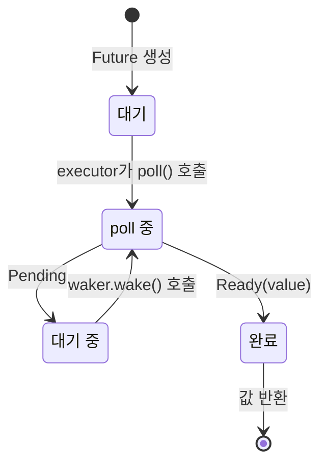

<a id="how-poll-works"></a>
# 3. Poll은 어떻게 동작하는가 🟡

> **이 장에서 배울 내용:**
> - executor의 poll 루프: poll → pending → wake → 다시 poll
> - 최소 executor를 처음부터 직접 만드는 방법
> - 허위 깨우기(spurious wake) 규칙과 그것이 중요한 이유
> - 유용한 도구 함수: `poll_fn()`과 `yield_now()`

<a id="the-polling-state-machine"></a>
## Polling 상태 머신

Executor는 루프를 돌면서 future를 poll합니다. 결과가 `Pending`이면 waker가 불릴 때까지 대기하고, 이후 다시 poll합니다. 이 점이 커널이 스케줄링을 맡는 OS 스레드와의 근본적인 차이입니다.



> **중요:** future가 *대기 중* 상태에 들어갔다면, 그 전에 반드시 I/O 소스에 waker를 등록해 두어야 합니다. 등록이 없으면 영원히 멈춥니다.

<a id="a-minimal-executor"></a>
### 최소 Executor

Executor의 정체를 더 분명히 보기 위해, 가장 단순한 형태부터 직접 만들어 보겠습니다:

```rust
use std::future::Future;
use std::task::{Context, Poll, RawWaker, RawWakerVTable, Waker};
use std::pin::Pin;

/// 가장 단순한 executor: Ready가 될 때까지 바쁘게 poll 반복
fn block_on<F: Future>(mut future: F) -> F::Output {
    // future를 스택에 pin한다
    // SAFETY: 이 지점 이후 `future`는 이동하지 않는다.
    // 완료될 때까지 pinned reference를 통해서만 접근한다.
    let mut future = unsafe { Pin::new_unchecked(&mut future) };

    // no-op waker 생성(그냥 계속 poll만 한다 — 비효율적이지만 단순함)
    fn noop_raw_waker() -> RawWaker {
        fn no_op(_: *const ()) {}
        fn clone(_: *const ()) -> RawWaker { noop_raw_waker() }
        let vtable = &RawWakerVTable::new(clone, no_op, no_op, no_op);
        RawWaker::new(std::ptr::null(), vtable)
    }

    let waker = unsafe { Waker::from_raw(noop_raw_waker()) };
    let mut cx = Context::from_waker(&waker);

    // future가 완료될 때까지 바쁜 루프
    loop {
        match future.as_mut().poll(&mut cx) {
            Poll::Ready(value) => return value,
            Poll::Pending => {
                // 실제 executor라면 여기서 스레드를 재우고
                // waker.wake()를 기다린다 — 우리는 그냥 돈다
                std::thread::yield_now();
            }
        }
    }
}

// 사용 예시:
fn main() {
    let result = block_on(async {
        println!("Hello from our mini executor!");
        42
    });
    println!("Got: {result}");
}
```

> **이 코드를 프로덕션에 쓰면 안 됩니다!** 바쁜 루프를 돌기 때문에 CPU를 낭비합니다. 실제 executor(tokio, smol)는 `epoll`/`kqueue`/`io_uring`을 사용해 I/O 준비가 될 때까지 잠듭니다. 하지만 이 예제는 핵심 아이디어를 잘 보여 줍니다. executor는 결국 `poll()`을 호출하는 루프일 뿐입니다.

<a id="wake-up-notifications"></a>
### 깨우기 알림

실제 executor는 이벤트 기반입니다. 모든 future가 `Pending`이면 executor는 잠듭니다. waker는 그 잠든 executor를 다시 깨우는 인터럽트 메커니즘입니다:

```rust
// 실제 executor 메인 루프의 개념적 모델:
fn executor_loop(tasks: &mut TaskQueue) {
    loop {
        // 1. 깨어난 모든 task를 poll한다
        while let Some(task) = tasks.get_woken_task() {
            match task.poll() {
                Poll::Ready(result) => task.complete(result),
                Poll::Pending => { /* task는 큐에 남아 wake를 기다린다 */ }
            }
        }

        // 2. 무언가가 우리를 깨울 때까지 잠든다(epoll_wait, kevent 등)
        //    여기서 mio/polling 같은 라이브러리가 큰 역할을 한다
        tasks.wait_for_events(); // I/O 이벤트나 waker가 올 때까지 대기
    }
}
```

<a id="spurious-wakes"></a>
### 허위 깨우기

I/O가 아직 준비되지 않았더라도 future가 poll될 수 있습니다. 이를 *허위 깨우기(spurious wake)*라고 합니다. future 구현은 이 상황을 올바르게 처리해야 합니다:

```rust
impl Future for MyFuture {
    type Output = Data;

    fn poll(self: Pin<&mut Self>, cx: &mut Context<'_>) -> Poll<Data> {
        // ✅ 올바른 방식: 실제 조건을 항상 다시 확인한다
        if let Some(data) = self.try_read_data() {
            Poll::Ready(data)
        } else {
            // waker를 다시 등록한다(중간에 바뀌었을 수 있다!)
            self.register_waker(cx.waker());
            Poll::Pending
        }

        // ❌ 잘못된 방식: poll되었다고 바로 준비되었다고 가정함
        // let data = self.read_data(); // block되거나 panic할 수 있다
        // Poll::Ready(data)
    }
}
```

**`poll()` 구현 규칙**:
1. **절대 block하지 말 것** — 준비되지 않았다면 즉시 `Pending`을 반환한다
2. **항상 waker를 다시 등록할 것** — poll 사이에 바뀌었을 수 있다
3. **허위 깨우기를 처리할 것** — 실제 조건을 다시 확인하고, 준비되었다고 추정하지 않는다
4. **`Ready` 이후 다시 poll하지 말 것** — 동작은 **정의되지 않음**(panic할 수도 있고, `Pending`을 돌려줄 수도 있고, 다시 `Ready`를 돌려줄 수도 있다). 완료 후 재poll이 안전하다고 보장하는 것은 `FusedFuture`뿐이다

<a id="exercise-implement-a-countdownfuture"></a>
<details>
<summary><strong>🏋️ 연습문제: CountdownFuture 구현하기</strong> (클릭해서 펼치기)</summary>

**과제**: `CountdownFuture`를 구현해 보세요. 이 future는 N에서 0까지 카운트다운하며, poll될 때마다 현재 숫자를 *출력*하는 부작용을 일으킵니다. 0에 도달하면 `Ready("Liftoff!")`로 완료되어야 합니다. (주의: `Future`는 최종 값 **하나만** 만들어 냅니다. 출력은 yield된 값이 아니라 부작용입니다. 여러 비동기 값을 다루려면 11장의 `Stream`을 보세요.)

*힌트*: 실제 I/O 소스가 필요하지는 않습니다. 매번 감소시킨 뒤 `cx.waker().wake_by_ref()`를 호출해 자기 자신을 즉시 다시 깨우면 됩니다.

<details>
<summary>🔑 해답</summary>

```rust
use std::future::Future;
use std::pin::Pin;
use std::task::{Context, Poll};

struct CountdownFuture {
    count: u32,
}

impl CountdownFuture {
    fn new(start: u32) -> Self {
        CountdownFuture { count: start }
    }
}

impl Future for CountdownFuture {
    type Output = &'static str;

    fn poll(mut self: Pin<&mut Self>, cx: &mut Context<'_>) -> Poll<Self::Output> {
        if self.count == 0 {
            Poll::Ready("Liftoff!")
        } else {
            println!("{}...", self.count);
            self.count -= 1;
            // 즉시 깨워서 항상 다음 단계로 진행할 수 있게 한다
            cx.waker().wake_by_ref();
            Poll::Pending
        }
    }
}

// 우리 미니 executor나 tokio에서의 사용 예시:
// let msg = block_on(CountdownFuture::new(5));
// 출력: 5... 4... 3... 2... 1...
// msg == "Liftoff!"
```

**핵심 포인트**: 이 future는 항상 다음 단계로 진행할 준비가 되어 있지만, 각 단계 사이에 제어권을 넘기기 위해 `Pending`을 반환합니다. 그리고 `wake_by_ref()`를 즉시 호출해 executor가 곧바로 다시 poll하게 만듭니다. 이것이 협력적 멀티태스킹의 기본입니다. 각 future가 자발적으로 양보하는 것입니다.

</details>
</details>

<a id="handy-utilities-poll_fn-and-yield_now"></a>
### 유용한 도구: `poll_fn`과 `yield_now`

표준 라이브러리와 tokio에는 전체 `Future` 구현을 직접 쓰지 않고도 쓸 수 있는 유용한 도구가 두 가지 있습니다:

```rust
use std::future::poll_fn;
use std::task::Poll;

// poll_fn: 클로저 하나로 일회성 future 만들기
let value = poll_fn(|cx| {
    // cx.waker()를 사용해 무언가를 하고 Ready 또는 Pending 반환
    Poll::Ready(42)
}).await;

// 실전 용도: 콜백 기반 API를 async로 연결하기
async fn read_when_ready(source: &MySource) -> Data {
    poll_fn(|cx| source.poll_read(cx)).await
}
```

```rust
// yield_now: executor에 자발적으로 제어권을 양보
// CPU 비중이 큰 async 루프에서 다른 task를 굶기지 않도록 도와준다
async fn cpu_heavy_work(items: &[Item]) {
    for (i, item) in items.iter().enumerate() {
        process(item); // CPU 작업

        // 100개마다 한 번씩 양보해서 다른 task도 실행되게 한다
        if i % 100 == 0 {
            tokio::task::yield_now().await;
        }
    }
}
```

> **`yield_now()`를 써야 하는 경우:** async 함수가 루프 안에서 CPU 작업만 계속하고 `.await` 지점이 하나도 없다면 executor 스레드를 독점하게 됩니다. 이럴 때 `yield_now().await`를 주기적으로 넣어 협력적 멀티태스킹이 가능하게 하세요.

> **핵심 정리 — Poll은 어떻게 동작하는가**
> - executor는 깨어난 future들에 대해 `poll()`을 반복 호출한다
> - future는 **허위 깨우기**를 처리해야 한다 — 실제 조건을 항상 다시 확인하라
> - `poll_fn()`을 사용하면 클로저로 즉석 future를 만들 수 있다
> - `yield_now()`는 CPU 비중이 큰 async 코드에서 협력적 스케줄링을 위한 탈출구다

> **참고:** [2장 — Future 트레잇](ch02-the-future-trait.md), [5장 — 상태 머신의 정체](ch05-the-state-machine-reveal.md)

***


