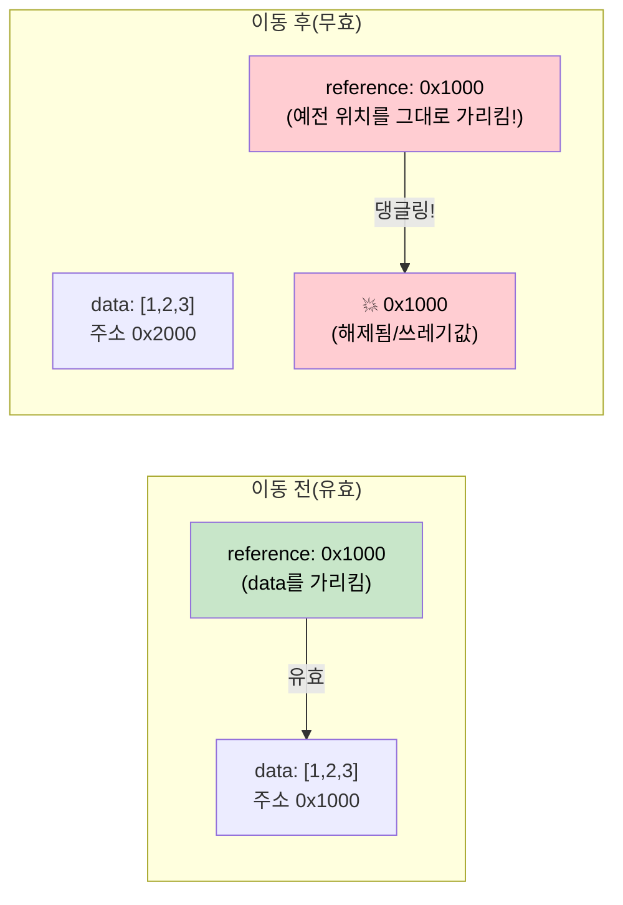

<a id="pin-and-unpin"></a>
# 4. Pin과 Unpin 🔴

> **이 장에서 배울 내용:**
> - 자기 참조 구조체가 메모리에서 이동하면 왜 깨지는지
> - `Pin<P>`가 무엇을 보장하고, 어떻게 이동을 막는지
> - 실전에서 자주 쓰는 세 가지 pinning 패턴: `Box::pin()`, `tokio::pin!()`, `Pin::new()`
> - `Unpin`이 언제 탈출구가 되는지

<a id="why-pin-exists"></a>
## 왜 Pin이 존재하는가

이것은 Async Rust에서 가장 헷갈리기 쉬운 개념입니다. 직관이 생기도록 한 단계씩 살펴보겠습니다.

<a id="the-problem-self-referential-structs"></a>
### 문제: 자기 참조 구조체

컴파일러가 `async fn`을 상태 머신으로 바꾸면, 그 상태 머신은 자기 자신의 필드를 참조하는 값을 포함할 수 있습니다. 이렇게 되면 *자기 참조 구조체(self-referential struct)*가 생기고, 이 값을 메모리에서 옮기면 내부 참조가 무효화됩니다.

```rust
// 컴파일러는 대략 이런 상태 머신을 만든다(단순화):
// async fn example() {
//     let data = vec![1, 2, 3];
//     let reference = &data;       // 위의 data를 가리킨다
//     use_ref(reference).await;
// }

// 결과는 대략 이런 형태가 된다:
enum ExampleStateMachine {
    State0 {
        data: Vec<i32>,
        // reference: &Vec<i32>,  // 문제: 위의 `data`를 가리킨다
        //                        // 이 구조체가 이동하면 포인터가 댕글링된다!
    },
    State1 {
        data: Vec<i32>,
        reference: *const Vec<i32>, // data 필드를 가리키는 내부 포인터
    },
    Complete,
}
```



<a id="self-referential-structs"></a>
### 자기 참조 구조체

이것은 이론적인 걱정이 아닙니다. `.await`를 넘겨 참조를 유지하는 모든 `async fn`은 자기 참조 상태 머신을 만듭니다:

```rust
async fn problematic() {
    let data = String::from("hello");
    let slice = &data[..]; // slice가 data를 빌린다

    some_io().await; // <-- .await 지점: 상태 머신이 data와 slice를 둘 다 저장한다

    println!("{slice}"); // await 이후에도 참조를 사용한다
}
// 생성된 상태 머신은 `data: String`과 `slice: &str`를 가진다
// slice는 data 내부를 가리킨다. 상태 머신을 이동하면 = 댕글링 포인터.
```

<a id="pin-in-practice"></a>
### 실전에서의 Pin

`Pin<P>`는 포인터 뒤에 있는 값을 이동하지 못하게 만드는 래퍼입니다:

```rust
use std::pin::Pin;

let mut data = String::from("hello");

// pin하면 이제 이동할 수 없다
let pinned: Pin<&mut String> = Pin::new(&mut data);

// 여전히 사용할 수는 있다:
println!("{}", pinned.as_ref().get_ref()); // "hello"

// 하지만 &mut String을 다시 꺼낼 수는 없다(mem::swap이 가능해지기 때문):
// let mutable: &mut String = Pin::into_inner(pinned); // String: Unpin일 때만 가능
// String은 Unpin이므로 실제로는 가능하다.
// 하지만 자기 참조 상태 머신(!Unpin)에서는 막힌다.
```

실전 코드에서 Pin은 주로 세 곳에서 만납니다:

```rust
// 1. poll() 시그니처 — 모든 future는 Pin을 통해 poll된다
fn poll(self: Pin<&mut Self>, cx: &mut Context<'_>) -> Poll<Output>;

// 2. Box::pin() — future를 힙에 올리고 pin한다
let future: Pin<Box<dyn Future<Output = i32>>> = Box::pin(async { 42 });

// 3. tokio::pin!() — future를 스택에 pin한다
tokio::pin!(my_future);
// 이제 my_future: Pin<&mut impl Future>
```

<a id="the-unpin-escape-hatch"></a>
### Unpin이라는 탈출구

Rust의 대부분 타입은 `Unpin`입니다. 자기 참조를 갖지 않기 때문에, pin해도 실질적으로 달라지는 것이 없습니다. 반대로 컴파일러가 생성한 상태 머신(`async fn`에서 나온 타입)은 `!Unpin`입니다.

```rust
// 이 타입들은 모두 Unpin이다 — pin해도 특별한 일은 없다:
// i32, String, Vec<T>, HashMap<K,V>, Box<T>, &T, &mut T

// 이 타입들은 !Unpin이다 — poll하기 전에 반드시 pin되어 있어야 한다:
// `async fn`과 `async {}`가 생성한 상태 머신

// 실전적인 의미:
// 직접 Future를 구현했고 자기 참조가 전혀 없다면,
// Unpin을 구현해서 사용하기 쉽게 만들 수 있다:
impl Unpin for MySimpleFuture {} // "날 이동해도 안전하니 믿어도 된다"
```

<a id="quick-reference"></a>
### 빠른 참고

| 무엇 | 언제 | 어떻게 |
|------|------|-----|
| future를 힙에 pin하기 | 컬렉션에 저장하거나 함수에서 반환할 때 | `Box::pin(future)` |
| future를 스택에 pin하기 | `select!` 안에서 로컬로 쓰거나 수동으로 poll할 때 | `tokio::pin!(future)` 또는 `pin-utils`의 `pin_mut!` |
| 함수 시그니처에서 pin 받기 | 이미 pin된 future를 인자로 받을 때 | `future: Pin<&mut F>` |
| Unpin 요구하기 | 생성 후 future를 이동해야 할 때 | `F: Future + Unpin` |

<a id="exercise-pin-and-move"></a>
<details>
<summary><strong>🏋️ 연습문제: Pin과 Move</strong> (클릭해서 펼치기)</summary>

**과제**: 아래 코드 조각 중 어떤 것이 컴파일될까요? 컴파일되지 않는 경우에는 이유를 설명하고 고쳐 보세요.

```rust
// 예제 A
let fut = async { 42 };
let pinned = Box::pin(fut);
let moved = pinned; // Box를 이동
let result = moved.await;

// 예제 B
let fut = async { 42 };
tokio::pin!(fut);
let moved = fut; // pin된 future를 이동
let result = moved.await;

// 예제 C
use std::pin::Pin;
let mut fut = async { 42 };
let pinned = Pin::new(&mut fut);
```

<details>
<summary>🔑 해답</summary>

**예제 A**: ✅ **컴파일됩니다.** `Box::pin()`은 future를 힙에 올립니다. `Box`를 이동해도 이동하는 것은 *포인터*이지 future 본체가 아닙니다. future는 힙의 같은 위치에 pin된 채로 남습니다.

**예제 B**: ❌ **컴파일되지 않습니다.** `tokio::pin!`은 future를 스택에 pin하고, `fut`를 `Pin<&mut ...>`로 다시 바인딩합니다. pin된 참조에서 값을 꺼내 이동할 수는 없습니다. **수정 방법**: 이동하지 말고 그 자리에서 사용하세요.

```rust
let fut = async { 42 };
tokio::pin!(fut);
let result = fut.await; // 재대입하지 말고 바로 사용
```

**예제 C**: ❌ **컴파일되지 않습니다.** `Pin::new()`은 `T: Unpin`을 요구합니다. async 블록이 생성하는 타입은 `!Unpin`입니다. **수정 방법**: `Box::pin()` 또는 `unsafe Pin::new_unchecked()`를 사용하세요.

```rust
let fut = async { 42 };
let pinned = Box::pin(fut); // 힙에 pin — !Unpin에도 동작
```

**핵심 포인트**: `Box::pin()`은 `!Unpin` future를 pin하는 가장 안전하고 쉬운 방법입니다. `tokio::pin!()`은 스택에 pin하지만, 그 이후에는 future를 이동할 수 없습니다. `Pin::new()`은 `Unpin` 타입에서만 동작합니다.

</details>
</details>

> **핵심 정리 — Pin과 Unpin**
> - `Pin<P>`는 **가리키는 값을 이동하지 못하게 만드는** 래퍼이며, 자기 참조 상태 머신에 필수적이다
> - `Box::pin()`은 future를 힙에 pin할 때 가장 안전하고 쉬운 기본 선택지다
> - `tokio::pin!()`은 스택에 pin한다 — 더 저렴하지만 이후 future를 이동할 수 없다
> - `Unpin`은 auto trait opt-out이다: `Unpin`을 구현한 타입은 pin되어 있어도 이동할 수 있다(대부분의 타입은 `Unpin`이고, async 블록은 아니다)

> **참고:** [2장 — Future 트레잇](ch02-the-future-trait.md), [5장 — 상태 머신의 정체](ch05-the-state-machine-reveal.md)

***


