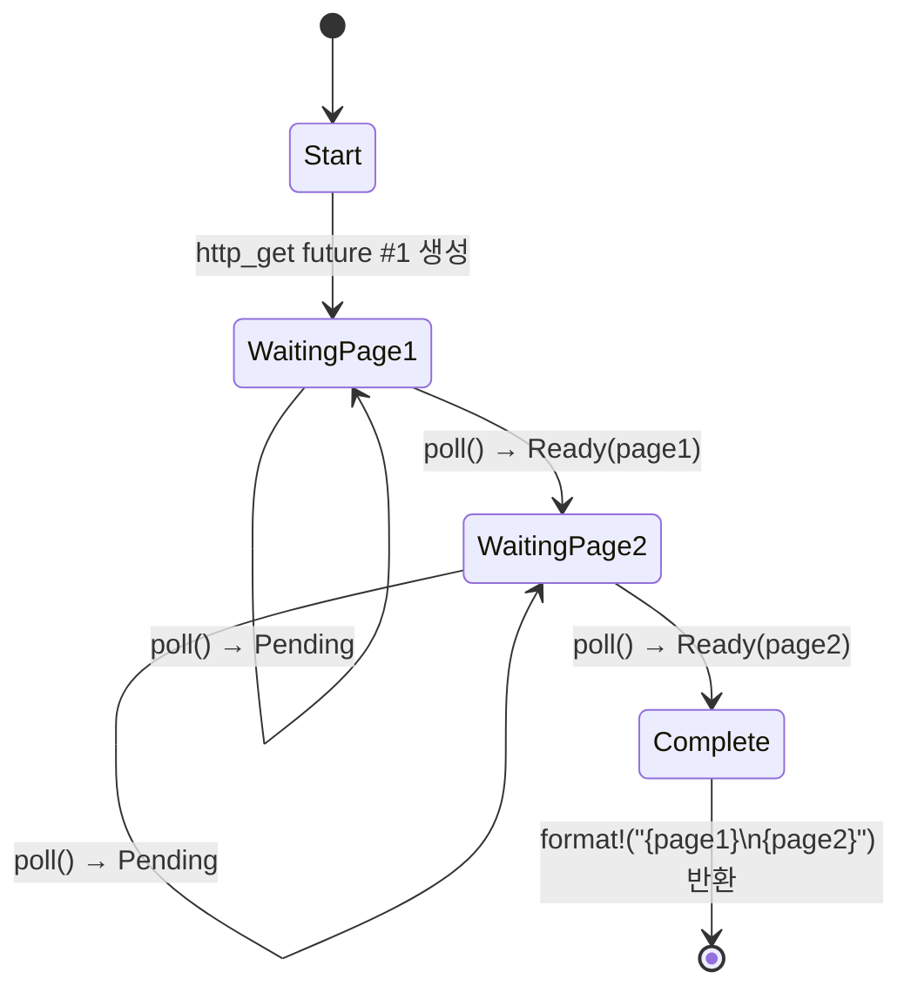

<a id="the-state-machine-reveal"></a>
# 5. 상태 머신의 정체 🟢

> **배울 내용:**
> - 컴파일러가 `async fn`을 enum 기반 상태 머신으로 변환하는 방식
> - 원본 코드와 생성된 상태를 나란히 비교하기
> - `async fn` 안의 큰 스택 할당이 왜 future 크기를 폭증시키는지
> - drop 최적화: 더 이상 필요 없는 값은 즉시 drop됨

<a id="what-the-compiler-actually-generates"></a>
## 컴파일러가 실제로 생성하는 것

`async fn`을 작성하면 컴파일러는 순차적으로 보이는 코드를 enum 기반 상태 머신으로 변환합니다. 이 변환을 이해하는 것이 async Rust의 성능 특성과 여러 가지 독특한 동작을 이해하는 핵심입니다.

<a id="side-by-side-async-fn-vs-state-machine"></a>
### 나란히 보기: async fn vs 상태 머신

```rust
// 여러분이 작성한 코드:
async fn fetch_two_pages() -> String {
    let page1 = http_get("https://example.com/a").await;
    let page2 = http_get("https://example.com/b").await;
    format!("{page1}\n{page2}")
}
```

컴파일러는 개념적으로 다음과 비슷한 코드를 생성합니다:

```rust
enum FetchTwoPagesStateMachine {
    // 상태 0: page1용 http_get을 호출하기 직전
    Start,

    // 상태 1: page1을 기다리는 중이며 future를 들고 있음
    WaitingPage1 {
        fut1: HttpGetFuture,
    },

    // 상태 2: page1을 얻었고 page2를 기다리는 중
    WaitingPage2 {
        page1: String,
        fut2: HttpGetFuture,
    },

    // 종료 상태
    Complete,
}

impl Future for FetchTwoPagesStateMachine {
    type Output = String;

    fn poll(mut self: Pin<&mut Self>, cx: &mut Context<'_>) -> Poll<String> {
        loop {
            match self.as_mut().get_mut() {
                Self::Start => {
                    let fut1 = http_get("https://example.com/a");
                    *self.as_mut().get_mut() = Self::WaitingPage1 { fut1 };
                }
                Self::WaitingPage1 { fut1 } => {
                    let page1 = match Pin::new(fut1).poll(cx) {
                        Poll::Ready(v) => v,
                        Poll::Pending => return Poll::Pending,
                    };
                    let fut2 = http_get("https://example.com/b");
                    *self.as_mut().get_mut() = Self::WaitingPage2 { page1, fut2 };
                }
                Self::WaitingPage2 { page1, fut2 } => {
                    let page2 = match Pin::new(fut2).poll(cx) {
                        Poll::Ready(v) => v,
                        Poll::Pending => return Poll::Pending,
                    };
                    let result = format!("{page1}\n{page2}");
                    *self.as_mut().get_mut() = Self::Complete;
                    return Poll::Ready(result);
                }
                Self::Complete => panic!("polled after completion"),
            }
        }
    }
}
```

> **참고**: 이 역문법화(desugaring)는 *개념적인 설명*입니다. 실제 컴파일러 출력은
> `unsafe` pin projection을 사용합니다. 여기서 보인 `get_mut()` 호출은
> `Unpin`이 필요하지만, async 상태 머신은 `!Unpin`입니다. 목적은
> 컴파일 가능한 코드를 만드는 것이 아니라 상태 전이를 설명하는 데 있습니다.



> **상태에 들어 있는 값:**
> - **WaitingPage1** — `fut1: HttpGetFuture` 저장 (`page2`는 아직 할당되지 않음)
> - **WaitingPage2** — `page1: String`, `fut2: HttpGetFuture` 저장 (`fut1`은 이미 drop됨)

<a id="why-this-matters-for-performance"></a>
### 이것이 성능에 중요한 이유

**제로 비용**: 이 상태 머신은 스택에 할당되는 enum입니다. future마다 힙 할당이 일어나지 않고, 가비지 컬렉터도 없으며, 명시적으로 `Box::pin()`을 쓰지 않는 한 boxing도 없습니다.

**크기**: enum의 크기는 모든 variant 가운데 가장 큰 variant의 크기로 결정됩니다. 각 `.await` 지점은 새로운 variant를 만듭니다. 즉:

```rust
async fn small() {
    let a: u8 = 0;
    yield_now().await;
    let b: u8 = 0;
    yield_now().await;
}
// 크기 ≈ max(size_of(u8), size_of(u8)) + 판별자 + 내부 future들의 크기
//      ≈ 아주 작음!

async fn big() {
    let buf: [u8; 1_000_000] = [0; 1_000_000]; // 스택 위에 1MB!
    some_io().await;
    process(&buf);
}
// 크기 ≈ 1MB + 내부 future들의 크기
// ⚠️ async 함수에서 거대한 버퍼를 스택에 올리지 마세요!
// 대신 Vec<u8> 또는 Box<[u8]>를 사용하세요.
```

**drop 최적화**: 상태 머신이 전이될 때 더 이상 필요 없는 값은 drop됩니다. 위 예시에서는 `WaitingPage1`에서 `WaitingPage2`로 넘어갈 때 `fut1`이 drop되며, 컴파일러가 이 drop을 자동으로 삽입합니다.

> **실전 규칙**: `async fn` 안의 큰 스택 할당은 future 크기를 크게 키웁니다.
> async 코드에서 스택 오버플로를 본다면 큰 배열이나 깊게 중첩된 future를 먼저 확인하세요.
> 필요하다면 `Box::pin()`으로 하위 future를 힙에 할당하세요.

<a id="exercise-predict-the-state-machine"></a>
### 연습문제: 상태 머신 예측하기

<details>
<summary>🏋️ 연습문제 (클릭하여 펼치기)</summary>

**도전 과제**: 아래 async 함수에 대해, 컴파일러가 생성하는 상태 머신을 스케치해 보세요. 상태(enum variant)는 몇 개일까요? 각 상태에는 어떤 값이 저장될까요?

```rust
async fn pipeline(url: &str) -> Result<usize, Error> {
    let response = fetch(url).await?;
    let body = response.text().await?;
    let parsed = parse(body).await?;
    Ok(parsed.len())
}
```

<details>
<summary>🔑 해답</summary>

상태는 다섯 개입니다:

1. **Start** — `url` 저장
2. **WaitingFetch** — `url`, `fetch` future 저장
3. **WaitingText** — `response`, `text()` future 저장
4. **WaitingParse** — `body`, `parse` future 저장
5. **Done** — `Ok(parsed.len())`를 반환한 상태

각 `.await`는 yield 지점을 만들고, 이것이 새로운 enum variant가 됩니다. `?`는 조기 반환 경로를 추가하지만 상태를 더 만들지는 않습니다. 결국 `Poll::Ready` 값에 대한 `match`일 뿐입니다.

</details>
</details>

> **핵심 요약 — 상태 머신의 정체**
> - `async fn`은 각 `.await` 지점마다 하나의 variant를 가진 enum으로 컴파일됩니다
> - future의 **크기**는 모든 variant 크기 중 최댓값이며, 큰 스택 값은 이 크기를 크게 만듭니다
> - 컴파일러는 상태 전이 시점에 필요한 **drop**을 자동으로 삽입합니다
> - future 크기가 문제라면 `Box::pin()`이나 힙 할당을 고려하세요

> **함께 보기:** 생성된 enum이 왜 pinning을 필요로 하는지는 [Ch 4 — Pin and Unpin](ch04-pin-and-unpin.md), 이런 상태 머신을 직접 만드는 방법은 [Ch 6 — Building Futures by Hand](ch06-building-futures-by-hand.md)에서 이어집니다

***


