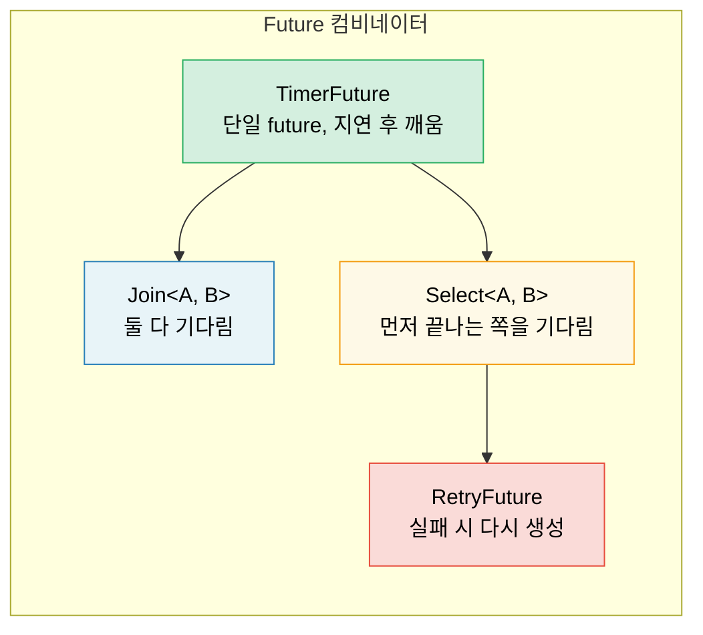

<a id="building-futures-by-hand"></a>
# 6. Future를 직접 만들기 🟡

> **배울 내용:**
> - 스레드 기반 wake를 사용하는 `TimerFuture` 구현하기
> - `Join` 컴비네이터 만들기: 두 future를 동시에 실행하기
> - `Select` 컴비네이터 만들기: 두 future를 경주시키기
> - 컴비네이터가 합성되는 방식: 끝까지 future로 이루어진 구조

<a id="a-simple-timer-future"></a>
## 간단한 TimerFuture

이제 실제로 쓸 수 있는 future를 처음부터 직접 만들어 봅시다. 이렇게 하면 2장부터 5장까지의 이론이 더 단단하게 연결됩니다.

<a id="timerfuture-a-complete-example"></a>
### TimerFuture: 완전한 예제

```rust
use std::future::Future;
use std::pin::Pin;
use std::sync::{Arc, Mutex};
use std::task::{Context, Poll, Waker};
use std::thread;
use std::time::{Duration, Instant};

pub struct TimerFuture {
    shared_state: Arc<Mutex<SharedState>>,
}

struct SharedState {
    completed: bool,
    waker: Option<Waker>,
}

impl TimerFuture {
    pub fn new(duration: Duration) -> Self {
        let shared_state = Arc::new(Mutex::new(SharedState {
            completed: false,
            waker: None,
        }));

        // 주어진 시간이 지나면 completed=true로 바꾸는 스레드를 시작
        let thread_shared_state = Arc::clone(&shared_state);
        thread::spawn(move || {
            thread::sleep(duration);
            let mut state = thread_shared_state.lock().unwrap();
            state.completed = true;
            if let Some(waker) = state.waker.take() {
                waker.wake(); // executor에 알림
            }
        });

        TimerFuture { shared_state }
    }
}

impl Future for TimerFuture {
    type Output = ();

    fn poll(self: Pin<&mut Self>, cx: &mut Context<'_>) -> Poll<()> {
        let mut state = self.shared_state.lock().unwrap();
        if state.completed {
            Poll::Ready(())
        } else {
            // 타이머 스레드가 현재 future를 깨울 수 있도록 waker를 저장
            // 중요: waker는 항상 최신 것으로 갱신해야 함
            // executor가 poll 사이에 waker를 바꿨을 수 있기 때문
            state.waker = Some(cx.waker().clone());
            Poll::Pending
        }
    }
}

// 사용 예:
// async fn example() {
//     println!("Starting timer...");
//     TimerFuture::new(Duration::from_secs(2)).await;
//     println!("Timer done!");
// }
//
// ⚠️ 이 구현은 타이머마다 OS 스레드를 하나씩 만듭니다.
// 학습용으로는 괜찮지만, 실제 코드에서는 공유 타이머 휠 위에서 동작하고
// 추가 스레드를 만들지 않는 `tokio::time::sleep`을 사용하세요.
```

<a id="join-running-two-futures-concurrently"></a>
### Join: 두 future를 동시에 실행하기

`Join`은 두 future를 모두 poll하고, *둘 다* 끝났을 때 완료됩니다. 내부적으로는 `tokio::join!`이 이런 식으로 동작합니다:

```rust
use std::future::Future;
use std::pin::Pin;
use std::task::{Context, Poll};

/// 두 future를 동시에 poll해서, 두 결과를 튜플로 반환한다
pub struct Join<A, B>
where
    A: Future,
    B: Future,
{
    a: MaybeDone<A>,
    b: MaybeDone<B>,
}

enum MaybeDone<F: Future> {
    Pending(F),
    Done(F::Output),
    Taken, // Output을 이미 꺼냈음
}

impl<A, B> Join<A, B>
where
    A: Future,
    B: Future,
{
    pub fn new(a: A, b: B) -> Self {
        Join {
            a: MaybeDone::Pending(a),
            b: MaybeDone::Pending(b),
        }
    }
}

impl<A, B> Future for Join<A, B>
where
    A: Future + Unpin,
    B: Future + Unpin,
{
    type Output = (A::Output, B::Output);

    fn poll(mut self: Pin<&mut Self>, cx: &mut Context<'_>) -> Poll<Self::Output> {
        // 아직 끝나지 않았다면 A를 poll
        if let MaybeDone::Pending(ref mut fut) = self.a {
            if let Poll::Ready(val) = Pin::new(fut).poll(cx) {
                self.a = MaybeDone::Done(val);
            }
        }

        // 아직 끝나지 않았다면 B를 poll
        if let MaybeDone::Pending(ref mut fut) = self.b {
            if let Poll::Ready(val) = Pin::new(fut).poll(cx) {
                self.b = MaybeDone::Done(val);
            }
        }

        // 둘 다 끝났는가?
        match (&self.a, &self.b) {
            (MaybeDone::Done(_), MaybeDone::Done(_)) => {
                // 두 결과를 꺼낸다
                let a_val = match std::mem::replace(&mut self.a, MaybeDone::Taken) {
                    MaybeDone::Done(v) => v,
                    _ => unreachable!(),
                };
                let b_val = match std::mem::replace(&mut self.b, MaybeDone::Taken) {
                    MaybeDone::Done(v) => v,
                    _ => unreachable!(),
                };
                Poll::Ready((a_val, b_val))
            }
            _ => Poll::Pending, // 적어도 하나는 아직 pending
        }
    }
}

// 사용 예:
// let (page1, page2) = Join::new(
//     http_get("https://example.com/a"),
//     http_get("https://example.com/b"),
// ).await;
// 두 요청은 동시에 진행된다!
```

> **핵심 통찰**: 여기서 "동시에"는 *같은 스레드에서 번갈아 진행된다*는 뜻입니다.
> `Join`은 스레드를 만들지 않고, 같은 `poll()` 호출 안에서 두 future를 모두 poll합니다.
> 이것은 병렬성(parallelism)이 아니라 협력적 동시성(cooperative concurrency)입니다.



<a id="select-racing-two-futures"></a>
### Select: 두 future 경주시키기

`Select`는 두 future 가운데 *어느 하나라도* 먼저 끝나면 완료됩니다. 나머지 하나는 drop됩니다:

```rust
use std::future::Future;
use std::pin::Pin;
use std::task::{Context, Poll};

pub enum Either<A, B> {
    Left(A),
    Right(B),
}

/// 먼저 완료된 future의 결과를 반환하고, 다른 future는 drop한다
pub struct Select<A, B> {
    a: A,
    b: B,
}

impl<A, B> Select<A, B>
where
    A: Future + Unpin,
    B: Future + Unpin,
{
    pub fn new(a: A, b: B) -> Self {
        Select { a, b }
    }
}

impl<A, B> Future for Select<A, B>
where
    A: Future + Unpin,
    B: Future + Unpin,
{
    type Output = Either<A::Output, B::Output>;

    fn poll(mut self: Pin<&mut Self>, cx: &mut Context<'_>) -> Poll<Self::Output> {
        // 먼저 A를 poll
        if let Poll::Ready(val) = Pin::new(&mut self.a).poll(cx) {
            return Poll::Ready(Either::Left(val));
        }

        // 그다음 B를 poll
        if let Poll::Ready(val) = Pin::new(&mut self.b).poll(cx) {
            return Poll::Ready(Either::Right(val));
        }

        Poll::Pending
    }
}

// 타임아웃과 함께 사용:
// match Select::new(http_get(url), TimerFuture::new(timeout)).await {
//     Either::Left(response) => println!("Got response: {}", response),
//     Either::Right(()) => println!("Request timed out!"),
// }
```

> **공정성 참고**: 이 `Select`는 항상 A를 먼저 poll하므로 둘 다 준비되어 있으면 항상 A가 이깁니다.
> Tokio의 `select!` 매크로는 공정성을 위해 poll 순서를 무작위화합니다.

<a id="exercise-build-a-retryfuture"></a>
<details>
<summary><strong>🏋️ 연습문제: RetryFuture 만들기</strong> (클릭하여 펼치기)</summary>

**도전 과제**: `F: Fn() -> Fut` 클로저를 받아 내부 future가 `Err`를 반환할 때 최대 N번까지 재시도하는 `RetryFuture<F, Fut>`를 만들어 보세요. 첫 번째 `Ok` 결과를 반환하거나, 끝까지 실패하면 마지막 `Err`를 반환해야 합니다.

*힌트*: "현재 시도 실행 중" 상태와 "모든 시도가 소진됨" 상태가 필요합니다.

<details>
<summary>🔑 해답</summary>

```rust
use std::future::Future;
use std::pin::Pin;
use std::task::{Context, Poll};

pub struct RetryFuture<F, Fut, T, E>
where
    F: Fn() -> Fut,
    Fut: Future<Output = Result<T, E>> + Unpin,
{
    factory: F,
    current: Option<Fut>,
    remaining: usize,
    last_error: Option<E>,
}

impl<F, Fut, T, E> RetryFuture<F, Fut, T, E>
where
    F: Fn() -> Fut,
    Fut: Future<Output = Result<T, E>> + Unpin,
{
    pub fn new(max_attempts: usize, factory: F) -> Self {
        let current = Some((factory)());
        RetryFuture {
            factory,
            current,
            remaining: max_attempts.saturating_sub(1),
            last_error: None,
        }
    }
}

impl<F, Fut, T, E> Future for RetryFuture<F, Fut, T, E>
where
    F: Fn() -> Fut + Unpin,
    Fut: Future<Output = Result<T, E>> + Unpin,
    T: Unpin,
    E: Unpin,
{
    type Output = Result<T, E>;

    fn poll(mut self: Pin<&mut Self>, cx: &mut Context<'_>) -> Poll<Self::Output> {
        loop {
            if let Some(ref mut fut) = self.current {
                match Pin::new(fut).poll(cx) {
                    Poll::Ready(Ok(val)) => return Poll::Ready(Ok(val)),
                    Poll::Ready(Err(e)) => {
                        self.last_error = Some(e);
                        if self.remaining > 0 {
                            self.remaining -= 1;
                            self.current = Some((self.factory)());
                            // 새 future를 즉시 poll하기 위해 루프를 계속 돈다
                        } else {
                            return Poll::Ready(Err(self.last_error.take().unwrap()));
                        }
                    }
                    Poll::Pending => return Poll::Pending,
                }
            } else {
                return Poll::Ready(Err(self.last_error.take().unwrap()));
            }
        }
    }
}

// 사용 예:
// let result = RetryFuture::new(3, || async {
//     http_get("https://flaky-server.com/api").await
// }).await;
```

**핵심 요점**: 이 retry future 역시 상태 머신입니다. 현재 시도 중인 future를 들고 있다가 실패하면 새로운 내부 future를 만들어 다시 시도합니다. 컴비네이터가 합성된다는 말은 바로 이런 뜻입니다. 끝까지 내려가면 결국 전부 future입니다.

</details>
</details>

> **핵심 요약 — Future를 직접 만들기**
> - future에는 세 가지가 필요합니다: 상태, `poll()` 구현, 그리고 waker 등록
> - `Join`은 두 하위 future를 모두 poll하고, `Select`는 먼저 끝나는 쪽을 반환합니다
> - 컴비네이터는 다른 future를 감싸는 또 다른 future입니다. 끝까지 내려가도 future입니다
> - 직접 future를 만들어 보면 이해가 깊어지지만, 실제 코드에서는 `tokio::join!`/`select!`를 사용하세요

> **함께 보기:** trait 정의는 [Ch 2 — The Future Trait](ch02-the-future-trait.md), 실전용 대응물은 [Ch 8 — Tokio Deep Dive](ch08-tokio-deep-dive.md)에서 다룹니다

***


