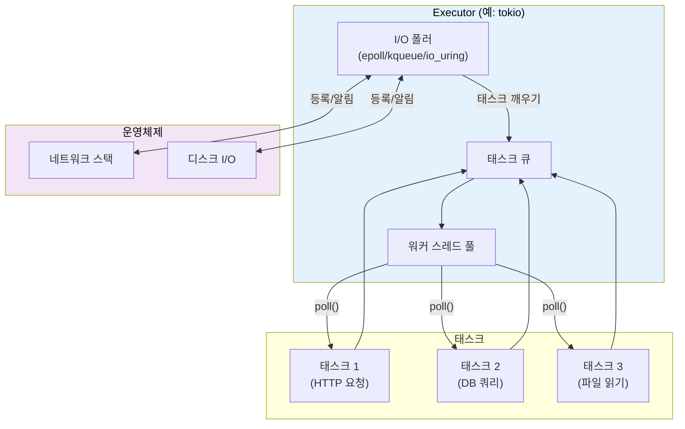
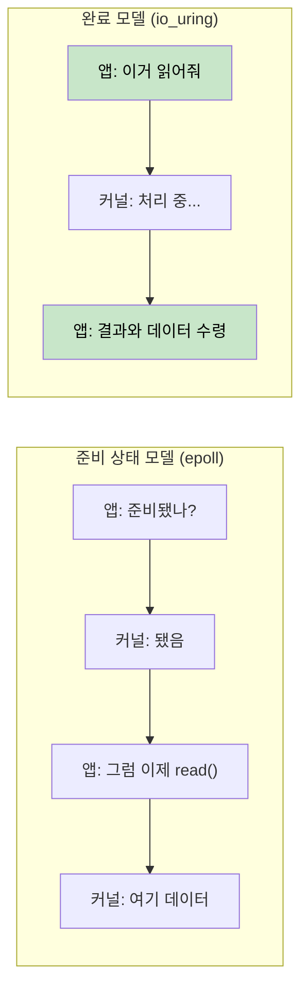
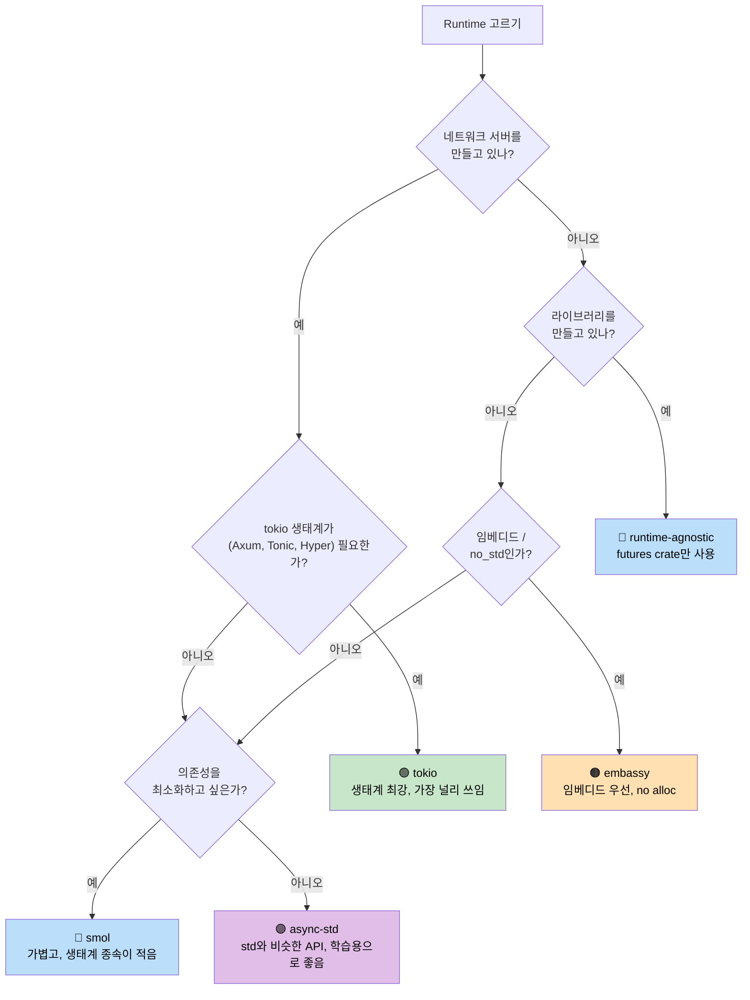

<a id="executors-and-runtimes"></a>
# 7. Executor와 Runtime 🟡

> **배울 내용:**
> - executor가 하는 일: 효율적으로 poll하고 잠들기
> - 여섯 가지 주요 runtime: mio, io_uring, tokio, async-std, smol, embassy
> - 알맞은 runtime을 고르기 위한 결정 트리
> - runtime에 종속되지 않는 라이브러리 설계가 왜 중요한지

<a id="what-an-executor-does"></a>
## Executor가 하는 일

Executor에는 두 가지 역할이 있습니다:
1. 진행할 준비가 된 future를 **poll**한다
2. 준비된 future가 없을 때는 OS의 I/O 알림 API를 이용해 **효율적으로 잠든다**



<a id="mio-the-foundation-layer"></a>
### mio: 기반 계층

[mio](https://github.com/tokio-rs/mio) (Metal I/O)는 executor가 아닙니다. 대신 가장 낮은 수준의 크로스플랫폼 I/O 알림 라이브러리입니다. 내부적으로 `epoll`(Linux), `kqueue`(macOS/BSD), IOCP(Windows)를 감쌉니다.

```rust
// 개념적인 mio 사용 예 (단순화한 버전):
use mio::{Events, Interest, Poll, Token};
use mio::net::TcpListener;

let mut poll = Poll::new()?;
let mut events = Events::with_capacity(128);

let mut server = TcpListener::bind("0.0.0.0:8080")?;
poll.registry().register(&mut server, Token(0), Interest::READABLE)?;

// 이벤트 루프 — 무언가가 일어날 때까지 block
loop {
    poll.poll(&mut events, None)?; // I/O 이벤트가 올 때까지 잠듦
    for event in events.iter() {
        match event.token() {
            Token(0) => { /* 서버에 새 연결이 들어옴 */ }
            _ => { /* 다른 I/O가 준비됨 */ }
        }
    }
}
```

대부분의 개발자는 mio를 직접 만질 일이 없습니다. 보통 tokio나 smol이 그 위에 올라갑니다.

<a id="io_uring-the-completion-based-future"></a>
### io_uring: 완료 기반 I/O의 미래

Linux의 `io_uring`(커널 5.1+)은 mio/epoll이 사용하는 준비 상태 기반(readiness-based) I/O 모델에서 크게 방향을 바꿉니다:

```text
준비 상태 기반 (epoll / mio / tokio):
  1. 질문: "이 소켓은 읽을 준비가 되었나?"      → epoll_wait()
  2. 커널: "응, 준비됐어"                         → EPOLLIN 이벤트
  3. 앱:   read(fd, buf)                         → 그래도 잠깐 block될 수 있음!

완료 기반 (io_uring):
  1. 제출: "이 소켓에서 이 버퍼로 읽어 와"       → SQE
  2. 커널: 비동기로 읽기를 수행
  3. 앱:   결과와 데이터를 완료된 형태로 받음    → CQE
```



**소유권 문제**: io_uring은 작업이 완료될 때까지 커널이 버퍼를 소유해야 합니다. 하지만 Rust의 표준 `AsyncRead` trait는 버퍼를 빌려 쓰는 방식입니다. 그래서 `tokio-uring`은 다른 I/O trait를 사용합니다:

```rust
// 일반 tokio (준비 상태 기반) — 버퍼를 빌린다:
let n = stream.read(&mut buf).await?;  // buf를 빌림

// tokio-uring (완료 기반) — 버퍼 소유권을 가져간다:
let (result, buf) = stream.read(buf).await;  // buf가 이동되었다가 다시 반환됨
let n = result?;
```

```rust
// Cargo.toml: tokio-uring = "0.5"
// 참고: Linux 전용, 커널 5.1+ 필요

fn main() {
    tokio_uring::start(async {
        let file = tokio_uring::fs::File::open("data.bin").await.unwrap();
        let buf = vec![0u8; 4096];
        let (result, buf) = file.read_at(buf, 0).await;
        let bytes_read = result.unwrap();
        println!("Read {} bytes: {:?}", bytes_read, &buf[..bytes_read]);
    });
}
```

| 항목 | epoll (tokio) | io_uring (tokio-uring) |
|------|---------------|------------------------|
| **모델** | 준비 상태 알림 | 완료 알림 |
| **시스템 콜** | `epoll_wait` + read/write | 배치된 SQE/CQE 링 |
| **버퍼 소유권** | 앱이 유지 (`&mut buf`) | 소유권 이전 (`buf` 이동) |
| **플랫폼** | Linux, macOS (`kqueue`), Windows (IOCP) | Linux 5.1+ 전용 |
| **제로 카피** | 아니오 (유저 공간 복사) | 예 (등록 버퍼) |
| **성숙도** | 프로덕션 준비 완료 | 실험적 |

> **io_uring을 쓸 때**: 시스템 콜 오버헤드가 병목인 고처리량 파일 I/O나 네트워킹에서 유용합니다. 예를 들어 데이터베이스, 스토리지 엔진, 10만 개 이상의 연결을 처리하는 프록시 같은 경우입니다. 대부분의 애플리케이션에서는 epoll 기반의 일반 tokio가 더 적절합니다.

<a id="tokio-the-batteries-included-runtime"></a>
### tokio: 모든 것이 갖춰진 런타임

Rust 생태계에서 가장 널리 쓰이는 async runtime입니다. Axum, Hyper, Tonic, 그리고 대부분의 프로덕션 Rust 서버가 tokio를 사용합니다.

```rust
// Cargo.toml:
// [dependencies]
// tokio = { version = "1", features = ["full"] }

#[tokio::main]
async fn main() {
    // work-stealing 스케줄러를 가진 멀티스레드 런타임을 시작
    let handle = tokio::spawn(async {
        tokio::time::sleep(std::time::Duration::from_secs(1)).await;
        "done"
    });

    let result = handle.await.unwrap();
    println!("{result}");
}
```

**tokio 기능**: 타이머, I/O, TCP/UDP, Unix 소켓, 시그널 처리, 동기화 프리미티브(`Mutex`, `RwLock`, `Semaphore`, 채널), `fs`, `process`, tracing 연동.

<a id="async-std-the-standard-library-mirror"></a>
### async-std: 표준 라이브러리와 닮은 런타임

`std` API를 닮은 async 버전을 제공합니다. tokio만큼 널리 쓰이진 않지만, 입문자에게는 더 단순하게 느껴질 수 있습니다.

```rust
// Cargo.toml:
// [dependencies]
// async-std = { version = "1", features = ["attributes"] }

#[async_std::main]
async fn main() {
    use async_std::fs;
    let content = fs::read_to_string("hello.txt").await.unwrap();
    println!("{content}");
}
```

<a id="smol-the-minimalist-runtime"></a>
### smol: 미니멀한 런타임

작고 의존성이 거의 없는 async runtime입니다. tokio를 끌어오지 않으면서 async를 제공하고 싶은 라이브러리에 잘 맞습니다.

```rust
// Cargo.toml:
// [dependencies]
// smol = "2"

fn main() {
    smol::block_on(async {
        let result = smol::unblock(|| {
            // thread pool에서 blocking 코드를 실행
            std::fs::read_to_string("hello.txt")
        }).await.unwrap();
        println!("{result}");
    });
}
```

<a id="embassy-async-for-embedded-no-std"></a>
### embassy: 임베디드를 위한 async (no_std)

임베디드 시스템용 async runtime입니다. 힙 할당이 필요 없고 `std`도 요구하지 않습니다.

```rust
// 마이크로컨트롤러(STM32, nRF52, RP2040 등)에서 실행
#[embassy_executor::main]
async fn main(spawner: embassy_executor::Spawner) {
    // async/await로 LED를 깜빡인다 — RTOS가 필요 없다!
    let mut led = Output::new(p.PA5, Level::Low, Speed::Low);
    loop {
        led.set_high();
        Timer::after(Duration::from_millis(500)).await;
        led.set_low();
        Timer::after(Duration::from_millis(500)).await;
    }
}
```

<a id="runtime-decision-tree"></a>
### Runtime 선택 결정 트리



<a id="runtime-comparison-table"></a>
### Runtime 비교 표

| 기능 | tokio | async-std | smol | embassy |
|------|-------|-----------|------|---------|
| **생태계** | 지배적 | 작음 | 최소 | 임베디드 |
| **멀티스레드** | ✅ Work-stealing | ✅ | ✅ | ❌ (single-core) |
| **no_std** | ❌ | ❌ | ❌ | ✅ |
| **타이머** | ✅ 내장 | ✅ 내장 | `async-io` 통해 제공 | ✅ HAL 기반 |
| **I/O** | ✅ 자체 추상화 | ✅ std 유사 API | ✅ `async-io` 통해 제공 | ✅ HAL 드라이버 |
| **채널** | ✅ 다양함 | ✅ | `async-channel` 통해 제공 | ✅ |
| **학습 곡선** | 중간 | 낮음 | 낮음 | 높음 (하드웨어) |
| **바이너리 크기** | 큼 | 중간 | 작음 | 매우 작음 |

<a id="exercise-runtime-comparison"></a>
<details>
<summary><strong>🏋️ 연습문제: Runtime 비교</strong> (클릭하여 펼치기)</summary>

**도전 과제**: 같은 프로그램을 세 가지 runtime(tokio, smol, async-std)으로 각각 작성해 보세요. 프로그램은 다음을 해야 합니다:
1. URL을 가져온다(여기서는 sleep으로 시뮬레이션)
2. 파일을 읽는다(역시 sleep으로 시뮬레이션)
3. 두 결과를 출력한다

이 연습은 async/await 비즈니스 로직 자체는 같고, runtime 설정만 다르다는 점을 보여 줍니다.

<details>
<summary>🔑 해답</summary>

```rust
// ----- tokio 버전 -----
// Cargo.toml: tokio = { version = "1", features = ["full"] }
#[tokio::main]
async fn main() {
    let (url_result, file_result) = tokio::join!(
        async {
            tokio::time::sleep(std::time::Duration::from_millis(100)).await;
            "Response from URL"
        },
        async {
            tokio::time::sleep(std::time::Duration::from_millis(50)).await;
            "Contents of file"
        },
    );
    println!("URL: {url_result}, File: {file_result}");
}

// ----- smol 버전 -----
// Cargo.toml: smol = "2", futures-lite = "2"
fn main() {
    smol::block_on(async {
        let (url_result, file_result) = futures_lite::future::zip(
            async {
                smol::Timer::after(std::time::Duration::from_millis(100)).await;
                "Response from URL"
            },
            async {
                smol::Timer::after(std::time::Duration::from_millis(50)).await;
                "Contents of file"
            },
        ).await;
        println!("URL: {url_result}, File: {file_result}");
    });
}

// ----- async-std 버전 -----
// Cargo.toml: async-std = { version = "1", features = ["attributes"] }
#[async_std::main]
async fn main() {
    let (url_result, file_result) = futures::future::join(
        async {
            async_std::task::sleep(std::time::Duration::from_millis(100)).await;
            "Response from URL"
        },
        async {
            async_std::task::sleep(std::time::Duration::from_millis(50)).await;
            "Contents of file"
        },
    ).await;
    println!("URL: {url_result}, File: {file_result}");
}
```

**핵심 요점**: async 비즈니스 로직은 runtime이 달라도 동일합니다. 달라지는 것은 엔트리 포인트와 타이머/I/O API뿐입니다. 그래서 `std::future::Future`만을 사용하는 runtime-agnostic 라이브러리가 가치가 있습니다.

</details>
</details>

> **핵심 요약 — Executor와 Runtime**
> - executor의 역할은 wake된 future를 poll하고, OS I/O API를 이용해 효율적으로 잠드는 것입니다
> - 서버에는 기본적으로 **tokio**, 최소 footprint가 중요하면 **smol**, 임베디드에는 **embassy**가 적합합니다
> - 비즈니스 로직은 특정 runtime이 아니라 `std::future::Future`에 의존하도록 작성하는 편이 좋습니다
> - io_uring(Linux 5.1+)은 고성능 I/O의 미래이지만, 생태계는 아직 성숙해지는 중입니다

> **함께 보기:** tokio 고유 기능은 [Ch 8 — Tokio Deep Dive](ch08-tokio-deep-dive.md), tokio 외 대안은 [Ch 9 — When Tokio Isn't the Right Fit](ch09-when-tokio-isnt-the-right-fit.md)에서 이어집니다

***


