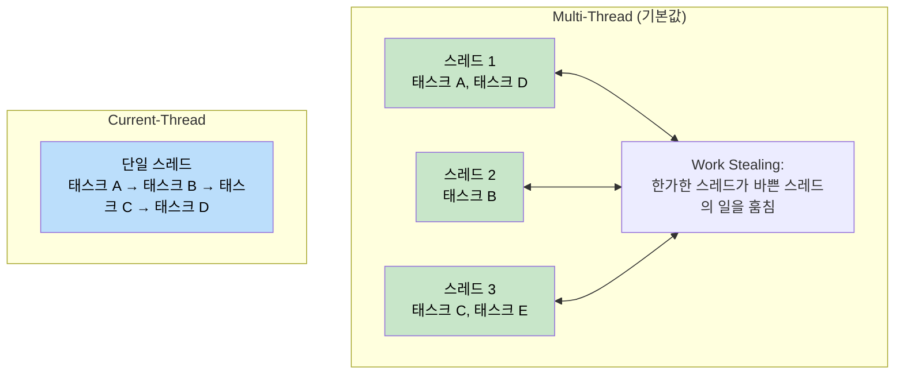
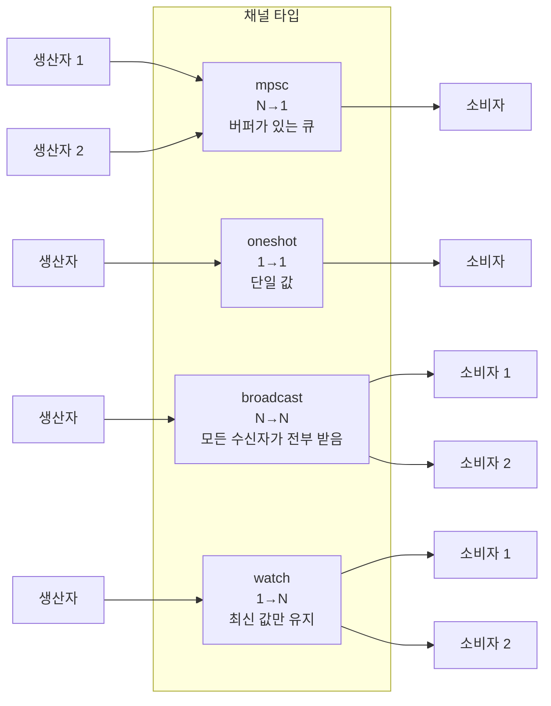
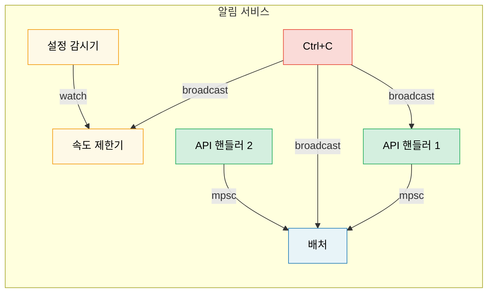

<a id="tokio-deep-dive"></a>
# 8. Tokio 심화 🟡

> **배울 내용:**
> - runtime 종류: multi-thread vs current-thread, 각각 언제 쓰는가
> - `tokio::spawn`, `'static` 요구사항, 그리고 `JoinHandle`
> - 태스크 취소 의미론과 cancel-on-drop과의 차이
> - 동기화 프리미티브: `Mutex`, `RwLock`, `Semaphore`, 그리고 네 가지 채널 타입

<a id="runtime-flavors-multi-thread-vs-current-thread"></a>
## Runtime 종류: multi-thread vs current-thread

Tokio는 두 가지 runtime 구성을 제공합니다:

```rust
// 멀티스레드 (#[tokio::main]의 기본값)
// work-stealing 스레드 풀을 사용하므로 태스크가 스레드 사이를 옮겨 다닐 수 있다
#[tokio::main]
async fn main() {
    // N개의 워커 스레드 (기본값 = CPU 코어 수)
    // 태스크는 Send + 'static 이어야 한다
}

// current-thread — 모든 것이 하나의 스레드에서 실행된다
#[tokio::main(flavor = "current_thread")]
async fn main() {
    // 단일 스레드 — 태스크가 Send일 필요는 없다
    // 더 가볍고, 단순한 도구나 WASM에 적합하다
}

// 수동으로 runtime 만들기:
let rt = tokio::runtime::Builder::new_multi_thread()
    .worker_threads(4)
    .enable_all()
    .build()
    .unwrap();

rt.block_on(async {
    println!("Running on custom runtime");
});
```



<a id="tokiospawn-and-the-static-requirement"></a>
### tokio::spawn과 `'static` 요구사항

`tokio::spawn`은 future를 runtime의 태스크 큐에 올립니다. 이 future는 *어떤* 워커 스레드에서든 *언제든* 실행될 수 있으므로 `Send + 'static`이어야 합니다:

```rust
use tokio::task;

async fn example() {
    let data = String::from("hello");

    // ✅ 가능: 소유권을 태스크 안으로 이동
    let handle = task::spawn(async move {
        println!("{data}");
        data.len()
    });

    let len = handle.await.unwrap();
    println!("Length: {len}");
}

async fn problem() {
    let data = String::from("hello");

    // ❌ 실패: data를 빌리고 있으므로 'static이 아님
    // task::spawn(async {
    //     println!("{data}"); // `data`를 빌림 — 'static 아님
    // });

    // ❌ 실패: Rc는 Send가 아님
    // let rc = std::rc::Rc::new(42);
    // task::spawn(async move {
    //     println!("{rc}"); // Rc는 !Send — 스레드 경계를 넘을 수 없음
    // });
}
```

**왜 `'static`일까?** 생성된 태스크는 독립적으로 실행되며, 그것을 만든 스코프보다 더 오래 살아남을 수도 있습니다. 컴파일러는 참조가 계속 유효할지 증명할 수 없으므로 소유권 있는 데이터를 요구합니다.

**왜 `Send`일까?** 태스크는 중단된 스레드와 다른 스레드에서 다시 재개될 수 있습니다. 따라서 `.await` 지점을 가로질러 보관되는 모든 데이터는 스레드 간 전송이 안전해야 합니다.

```rust
// 흔한 패턴: 공유 데이터를 태스크 안으로 clone해서 넣기
let shared = Arc::new(config);

for i in 0..10 {
    let shared = Arc::clone(&shared); // 데이터를 복제하는 것이 아니라 Arc만 복제
    tokio::spawn(async move {
        process_item(i, &shared).await;
    });
}
```

<a id="joinhandle-and-task-cancellation"></a>
### JoinHandle과 태스크 취소

```rust
use tokio::task::JoinHandle;
use tokio::time::{sleep, Duration};

async fn cancellation_example() {
    let handle: JoinHandle<String> = tokio::spawn(async {
        sleep(Duration::from_secs(10)).await;
        "completed".to_string()
    });

    // handle을 drop하면 취소될까? 아니다 — 태스크는 계속 실행된다!
    // drop(handle); // 태스크는 백그라운드에서 계속 돈다

    // 실제로 취소하려면 abort()를 호출해야 한다:
    handle.abort();

    // abort된 태스크를 await하면 JoinError가 반환된다
    match handle.await {
        Ok(val) => println!("Got: {val}"),
        Err(e) if e.is_cancelled() => println!("Task was cancelled"),
        Err(e) => println!("Task panicked: {e}"),
    }
}
```

> **중요**: tokio에서 `JoinHandle`을 drop한다고 해서 태스크가 취소되지는 않습니다.
> 태스크는 *detached* 상태가 되어 계속 실행됩니다. 취소하려면 반드시 `.abort()`를 직접 호출해야 합니다.
> 이것은 `Future` 자체를 직접 drop할 때와 다릅니다. `Future`를 drop하면 그 계산도 함께 취소/drop됩니다.

<a id="tokio-sync-primitives"></a>
### Tokio 동기화 프리미티브

Tokio는 async를 이해하는 동기화 프리미티브를 제공합니다. 핵심 원칙은 하나입니다: **`.await` 지점을 가로질러 `std::sync::Mutex`를 사용하지 마세요**.

```rust
use tokio::sync::{Mutex, RwLock, Semaphore, mpsc, oneshot, broadcast, watch};

// --- Mutex ---
// 비동기 뮤텍스: lock() 메서드가 async이며 스레드를 block하지 않음
let data = Arc::new(Mutex::new(vec![1, 2, 3]));
{
    let mut guard = data.lock().await; // 논블로킹 잠금
    guard.push(4);
} // 여기서 guard가 drop되며 락 해제

// --- Channels ---
// mpsc: 다중 생산자, 단일 소비자
let (tx, mut rx) = mpsc::channel::<String>(100); // 고정 크기 버퍼

tokio::spawn(async move {
    tx.send("hello".into()).await.unwrap();
});

let msg = rx.recv().await.unwrap();

// oneshot: 단일 값, 단일 소비자
let (tx, rx) = oneshot::channel::<i32>();
tx.send(42).unwrap(); // await가 필요 없음 — 보내거나 실패하거나 둘 중 하나
let val = rx.await.unwrap();

// broadcast: 다중 생산자, 다중 소비자 (모든 수신자가 모든 메시지를 받음)
let (tx, _) = broadcast::channel::<String>(100);
let mut rx1 = tx.subscribe();
let mut rx2 = tx.subscribe();

// watch: 단일 값, 다중 소비자 (최신 값만 유지)
let (tx, rx) = watch::channel(0u64);
tx.send(42).unwrap();
println!("Latest: {}", *rx.borrow());
```



<a id="case-study-choosing-the-right-channel-for-a-notification-service"></a>
## 사례 연구: 알림 서비스에 맞는 채널 고르기

다음과 같은 알림 서비스를 만든다고 해봅시다:
- 여러 API 핸들러가 이벤트를 만든다
- 하나의 백그라운드 태스크가 이를 모아서 전송한다
- 설정 감시기가 런타임 중 속도 제한값을 갱신한다
- 종료 신호는 모든 구성 요소에 전달되어야 한다

**각 경우에 어떤 채널을 써야 할까요?**

| 요구사항 | 채널 | 이유 |
|----------|------|------|
| API 핸들러 → 배처 | `mpsc` (bounded) | 생산자는 N개, 소비자는 1개입니다. bounded로 backpressure를 걸어 배처가 밀릴 때 API 핸들러가 속도를 늦추게 하고, OOM을 막을 수 있습니다 |
| 설정 감시기 → 속도 제한기 | `watch` | 최신 설정만 중요합니다. 여러 워커가 현재 값을 읽을 수 있습니다 |
| 종료 신호 → 모든 구성 요소 | `broadcast` | 모든 구성 요소가 종료 알림을 각각 독립적으로 받아야 합니다 |
| 단일 health-check 응답 | `oneshot` | 요청/응답 패턴에 맞습니다. 값 하나를 보내고 끝입니다 |



<a id="exercise-build-a-task-pool"></a>
<details>
<summary><strong>🏋️ 연습문제: 태스크 풀 만들기</strong> (클릭하여 펼치기)</summary>

**도전 과제**: async 클로저 목록과 동시성 제한값을 받아 최대 N개의 태스크만 동시에 실행하는 `run_with_limit` 함수를 만들어 보세요. `tokio::sync::Semaphore`를 사용하세요.

<details>
<summary>🔑 해답</summary>

```rust
use std::future::Future;
use std::sync::Arc;
use tokio::sync::Semaphore;

async fn run_with_limit<F, Fut, T>(tasks: Vec<F>, limit: usize) -> Vec<T>
where
    F: FnOnce() -> Fut + Send + 'static,
    Fut: Future<Output = T> + Send + 'static,
    T: Send + 'static,
{
    let semaphore = Arc::new(Semaphore::new(limit));
    let mut handles = Vec::new();

    for task in tasks {
        let permit = Arc::clone(&semaphore);
        let handle = tokio::spawn(async move {
            let _permit = permit.acquire().await.unwrap();
            // permit을 잡고 있는 동안 태스크가 실행되고, 끝나면 drop된다
            task().await
        });
        handles.push(handle);
    }

    let mut results = Vec::new();
    for handle in handles {
        results.push(handle.await.unwrap());
    }
    results
}

// 사용 예:
// let tasks: Vec<_> = urls.into_iter().map(|url| {
//     move || async move { fetch(url).await }
// }).collect();
// let results = run_with_limit(tasks, 10).await; // 최대 10개 동시 실행
```

**핵심 요점**: `Semaphore`는 tokio에서 동시성을 제한하는 표준적인 방법입니다. 각 태스크는 작업을 시작하기 전에 permit을 하나 획득합니다. 세마포어가 가득 차 있으면 새 태스크는 자리가 날 때까지 비동기적으로, 즉 스레드를 막지 않고 기다립니다.

</details>
</details>

> **핵심 요약 — Tokio 심화**
> - 서버에는 기본값인 `multi_thread`, CLI 도구나 테스트, `!Send` 타입에는 `current_thread`가 적합합니다
> - `tokio::spawn`은 `'static` future를 요구하므로 데이터 공유에는 `Arc`나 채널을 사용하세요
> - `JoinHandle`을 drop해도 태스크는 취소되지 않으며, 명시적으로 `.abort()`를 호출해야 합니다
> - 동기화 프리미티브는 필요에 따라 고르세요: 공유 상태에는 `Mutex`, 동시성 제한에는 `Semaphore`, 통신에는 `mpsc`/`oneshot`/`broadcast`/`watch`

> **함께 보기:** `spawn`의 대안은 [Ch 9 — When Tokio Isn't the Right Fit](ch09-when-tokio-isnt-the-right-fit.md), `MutexGuard`를 `.await` 너머로 들고 가는 버그는 [Ch 12 — Common Pitfalls](ch12-common-pitfalls.md)에서 이어집니다

***


