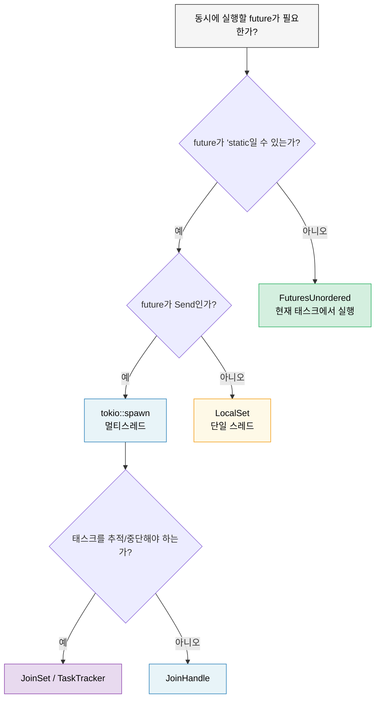

<a id="when-tokio-isnt-the-right-fit"></a>
# 9. Tokio가 맞지 않는 경우 🟡

> **이 장에서 배우는 것:**
> - `tokio::spawn`이 모든 곳에서 `Arc`를 강요하게 되는 `'static` 문제
> - `!Send` future를 위한 `LocalSet`
> - 대여 친화적인 동시성을 위한 `FuturesUnordered` (`spawn` 불필요)
> - 관리형 태스크 그룹을 위한 `JoinSet`
> - 런타임 비의존적 라이브러리 작성법



<a id="the-static-future-problem"></a>
## `'static` future 문제

Tokio의 `spawn`은 `'static` future를 요구합니다. 즉, `spawn`한 태스크 안에서는 지역 데이터를 빌려 쓸 수 없습니다:

```rust
async fn process_items(items: &[String]) {
    // ❌ 이렇게는 할 수 없다 — items는 빌린 값이지 'static이 아니다
    // for item in items {
    //     tokio::spawn(async {
    //         process(item).await;
    //     });
    // }

    // 😐 우회책 1: 모두 clone하기
    for item in items {
        let item = item.clone();
        tokio::spawn(async move {
            process(&item).await;
        });
    }

    // 😐 우회책 2: Arc 사용하기
    let items = Arc::new(items.to_vec());
    for i in 0..items.len() {
        let items = Arc::clone(&items);
        tokio::spawn(async move {
            process(&items[i]).await;
        });
    }
}
```

이건 꽤 번거롭습니다. Go에서는 클로저로 `go func() { use(item) }`처럼 그냥 쓰면 됩니다. Rust에서는 소유권 시스템 때문에 누가 무엇을 소유하고, 그것이 얼마나 오래 살아 있는지까지 생각해야 합니다.

<a id="scoped-tasks-and-alternatives"></a>
### 스코프드 태스크와 대안들

이 `'static` 문제를 푸는 방법은 여러 가지입니다:

```rust
// 1. tokio::task::LocalSet — 현재 스레드에서 !Send future 실행
use tokio::task::LocalSet;

let local_set = LocalSet::new();
local_set.run_until(async {
    tokio::task::spawn_local(async {
        // 여기서는 Rc, Cell, 기타 !Send 타입을 사용할 수 있다
        let rc = std::rc::Rc::new(42);
        println!("{rc}");
    }).await.unwrap();
}).await;

// 2. FuturesUnordered — spawn 없이 동시 실행
use futures::stream::{FuturesUnordered, StreamExt};

async fn process_items(items: &[String]) {
    let futures: FuturesUnordered<_> = items
        .iter()
        .map(|item| async move {
            // ✅ item을 빌려 쓸 수 있다 — spawn도, 'static도 필요 없다!
            process(item).await
        })
        .collect();

    // 모든 future를 완료까지 구동한다
    futures.for_each(|result| async {
        println!("Result: {result:?}");
    }).await;
}

// 3. tokio JoinSet (tokio 1.21+) — 스폰된 태스크를 관리하는 집합
use tokio::task::JoinSet;

async fn with_joinset() {
    let mut set = JoinSet::new();

    for i in 0..10 {
        set.spawn(async move {
            tokio::time::sleep(Duration::from_millis(100)).await;
            i * 2
        });
    }

    while let Some(result) = set.join_next().await {
        println!("Task completed: {:?}", result.unwrap());
    }
}
```

<a id="lightweight-runtimes-for-libraries"></a>
### 라이브러리를 위한 가벼운 런타임 설계

라이브러리를 작성한다면 사용자에게 tokio를 강제하지 마세요:

```rust
// ❌ 나쁨: 라이브러리가 사용자에게 tokio를 강제한다
pub async fn my_lib_function() {
    tokio::time::sleep(Duration::from_secs(1)).await;
    // 이제 사용자는 반드시 tokio를 써야 한다
}

// ✅ 좋음: 라이브러리가 특정 런타임에 묶이지 않는다
pub async fn my_lib_function() {
    // std::future와 futures 크레이트의 타입만 사용한다
    do_computation().await;
}

// ✅ 좋음: I/O 작업에는 제네릭 future를 받는다
pub async fn fetch_with_retry<F, Fut, T, E>(
    operation: F,
    max_retries: usize,
) -> Result<T, E>
where
    F: Fn() -> Fut,
    Fut: Future<Output = Result<T, E>>,
{
    for attempt in 0..max_retries {
        match operation().await {
            Ok(val) => return Ok(val),
            Err(e) if attempt == max_retries - 1 => return Err(e),
            Err(_) => continue,
        }
    }
    unreachable!()
}
```

> **경험칙**: 라이브러리는 `tokio`가 아니라 `futures` 크레이트에 의존해야 합니다.
> 애플리케이션은 `tokio`(또는 선택한 런타임)에 의존해야 합니다.
> 그래야 생태계가 조합 가능하게 유지됩니다.

<details>
<summary><strong>🏋️ 연습문제: FuturesUnordered vs Spawn</strong> (클릭하여 펼치기)</summary>

**도전 과제**: 같은 함수를 두 방식으로 작성하세요. 한 번은 `tokio::spawn`(`'static` 필요)을 사용하고, 다른 한 번은 `FuturesUnordered`(데이터를 빌려 씀)를 사용합니다. 함수는 `&[String]`을 받아, 비동기 조회를 흉내 낸 뒤 각 문자열의 길이를 반환해야 합니다.

비교해 보세요: 어떤 방식이 `.clone()`을 요구하나요? 어떤 방식이 입력 슬라이스를 빌려 쓸 수 있나요?

<details>
<summary>해답 (클릭하여 펼치기)</summary>

```rust
use futures::stream::{FuturesUnordered, StreamExt};
use tokio::time::{sleep, Duration};

// 버전 1: tokio::spawn — 'static이 필요하므로 clone해야 한다
async fn lengths_with_spawn(items: &[String]) -> Vec<usize> {
    let mut handles = Vec::new();
    for item in items {
        let owned = item.clone(); // spawn에는 'static이 필요하므로 반드시 clone
        handles.push(tokio::spawn(async move {
            sleep(Duration::from_millis(10)).await;
            owned.len()
        }));
    }

    let mut results = Vec::new();
    for handle in handles {
        results.push(handle.await.unwrap());
    }
    results
}

// 버전 2: FuturesUnordered — 데이터를 빌려 쓰므로 clone이 필요 없다
async fn lengths_without_spawn(items: &[String]) -> Vec<usize> {
    let futures: FuturesUnordered<_> = items
        .iter()
        .map(|item| async move {
            sleep(Duration::from_millis(10)).await;
            item.len() // ✅ item을 빌린다 — clone이 필요 없다!
        })
        .collect();

    futures.collect().await
}

#[tokio::test]
async fn test_both_versions() {
    let items = vec!["hello".into(), "world".into(), "rust".into()];

    let v1 = lengths_with_spawn(&items).await;
    // 참고: v1은 삽입 순서를 유지한다 (순차 조인)

    let mut v2 = lengths_without_spawn(&items).await;
    v2.sort(); // FuturesUnordered는 완료 순서로 반환한다

    assert_eq!(v1, vec![5, 5, 4]);
    assert_eq!(v2, vec![4, 5, 5]);
}
```

**핵심 포인트**: `FuturesUnordered`는 모든 future를 현재 태스크 위에서 실행하므로(스레드 이동 없음) `'static` 요구를 피할 수 있습니다. 대신 모든 future가 하나의 태스크를 공유하므로, 하나가 블로킹되면 나머지도 함께 멈춥니다. 별도 스레드에서 돌려야 하는 CPU 집약 작업에는 `spawn`을 쓰세요.

</details>
</details>

> **핵심 정리 — Tokio가 맞지 않는 경우**
> - `FuturesUnordered`는 현재 태스크에서 future를 동시에 실행하므로 `'static`이 필요 없습니다
> - `LocalSet`은 단일 스레드 실행기에서 `!Send` future를 가능하게 합니다
> - `JoinSet`(tokio 1.21+)은 자동 정리를 포함한 관리형 태스크 그룹을 제공합니다
> - 라이브러리는 tokio에 직접 의존하지 말고 `std::future::Future`와 `futures` 크레이트에만 의존하세요

> **함께 보기:** `spawn`이 올바른 도구인 경우는 [8장 — Tokio 심화](ch08-tokio-deep-dive.md), 또 다른 동시성 제한 도구인 `buffer_unordered()`는 [11장 — Streams](ch11-streams-and-asynciterator.md)에서 다룹니다

***


