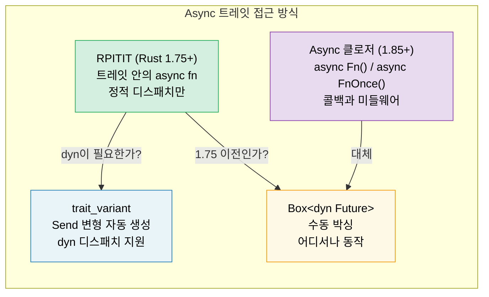

<a id="async-traits"></a>
# 10. Async 트레잇 🟡

> **이 장에서 배우는 것:**
> - 트레잇의 async 메서드가 안정화되기까지 왜 오랜 시간이 걸렸는지
> - RPITIT: 네이티브 async 트레잇 메서드 (Rust 1.75+)
> - dyn 디스패치의 난점과 `trait_variant` 우회책
> - Async 클로저 (Rust 1.85+): `async Fn()`과 `async FnOnce()`



<a id="the-history-why-it-took-so-long"></a>
## 역사: 왜 이렇게 오래 걸렸나

트레잇의 async 메서드는 수년 동안 Rust에서 가장 많이 요청된 기능 중 하나였습니다. 문제는 다음과 같았습니다:

```rust
// Rust 1.75(2023년 12월) 전까지는 컴파일되지 않았다:
trait DataStore {
    async fn get(&self, key: &str) -> Option<String>;
}
// 왜일까? async fn은 `impl Future<Output = T>`를 반환하는데,
// 트레잇의 반환 위치에서 `impl Trait`를 지원하지 않았기 때문이다.
```

핵심 난점은 이것입니다. 트레잇 메서드가 `impl Future`를 반환하면, 각 구현체는 *서로 다른 구체 타입*을 반환합니다. 그런데 트레잇 메서드는 동적 디스패치될 수 있으므로, 컴파일러는 반환 타입의 크기를 알 수 있어야 합니다.

<a id="rpitit-return-position-impl-trait-in-trait"></a>
### RPITIT: 트레잇 반환 위치의 impl Trait

Rust 1.75부터는 정적 디스패치에서는 이 패턴이 그대로 동작합니다:

```rust
trait DataStore {
    async fn get(&self, key: &str) -> Option<String>;
    // 다음과 같이 디슈거링된다:
    // fn get(&self, key: &str) -> impl Future<Output = Option<String>>;
}

struct InMemoryStore {
    data: std::collections::HashMap<String, String>,
}

impl DataStore for InMemoryStore {
    async fn get(&self, key: &str) -> Option<String> {
        self.data.get(key).cloned()
    }
}

// ✅ 제네릭과 함께 잘 동작한다 (정적 디스패치):
async fn lookup<S: DataStore>(store: &S, key: &str) {
    if let Some(val) = store.get(key).await {
        println!("{key} = {val}");
    }
}
```

<a id="dyn-dispatch-and-send-bounds"></a>
### dyn 디스패치와 Send 바운드

제약은 이것입니다. 컴파일러가 반환 future의 크기를 알 수 없기 때문에 `dyn DataStore`를 직접 쓸 수 없습니다:

```rust
// ❌ 동작하지 않는다:
// async fn lookup_dyn(store: &dyn DataStore, key: &str) { ... }
// 에러: 메서드 `get`이 `async`이므로
//       트레잇 `DataStore`는 dyn과 호환되지 않는다

// ✅ 우회책: boxed future를 반환한다
trait DynDataStore {
    fn get(&self, key: &str) -> Pin<Box<dyn Future<Output = Option<String>> + Send + '_>>;
}

// 또는 trait_variant 매크로를 사용한다 (아래 참고)
```

**`Send` 문제**: 멀티스레드 런타임에서는 `spawn`된 태스크가 `Send`여야 합니다. 하지만 async 트레잇 메서드는 자동으로 `Send` 바운드를 붙여 주지 않습니다:

```rust
trait Worker {
    async fn run(&self); // 반환 future는 Send일 수도 있고 아닐 수도 있다
}

struct MyWorker;

impl Worker for MyWorker {
    async fn run(&self) {
        // !Send 타입을 사용하면 future도 !Send가 된다
        let rc = std::rc::Rc::new(42);
        some_work().await;
        println!("{rc}");
    }
}

// ❌ future가 Send가 아니면 실패한다:
// tokio::spawn(worker.run()); // Send + 'static 필요
```

<a id="the-trait_variant-crate"></a>
### `trait_variant` 크레이트

`trait_variant` 크레이트(Rust async working group에서 제공)는 `Send` 변형을 자동으로 생성해 줍니다:

```rust
// Cargo.toml: trait-variant = "0.1"

#[trait_variant::make(SendDataStore: Send)]
trait DataStore {
    async fn get(&self, key: &str) -> Option<String>;
    async fn set(&self, key: &str, value: String);
}

// 이제 트레잇이 두 개 생긴다:
// - DataStore: future에 Send 바운드가 없다
// - SendDataStore: 모든 future가 Send다
// 둘은 메서드 시그니처가 같으며, 구현체는 DataStore만 구현하면 되고
// future가 Send라면 SendDataStore도 자동으로 얻는다.

// spawn이 필요할 때는 SendDataStore를 사용한다:
async fn spawn_lookup(store: Arc<dyn SendDataStore>) {
    tokio::spawn(async move {
        store.get("key").await;
    });
}
```

<a id="quick-reference-async-traits"></a>
### 빠른 참고: Async 트레잇

| 방식 | 정적 디스패치 | 동적 디스패치 | Send | 문법 오버헤드 |
|----------|:---:|:---:|:---:|---|
| 트레잇 안의 네이티브 `async fn` | ✅ | ❌ | 암묵적 | 없음 |
| `trait_variant` | ✅ | ✅ | 명시적 | `#[trait_variant::make]` |
| 수동 `Box::pin` | ✅ | ✅ | 명시적 | 높음 |
| `async-trait` 크레이트 | ✅ | ✅ | `#[async_trait]` | 중간 (proc macro) |

> **권장 사항**: 새 코드(Rust 1.75+)에서는 네이티브 async 트레잇을 쓰고, `dyn` 디스패치가 필요할 때 `trait_variant`를 함께 쓰세요. `async-trait` 크레이트도 여전히 널리 사용되지만 모든 future를 박싱합니다. 네이티브 접근은 정적 디스패치에서 비용이 0입니다.

<a id="async-closures-rust-185"></a>
### Async 클로저 (Rust 1.85+)

Rust 1.85부터는 `async closure`가 안정화되었습니다. 즉, 환경을 캡처하고 future를 반환하는 클로저를 직접 쓸 수 있습니다:

```rust
// 1.85 이전: 어색한 우회책
let urls = vec!["https://a.com", "https://b.com"];
let fetchers: Vec<_> = urls.iter().map(|url| {
    let url = url.to_string();
    // async가 아닌 클로저가 async 블록을 반환한다
    move || async move { reqwest::get(&url).await }
}).collect();

// 1.85 이후: async 클로저가 바로 동작한다
let fetchers: Vec<_> = urls.iter().map(|url| {
    async move || { reqwest::get(url).await }
    // ↑ 이것이 async 클로저다 — url을 캡처하고 Future를 반환한다
}).collect();
```

Async 클로저는 새로운 `AsyncFn`, `AsyncFnMut`, `AsyncFnOnce` 트레잇을 구현하며, 이는 각각 `Fn`, `FnMut`, `FnOnce`에 대응합니다:

```rust
// async 클로저를 받는 제네릭 함수
async fn retry<F>(max: usize, f: F) -> Result<String, Error>
where
    F: AsyncFn() -> Result<String, Error>,
{
    for _ in 0..max {
        if let Ok(val) = f().await {
            return Ok(val);
        }
    }
    f().await
}
```

> **마이그레이션 팁**: `Fn() -> impl Future<Output = T>` 형태를 쓰고 있다면, 더 깔끔한 시그니처를 위해 `AsyncFn() -> T`로 바꾸는 것을 고려해 보세요.

<details>
<summary><strong>🏋️ 연습문제: Async 서비스 트레잇 설계하기</strong> (클릭하여 펼치기)</summary>

**도전 과제**: async `get`/`set` 메서드를 가진 `Cache` 트레잇을 설계해 보세요. 구현은 두 가지로 만듭니다. 하나는 `HashMap` 기반(메모리 내 구현), 다른 하나는 Redis 백엔드를 흉내 낸 구현입니다(`tokio::time::sleep`으로 네트워크 지연을 시뮬레이션). 두 구현 모두와 동작하는 제네릭 함수를 작성하세요.

<details>
<summary>해답 (클릭하여 펼치기)</summary>

```rust
use std::collections::HashMap;
use std::sync::Arc;
use tokio::sync::Mutex;
use tokio::time::{sleep, Duration};

trait Cache {
    async fn get(&self, key: &str) -> Option<String>;
    async fn set(&self, key: &str, value: String);
}

// --- 메모리 내 구현 ---
struct MemoryCache {
    store: Mutex<HashMap<String, String>>,
}

impl MemoryCache {
    fn new() -> Self {
        MemoryCache {
            store: Mutex::new(HashMap::new()),
        }
    }
}

impl Cache for MemoryCache {
    async fn get(&self, key: &str) -> Option<String> {
        self.store.lock().await.get(key).cloned()
    }

    async fn set(&self, key: &str, value: String) {
        self.store.lock().await.insert(key.to_string(), value);
    }
}

// --- Redis를 흉내 낸 구현 ---
struct RedisCache {
    store: Mutex<HashMap<String, String>>,
    latency: Duration,
}

impl RedisCache {
    fn new(latency_ms: u64) -> Self {
        RedisCache {
            store: Mutex::new(HashMap::new()),
            latency: Duration::from_millis(latency_ms),
        }
    }
}

impl Cache for RedisCache {
    async fn get(&self, key: &str) -> Option<String> {
        sleep(self.latency).await; // 네트워크 왕복 시간을 흉내 낸다
        self.store.lock().await.get(key).cloned()
    }

    async fn set(&self, key: &str, value: String) {
        sleep(self.latency).await;
        self.store.lock().await.insert(key.to_string(), value);
    }
}

// --- 어떤 Cache와도 동작하는 제네릭 함수 ---
async fn cache_demo<C: Cache>(cache: &C, label: &str) {
    cache.set("greeting", "Hello, async!".into()).await;
    let val = cache.get("greeting").await;
    println!("[{label}] greeting = {val:?}");
}

#[tokio::main]
async fn main() {
    let mem = MemoryCache::new();
    cache_demo(&mem, "memory").await;

    let redis = RedisCache::new(50);
    cache_demo(&redis, "redis").await;
}
```

**핵심 포인트**: 같은 제네릭 함수가 정적 디스패치를 통해 두 구현 모두와 동작합니다. 박싱도, 추가 할당도 필요 없습니다. 동적 디스패치가 필요하다면 `trait_variant::make(SendCache: Send)`를 추가하세요.

</details>
</details>

> **핵심 정리 — Async 트레잇**
> - Rust 1.75부터는 트레잇 안에 `async fn`을 직접 쓸 수 있습니다 (`#[async_trait]` 크레이트가 필수는 아닙니다)
> - `trait_variant::make`는 동적 디스패치를 위한 `Send` 변형을 자동 생성합니다
> - Async 클로저(`async Fn()`)는 1.85에서 안정화되었으며 콜백과 미들웨어에 유용합니다
> - 성능이 중요한 코드에서는 `dyn`보다 정적 디스패치(`<S: Service>`)를 우선하세요

> **함께 보기:** Tower의 `Service` 트레잇은 [13장 — 프로덕션 패턴](ch13-production-patterns.md), 수동 트레잇 구현은 [6장 — Future를 직접 만들기](ch06-building-futures-by-hand.md)에서 다룹니다

***


