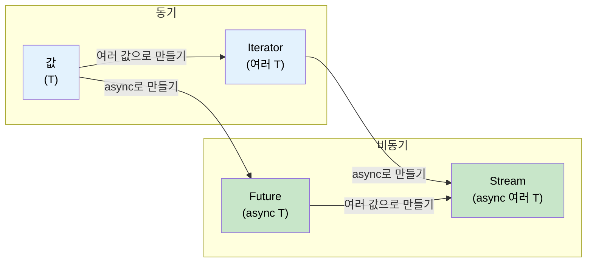

<a id="streams-and-asynciterator"></a>
# 11. Streams와 AsyncIterator 🟡

> **이 장에서 배우는 것:**
> - `Stream` 트레잇: 여러 값을 비동기로 순회하기
> - Stream 만들기: `stream::iter`, `async_stream`, `unfold`
> - Stream 조합기: `map`, `filter`, `buffer_unordered`, `fold`
> - Async I/O 트레잇: `AsyncRead`, `AsyncWrite`, `AsyncBufRead`

<a id="stream-trait-overview"></a>
## Stream 트레잇 개요

`Stream`은 `Iterator`가 여러 값을 다루는 방식에 대해, `Future`가 단일 값을 다루는 방식과 같은 위치에 있습니다. 즉, 여러 값을 비동기로 산출합니다:

```rust
// std::iter::Iterator (동기, 여러 값)
trait Iterator {
    type Item;
    fn next(&mut self) -> Option<Self::Item>;
}

// futures::Stream (비동기, 여러 값)
trait Stream {
    type Item;
    fn poll_next(self: Pin<&mut Self>, cx: &mut Context<'_>) -> Poll<Option<Self::Item>>;
}
```



<a id="creating-streams"></a>
### Stream 만들기

```rust
use futures::stream::{self, StreamExt};
use tokio::time::{interval, Duration};
use tokio_stream::wrappers::IntervalStream;

// 1. 이터레이터에서 만들기
let s = stream::iter(vec![1, 2, 3]);

// 2. async 생성기에서 만들기 (async_stream 크레이트 사용)
// Cargo.toml: async-stream = "0.3"
use async_stream::stream;

fn countdown(from: u32) -> impl futures::Stream<Item = u32> {
    stream! {
        for i in (0..=from).rev() {
            tokio::time::sleep(Duration::from_millis(500)).await;
            yield i;
        }
    }
}

// 3. tokio interval에서 만들기
let tick_stream = IntervalStream::new(interval(Duration::from_secs(1)));

// 4. 채널 receiver에서 만들기 (tokio_stream::wrappers)
let (tx, rx) = tokio::sync::mpsc::channel::<String>(100);
let rx_stream = tokio_stream::wrappers::ReceiverStream::new(rx);

// 5. unfold에서 만들기 (비동기 상태에서 생성)
let s = stream::unfold(0u32, |state| async move {
    if state >= 5 {
        None // Stream 종료
    } else {
        let next = state + 1;
        Some((state, next)) // `state`를 yield하고, 다음 상태는 `next`
    }
});
```

<a id="consuming-streams"></a>
### Stream 소비하기

```rust
use futures::stream::{self, StreamExt};

async fn stream_examples() {
    let s = stream::iter(vec![1, 2, 3, 4, 5]);

    // for_each — 각 항목 처리
    s.for_each(|x| async move {
        println!("{x}");
    }).await;

    // map + collect
    let doubled: Vec<i32> = stream::iter(vec![1, 2, 3])
        .map(|x| x * 2)
        .collect()
        .await;

    // filter
    let evens: Vec<i32> = stream::iter(1..=10)
        .filter(|x| futures::future::ready(x % 2 == 0))
        .collect()
        .await;

    // buffer_unordered — N개 항목을 동시에 처리
    let results: Vec<_> = stream::iter(vec!["url1", "url2", "url3"])
        .map(|url| async move {
            // HTTP fetch를 흉내 낸다
            tokio::time::sleep(Duration::from_millis(100)).await;
            format!("response from {url}")
        })
        .buffer_unordered(10) // 최대 10개 fetch를 동시 처리
        .collect()
        .await;

    // take, skip, zip, chain — Iterator와 동일
    let first_three: Vec<i32> = stream::iter(1..=100)
        .take(3)
        .collect()
        .await;
}
```

<a id="comparison-with-c-iasyncenumerable"></a>
### C#의 `IAsyncEnumerable`과 비교

| 기능 | Rust `Stream` | C# `IAsyncEnumerable<T>` |
|---------|--------------|--------------------------|
| **문법** | `stream! { yield x; }` | `await foreach` / `yield return` |
| **취소** | stream을 drop | `CancellationToken` |
| **백프레셔** | 소비자가 poll 속도를 제어 | 소비자가 `MoveNextAsync`를 제어 |
| **내장 여부** | 아니오 (`futures` 크레이트 필요) | 예 (C# 8.0부터) |
| **조합기** | `.map()`, `.filter()`, `.buffer_unordered()` | LINQ + `System.Linq.Async` |
| **에러 처리** | `Stream<Item = Result<T, E>>` | async iterator 안에서 예외 발생 |

```rust
// Rust: 데이터베이스 row를 내보내는 Stream
// 참고: 본문 안에서 ?를 쓰려면 stream!이 아니라 try_stream!이 필요하다.
// stream!은 에러를 전파하지 않고, try_stream!은 Err(e)를 yield한 뒤 종료한다.
fn get_users(db: &Database) -> impl Stream<Item = Result<User, DbError>> + '_ {
    try_stream! {
        let mut cursor = db.query("SELECT * FROM users").await?;
        while let Some(row) = cursor.next().await {
            yield User::from_row(row?);
        }
    }
}

// 소비하기:
let mut users = pin!(get_users(&db));
while let Some(result) = users.next().await {
    match result {
        Ok(user) => println!("{}", user.name),
        Err(e) => eprintln!("Error: {e}"),
    }
}
```

```csharp
// C#에서의 대응 코드:
async IAsyncEnumerable<User> GetUsers() {
    await using var reader = await db.QueryAsync("SELECT * FROM users");
    while (await reader.ReadAsync()) {
        yield return User.FromRow(reader);
    }
}

// 소비하기:
await foreach (var user in GetUsers()) {
    Console.WriteLine(user.Name);
}
```

<details>
<summary><strong>🏋️ 연습문제: Async 통계 집계기 만들기</strong> (클릭하여 펼치기)</summary>

**도전 과제**: 센서 측정값 stream `Stream<Item = f64>`가 주어졌을 때, stream을 소비해서 `(count, min, max, average)`를 반환하는 async 함수를 작성하세요. `StreamExt` 조합기를 사용하고, 단순히 `Vec`로 모아 버리지는 마세요.

*힌트*: `.fold()`로 stream 전체에 걸쳐 상태를 누적하세요.

<details>
<summary>해답 (클릭하여 펼치기)</summary>

```rust
use futures::stream::{self, StreamExt};

#[derive(Debug)]
struct Stats {
    count: usize,
    min: f64,
    max: f64,
    sum: f64,
}

impl Stats {
    fn average(&self) -> f64 {
        if self.count == 0 { 0.0 } else { self.sum / self.count as f64 }
    }
}

async fn compute_stats<S: futures::Stream<Item = f64> + Unpin>(stream: S) -> Stats {
    stream
        .fold(
            Stats { count: 0, min: f64::INFINITY, max: f64::NEG_INFINITY, sum: 0.0 },
            |mut acc, value| async move {
                acc.count += 1;
                acc.min = acc.min.min(value);
                acc.max = acc.max.max(value);
                acc.sum += value;
                acc
            },
        )
        .await
}

#[tokio::test]
async fn test_stats() {
    let readings = stream::iter(vec![23.5, 24.1, 22.8, 25.0, 23.9]);
    let stats = compute_stats(readings).await;

    assert_eq!(stats.count, 5);
    assert!((stats.min - 22.8).abs() < f64::EPSILON);
    assert!((stats.max - 25.0).abs() < f64::EPSILON);
    assert!((stats.average() - 23.86).abs() < 0.01);
}
```

**핵심 포인트**: `.fold()` 같은 stream 조합기는 항목을 메모리에 모두 모으지 않고 하나씩 처리합니다. 큰 데이터 스트림이나 끝이 없는 스트림을 처리할 때 필수적인 방식입니다.

</details>
</details>

<a id="async-io-traits-asyncread-asyncwrite-asyncbufread"></a>
### Async I/O 트레잇: `AsyncRead`, `AsyncWrite`, `AsyncBufRead`

동기 I/O의 기반이 `std::io::Read`/`Write`인 것처럼, async I/O의 기반은 그에 대응하는 async 트레잇들입니다. 이 트레잇들은 `tokio::io`에서 제공되며, 런타임 비의존적 코드라면 `futures::io`를 사용할 수도 있습니다:

```rust
// tokio::io — std::io 트레잇의 async 버전

/// 소스에서 바이트를 비동기로 읽는다
pub trait AsyncRead {
    fn poll_read(
        self: Pin<&mut Self>,
        cx: &mut Context<'_>,
        buf: &mut ReadBuf<'_>,  // Tokio가 제공하는 미초기화 메모리 안전 래퍼
    ) -> Poll<io::Result<()>>;
}

/// 싱크에 바이트를 비동기로 쓴다
pub trait AsyncWrite {
    fn poll_write(
        self: Pin<&mut Self>,
        cx: &mut Context<'_>,
        buf: &[u8],
    ) -> Poll<io::Result<usize>>;

    fn poll_flush(self: Pin<&mut Self>, cx: &mut Context<'_>) -> Poll<io::Result<()>>;
    fn poll_shutdown(self: Pin<&mut Self>, cx: &mut Context<'_>) -> Poll<io::Result<()>>;
}

/// 줄 단위 지원이 있는 버퍼드 읽기
pub trait AsyncBufRead: AsyncRead {
    fn poll_fill_buf(self: Pin<&mut Self>, cx: &mut Context<'_>) -> Poll<io::Result<&[u8]>>;
    fn consume(self: Pin<&mut Self>, amt: usize);
}
```

**실전에서는** 이 `poll_*` 메서드를 직접 호출하는 경우가 거의 없습니다. 대신 `.await` 친화적인 헬퍼를 제공하는 확장 트레잇 `AsyncReadExt`, `AsyncWriteExt`를 사용합니다:

```rust
use tokio::io::{AsyncReadExt, AsyncWriteExt, AsyncBufReadExt};
use tokio::net::TcpStream;
use tokio::io::BufReader;

async fn io_examples() -> tokio::io::Result<()> {
    let mut stream = TcpStream::connect("127.0.0.1:8080").await?;

    // AsyncWriteExt: write_all, write_u32, write_buf 등
    stream.write_all(b"GET / HTTP/1.0\r\n\r\n").await?;

    // AsyncReadExt: read, read_exact, read_to_end, read_to_string
    let mut response = Vec::new();
    stream.read_to_end(&mut response).await?;

    // AsyncBufReadExt: read_line, lines(), split()
    let file = tokio::fs::File::open("config.txt").await?;
    let reader = BufReader::new(file);
    let mut lines = reader.lines();
    while let Some(line) = lines.next_line().await? {
        println!("{line}");
    }

    Ok(())
}
```

**커스텀 async I/O 구현하기** — raw TCP 위에 프로토콜 감싸기:

```rust
use tokio::io::{AsyncRead, AsyncWrite, ReadBuf};
use std::pin::Pin;
use std::task::{Context, Poll};

/// 길이 접두(length-prefixed) 프로토콜: [u32 length][payload bytes]
struct FramedStream<T> {
    inner: T,
}

impl<T: AsyncRead + AsyncReadExt + Unpin> FramedStream<T> {
    /// 프레임 하나를 완전히 읽는다
    async fn read_frame(&mut self) -> tokio::io::Result<Vec<u8>>
    {
        // 4바이트 길이 접두를 읽는다
        let len = self.inner.read_u32().await? as usize;

        // 그 길이만큼 정확히 읽는다
        let mut payload = vec![0u8; len];
        self.inner.read_exact(&mut payload).await?;
        Ok(payload)
    }
}

impl<T: AsyncWrite + AsyncWriteExt + Unpin> FramedStream<T> {
    /// 프레임 하나를 완전히 쓴다
    async fn write_frame(&mut self, data: &[u8]) -> tokio::io::Result<()>
    {
        self.inner.write_u32(data.len() as u32).await?;
        self.inner.write_all(data).await?;
        self.inner.flush().await?;
        Ok(())
    }
}
```

| 동기 트레잇 | Async 트레잇 (tokio) | Async 트레잇 (futures) | 확장 트레잇 |
|-----------|--------------------|-----------------------|----------------|
| `std::io::Read` | `tokio::io::AsyncRead` | `futures::io::AsyncRead` | `AsyncReadExt` |
| `std::io::Write` | `tokio::io::AsyncWrite` | `futures::io::AsyncWrite` | `AsyncWriteExt` |
| `std::io::BufRead` | `tokio::io::AsyncBufRead` | `futures::io::AsyncBufRead` | `AsyncBufReadExt` |
| `std::io::Seek` | `tokio::io::AsyncSeek` | `futures::io::AsyncSeek` | `AsyncSeekExt` |

> **tokio vs futures I/O 트레잇**: 둘은 비슷하지만 완전히 같지는 않습니다. tokio의 `AsyncRead`는 `ReadBuf`를 사용해 미초기화 메모리를 안전하게 다루고, `futures::AsyncRead`는 `&mut [u8]`를 사용합니다. 둘 사이를 변환하려면 `tokio_util::compat`를 사용하세요.

> **복사 유틸리티**: `tokio::io::copy(&mut reader, &mut writer)`는 `std::io::copy`의 async 버전으로, 프록시 서버나 파일 전송에 유용합니다. `tokio::io::copy_bidirectional`은 양방향 복사를 동시에 수행합니다.

<details>
<summary><strong>🏋️ 연습문제: Async 줄 수 세기 만들기</strong> (클릭하여 펼치기)</summary>

**도전 과제**: 어떤 `AsyncBufRead` 소스든 받아 비어 있지 않은 줄의 개수를 반환하는 async 함수를 작성하세요. 파일, TCP 스트림, 혹은 어떤 버퍼드 리더와도 동작해야 합니다.

*힌트*: `AsyncBufReadExt::lines()`를 사용하고 `!line.is_empty()`인 줄만 세세요.

<details>
<summary>해답 (클릭하여 펼치기)</summary>

```rust
use tokio::io::AsyncBufReadExt;

async fn count_non_empty_lines<R: tokio::io::AsyncBufRead + Unpin>(
    reader: R,
) -> tokio::io::Result<usize> {
    let mut lines = reader.lines();
    let mut count = 0;
    while let Some(line) = lines.next_line().await? {
        if !line.is_empty() {
            count += 1;
        }
    }
    Ok(count)
}

// 어떤 AsyncBufRead와도 동작한다:
// let file = tokio::io::BufReader::new(tokio::fs::File::open("data.txt").await?);
// let count = count_non_empty_lines(file).await?;
//
// let tcp = tokio::io::BufReader::new(TcpStream::connect("...").await?);
// let count = count_non_empty_lines(tcp).await?;
```

**핵심 포인트**: 구체 타입 대신 `AsyncBufRead`에 맞춰 프로그래밍하면, 파일·소켓·파이프는 물론 메모리 버퍼(`tokio::io::BufReader::new(std::io::Cursor::new(data))`)까지 재사용 가능한 I/O 코드를 작성할 수 있습니다.

</details>
</details>

> **핵심 정리 — Streams와 AsyncIterator**
> - `Stream`은 `Iterator`의 async 대응물로, `Poll::Ready(Some(item))` 또는 `Poll::Ready(None)`을 산출합니다
> - `.buffer_unordered(N)`은 stream 항목 N개를 동시에 처리하는, stream에서 가장 중요한 동시성 도구입니다
> - `async_stream::stream!`은 커스텀 stream을 만드는 가장 쉬운 방법입니다 (`yield` 사용)
> - `AsyncRead`/`AsyncBufRead`는 파일·소켓·파이프 전반에 걸쳐 재사용 가능한 제네릭 I/O 코드를 가능하게 합니다

> **함께 보기:** 관련 패턴인 `FuturesUnordered`는 [9장 — Tokio가 맞지 않는 경우](ch09-when-tokio-isnt-the-right-fit.md), bounded channel 기반 백프레셔는 [13장 — 프로덕션 패턴](ch13-production-patterns.md)에서 다룹니다

***


