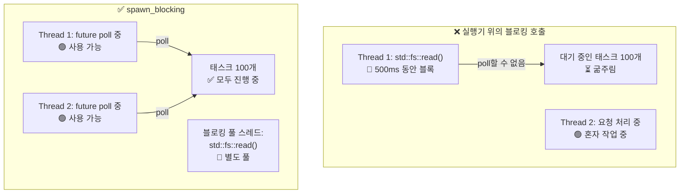

<a id="common-pitfalls"></a>
# 12. 흔한 함정 🔴

> **이 장에서 배우는 것:**
> - async Rust에서 자주 나오는 9가지 버그와 각각의 해결법
> - 왜 실행기를 막아버리는 일이 가장 흔한 실수인지, 그리고 `spawn_blocking`이 어떻게 해결하는지
> - 취소 위험: `await` 도중 future가 drop되면 무슨 일이 생기는지
> - 디버깅: `tokio-console`, `tracing`, `#[instrument]`
> - 테스트: `#[tokio::test]`, `time::pause()`, 트레잇 기반 모킹

<a id="blocking-the-executor"></a>
## 실행기를 막아버리기

async Rust에서 가장 흔한 실수는 async 실행기 스레드 위에서 블로킹 코드를 돌리는 것입니다. 그러면 다른 태스크들이 굶주리게 됩니다.

```rust
// ❌ 잘못된 예: 실행기 스레드 전체를 막아 버린다
async fn bad_handler() -> String {
    let data = std::fs::read_to_string("big_file.txt").unwrap(); // 블로킹된다!
    process(&data)
}

// ✅ 올바른 예: 블로킹 작업을 전용 스레드 풀로 넘긴다
async fn good_handler() -> String {
    let data = tokio::task::spawn_blocking(|| {
        std::fs::read_to_string("big_file.txt").unwrap()
    }).await.unwrap();
    process(&data)
}

// ✅ 이것도 올바른 예: tokio의 async fs 사용
async fn also_good_handler() -> String {
    let data = tokio::fs::read_to_string("big_file.txt").await.unwrap();
    process(&data)
}
```



<a id="stdthreadsleep-vs-tokiotimesleep"></a>
### `std::thread::sleep` vs `tokio::time::sleep`

```rust
// ❌ 잘못된 예: 실행기 스레드를 5초 동안 막아 버린다
async fn bad_delay() {
    std::thread::sleep(Duration::from_secs(5)); // 이 스레드는 다른 어떤 것도 poll할 수 없다!
}

// ✅ 올바른 예: 실행기에 제어를 넘기므로 다른 태스크가 돌 수 있다
async fn good_delay() {
    tokio::time::sleep(Duration::from_secs(5)).await; // 블로킹되지 않는다!
}
```

<a id="holding-mutexguard-across-await"></a>
### `.await`를 가로질러 `MutexGuard` 유지하기

```rust
use std::sync::Mutex; // std Mutex — async를 인식하지 못한다

// ❌ 잘못된 예: MutexGuard를 .await 너머까지 들고 간다
async fn bad_mutex(data: &Mutex<Vec<String>>) {
    let mut guard = data.lock().unwrap();
    guard.push("item".into());
    some_io().await; // 💥 여기서 Guard가 살아 있으므로 다른 스레드가 lock하지 못한다!
    guard.push("another".into());
}
// 또한 std::sync::MutexGuard는 !Send이므로
// tokio의 멀티스레드 런타임에서는 이 코드가 컴파일되지 않는다.

// ✅ 해결 1: Guard가 .await 전에 drop되도록 스코프를 나눈다
async fn good_mutex_scoped(data: &Mutex<Vec<String>>) {
    {
        let mut guard = data.lock().unwrap();
        guard.push("item".into());
    } // 여기서 Guard drop
    some_io().await; // 안전함 — lock이 해제되었다
    {
        let mut guard = data.lock().unwrap();
        guard.push("another".into());
    }
}

// ✅ 해결 2: tokio::sync::Mutex 사용 (async 인식)
use tokio::sync::Mutex as AsyncMutex;

async fn good_async_mutex(data: &AsyncMutex<Vec<String>>) {
    let mut guard = data.lock().await; // async lock — 스레드를 블로킹하지 않는다
    guard.push("item".into());
    some_io().await; // OK — tokio Mutex guard는 Send다
    guard.push("another".into());
}
```

> **어떤 Mutex를 언제 쓸까**
> - `std::sync::Mutex`: `.await` 없이 짧은 임계 구역만 있을 때
> - `tokio::sync::Mutex`: lock을 `.await` 지점 너머까지 들고 있어야 할 때
> - `parking_lot::Mutex`: `std` 대체품이 필요할 때. 더 빠르고 더 작지만 여전히 `.await`와는 함께 쓰지 않습니다

<a id="cancellation-hazards"></a>
### 취소 위험

future를 drop하면 해당 future는 취소됩니다. 문제는 이것이 상태를 일관되지 않게 남길 수 있다는 점입니다:

```rust
// ❌ 위험: 취소되면 자원이 새어 나갈 수 있다
async fn transfer(from: &Account, to: &Account, amount: u64) {
    from.debit(amount).await;  // 여기서 취소되면...
    to.credit(amount).await;   // ...돈이 사라진다!
}

// ✅ 안전: 작업을 원자적으로 만들거나 보상 로직을 둔다
async fn safe_transfer(from: &Account, to: &Account, amount: u64) -> Result<(), Error> {
    // 데이터베이스 트랜잭션 사용 (전부 성공하거나 전부 실패)
    let tx = db.begin_transaction().await?;
    tx.debit(from, amount).await?;
    tx.credit(to, amount).await?;
    tx.commit().await?; // 모든 단계가 성공했을 때만 커밋
    Ok(())
}

// ✅ 이것도 안전: tokio::select!를 취소 인지 방식으로 사용
tokio::select! {
    result = transfer(from, to, amount) => {
        // 송금 완료
    }
    _ = shutdown_signal() => {
        // 중간에 취소하지 말고 완료까지 기다린다
        // 또는: 명시적으로 롤백한다
    }
}
```

<a id="no-async-drop"></a>
### Async Drop은 없다

Rust의 `Drop` 트레잇은 동기적이므로 `drop()` 안에서는 **`.await`를 사용할 수 없습니다**. 이것은 자주 혼동되는 지점입니다:

```rust
struct DbConnection { /* ... */ }

impl Drop for DbConnection {
    fn drop(&mut self) {
        // ❌ 이렇게는 못 한다 — drop()은 동기 함수다!
        // self.connection.shutdown().await;

        // ✅ 우회책 1: 정리 태스크를 spawn한다 (fire-and-forget)
        let conn = self.connection.take();
        tokio::spawn(async move {
            let _ = conn.shutdown().await;
        });

        // ✅ 우회책 2: 동기 close를 사용한다
        // self.connection.blocking_close();
    }
}
```

**권장 사항**: 명시적인 `async fn close(self)` 메서드를 제공하고, 호출자가 그것을 사용해야 한다고 문서화하세요. `Drop`은 기본 정리 경로가 아니라 최후의 안전망으로만 두는 편이 좋습니다.

<a id="select-fairness-and-starvation"></a>
### `select!`의 공정성과 기아

```rust
use tokio::sync::mpsc;

// ❌ 불공정: busy_stream이 항상 이기고, slow_stream은 굶주린다
async fn unfair(mut fast: mpsc::Receiver<i32>, mut slow: mpsc::Receiver<i32>) {
    loop {
        tokio::select! {
            Some(v) = fast.recv() => println!("fast: {v}"),
            Some(v) = slow.recv() => println!("slow: {v}"),
            // 둘 다 준비되어 있으면 tokio가 무작위로 하나를 고른다.
            // 하지만 `fast`가 항상 준비되어 있으면 `slow`는 거의 poll되지 않는다.
        }
    }
}

// ✅ 공정: biased select를 쓰거나 배치로 비운다
async fn fair(mut fast: mpsc::Receiver<i32>, mut slow: mpsc::Receiver<i32>) {
    loop {
        tokio::select! {
            biased; // 항상 순서대로 검사 — 우선순위를 명시한다

            Some(v) = slow.recv() => println!("slow: {v}"),  // 우선순위!
            Some(v) = fast.recv() => println!("fast: {v}"),
        }
    }
}
```

<a id="accidental-sequential-execution"></a>
### 의도치 않은 순차 실행

```rust
// ❌ 순차 실행: 총 2초 걸린다
async fn slow() {
    let a = fetch("url_a").await; // 1초
    let b = fetch("url_b").await; // 1초 (a가 끝날 때까지 기다린다!)
}

// ✅ 동시 실행: 총 1초 걸린다
async fn fast() {
    let (a, b) = tokio::join!(
        fetch("url_a"), // 둘 다 즉시 시작한다
        fetch("url_b"),
    );
}

// ✅ 이것도 동시 실행: let + join 사용
async fn also_fast() {
    let fut_a = fetch("url_a"); // future 생성 (lazy — 아직 시작되지 않음)
    let fut_b = fetch("url_b"); // future 생성
    let (a, b) = tokio::join!(fut_a, fut_b); // 이제 둘 다 동시에 실행된다
}
```

> **함정**: `let a = fetch(url).await; let b = fetch(url).await;`는 순차 실행입니다.
> 두 번째 `.await`는 첫 번째가 끝난 뒤에야 시작됩니다. 동시성이 필요하면 `join!`이나 `spawn`을 사용하세요.

<a id="case-study-debugging-a-hung-production-service"></a>
## 사례 연구: 멈춰 버린 프로덕션 서비스 디버깅

실제 운영에서 흔한 시나리오를 보겠습니다. 서비스가 10분 동안은 요청을 잘 처리하다가, 그 뒤로는 응답을 멈춥니다. 로그에 에러는 없고 CPU 사용률은 0%입니다.

**진단 단계:**

1. **`tokio-console` 연결** — `Pending` 상태에 멈춘 태스크 200개 이상이 보입니다
2. **태스크 상세 확인** — 모두 같은 `Mutex::lock().await`를 기다리고 있습니다
3. **근본 원인** — 한 태스크가 `std::sync::MutexGuard`를 `.await` 너머까지 들고 있다가 panic을 내며 mutex를 poison 상태로 만들었습니다. 그 뒤 다른 태스크들은 모두 `lock().unwrap()`에서 실패합니다

**수정 내용:**

| 이전 (문제 있음) | 이후 (수정됨) |
|-----------------|---------------|
| `std::sync::Mutex` | `tokio::sync::Mutex` |
| `.lock().unwrap()`을 `.await` 너머까지 유지 | `.await` 전에 lock 스코프 종료 |
| lock 획득 타임아웃 없음 | `tokio::time::timeout(dur, mutex.lock())` |
| poison 상태 복구 없음 | `tokio::sync::Mutex`는 poison되지 않음 |

**예방 체크리스트:**
- [ ] Guard가 어떤 `.await`라도 넘는다면 `tokio::sync::Mutex`를 사용한다
- [ ] async 함수에 `#[tracing::instrument]`를 붙여 span 추적을 남긴다
- [ ] staging 환경에서 `tokio-console`을 돌려 멈춘 태스크를 일찍 잡는다
- [ ] 태스크 응답성을 확인하는 헬스 체크 엔드포인트를 추가한다

<details>
<summary><strong>🏋️ 연습문제: 버그 찾기</strong> (클릭하여 펼치기)</summary>

**도전 과제**: 아래 코드에 있는 async 함정들을 모두 찾아 고쳐 보세요.

```rust
use std::sync::Mutex;

async fn process_requests(urls: Vec<String>) -> Vec<String> {
    let results = Mutex::new(Vec::new());
    
    for url in &urls {
        let response = reqwest::get(url).await.unwrap().text().await.unwrap();
        std::thread::sleep(std::time::Duration::from_millis(100)); // 속도 제한
        let mut guard = results.lock().unwrap();
        guard.push(response);
        expensive_parse(&guard).await; // 지금까지의 모든 결과를 파싱
    }
    
    results.into_inner().unwrap()
}
```

<details>
<summary>해답 (클릭하여 펼치기)</summary>

**찾아낸 문제:**

1. **순차 fetch** — URL을 동시에 가져오지 않고 하나씩 가져옵니다
2. **`std::thread::sleep`** — 실행기 스레드를 막아 버립니다
3. **`.await`를 넘겨 살아 있는 `MutexGuard`** — `expensive_parse`를 기다릴 때도 `guard`가 살아 있습니다
4. **동시성 부재** — `join!`이나 `FuturesUnordered`를 써야 합니다

```rust
use tokio::sync::Mutex;
use std::sync::Arc;
use futures::stream::{self, StreamExt};

async fn process_requests(urls: Vec<String>) -> Vec<String> {
    // 해결 4: buffer_unordered로 URL을 동시에 처리한다
    let results: Vec<String> = stream::iter(urls)
        .map(|url| async move {
            let response = reqwest::get(&url).await.unwrap().text().await.unwrap();
            // 해결 2: std::thread::sleep 대신 tokio::time::sleep 사용
            tokio::time::sleep(std::time::Duration::from_millis(100)).await;
            response
        })
        .buffer_unordered(10) // 최대 10개 요청 동시 처리
        .collect()
        .await;

    // 해결 3: 먼저 모은 뒤 파싱 — 아예 mutex가 필요 없다!
    for result in &results {
        expensive_parse(result).await;
    }

    results
}
```

**핵심 포인트**: async 코드는 구조를 조금만 바꿔도 mutex를 아예 없앨 수 있는 경우가 많습니다. stream이나 `join`으로 결과를 모은 뒤 처리하세요. 더 단순하고, 더 빠르며, 데드락 위험도 없습니다.

</details>
</details>

---

<a id="debugging-async-code"></a>
### Async 코드 디버깅

Async 스택 트레이스는 악명이 높을 정도로 난해합니다. 논리적인 호출 체인 대신 실행기의 poll 루프가 보이기 때문입니다. 아래는 가장 중요한 디버깅 도구들입니다.

<a id="tokio-console-real-time-task-inspector"></a>
#### `tokio-console`: 실시간 태스크 검사기

[`tokio-console`](https://github.com/tokio-rs/console)은 `htop` 같은 화면으로 모든 spawned task를 보여 줍니다. 각 태스크의 상태, poll 시간, waker 활동, 자원 사용량까지 확인할 수 있습니다.

```toml
# Cargo.toml
[dependencies]
console-subscriber = "0.4"
tokio = { version = "1", features = ["full", "tracing"] }
```

```rust
#[tokio::main]
async fn main() {
    console_subscriber::init(); // 기본 tracing subscriber를 대체한다
    // ... 애플리케이션 나머지 부분
}
```

다른 터미널에서 실행:

```bash
$ RUSTFLAGS="--cfg tokio_unstable" cargo run   # 필요한 컴파일 타임 플래그
$ tokio-console                                # 127.0.0.1:6669로 연결
```

<a id="tracing--instrument-structured-logging-for-async"></a>
#### `tracing` + `#[instrument]`: Async용 구조화 로깅

[`tracing`](https://docs.rs/tracing) 크레이트는 `Future`의 생명주기를 이해합니다. span은 `.await` 지점을 지나도 열린 상태를 유지하므로, OS 스레드가 바뀌어도 논리적인 호출 스택을 따라갈 수 있습니다:

```rust
use tracing::{info, instrument};

#[instrument(skip(db_pool), fields(user_id = %user_id))]
async fn handle_request(user_id: u64, db_pool: &Pool) -> Result<Response> {
    info!("looking up user");
    let user = db_pool.get_user(user_id).await?;  // span은 .await를 지나도 열린 채로 유지된다
    info!(email = %user.email, "found user");
    let orders = fetch_orders(user_id).await?;     // 여전히 같은 span 안이다
    Ok(build_response(user, orders))
}
```

출력 예시 (`tracing_subscriber::fmt::json()` 사용):

```json
{"timestamp":"...","level":"INFO","span":{"name":"handle_request","user_id":"42"},"message":"looking up user"}
{"timestamp":"...","level":"INFO","span":{"name":"handle_request","user_id":"42"},"fields":{"email":"a@b.com"},"message":"found user"}
```

<a id="debugging-checklist"></a>
#### 디버깅 체크리스트

| 증상 | 가능한 원인 | 도구 |
|---------|-------------|------|
| 태스크가 영원히 멈춤 | `.await` 누락 또는 `Mutex` 데드락 | `tokio-console` 태스크 뷰 |
| 처리량이 낮음 | async 스레드에서 블로킹 호출 | `tokio-console` poll 시간 히스토그램 |
| `Future is not Send` | `.await` 너머에 `!Send` 타입 보관 | 컴파일러 에러 + 위치 파악용 `#[instrument]` |
| 원인 모를 취소 | 부모 `select!`가 한 브랜치를 drop | `tracing` span 생명주기 이벤트 |

> **팁**: `tokio-console`에서 태스크 수준 메트릭을 보려면 `RUSTFLAGS="--cfg tokio_unstable"`를 켜세요.
> 이것은 런타임 플래그가 아니라 컴파일 타임 플래그입니다.

<a id="testing-async-code"></a>
### Async 코드 테스트

Async 코드는 테스트에서도 고유한 과제를 만듭니다. 런타임이 필요하고, 시간을 제어해야 하며, 동시 동작을 검증할 전략도 필요합니다.

**기본 async 테스트** (`#[tokio::test]` 사용):

```rust
// Cargo.toml
// [dev-dependencies]
// tokio = { version = "1", features = ["full", "test-util"] }

#[tokio::test]
async fn test_basic_async() {
    let result = fetch_data().await;
    assert_eq!(result, "expected");
}

// 단일 스레드 테스트 (!Send 타입에 유용)
#[tokio::test(flavor = "current_thread")]
async fn test_single_threaded() {
    let rc = std::rc::Rc::new(42);
    let val = async { *rc }.await;
    assert_eq!(val, 42);
}

// 워커 수를 명시한 멀티스레드 테스트
#[tokio::test(flavor = "multi_thread", worker_threads = 2)]
async fn test_concurrent_behavior() {
    // 실제 동시성으로 경쟁 조건을 시험한다
    let counter = std::sync::Arc::new(std::sync::atomic::AtomicU32::new(0));
    let c1 = counter.clone();
    let c2 = counter.clone();
    let (a, b) = tokio::join!(
        tokio::spawn(async move { c1.fetch_add(1, std::sync::atomic::Ordering::SeqCst) }),
        tokio::spawn(async move { c2.fetch_add(1, std::sync::atomic::Ordering::SeqCst) }),
    );
    a.unwrap();
    b.unwrap();
    assert_eq!(counter.load(std::sync::atomic::Ordering::SeqCst), 2);
}
```

**시간 조작** — 실제로 기다리지 않고 타임아웃 테스트하기:

```rust
use tokio::time::{self, Duration, Instant};

#[tokio::test]
async fn test_timeout_behavior() {
    // 시간을 멈춘다 — sleep()은 즉시 진행되며 실제 벽시계 시간은 흐르지 않는다
    time::pause();

    let start = Instant::now();
    time::sleep(Duration::from_secs(3600)).await; // 1시간 "기다리지만" 실제로는 0ms
    assert!(start.elapsed() >= Duration::from_secs(3600));
    // 테스트는 1시간이 아니라 밀리초 단위로 끝난다!
}

#[tokio::test]
async fn test_retry_timing() {
    time::pause();

    // retry 로직이 예상한 시간만큼 기다리는지 확인한다
    let start = Instant::now();
    let result = retry_with_backoff(|| async {
        Err::<(), _>("simulated failure")
    }, 3, Duration::from_secs(1))
    .await;

    assert!(result.is_err());
    // 1s + 2s + 4s = 7초의 백오프 (지수 증가)
    assert!(start.elapsed() >= Duration::from_secs(7));
}

#[tokio::test]
async fn test_deadline_exceeded() {
    time::pause();

    let result = tokio::time::timeout(
        Duration::from_secs(5),
        async {
            // 느린 작업을 흉내 낸다
            time::sleep(Duration::from_secs(10)).await;
            "done"
        }
    ).await;

    assert!(result.is_err()); // 타임아웃 발생
}
```

**Async 의존성 모킹** — 트레잇 객체나 제네릭을 사용하기:

```rust
// 의존성을 위한 트레잇 정의:
trait Storage {
    async fn get(&self, key: &str) -> Option<String>;
    async fn set(&self, key: &str, value: String);
}

// 프로덕션 구현:
struct RedisStorage { /* ... */ }
impl Storage for RedisStorage {
    async fn get(&self, key: &str) -> Option<String> {
        // 실제 Redis 호출
        todo!()
    }
    async fn set(&self, key: &str, value: String) {
        todo!()
    }
}

// 테스트용 mock:
struct MockStorage {
    data: std::sync::Mutex<std::collections::HashMap<String, String>>,
}

impl MockStorage {
    fn new() -> Self {
        MockStorage { data: std::sync::Mutex::new(std::collections::HashMap::new()) }
    }
}

impl Storage for MockStorage {
    async fn get(&self, key: &str) -> Option<String> {
        self.data.lock().unwrap().get(key).cloned()
    }
    async fn set(&self, key: &str, value: String) {
        self.data.lock().unwrap().insert(key.to_string(), value);
    }
}

// 테스트 대상 함수는 Storage에 대해 제네릭하다:
async fn cache_lookup<S: Storage>(store: &S, key: &str) -> String {
    match store.get(key).await {
        Some(val) => val,
        None => {
            let val = "computed".to_string();
            store.set(key, val.clone()).await;
            val
        }
    }
}

#[tokio::test]
async fn test_cache_miss_then_hit() {
    let mock = MockStorage::new();

    // 첫 호출: miss → 계산 후 저장
    let val = cache_lookup(&mock, "key1").await;
    assert_eq!(val, "computed");

    // 두 번째 호출: hit → 저장된 값 반환
    let val = cache_lookup(&mock, "key1").await;
    assert_eq!(val, "computed");
    assert!(mock.data.lock().unwrap().contains_key("key1"));
}
```

**채널과 태스크 통신 테스트**:

```rust
#[tokio::test]
async fn test_producer_consumer() {
    let (tx, mut rx) = tokio::sync::mpsc::channel(10);

    tokio::spawn(async move {
        for i in 0..5 {
            tx.send(i).await.unwrap();
        }
        // 여기서 tx가 drop되며 채널이 닫힌다
    });

    let mut received = Vec::new();
    while let Some(val) = rx.recv().await {
        received.push(val);
    }

    assert_eq!(received, vec![0, 1, 2, 3, 4]);
}
```

| 테스트 패턴 | 언제 쓰나 | 핵심 도구 |
|-------------|-------------|----------|
| `#[tokio::test]` | 모든 async 테스트 | `tokio = { features = ["macros", "rt"] }` |
| `time::pause()` | 타임아웃, 재시도, 주기 작업 테스트 | `tokio::time::pause()` |
| 트레잇 모킹 | I/O 없이 비즈니스 로직 테스트 | 제네릭 `<S: Storage>` |
| `current_thread` flavor | `!Send` 타입 또는 결정적 스케줄링 테스트 | `#[tokio::test(flavor = "current_thread")]` |
| `multi_thread` flavor | 경쟁 조건 테스트 | `#[tokio::test(flavor = "multi_thread")]` |

> **핵심 정리 — 흔한 함정**
> - 실행기를 블로킹하지 마세요. CPU/동기 작업에는 `spawn_blocking`을 사용하세요
> - `MutexGuard`를 `.await` 너머까지 들고 가지 마세요. lock 범위를 좁히거나 `tokio::sync::Mutex`를 사용하세요
> - 취소는 future를 즉시 drop합니다. 부분 완료 작업에는 cancel-safe 패턴을 사용하세요
> - async 코드를 디버깅할 때는 `tokio-console`과 `#[tracing::instrument]`가 강력합니다
> - async 코드는 `#[tokio::test]`와 `time::pause()`로 결정적으로 테스트할 수 있습니다

> **함께 보기:** 동기화 프리미티브는 [8장 — Tokio 심화](ch08-tokio-deep-dive.md), graceful shutdown과 구조적 동시성은 [13장 — 프로덕션 패턴](ch13-production-patterns.md)에서 이어서 다룹니다

***


