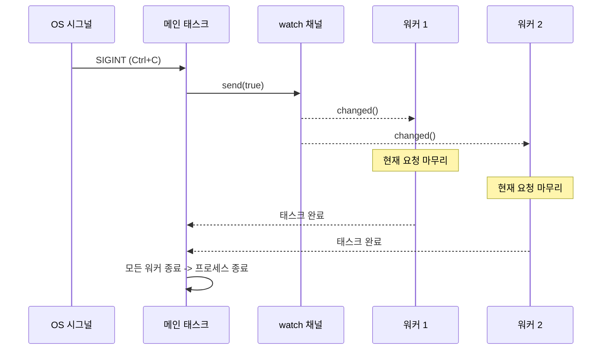

<a id="production-patterns"></a>
# 13. 프로덕션 패턴 🔴

> **이 장에서 배우는 것:**
> - `watch` 채널과 `select!`를 사용한 우아한 종료
> - 백프레셔: bounded 채널로 OOM 방지
> - 구조화된 동시성: `JoinSet`과 `TaskTracker`
> - 타임아웃, 재시도, 지수 백오프
> - 에러 처리: `thiserror` vs `anyhow`, double-`?` 패턴
> - Tower: `axum`, `tonic`, `hyper`가 사용하는 미들웨어 패턴

<a id="graceful-shutdown"></a>
## 우아한 종료

프로덕션 서버는 종료될 때도 깔끔해야 합니다. 진행 중인 요청을 마무리하고, 버퍼를 flush하고, 연결을 닫아야 합니다.

```rust
use tokio::signal;
use tokio::sync::watch;

async fn main_server() {
    // 종료 신호 채널 생성
    let (shutdown_tx, shutdown_rx) = watch::channel(false);

    // 서버 스폰
    let server_handle = tokio::spawn(run_server(shutdown_rx.clone()));

    // Ctrl+C 대기
    signal::ctrl_c().await.expect("Failed to listen for Ctrl+C");
    println!("Shutdown signal received, finishing in-flight requests...");

    // 모든 태스크에 종료 알림 전송
    shutdown_tx.send(true).unwrap();

    // 서버가 끝날 때까지 대기(타임아웃 포함)
    match tokio::time::timeout(
        std::time::Duration::from_secs(30),
        server_handle,
    ).await {
        Ok(Ok(())) => println!("Server shut down gracefully"),
        Ok(Err(e)) => eprintln!("Server error: {e}"),
        Err(_) => eprintln!("Server shutdown timed out — forcing exit"),
    }
}

async fn run_server(mut shutdown: watch::Receiver<bool>) {
    loop {
        tokio::select! {
            // 새 연결 수락
            conn = accept_connection() => {
                let shutdown = shutdown.clone();
                tokio::spawn(handle_connection(conn, shutdown));
            }
            // 종료 신호 수신
            _ = shutdown.changed() => {
                if *shutdown.borrow() {
                    println!("Stopping accepting new connections");
                    break;
                }
            }
        }
    }
    // 진행 중이던 연결은 각자 가진 shutdown_rx clone을 통해
    // 스스로 작업을 마무리하고 종료한다.
}

async fn handle_connection(conn: Connection, mut shutdown: watch::Receiver<bool>) {
    loop {
        tokio::select! {
            request = conn.next_request() => {
                // 요청은 끝까지 처리한다. 중간에 버리지 않는다.
                process_request(request).await;
            }
            _ = shutdown.changed() => {
                if *shutdown.borrow() {
                    // 현재 요청을 마친 뒤 종료
                    break;
                }
            }
        }
    }
}
```



<a id="backpressure-with-bounded-channels"></a>
### bounded 채널로 백프레셔 적용하기

producer가 consumer보다 빠르면 unbounded 채널은 OOM으로 이어질 수 있습니다. 프로덕션에서는 항상 bounded 채널을 사용하세요.

```rust
use tokio::sync::mpsc;

async fn backpressure_example() {
    // bounded 채널: 최대 100개 항목을 버퍼링
    let (tx, mut rx) = mpsc::channel::<WorkItem>(100);

    // producer: 버퍼가 가득 차면 자연스럽게 속도가 느려진다
    let producer = tokio::spawn(async move {
        for i in 0..1_000_000 {
            // send()는 async다. 버퍼가 가득 차면 기다린다.
            // 이것이 자연스러운 백프레셔를 만든다.
            tx.send(WorkItem { id: i }).await.unwrap();
        }
    });

    // consumer: 자기 속도대로 항목을 처리한다
    let consumer = tokio::spawn(async move {
        while let Some(item) = rx.recv().await {
            process(item).await; // 처리 속도가 느려도 괜찮다. producer가 기다린다.
        }
    });

    let _ = tokio::join!(producer, consumer);
}

// unbounded와 비교해 보면 위험하다:
// let (tx, rx) = mpsc::unbounded_channel(); // 백프레셔 없음!
// producer가 메모리를 끝없이 채울 수 있다
```

<a id="structured-concurrency-joinset-and-tasktracker"></a>
### 구조화된 동시성: `JoinSet`과 `TaskTracker`

`JoinSet`은 관련된 태스크를 한데 묶고, 모두 완료될 때까지 추적할 수 있게 해 줍니다.

```rust
use tokio::task::JoinSet;
use tokio::time::{sleep, Duration};

async fn structured_concurrency() {
    let mut set = JoinSet::new();

    // 태스크 묶음을 스폰
    for url in get_urls() {
        set.spawn(async move {
            fetch_and_process(url).await
        });
    }

    // 모든 결과 수집(순서는 보장되지 않음)
    let mut results = Vec::new();
    while let Some(result) = set.join_next().await {
        match result {
            Ok(Ok(data)) => results.push(data),
            Ok(Err(e)) => eprintln!("Task error: {e}"),
            Err(e) => eprintln!("Task panicked: {e}"),
        }
    }

    // 여기까지 오면 모든 태스크가 끝난 상태다. 떠 있는 백그라운드 작업이 없다.
    println!("Processed {} items", results.len());
}

// TaskTracker (tokio-util 0.7.9+) — 스폰한 태스크 전체를 기다리기
use tokio_util::task::TaskTracker;

async fn with_tracker() {
    let tracker = TaskTracker::new();

    for i in 0..10 {
        tracker.spawn(async move {
            sleep(Duration::from_millis(100 * i)).await;
            println!("Task {i} done");
        });
    }

    tracker.close(); // 더 이상 태스크를 추가하지 않음
    tracker.wait().await; // 추적 중인 모든 태스크를 기다림
    println!("All tasks finished");
}
```

<a id="timeouts-and-retries"></a>
### 타임아웃과 재시도

```rust
use tokio::time::{timeout, sleep, Duration};

// 간단한 타임아웃
async fn with_timeout() -> Result<Response, Error> {
    match timeout(Duration::from_secs(5), fetch_data()).await {
        Ok(Ok(response)) => Ok(response),
        Ok(Err(e)) => Err(Error::Fetch(e)),
        Err(_) => Err(Error::Timeout),
    }
}

// 지수 백오프 재시도
async fn retry_with_backoff<F, Fut, T, E>(
    max_attempts: u32,
    base_delay_ms: u64,
    operation: F,
) -> Result<T, E>
where
    F: Fn() -> Fut,
    Fut: std::future::Future<Output = Result<T, E>>,
    E: std::fmt::Display,
{
    let mut delay = Duration::from_millis(base_delay_ms);

    for attempt in 1..=max_attempts {
        match operation().await {
            Ok(result) => return Ok(result),
            Err(e) => {
                if attempt == max_attempts {
                    eprintln!("Final attempt {attempt} failed: {e}");
                    return Err(e);
                }
                eprintln!("Attempt {attempt} failed: {e}, retrying in {delay:?}");
                sleep(delay).await;
                delay *= 2; // 지수 백오프
            }
        }
    }
    unreachable!()
}

// 사용 예:
// let result = retry_with_backoff(3, 100, || async {
//     reqwest::get("https://api.example.com/data").await
// }).await?;
```

> **프로덕션 팁 — 지터를 추가하세요:** 위 함수는 순수 지수 백오프만 사용합니다. 하지만 프로덕션에서는 여러 클라이언트가 동시에 실패하면 모두 같은 간격으로 재시도해 thundering herd가 생깁니다. `sleep(delay + rand_jitter)`처럼 무작위 *지터*를 더해 재시도 시점을 흩어 주세요. 여기서 `rand_jitter`는 `0..delay/4` 정도로 둘 수 있습니다.

<a id="error-handling-in-async-code"></a>
### Async 코드에서의 에러 처리

Async 코드에서는 에러 전파가 조금 더 까다롭습니다. 스폰된 태스크가 에러 경계를 만들고, 타임아웃 에러가 내부 에러를 감싸며, future가 태스크 경계를 넘을 때 `?`의 작동 방식도 달라지기 때문입니다.

**`thiserror` vs `anyhow`** — 어떤 도구를 골라야 할까:

```rust
// thiserror: 라이브러리와 공개 API를 위한 타입 있는 에러 정의
// 각 variant가 명시적이므로 호출자가 특정 에러를 매칭할 수 있다
use thiserror::Error;

#[derive(Error, Debug)]
enum DiagError {
    #[error("IPMI command failed: {0}")]
    Ipmi(#[from] IpmiError),

    #[error("Sensor {sensor} out of range: {value}°C (max {max}°C)")]
    OverTemp { sensor: String, value: f64, max: f64 },

    #[error("Operation timed out after {0:?}")]
    Timeout(std::time::Duration),

    #[error("Task panicked: {0}")]
    TaskPanic(#[from] tokio::task::JoinError),
}

// anyhow: 애플리케이션과 프로토타입을 위한 빠른 에러 처리
// 어떤 에러든 감쌀 수 있으므로 경우마다 타입을 만들 필요가 없다
use anyhow::{Context, Result};

async fn run_diagnostics() -> Result<()> {
    let config = load_config()
        .await
        .context("Failed to load diagnostic config")?;  // 문맥 추가

    let result = run_gpu_test(&config)
        .await
        .context("GPU diagnostic failed")?;              // 문맥 누적

    Ok(())
}
// anyhow prints: "GPU diagnostic failed: IPMI command failed: timeout"
```

| 크레이트 | 이럴 때 사용 | 에러 타입 | 매칭 |
|-------|----------|-----------|----------|
| `thiserror` | 라이브러리 코드, 공개 API | `enum MyError { ... }` | `match err { MyError::Timeout => ... }` |
| `anyhow` | 애플리케이션, CLI 도구, 스크립트 | `anyhow::Error` (타입 소거) | `err.downcast_ref::<MyError>()` |
| 둘 다 함께 | 라이브러리는 `thiserror`, 앱은 `anyhow`로 감싼다 | 양쪽 장점 결합 | 라이브러리 에러는 타입이 있고, 앱은 세부 타입에 덜 신경 쓴다 |

**`tokio::spawn`에서의 double-`?` 패턴**:

```rust
use thiserror::Error;
use tokio::task::JoinError;

#[derive(Error, Debug)]
enum AppError {
    #[error("HTTP error: {0}")]
    Http(#[from] reqwest::Error),

    #[error("Task panicked: {0}")]
    TaskPanic(#[from] JoinError),
}

async fn spawn_with_errors() -> Result<String, AppError> {
    let handle = tokio::spawn(async {
        let resp = reqwest::get("https://example.com").await?;
        Ok::<_, reqwest::Error>(resp.text().await?)
    });

    // double ?: 첫 번째 ?는 JoinError(태스크 panic)를 풀고,
    // 두 번째 ?는 내부 Result를 푼다.
    let result = handle.await??;
    Ok(result)
}
```

**에러 경계 문제** — `tokio::spawn`은 문맥을 지워 버린다:

```rust
// ❌ spawn 경계를 넘으면 에러 문맥이 사라진다
async fn bad_error_handling() -> Result<()> {
    let handle = tokio::spawn(async {
        some_fallible_work().await  // Result<T, SomeError> 반환
    });

    // handle.await는 Result<Result<T, SomeError>, JoinError>를 반환한다
    // 내부 에러에는 어떤 태스크가 실패했는지에 대한 문맥이 없다
    let result = handle.await??;
    Ok(())
}

// ✅ spawn 경계에서 문맥을 추가한다
async fn good_error_handling() -> Result<()> {
    let handle = tokio::spawn(async {
        some_fallible_work()
            .await
            .context("worker task failed")  // 경계를 넘기기 전에 문맥 추가
    });

    let result = handle.await
        .context("worker task panicked")??;  // JoinError에도 문맥 추가
    Ok(())
}
```

**타임아웃 에러** — 감쌀 것인가, 대체할 것인가:

```rust
use tokio::time::{timeout, Duration};

async fn with_timeout_context() -> Result<String, DiagError> {
    let dur = Duration::from_secs(30);
    match timeout(dur, fetch_sensor_data()).await {
        Ok(Ok(data)) => Ok(data),
        Ok(Err(e)) => Err(e),                      // 내부 에러 유지
        Err(_) => Err(DiagError::Timeout(dur)),     // 타임아웃 -> 타입 있는 에러
    }
}
```

<a id="tower-the-middleware-pattern"></a>
### Tower: 미들웨어 패턴

[Tower](https://docs.rs/tower) 크레이트는 조합 가능한 `Service` 트레잇을 정의합니다. 이것이 Rust async 미들웨어의 핵심 뼈대이며, `axum`, `tonic`, `hyper`가 모두 이 패턴을 활용합니다.

```rust
// Tower의 핵심 트레잇(단순화 버전)
pub trait Service<Request> {
    type Response;
    type Error;
    type Future: Future<Output = Result<Self::Response, Self::Error>>;

    fn poll_ready(&mut self, cx: &mut Context<'_>) -> Poll<Result<(), Self::Error>>;
    fn call(&mut self, req: Request) -> Self::Future;
}
```

미들웨어는 `Service`를 감싸서 로깅, 타임아웃, 속도 제한 같은 횡단 관심사를 안쪽 로직을 수정하지 않고 추가합니다.

```rust
use tower::{ServiceBuilder, timeout::TimeoutLayer, limit::RateLimitLayer};
use std::time::Duration;

let service = ServiceBuilder::new()
    .layer(TimeoutLayer::new(Duration::from_secs(10)))       // 가장 바깥: timeout
    .layer(RateLimitLayer::new(100, Duration::from_secs(1))) // 그다음: rate limit
    .service(my_handler);                                     // 가장 안쪽: 내 비즈니스 로직
```

**왜 중요한가:** ASP.NET 미들웨어나 Express.js 미들웨어를 써 본 적이 있다면 Tower는 그 Rust 대응물입니다. 프로덕션 Rust 서비스가 코드 중복 없이 공통 관심사를 얹는 표준 방식이라고 보면 됩니다.

<a id="exercise-graceful-shutdown-with-worker-pool"></a>
### 연습문제: 워커 풀과 우아한 종료

<details>
<summary>연습문제 (클릭하여 펼치기)</summary>

**도전 과제:** 채널 기반 작업 큐, N개의 워커 태스크, Ctrl+C 시 우아한 종료를 갖춘 작업 처리기를 만들어 보세요. 워커는 종료 전에 진행 중인 작업을 끝까지 마쳐야 합니다.

<details>
<summary>해답 (클릭하여 펼치기)</summary>

```rust
use tokio::sync::{mpsc, watch};
use tokio::time::{sleep, Duration};

struct WorkItem { id: u64, payload: String }

#[tokio::main]
async fn main() {
    let (work_tx, work_rx) = mpsc::channel::<WorkItem>(100);
    let (shutdown_tx, shutdown_rx) = watch::channel(false);
    let work_rx = std::sync::Arc::new(tokio::sync::Mutex::new(work_rx));

    let mut handles = Vec::new();
    for id in 0..4 {
        let rx = work_rx.clone();
        let mut shutdown = shutdown_rx.clone();
        handles.push(tokio::spawn(async move {
            loop {
                let item = {
                    let mut rx = rx.lock().await;
                    tokio::select! {
                        item = rx.recv() => item,
                        _ = shutdown.changed() => {
                            if *shutdown.borrow() { None } else { continue }
                        }
                    }
                };
                match item {
                    Some(work) => {
                        println!("Worker {id}: processing {}", work.id);
                        sleep(Duration::from_millis(200)).await;
                    }
                    None => break,
                }
            }
        }));
    }

    // 작업 투입
    for i in 0..20 {
        let _ = work_tx.send(WorkItem { id: i, payload: format!("task-{i}") }).await;
        sleep(Duration::from_millis(50)).await;
    }

    // Ctrl+C가 오면 종료 신호를 보내고 워커를 기다린다
    tokio::signal::ctrl_c().await.unwrap();
    shutdown_tx.send(true).unwrap();
    for h in handles { let _ = h.await; }
    println!("Shut down cleanly.");
}
```

</details>
</details>

> **핵심 정리 — 프로덕션 패턴**
> - 조율된 우아한 종료에는 `watch` 채널 + `select!` 조합이 유용합니다.
> - bounded 채널(`mpsc::channel(N)`)은 **백프레셔**를 제공하므로 버퍼가 가득 차면 sender가 기다립니다.
> - `JoinSet`과 `TaskTracker`는 **구조화된 동시성**을 제공합니다. 태스크 묶음을 추적하고, 중단하고, 기다릴 수 있습니다.
> - 네트워크 작업에는 항상 타임아웃을 두세요. `tokio::time::timeout(dur, fut)`
> - Tower의 `Service` 트레잇은 프로덕션 Rust 서비스에서 사실상의 표준 미들웨어 패턴입니다.

> **참고:** [8장 — Tokio 심화](ch08-tokio-deep-dive.md)에서 채널과 동기화 프리미티브를, [12장 — 흔한 함정](ch12-common-pitfalls.md)에서 종료 시점의 cancellation hazard를 함께 보세요.

***