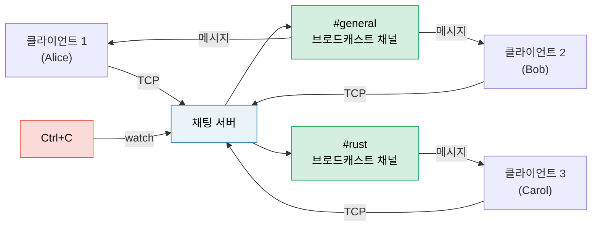

<a id="capstone-project-async-chat-server"></a>
# 캡스톤 프로젝트: Async 채팅 서버

이 프로젝트는 책 전반에서 다룬 패턴을 하나의 프로덕션 스타일 애플리케이션으로 통합합니다. `tokio`, 채널, stream, 우아한 종료, 적절한 에러 처리를 사용해 **여러 방을 지원하는 async 채팅 서버**를 만들어 보세요.

**예상 시간**: 4–6시간 | **난이도**: ★★★

> **이 프로젝트에서 연습할 것:**
> - `tokio::spawn`과 `'static` 요구 사항 (8장)
> - 채널: 메시지용 `mpsc`, 방용 `broadcast`, 종료용 `watch` (8장)
> - Stream: TCP 연결에서 줄 단위로 읽기 (11장)
> - 흔한 함정: cancellation safety, `.await`를 넘는 `MutexGuard` (12장)
> - 프로덕션 패턴: 우아한 종료, 백프레셔 (13장)
> - 교체 가능한 백엔드를 위한 async 트레잇 (10장)

<a id="the-problem"></a>
## 문제 정의

다음 조건을 만족하는 TCP 채팅 서버를 만들어 보세요.

1. **클라이언트**는 TCP로 접속해 이름 있는 방에 들어간다.
2. **메시지**는 같은 방의 모든 클라이언트에게 브로드캐스트된다.
3. **명령어**: `/join <room>`, `/nick <name>`, `/rooms`, `/quit`
4. 서버는 Ctrl+C 시 우아하게 종료되며, 진행 중인 메시지 처리를 마무리한다.



<a id="step-1-basic-tcp-accept-loop"></a>
## 1단계: 기본 TCP accept 루프

먼저 연결을 받아 줄 단위로 그대로 돌려주는 서버부터 시작해 보세요.

```rust
use tokio::io::{AsyncBufReadExt, AsyncWriteExt, BufReader};
use tokio::net::TcpListener;

#[tokio::main]
async fn main() -> anyhow::Result<()> {
    let listener = TcpListener::bind("127.0.0.1:8080").await?;
    println!("Chat server listening on :8080");

    loop {
        let (socket, addr) = listener.accept().await?;
        println!("[{addr}] Connected");

        tokio::spawn(async move {
            let (reader, mut writer) = socket.into_split();
            let mut reader = BufReader::new(reader);
            let mut line = String::new();

            loop {
                line.clear();
                match reader.read_line(&mut line).await {
                    Ok(0) | Err(_) => break,
                    Ok(_) => {
                        let _ = writer.write_all(line.as_bytes()).await;
                    }
                }
            }
            println!("[{addr}] Disconnected");
        });
    }
}
```

**직접 해볼 일:** 이 코드가 컴파일되는지 확인하고, `telnet localhost 8080`으로 실제 동작을 검증해 보세요.

<a id="step-2-room-state-with-broadcast-channels"></a>
## 2단계: `broadcast` 채널로 방 상태 만들기

각 방은 `broadcast::Sender` 하나로 표현합니다. 같은 방에 있는 모든 클라이언트는 이 sender에 subscribe해서 메시지를 받습니다.

```rust
use std::collections::HashMap;
use std::sync::Arc;
use tokio::sync::{broadcast, RwLock};

type RoomMap = Arc<RwLock<HashMap<String, broadcast::Sender<String>>>>;

fn get_or_create_room(rooms: &mut HashMap<String, broadcast::Sender<String>>, name: &str) -> broadcast::Sender<String> {
    rooms.entry(name.to_string())
        .or_insert_with(|| {
            let (tx, _) = broadcast::channel(100); // 메시지 버퍼 100개
            tx
        })
        .clone()
}
```

**직접 해볼 일:** 방 상태를 구현해서 다음이 가능하도록 만들어 보세요.
- 클라이언트는 처음에 `#general`에서 시작한다.
- `/join <room>`은 방을 바꾼다(이전 방 구독 해제, 새 방 구독).
- 메시지는 sender가 현재 속한 방의 모든 클라이언트에게 브로드캐스트된다.

<details>
<summary>힌트 — 클라이언트 태스크 구조</summary>

각 클라이언트 태스크에는 동시에 돌아가는 두 개의 루프가 필요합니다.
1. **TCP에서 읽기** -> 명령어를 파싱하거나 현재 방으로 메시지 전송
2. **broadcast receiver에서 읽기** -> TCP에 쓰기

둘은 `tokio::select!`로 함께 돌릴 수 있습니다.

```rust
loop {
    tokio::select! {
        // 클라이언트가 한 줄 보냄
        result = reader.read_line(&mut line) => {
            match result {
                Ok(0) | Err(_) => break,
                Ok(_) => {
                    // 명령어 파싱 또는 메시지 브로드캐스트
                }
            }
        }
        // 방에서 브로드캐스트 메시지 수신
        result = room_rx.recv() => {
            match result {
                Ok(msg) => {
                    let _ = writer.write_all(msg.as_bytes()).await;
                }
                Err(_) => break,
            }
        }
    }
}
```

</details>

<a id="step-3-commands"></a>
## 3단계: 명령어 처리

다음 명령어 프로토콜을 구현해 보세요.

| 명령어 | 동작 |
|---------|--------|
| `/join <room>` | 현재 방을 떠나 새 방에 들어가고, 양쪽 방에 입장/퇴장 알림을 보냄 |
| `/nick <name>` | 표시 이름 변경 |
| `/rooms` | 현재 활성 방 목록과 인원 수 출력 |
| `/quit` | 우아하게 연결 종료 |
| 그 외 입력 | 일반 채팅 메시지로 브로드캐스트 |

**직접 해볼 일:** 입력 줄에서 명령어를 파싱해 보세요. `/rooms`를 처리하려면 `RoomMap`을 읽어야 하므로, 다른 클라이언트를 막지 않도록 `RwLock::read()`를 사용하세요.

<a id="step-4-graceful-shutdown"></a>
## 4단계: 우아한 종료

Ctrl+C 처리 로직을 추가해서 서버가 다음처럼 동작하도록 만들어 보세요.
1. 새 연결 수락을 중단한다.
2. 모든 방에 `"Server shutting down..."` 메시지를 보낸다.
3. 진행 중인 메시지가 비워질 때까지 기다린다.
4. 깔끔하게 종료한다.

```rust
use tokio::sync::watch;

let (shutdown_tx, shutdown_rx) = watch::channel(false);

// accept 루프 안에서:
loop {
    tokio::select! {
        result = listener.accept() => {
            let (socket, addr) = result?;
            // shutdown_rx.clone()과 함께 클라이언트 태스크 스폰
        }
        _ = tokio::signal::ctrl_c() => {
            println!("Shutdown signal received");
            shutdown_tx.send(true)?;
            break;
        }
    }
}
```

**직접 해볼 일:** 각 클라이언트의 `select!` 루프에 `shutdown_rx.changed()` 분기를 추가해서 종료 신호가 오면 클라이언트가 빠져나가도록 하세요.

<a id="step-5-error-handling-and-edge-cases"></a>
## 5단계: 에러 처리와 경계 사례

이제 서버를 프로덕션에 더 가깝게 단단하게 만들어 보세요.

1. **처리 지연 수신자**: 느린 클라이언트가 메시지를 놓치면 `broadcast::recv()`가 `RecvError::Lagged(n)`을 반환합니다. 이를 우아하게 처리하세요(로그를 남기고 계속 진행, crash 금지).
2. **닉네임 검증**: 빈 닉네임이나 너무 긴 닉네임은 거부하세요.
3. **백프레셔**: broadcast 채널 버퍼는 bounded(100)입니다. 클라이언트가 따라오지 못하면 `Lagged` 에러를 받게 됩니다.
4. **타임아웃**: 5분 넘게 idle인 클라이언트는 연결을 끊으세요.

```rust
use tokio::time::{timeout, Duration};

// 읽기 작업에 타임아웃 적용:
match timeout(Duration::from_secs(300), reader.read_line(&mut line)).await {
    Ok(Ok(0)) | Ok(Err(_)) | Err(_) => break, // EOF, 에러, 또는 타임아웃
    Ok(Ok(_)) => { /* 줄 처리 */ }
}
```

<a id="step-6-integration-test"></a>
## 6단계: 통합 테스트

서버를 띄우고 클라이언트 두 개를 연결한 뒤, 메시지 전달이 실제로 되는지 검증하는 테스트를 작성해 보세요.

```rust
#[tokio::test]
async fn two_clients_can_chat() {
    // 백그라운드에서 서버 시작
    let server = tokio::spawn(run_server("127.0.0.1:0")); // Port 0 = OS가 선택

    // 두 클라이언트 연결
    let mut client1 = TcpStream::connect(addr).await.unwrap();
    let mut client2 = TcpStream::connect(addr).await.unwrap();

    // 클라이언트 1이 메시지 전송
    client1.write_all(b"Hello from client 1\n").await.unwrap();

    // 클라이언트 2는 그 메시지를 받아야 한다
    let mut buf = vec![0u8; 1024];
    let n = client2.read(&mut buf).await.unwrap();
    let msg = String::from_utf8_lossy(&buf[..n]);
    assert!(msg.contains("Hello from client 1"));
}
```

<a id="evaluation-criteria"></a>
## 평가 기준

| 기준 | 목표 |
|-----------|--------|
| 동시성 | 여러 방에서 여러 클라이언트를 동시에 처리하고, blocking이 없어야 함 |
| 정확성 | 메시지는 같은 방의 클라이언트에게만 전달되어야 함 |
| 우아한 종료 | Ctrl+C 시 메시지를 비운 뒤 깔끔하게 종료해야 함 |
| 에러 처리 | 지연 수신자, 연결 종료, 타임아웃을 다뤄야 함 |
| 코드 구성 | accept 루프, 클라이언트 태스크, 방 상태가 깔끔하게 분리되어야 함 |
| 테스트 | 통합 테스트 최소 2개 이상 |

<a id="extension-ideas"></a>
## 확장 아이디어

기본 채팅 서버가 동작하면 다음 확장도 시도해 보세요.

1. **영속 히스토리**: 방마다 최근 N개 메시지를 저장하고 새로 들어온 사용자에게 재생해 주기
2. **WebSocket 지원**: `tokio-tungstenite`를 사용해 TCP와 WebSocket 클라이언트를 모두 받기
3. **속도 제한**: `tokio::time::Interval`로 클라이언트당 초당 메시지 수 제한하기
4. **메트릭**: `prometheus` 크레이트로 연결된 클라이언트 수, 초당 메시지 수, 방 수 추적하기
5. **TLS**: `tokio-rustls`를 붙여 암호화된 연결 지원하기

***
