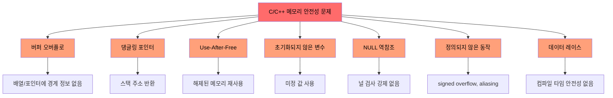
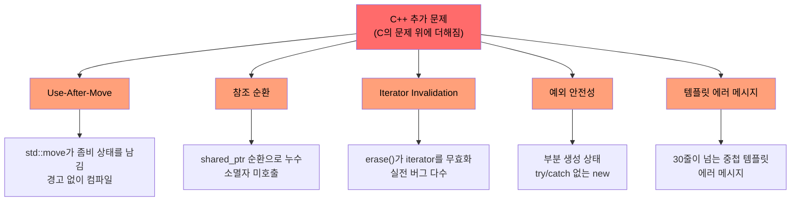
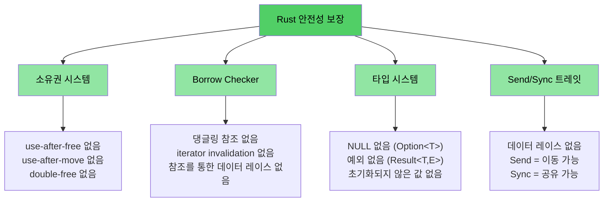

# 왜 C/C++ 개발자에게 Rust가 필요한가

> **이 장에서 배우는 것:**
> - Rust가 제거하는 문제의 전체 목록 - 메모리 안전성, 정의되지 않은 동작, 데이터 레이스 등
> - `shared_ptr`, `unique_ptr` 같은 C++ 완화책이 왜 근본 해결책이 아닌지
> - 안전한 Rust에서는 구조적으로 불가능한 C/C++ 취약점의 구체적인 예시

> **바로 코드를 보고 싶다면?** [코드부터 보자](ch02-getting-started.md#enough-talk-already-show-me-some-code)로 이동하세요.

<a id="what-rust-eliminates--the-complete-list"></a>
## Rust가 제거하는 문제 전체 목록

예제로 들어가기 전에 먼저 핵심만 요약해 보겠습니다. 안전한 Rust는 아래 문제를 **규율, 도구, 코드 리뷰**가 아니라 타입 시스템과 컴파일러를 통해 **구조적으로 방지**합니다.

| **제거되는 문제** | **C** | **C++** | **Rust가 막는 방식** |
|----------------------|:-----:|:-------:|--------------------------|
| 버퍼 오버플로 / 언더플로 | ✅ | ✅ | 모든 배열, 슬라이스, 문자열이 길이 정보를 가지며, 인덱싱은 런타임에 검사된다 |
| 메모리 누수 (GC 없이) | ✅ | ✅ | `Drop` 트레잇 = 제대로 된 RAII, 자동 정리, Rule of Five 불필요 |
| 댕글링 포인터 | ✅ | ✅ | 라이프타임 시스템이 참조 대상보다 참조 수명이 길다는 것을 컴파일 타임에 증명한다 |
| Use-after-free | ✅ | ✅ | 소유권 시스템이 이를 컴파일 에러로 만든다 |
| Use-after-move | — | ✅ | move는 **파괴적**이므로 원래 바인딩이 사라진다 |
| 초기화되지 않은 변수 | ✅ | ✅ | 모든 변수는 사용 전에 반드시 초기화되어야 하며, 컴파일러가 강제한다 |
| 정수 오버플로 / 언더플로 UB | ✅ | ✅ | debug 빌드는 패닉, release 빌드는 wrap 처리 (둘 다 정의된 동작) |
| NULL 포인터 역참조 / SEGV | ✅ | ✅ | 널 포인터가 없고, `Option<T>`가 명시적 처리를 강제한다 |
| 데이터 레이스 | ✅ | ✅ | `Send`/`Sync` 트레잇과 borrow checker가 데이터 레이스를 컴파일 에러로 만든다 |
| 통제되지 않은 부작용 | ✅ | ✅ | 기본이 불변이며, 변경하려면 명시적으로 `mut`가 필요하다 |
| 상속 없음 (더 나은 유지보수성) | — | ✅ | 트레잇 + 조합이 클래스 계층을 대체한다. 재사용은 높이고 결합은 줄인다 |
| 예외 없음, 예측 가능한 제어 흐름 | — | ✅ | 에러는 값(`Result<T, E>`)이고, 무시할 수 없으며 숨은 `throw` 경로가 없다 |
| Iterator invalidation | — | ✅ | borrow checker가 순회 중인 컬렉션 변경을 금지한다 |
| 참조 순환 / finalizer 누수 | — | ✅ | 소유권은 트리 구조가 기본이며, `Rc` 순환은 opt-in이고 `Weak`로 끊을 수 있다 |
| mutex unlock 누락 | ✅ | ✅ | `Mutex<T>`가 데이터를 감싸고, lock guard를 통해서만 접근 가능하다 |
| 정의되지 않은 동작(일반) | ✅ | ✅ | 안전한 Rust에는 **정의되지 않은 동작이 없다**. `unsafe`는 명시적이며 감사 가능하다 |

> **핵심 결론:** 이것들은 코딩 규칙으로 "노력해서" 지키는 목표가 아닙니다. **컴파일 타임 보장**입니다. 코드가 컴파일되면, 이런 버그는 존재할 수 없습니다.

---

<a id="the-problems-shared-by-c-and-c"></a>
## C와 C++가 공통으로 안고 있는 문제들

> **예제를 건너뛰고 싶다면?** [Rust가 이 모든 것을 어떻게 해결하는가](#how-rust-addresses-all-of-this)로 이동하거나, 바로 [코드부터 보자](ch02-getting-started.md#enough-talk-already-show-me-some-code)로 가도 됩니다.

두 언어는 메모리 안전성 문제라는 공통된 핵심 약점을 공유합니다. 이 문제들은 CVE(Common Vulnerabilities and Exposures)의 70% 이상을 차지하는 근본 원인입니다.

### 버퍼 오버플로

C의 배열, 포인터, 문자열은 스스로 경계 정보를 가지지 않습니다. 따라서 범위를 넘는 접근이 너무 쉽게 발생합니다.

```c
#include <stdlib.h>
#include <string.h>

void buffer_dangers() {
    char buffer[10];
    strcpy(buffer, "This string is way too long!");  // 버퍼 오버플로

    int arr[5] = {1, 2, 3, 4, 5};
    int *ptr = arr;           // 크기 정보가 사라진다
    ptr[10] = 42;             // 경계 검사 없음 - 정의되지 않은 동작
}
```

C++에서도 `std::vector::operator[]`는 경계 검사를 하지 않습니다. `.at()`만 검사하지만, 그 예외를 누가 처리하나요?

### 댕글링 포인터와 use-after-free

```c
int *bar() {
    int i = 42;
    return &i;    // 스택 변수 주소를 반환 - 댕글링!
}

void use_after_free() {
    char *p = (char *)malloc(20);
    free(p);
    *p = '\0';   // 해제 후 사용 - 정의되지 않은 동작
}
```

### 초기화되지 않은 변수와 정의되지 않은 동작

C와 C++ 모두 초기화되지 않은 변수를 허용합니다. 결과 값은 미정(indeterminate)이며, 이를 읽는 행위 자체가 정의되지 않은 동작입니다.

```c
int x;               // 초기화되지 않음
if (x > 0) { ... }  // UB - x는 무엇이든 될 수 있음
```

정수 오버플로는 C에서 unsigned 타입은 **정의된 동작**이지만 signed 타입은 **정의되지 않은 동작**입니다. C++에서도 signed overflow는 정의되지 않은 동작입니다. 컴파일러는 이를 "최적화"에 이용하고, 그 결과 프로그램이 예상치 못하게 깨질 수 있습니다.

### NULL 포인터 역참조

```c
int *ptr = NULL;
*ptr = 42;           // SEGV - 하지만 컴파일러는 막아주지 않는다
```

C++에서는 `std::optional<T>`가 도움이 되지만 장황하고, `.value()`를 호출해 예외를 던지는 식으로 우회되는 경우도 많습니다.

### 시각화: 공통 문제



---

<a id="c-adds-more-problems-on-top"></a>
## C++가 추가로 만드는 문제들

> **C만 사용하는 독자라면** 이 절은 건너뛰고 [Rust가 이 문제들을 어떻게 해결하는가](#how-rust-addresses-all-of-this)로 바로 가도 됩니다.
>
> **바로 코드를 보고 싶다면?** [코드부터 보자](ch02-getting-started.md#enough-talk-already-show-me-some-code)로 이동하세요.

C++은 C의 문제를 완화하기 위해 스마트 포인터, RAII, move semantics, 예외를 도입했습니다. 하지만 이것들은 **치료제가 아니라 반창고**입니다. 실패 형태를 "즉시 크래시"에서 "더 미묘한 런타임 버그"로 옮길 뿐입니다.

### `unique_ptr`와 `shared_ptr` - 임시방편일 뿐 근본 해결이 아니다

C++ 스마트 포인터는 raw `malloc`/`free`보다 훨씬 낫지만, 근본 문제를 없애지는 못합니다.

| C++ 완화책 | 해결하는 것 | **해결하지 못하는 것** |
|----------------|---------------|------------------------|
| `std::unique_ptr` | RAII로 누수 방지 | **Use-after-move**는 여전히 컴파일되며, 좀비 `nullptr`를 남긴다 |
| `std::shared_ptr` | 공유 소유권 | **참조 순환**은 조용히 누수된다. `weak_ptr` 사용은 수동 규율에 의존한다 |
| `std::optional` | 일부 널 사용 대체 | 비어 있을 때 `.value()`가 **예외를 던진다** - 숨은 제어 흐름 |
| `std::string_view` | 복사 방지 | 원본 문자열이 해제되면 **댕글링**된다 - 라이프타임 검사 없음 |
| Move semantics | 효율적인 이동 | 이동 후 객체가 **"유효하지만 정의되지 않은 상태"**가 된다 - 버그의 온상 |
| RAII | 자동 정리 | **Rule of Five**를 맞게 구현해야 한다. 하나라도 틀리면 전체가 무너진다 |

```cpp
// unique_ptr: 이동 후 사용이 아무 문제 없이 컴파일된다
std::unique_ptr<int> ptr = std::make_unique<int>(42);
std::unique_ptr<int> ptr2 = std::move(ptr);
std::cout << *ptr;  // 컴파일됨! 런타임에서는 정의되지 않은 동작.
                    // Rust에서는 "value used after move" 컴파일 에러
```

```cpp
// shared_ptr: 참조 순환이 조용히 누수된다
struct Node {
    std::shared_ptr<Node> next;
    std::shared_ptr<Node> parent;  // 순환! 소멸자가 호출되지 않는다.
};
auto a = std::make_shared<Node>();
auto b = std::make_shared<Node>();
a->next = b;
b->parent = a;  // 메모리 누수 - 참조 카운트가 0이 되지 않음
                // Rust에서는 Rc<T> + Weak<T>로 순환을 명시적으로 끊는다
```

### Use-after-move - 조용한 살인자

C++의 `std::move`는 진짜 move가 아니라 캐스트에 가깝습니다. 원본 객체는 "유효하지만 정의되지 않은 상태"로 남고, 컴파일러는 계속 사용하게 둡니다.

```cpp
auto vec = std::make_unique<std::vector<int>>({1, 2, 3});
auto vec2 = std::move(vec);
vec->size();  // 컴파일됨! 하지만 nullptr 역참조로 런타임 크래시
```

Rust에서 move는 **파괴적**입니다. 원래 바인딩은 사라집니다.

```rust
let vec = vec![1, 2, 3];
let vec2 = vec;           // move - vec는 소비됨
// vec.len();             // 컴파일 에러: value used after move
```

### Iterator invalidation - 실전 C++ 코드에서 반복되는 버그

이 예제들은 인위적인 장난감 코드가 아니라, 대규모 C++ 코드베이스에서 실제로 반복해서 나타나는 버그 패턴입니다.

```cpp
// 버그 1: erase 후 iterator를 다시 대입하지 않음 (정의되지 않은 동작)
while (it != pending_faults.end()) {
    if (*it != nullptr && (*it)->GetId() == fault->GetId()) {
        pending_faults.erase(it);   // ← iterator 무효화!
        removed_count++;            //   다음 루프에서 댕글링 iterator 사용
    } else {
        ++it;
    }
}
// 올바른 코드: it = pending_faults.erase(it);
```

```cpp
// 버그 2: 인덱스 기반 erase가 원소를 건너뛴다
for (auto i = 0; i < entries.size(); i++) {
    if (config_status == ConfigDisable::Status::Disabled) {
        entries.erase(entries.begin() + i);  // ← 뒤 원소들이 당겨짐
    }                                        //   i++ 때문에 밀려온 원소를 건너뜀
}
```

```cpp
// 버그 3: 한 경로는 올바르고 다른 경로는 틀리다
while (it != incomplete_ids.end()) {
    if (current_action == nullptr) {
        incomplete_ids.erase(it);  // ← 버그: iterator를 다시 받지 않음
        continue;
    }
    it = incomplete_ids.erase(it); // ← 올바른 경로
}
```

**이 코드는 경고 없이 컴파일됩니다.** Rust에서는 borrow checker가 세 경우 모두 컴파일 에러로 만듭니다. 순회 중 컬렉션을 변경할 수 없기 때문입니다.

### 예외 안전성과 `dynamic_cast` / `new` 패턴

현대 C++ 코드베이스도 여전히 컴파일 타임 안전성이 없는 패턴에 크게 의존합니다.

```cpp
// 전형적인 C++ factory 패턴 - 모든 분기가 잠재적 버그
DriverBase* driver = nullptr;
if (dynamic_cast<ModelA*>(device)) {
    driver = new DriverForModelA(framework);
} else if (dynamic_cast<ModelB*>(device)) {
    driver = new DriverForModelB(framework);
}
// driver가 여전히 nullptr이면? new가 예외를 던지면? driver의 소유자는 누구인가?
```

일반적인 10만 줄 규모 C++ 코드베이스에는 수백 개의 `dynamic_cast`(각각 런타임 실패 가능성), 수백 개의 raw `new`(각각 누수 가능성), 수백 개의 `virtual`/`override` 메서드(vtable 비용)가 존재할 수 있습니다.

### 댕글링 참조와 람다 캡처

```cpp
int& get_reference() {
    int x = 42;
    return x;  // 댕글링 참조 - 컴파일되지만 런타임 UB
}

auto make_closure() {
    int local = 42;
    return [&local]() { return local; };  // 댕글링 캡처!
}
```

### 시각화: C++가 추가로 만드는 문제



---

<a id="how-rust-addresses-all-of-this"></a>
## Rust가 이 모든 것을 어떻게 해결하는가

위에서 나열한 모든 문제, 즉 C와 C++ 양쪽의 문제는 Rust의 컴파일 타임 보장으로 방지됩니다.

| 문제 | Rust의 해법 |
|---------|-----------------|
| 버퍼 오버플로 | 슬라이스가 길이를 가지며, 인덱싱은 경계 검사를 수행한다 |
| 댕글링 포인터 / use-after-free | 라이프타임 시스템이 참조의 유효성을 컴파일 타임에 증명한다 |
| Use-after-move | move는 파괴적이므로 원본을 다시 건드릴 수 없다 |
| 메모리 누수 | `Drop` 트레잇 = Rule of Five 없는 RAII, 자동이며 정확한 정리 |
| 참조 순환 | 소유권은 기본적으로 트리 구조이며, `Rc` + `Weak`로 순환을 명시한다 |
| Iterator invalidation | borrow checker가 대여 중인 컬렉션 변경을 금지한다 |
| NULL 포인터 | 널이 없다. `Option<T>`가 패턴 매칭을 통한 명시적 처리를 강제한다 |
| 데이터 레이스 | `Send`/`Sync`가 데이터 레이스를 컴파일 에러로 만든다 |
| 초기화되지 않은 변수 | 모든 변수는 반드시 초기화되어야 하며, 컴파일러가 강제한다 |
| 정수 UB | debug에서는 패닉, release에서는 wrap 처리 (둘 다 정의된 동작) |
| 예외 | 예외가 없고, `Result<T, E>`가 타입 시그니처에 드러나며 `?`로 전파된다 |
| 상속 복잡성 | 트레잇 + 조합, Diamond Problem도 없고 vtable 취약성도 줄어든다 |
| mutex unlock 누락 | `Mutex<T>`가 데이터를 감싸고, lock guard만이 접근 경로가 된다 |

```rust
fn rust_prevents_everything() {
    // ✅ 버퍼 오버플로 없음 - 경계 검사 수행
    let arr = [1, 2, 3, 4, 5];
    // arr[10];  // 런타임 패닉, UB는 아님

    // ✅ 이동 후 사용 없음 - 컴파일 에러
    let data = vec![1, 2, 3];
    let moved = data;
    // data.len();  // error: value used after move

    // ✅ 댕글링 포인터 없음 - 라이프타임 에러
    // let r;
    // { let x = 5; r = &x; }  // error: x does not live long enough

    // ✅ 널 없음 - Option이 처리를 강제
    let maybe: Option<i32> = None;
    // maybe.unwrap();  // 패닉은 가능하지만, 보통 match나 if let을 사용한다

    // ✅ 데이터 레이스 없음 - 컴파일 에러
    // let mut shared = vec![1, 2, 3];
    // std::thread::spawn(|| shared.push(4));  // error: closure may outlive
    // shared.push(5);                         //   borrowed value
}
```

### Rust 안전성 모델 - 전체 그림



<a id="quick-reference-c-vs-c-vs-rust"></a>
## 빠른 비교: C vs C++ vs Rust

| **개념** | **C** | **C++** | **Rust** | **핵심 차이** |
|-------------|-------|---------|----------|-------------------|
| 메모리 관리 | `malloc()/free()` | `unique_ptr`, `shared_ptr` | `Box<T>`, `Rc<T>`, `Arc<T>` | 자동 관리, 순환도 없고 좀비 상태도 없다 |
| 배열 | `int arr[10]` | `std::vector<T>`, `std::array<T>` | `Vec<T>`, `[T; N]` | 기본적으로 경계 검사 수행 |
| 문자열 | `char*`와 `\0` | `std::string`, `string_view` | `String`, `&str` | UTF-8 보장, 라이프타임 검사 |
| 참조 | `int*` (raw) | `T&`, `T&&` (move) | `&T`, `&mut T` | 라이프타임 + 대여 검사 |
| 다형성 | 함수 포인터 | 가상 함수, 상속 | 트레잇, trait object | 상속보다 조합 |
| 제네릭 | 매크로 / `void*` | 템플릿 | 제네릭 + 트레잇 바운드 | 에러 메시지가 더 명확함 |
| 에러 처리 | 반환 코드, `errno` | 예외, `std::optional` | `Result<T, E>`, `Option<T>` | 숨겨진 제어 흐름 없음 |
| NULL 안전성 | `ptr == NULL` | `nullptr`, `std::optional<T>` | `Option<T>` | 널 처리를 강제함 |
| 스레드 안전성 | 수동 (`pthreads`) | 수동 (`std::mutex` 등) | 컴파일 타임 `Send`/`Sync` | 데이터 레이스 불가능 |
| 빌드 시스템 | Make, CMake | CMake, Make 등 | Cargo | 통합 툴체인 |
| 정의되지 않은 동작 | 만연함 | 미묘함 (signed overflow, aliasing) | 안전한 코드에서는 0 | 안전성 보장 |

***
