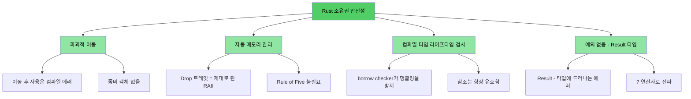
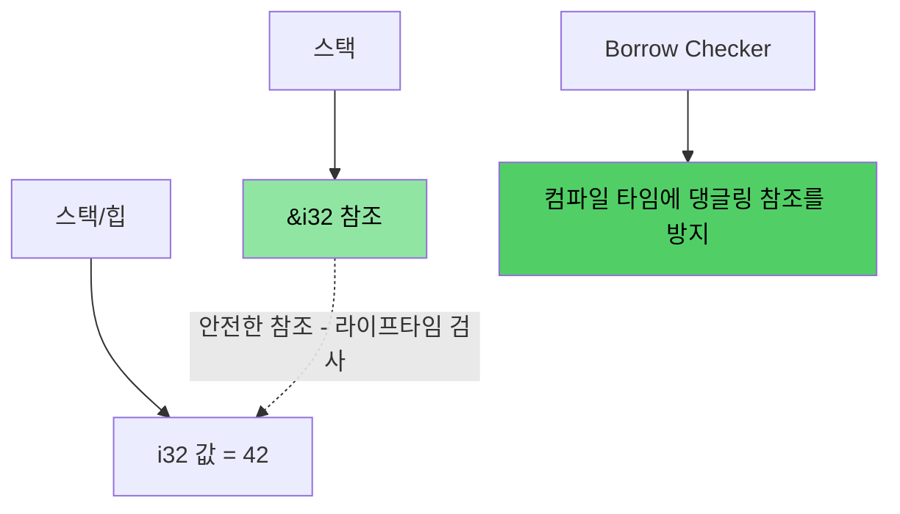
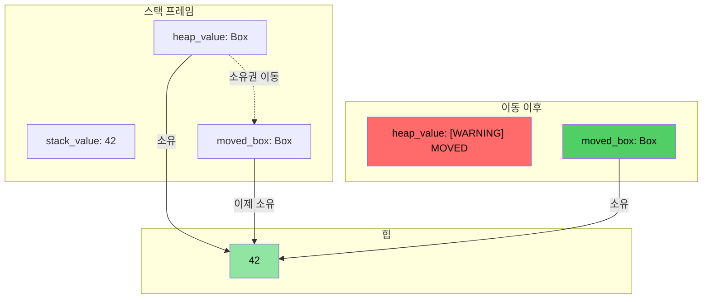
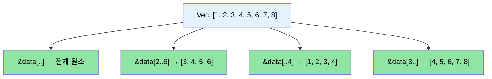

<a id="speaker-intro-and-general-approach"></a>
# 발표자 소개와 전체 진행 방식

> **이 장에서 배우는 것:** 과정의 전체 구조, 상호작용 중심 진행 방식, 그리고 익숙한 C/C++ 개념이 Rust의 어떤 대응 개념으로 이어지는지 살펴봅니다. 이 장은 이후 학습의 기대치를 맞추고 전체 로드맵을 제시합니다.

- 발표자 소개
    - Microsoft SCHIE(Silicon and Cloud Hardware Infrastructure Engineering) 팀의 Principal Firmware Architect
    - 보안, 시스템 프로그래밍(펌웨어, 운영체제, 하이퍼바이저), CPU 및 플랫폼 아키텍처, C++ 시스템 분야의 오랜 실무 경험 보유
    - 2017년(@AWS EC2)부터 Rust를 사용하기 시작했고, 그 이후로 Rust를 꾸준히 애용해 왔음
- 이 과정은 가능한 한 상호작용적으로 진행하는 것을 목표로 합니다.
    - 전제: 학습자는 C, C++, 혹은 둘 다를 알고 있다
    - 예제는 익숙한 개념을 Rust 대응 개념으로 자연스럽게 연결하도록 의도적으로 설계되었다
    - **언제든지 주저하지 말고 질문하세요**
- 발표자는 이후 팀들과도 지속적으로 소통하길 기대하고 있습니다

<a id="the-case-for-rust"></a>
# 왜 Rust인가
> **바로 코드를 보고 싶다면?** [코드부터 보자](ch02-getting-started.md#enough-talk-already-show-me-some-code)로 이동하세요.

C에서 오든 C++에서 오든 핵심적인 고통 지점은 같습니다. 컴파일은 멀쩡히 되지만 실행 시 크래시, 메모리 손상, 누수로 이어지는 메모리 안전성 버그입니다.

- **70%가 넘는 CVE**가 메모리 안전성 문제에서 비롯됩니다. 버퍼 오버플로, 댕글링 포인터, use-after-free가 대표적입니다.
- C++의 `shared_ptr`, `unique_ptr`, RAII, move semantics는 분명 진전이지만 **근본 치료제가 아니라 임시방편**입니다. use-after-move, 참조 순환, iterator invalidation, 예외 안전성 문제를 완전히 없애지 못합니다.
- Rust는 C/C++의 성능을 유지하면서도 **컴파일 타임 안전성 보장**을 제공합니다.

> **📖 심화 읽기:** 구체적인 취약점 예제, Rust가 실제로 제거하는 문제 목록, 그리고 C++ 스마트 포인터만으로는 왜 부족한지를 보려면 [왜 C/C++ 개발자에게 Rust가 필요한가](ch01-1-why-c-cpp-developers-need-rust.md)를 읽어보세요.

----

<a id="how-does-rust-address-these-issues"></a>
# Rust는 이 문제들을 어떻게 해결하는가

## 버퍼 오버플로와 경계 위반
- Rust의 모든 배열, 슬라이스, 문자열은 명시적인 경계 정보를 함께 가집니다.
- 컴파일러는 경계 위반 시 **정의되지 않은 동작**이 아니라 **런타임 패닉**이 나도록 검사 코드를 넣습니다.

## 댕글링 포인터와 참조
- Rust는 라이프타임과 borrow checker를 도입해 댕글링 참조를 **컴파일 타임에 제거**합니다.
- 댕글링 포인터도, use-after-free도 허용되지 않습니다. 컴파일러가 애초에 막습니다.

## 이동 후 사용(use-after-move)
- Rust의 소유권 시스템에서 move는 **파괴적**입니다. 값을 이동하면 원래 바인딩은 더 이상 사용할 수 없습니다.
- 좀비 객체도 없고, "유효하지만 정의되지 않은 상태"도 없습니다.

## 자원 관리
- Rust의 `Drop` 트레잇은 RAII를 제대로 구현한 형태입니다. 값이 스코프를 벗어나면 자원이 자동 해제되고, **이동 후 사용**도 막습니다.
- C++처럼 Rule of Five(copy ctor, move ctor, copy assign, move assign, destructor)를 직접 관리할 필요가 없습니다.

## 에러 처리
- Rust에는 예외가 없습니다. 모든 에러는 값(`Result<T, E>`)으로 표현되며, 함수 시그니처에 드러납니다.

## 반복자 무효화
- Rust의 borrow checker는 **순회 중인 컬렉션을 동시에 변경하는 행위**를 금지합니다. C++ 코드베이스에서 흔히 보이는 종류의 버그를 원천적으로 작성할 수 없습니다.
```rust
// 순회 중 erase의 Rust 대응: retain()
pending_faults.retain(|f| f.id != fault_to_remove.id);

// 또는: 새로운 Vec으로 수집하기 (함수형 스타일)
let remaining: Vec<_> = pending_faults
    .into_iter()
    .filter(|f| f.id != fault_to_remove.id)
    .collect();
```

## 데이터 레이스
- 타입 시스템은 `Send`, `Sync` 트레잇을 통해 데이터 레이스를 **컴파일 타임에** 차단합니다.

## 메모리 안전성 시각화

### Rust 소유권 — 설계 자체가 안전하다

```rust
fn safe_rust_ownership() {
    // move는 파괴적이다: 원래 값은 사라진다
    let data = vec![1, 2, 3];
    let data2 = data;           // move 발생
    // data.len();              // 컴파일 에러: move 이후 값 사용
    
    // 대여: 안전한 공유 접근
    let owned = String::from("Hello, World!");
    let slice: &str = &owned;   // 대여 — 할당 없음
    println!("{}", slice);      // 항상 안전
    
    // 댕글링 참조는 불가능
    /*
    let dangling_ref;
    {
        let temp = String::from("temporary");
        dangling_ref = &temp;   // 컴파일 에러: temp의 수명이 충분히 길지 않음
    }
    */
}
```



## 메모리 레이아웃: Rust 참조



### `Box<T>` 힙 할당 시각화

```rust
fn box_allocation_example() {
    // 스택 할당
    let stack_value = 42;
    
    // Box를 이용한 힙 할당
    let heap_value = Box::new(42);
    
    // 소유권 이동
    let moved_box = heap_value;
    // heap_value에는 더 이상 접근할 수 없음
}
```



## 슬라이스 연산 시각화

```rust
fn slice_operations() {
    let data = vec![1, 2, 3, 4, 5, 6, 7, 8];
    
    let full_slice = &data[..];        // [1,2,3,4,5,6,7,8]
    let partial_slice = &data[2..6];   // [3,4,5,6]
    let from_start = &data[..4];       // [1,2,3,4]
    let to_end = &data[3..];           // [4,5,6,7,8]
}
```



<a id="other-rust-usps-and-features"></a>
# Rust의 다른 강점과 특징
- 스레드 간 데이터 레이스가 없다 (`Send`/`Sync`의 컴파일 타임 검사)
- 이동 후 사용이 없다 (C++ `std::move`처럼 좀비 객체를 남기지 않는다)
- 초기화되지 않은 변수가 없다
    - 모든 변수는 사용 전에 반드시 초기화되어야 한다
- 사소한 메모리 누수가 없다
    - `Drop` 트레잇 = 제대로 된 RAII, Rule of Five 불필요
    - 값이 스코프를 벗어나면 컴파일러가 자동으로 메모리를 해제한다
- mutex 잠금을 깜빡하는 일이 없다
    - 데이터에 접근하는 유일한 방법이 lock guard다 (`Mutex<T>`는 접근 자체가 아니라 데이터를 감싼다)
- 예외 처리 복잡성이 없다
    - 에러는 값(`Result<T, E>`)이며 함수 시그니처에 드러나고, `?`로 전파한다
- 타입 추론, enum, 패턴 매칭, zero-cost abstraction 지원이 뛰어나다
- 의존성 관리, 빌드, 테스트, 포매팅, 린팅이 기본 제공된다
    - `cargo`가 make/CMake + 린트 + 테스트 프레임워크를 대체한다

<a id="quick-reference-rust-vs-cc"></a>
# 빠른 비교: Rust vs C/C++

| **개념** | **C** | **C++** | **Rust** | **핵심 차이** |
|-------------|-------|---------|----------|-------------------|
| 메모리 관리 | `malloc()/free()` | `unique_ptr`, `shared_ptr` | `Box<T>`, `Rc<T>`, `Arc<T>` | 자동 관리, 순환 참조 방지 |
| 배열 | `int arr[10]` | `std::vector<T>`, `std::array<T>` | `Vec<T>`, `[T; N]` | 기본적으로 경계 검사 수행 |
| 문자열 | `char*`와 `\0` | `std::string`, `string_view` | `String`, `&str` | UTF-8 보장, 라이프타임 검사 |
| 참조 | `int* ptr` | `T&`, `T&&` (move) | `&T`, `&mut T` | 대여 검사와 라이프타임 |
| 다형성 | 함수 포인터 | 가상 함수, 상속 | 트레잇, trait object | 상속보다 조합 |
| 제네릭 프로그래밍 | 매크로 (`void*`) | 템플릿 | 제네릭 + 트레잇 바운드 | 에러 메시지가 명확함 |
| 에러 처리 | 반환 코드, `errno` | 예외, `std::optional` | `Result<T, E>`, `Option<T>` | 숨겨진 제어 흐름 없음 |
| NULL/널 안전성 | `ptr == NULL` | `nullptr`, `std::optional<T>` | `Option<T>` | 널 처리를 강제함 |
| 스레드 안전성 | 수동 (`pthreads`) | 수동 동기화 | 컴파일 타임 보장 | 데이터 레이스 불가능 |
| 빌드 시스템 | Make, CMake | CMake, Make 등 | Cargo | 통합 툴체인 |
| 정의되지 않은 동작 | 런타임 크래시 | 미묘한 UB(부호 있는 오버플로, aliasing) | 컴파일 타임 에러 | 안전성 보장 |
