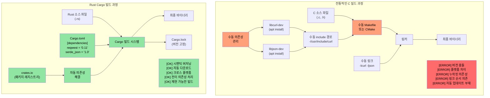
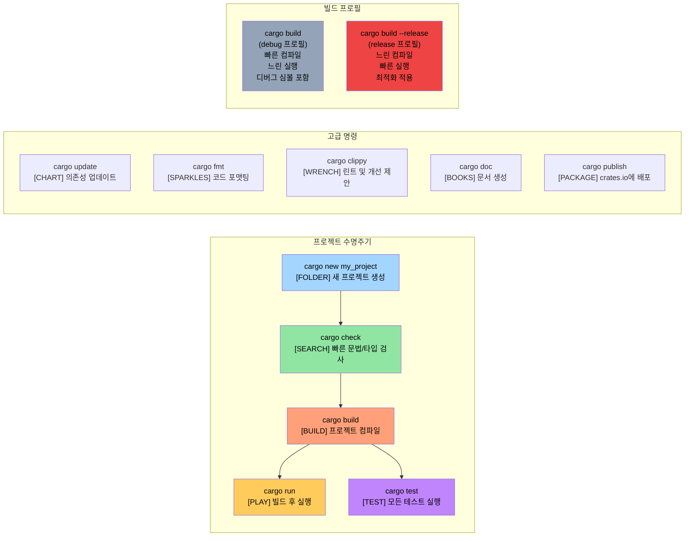

<a id="enough-talk-already-show-me-some-code"></a>
# 말은 충분하다. 코드부터 보자

> **이 장에서 배우는 것:** 첫 Rust 프로그램을 작성해 보면서 `fn main()`, `println!()`, 그리고 Rust 매크로가 C/C++ 전처리기 매크로와 어떻게 근본적으로 다른지 살펴봅니다. 이 장을 마치면 간단한 Rust 프로그램을 작성하고, 컴파일하고, 실행할 수 있습니다.

```rust
fn main() {
    println!("Hello world from Rust");
}
```
- 위 문법은 C 계열 언어에 익숙한 사람이라면 비교적 친숙하게 느껴질 것입니다.
    - Rust의 모든 함수는 `fn` 키워드로 시작합니다.
    - 실행 파일의 기본 진입점은 `main()`입니다.
    - `println!`은 함수처럼 보이지만 실제로는 **매크로**입니다. Rust의 매크로는 C/C++ 전처리기 매크로와 매우 다릅니다. 위생적(hygienic)이고, 타입 안전하며, 텍스트 치환이 아니라 구문 트리 수준에서 동작합니다.
- Rust 코드를 빠르게 시험해 보는 좋은 방법 두 가지
    - **온라인**: [Rust Playground](https://play.rust-lang.org/) - 코드를 붙여넣고 Run을 누르면 됩니다. 설치가 필요 없습니다.
    - **로컬 REPL**: [`evcxr_repl`](https://github.com/evcxr/evcxr)을 설치하면 Python 같은 대화형 REPL처럼 Rust 코드를 바로 실행해 볼 수 있습니다.
```bash
cargo install --locked evcxr_repl
evcxr   # REPL 시작 후 Rust 표현식을 바로 입력
```

<a id="rust-local-installation"></a>
### Rust 로컬 설치
- Rust는 다음 방법으로 로컬에 설치할 수 있습니다.
    - Windows: https://static.rust-lang.org/rustup/dist/x86_64-pc-windows-msvc/rustup-init.exe
    - Linux / WSL: `curl --proto '=https' --tlsv1.2 -sSf https://sh.rustup.rs | sh`
- Rust 생태계는 다음 구성 요소로 이루어집니다.
    - `rustc`는 독립 실행형 컴파일러지만, 실무에서는 직접 호출하는 경우가 많지 않습니다.
    - 실제로는 `cargo`가 중심 도구입니다. 의존성 관리, 빌드, 테스트, 포매팅, 린팅 등을 모두 담당하는 Swiss Army knife에 가깝습니다.
    - Rust 툴체인은 `stable`, `beta`, `nightly`(실험적) 채널로 나뉘지만, 이 과정에서는 `stable`만 사용합니다. `stable`은 6주 주기로 릴리스되며 `rustup update`로 업데이트할 수 있습니다.
- VSCode를 쓴다면 `rust-analyzer` 플러그인도 설치하는 것이 좋습니다.

<a id="rust-packages-crates"></a>
# Rust 패키지(크레이트)
- Rust 바이너리와 라이브러리는 패키지, 즉 크레이트(crates) 단위로 만들어집니다.
    - 크레이트는 독립적일 수도 있고, 다른 크레이트에 의존할 수도 있습니다. 의존성은 로컬일 수도 있고 원격일 수도 있습니다. 서드파티 크레이트는 보통 `crates.io`라는 중앙 저장소에서 내려받습니다.
    - `cargo`는 크레이트와 그 의존성 다운로드를 자동으로 처리합니다. 개념적으로는 C 라이브러리를 링크하는 과정과 비슷합니다.
    - 크레이트 의존성은 `Cargo.toml` 파일에 선언합니다. 이 파일은 실행 파일, 정적 라이브러리, 동적 라이브러리(드묾) 같은 타깃 종류도 정의합니다.
    - 참고: https://doc.rust-lang.org/cargo/reference/cargo-targets.html

## Cargo vs 전통적인 C 빌드 시스템

### 의존성 관리 비교



### Cargo 프로젝트 구조

```text
my_project/
|-- Cargo.toml          # 프로젝트 설정 (package.json과 비슷)
|-- Cargo.lock          # 정확한 의존성 버전 (자동 생성)
|-- src/
|   |-- main.rs         # 바이너리의 메인 진입점
|   |-- lib.rs          # 라이브러리 루트 (라이브러리일 경우)
|   `-- bin/            # 추가 바이너리 타깃
|-- tests/              # 통합 테스트
|-- examples/           # 예제 코드
|-- benches/            # 벤치마크
`-- target/             # 빌드 결과물 (C의 build/ 또는 obj/와 비슷)
    |-- debug/          # 디버그 빌드 (컴파일 빠름, 실행 느림)
    `-- release/        # 릴리스 빌드 (컴파일 느림, 실행 빠름)
```

### 자주 쓰는 Cargo 명령



<a id="example-cargo-and-crates"></a>
# 예제: Cargo와 크레이트
- 이 예제에서는 다른 의존성이 없는 독립 실행형 크레이트를 만듭니다.
- `helloworld`라는 새 크레이트를 만들려면 다음 명령을 사용합니다.
```bash
cargo new helloworld
cd helloworld
cat Cargo.toml
```
- 기본적으로 `cargo run`은 `debug`(비최적화) 버전을 컴파일하고 실행합니다. `release` 버전을 실행하려면 `cargo run --release`를 사용합니다.
- 실제 바이너리 파일은 `target/debug` 또는 `target/release` 아래에 생성됩니다.
- 같은 폴더에 `Cargo.lock` 파일도 보일 텐데, 이 파일은 자동 생성되며 직접 수정해서는 안 됩니다.
    - `Cargo.lock`의 정확한 역할은 뒤에서 다시 설명합니다.
