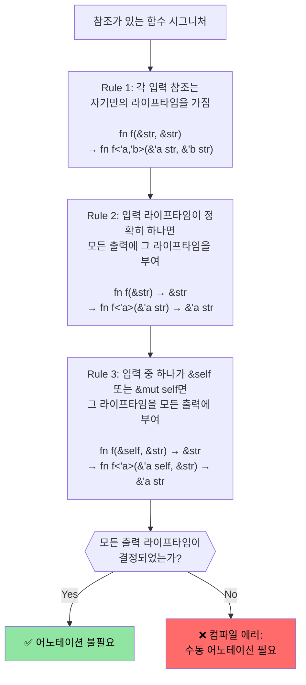

<a id="rust-lifetime-and-borrowing"></a>
# Rust 라이프타임과 대여

> **이 장에서 배우는 것:** Rust의 라이프타임 시스템이 어떻게 참조가 절대 댕글링되지 않도록 보장하는지 배웁니다. 암묵적 라이프타임부터 명시적 어노테이션, 그리고 대부분의 코드에서 어노테이션이 필요 없게 만드는 세 가지 elision 규칙까지 다룹니다. 다음 절의 스마트 포인터로 넘어가기 전에 반드시 이해해야 하는 내용입니다.

- Rust는 가변 참조는 하나만, 불변 참조는 여러 개 허용합니다.
    - 어떤 참조의 라이프타임도 원래 소유자의 라이프타임보다 길 수 없습니다. 이런 라이프타임은 대부분 암묵적이며, 컴파일러가 추론합니다. 참고: https://doc.rust-lang.org/nomicon/lifetime-elision.html
```rust
fn borrow_mut(x: &mut u32) {
    *x = 43;
}
fn main() {
    let mut x = 42;
    let y = &mut x;
    borrow_mut(y);
    let _z = &x; // y가 이후에 쓰이지 않음을 컴파일러가 알기 때문에 허용
    // println!("{y}"); // 이 줄을 풀면 컴파일되지 않음
    borrow_mut(&mut x); // _z가 쓰이지 않으므로 허용
    let z = &x; // OK -- x의 가변 대여는 foo() 반환 후 종료
    println!("{z}");
}
```

<a id="rust-lifetime-annotations"></a>
# Rust 라이프타임 어노테이션
- 여러 라이프타임이 얽히는 경우에는 명시적 라이프타임 어노테이션이 필요합니다.
    - 라이프타임은 `'`로 표기하며, `'a`, `'b`, `'static`처럼 아무 식별자나 사용할 수 있습니다.
    - 컴파일러가 참조가 얼마나 살아야 하는지 스스로 결정할 수 없을 때, 우리가 힌트를 줘야 합니다.
- **흔한 상황**: 함수가 참조를 반환하는데, 그 참조가 어떤 입력에서 왔는지 컴파일러가 모르는 경우
```rust
#[derive(Debug)]
struct Point { x: u32, y: u32 }

// 라이프타임 어노테이션이 없으면 컴파일되지 않음:
// fn left_or_right(pick_left: bool, left: &Point, right: &Point) -> &Point

// 라이프타임 어노테이션 추가 - 모든 참조가 같은 'a 라이프타임 공유
fn left_or_right<'a>(pick_left: bool, left: &'a Point, right: &'a Point) -> &'a Point {
    if pick_left { left } else { right }
}

// 더 복잡한 예: 입력에 서로 다른 라이프타임
fn get_x_coordinate<'a, 'b>(p1: &'a Point, _p2: &'b Point) -> &'a u32 {
    &p1.x // 반환값 라이프타임은 p1에 묶이고 p2와는 무관
}

fn main() {
    let p1 = Point { x: 20, y: 30 };
    let result;
    {
        let p2 = Point { x: 42, y: 50 };
        result = left_or_right(true, &p1, &p2);
        // result를 p2가 살아 있는 동안만 사용하므로 문제없음
        println!("Selected: {result:?}");
    }
    // 아래는 동작하지 않음 - result가 p2를 참조할 수 있기 때문
    // println!("After scope: {result:?}");
}
```

# Rust 라이프타임 어노테이션
- 데이터 구조 안에 참조를 저장할 때도 라이프타임 어노테이션이 필요합니다.
```rust
use std::collections::HashMap;
#[derive(Debug)]
struct Point { x: u32, y: u32 }
struct Lookup<'a> {
    map: HashMap<u32, &'a Point>,
}
fn main() {
    let p = Point { x: 42, y: 42 };
    let p1 = Point { x: 50, y: 60 };
    let mut m = Lookup { map: HashMap::new() };
    m.map.insert(0, &p);
    m.map.insert(1, &p1);
    {
        let p3 = Point { x: 60, y: 70 };
        // m.map.insert(3, &p3); // 컴파일되지 않음
        // p3는 여기서 drop되지만, m은 더 오래 살아 있음
    }
    for (k, v) in m.map {
        println!("{v:?}");
    }
    // 여기서 m drop
    // 그 뒤 p1, p 순서로 drop
}
```

# 연습문제: 라이프타임이 있는 first_word

🟢 **Starter** - lifetime elision이 실제로 어떻게 적용되는지 연습합니다.

문자열에서 첫 번째 공백 기준 단어를 반환하는 `fn first_word(s: &str) -> &str` 함수를 작성하세요. 왜 이 함수는 명시적 라이프타임 어노테이션 없이도 컴파일되는지 생각해보세요. 힌트: elision rule #1과 #2.

<details><summary>해답 (클릭하여 펼치기)</summary>

```rust
fn first_word(s: &str) -> &str {
    // 컴파일러가 elision 규칙을 적용한다:
    // Rule 1: 입력 &str에 'a 부여 → fn first_word(s: &'a str) -> &str
    // Rule 2: 입력 라이프타임이 하나뿐이므로 출력도 같은 'a
    match s.find(' ') {
        Some(pos) => &s[..pos],
        None => s,
    }
}

fn main() {
    let text = "hello world foo";
    let word = first_word(text);
    println!("First word: {word}"); // "hello"
    
    let single = "onlyone";
    println!("First word: {}", first_word(single)); // "onlyone"
}
```

</details>

<a id="exercise-slice-storage-with-lifetimes"></a>
# 연습문제: 라이프타임이 있는 슬라이스 저장소

🟡 **Intermediate** - 명시적 라이프타임 어노테이션을 처음 직접 써보는 문제입니다.
- `&str`의 슬라이스를 참조로 저장하는 구조체를 만들어 보세요.
    - 긴 `&str` 하나를 만들고, 그 안의 여러 슬라이스를 구조체 안에 저장하세요.
    - 그 구조체를 받아 내부 슬라이스를 반환하는 함수도 작성하세요.
```rust
// TODO: 슬라이스 참조를 저장하는 구조체 만들기
struct SliceStore {

}
fn main() {
    let s = "This is long string";
    let s1 = &s[0..];
    let s2 = &s[1..2];
    // let slice = struct SliceStore {...};
    // let slice2 = struct SliceStore {...};
}
```

<details><summary>해답 (클릭하여 펼치기)</summary>

```rust
struct SliceStore<'a> {
    slice: &'a str,
}

impl<'a> SliceStore<'a> {
    fn new(slice: &'a str) -> Self {
        SliceStore { slice }
    }

    fn get_slice(&self) -> &'a str {
        self.slice
    }
}

fn main() {
    let s = "This is a long string";
    let store1 = SliceStore::new(&s[0..4]); // "This"
    let store2 = SliceStore::new(&s[5..7]); // "is"
    println!("store1: {}", store1.get_slice());
    println!("store2: {}", store2.get_slice());
}
// Output:
// store1: This
// store2: is
```

</details>

---

<a id="lifetime-elision-rules-deep-dive"></a>
## 라이프타임 생략 규칙 심화

C 개발자는 자주 이렇게 묻습니다. "라이프타임이 그렇게 중요하면, 왜 대부분의 Rust 함수에는 `'a`가 안 붙어 있지?" 답은 **lifetime elision**입니다. 컴파일러가 세 가지 결정적 규칙을 적용해 라이프타임을 자동 추론합니다.

### 세 가지 elision 규칙

Rust 컴파일러는 함수 시그니처에 대해 아래 규칙을 **순서대로** 적용합니다. 이 규칙들을 적용한 뒤 모든 출력 라이프타임이 결정되면, 명시적 어노테이션이 필요 없습니다.



### 규칙별 예시

**Rule 1** - 각 입력 참조는 각자 라이프타임 파라미터를 갖습니다.
```rust
// 우리가 작성한 코드:
fn first_word(s: &str) -> &str { ... }

// Rule 1 적용 후 컴파일러가 보는 형태:
fn first_word<'a>(s: &'a str) -> &str { ... }
// 입력 라이프타임이 하나뿐이므로 Rule 2 적용 가능
```

**Rule 2** - 입력 라이프타임이 하나면 출력도 그 라이프타임을 따릅니다.
```rust
// Rule 2 적용 후:
fn first_word<'a>(s: &'a str) -> &'a str { ... }
// ✅ 이제 출력 라이프타임이 결정됨 - 어노테이션 불필요
```

**Rule 3** - `&self`의 라이프타임은 출력으로 전파됩니다.
```rust
// 우리가 작성한 코드:
impl SliceStore<'_> {
    fn get_slice(&self) -> &str { self.slice }
}

// Rule 1 + 3 적용 후 컴파일러가 보는 형태:
impl SliceStore<'_> {
    fn get_slice<'a>(&'a self) -> &'a str { self.slice }
}
// ✅ &self 라이프타임을 출력에 사용하므로 어노테이션 불필요
```

**elision이 실패하는 경우** - 수동으로 적어야 합니다.
```rust
// 입력 참조가 둘이고 &self도 없으므로 Rule 2, 3이 적용되지 않음
// fn longest(a: &str, b: &str) -> &str  ← 컴파일되지 않음

// 해결: 출력이 어떤 입력을 빌리는지 직접 알려준다
fn longest<'a>(a: &'a str, b: &'a str) -> &'a str {
    if a.len() >= b.len() { a } else { b }
}
```

### C 개발자를 위한 마음속 모델

C에서는 각 포인터가 서로 독립적이며, 어떤 할당을 가리키는지는 프로그래머가 머릿속으로 추적합니다. 컴파일러는 전적으로 여러분을 믿습니다. Rust에서는 라이프타임이 이 추적을 **명시적이고 컴파일러 검증 가능하게** 만듭니다.

| C | Rust | 실제 의미 |
|---|------|-------------|
| `char* get_name(struct User* u)` | `fn get_name(&self) -> &str` | Rule 3 적용: 출력은 `self`를 빌림 |
| `char* concat(char* a, char* b)` | `fn concat<'a>(a: &'a str, b: &'a str) -> &'a str` | 입력이 둘이므로 어노테이션 필요 |
| `void process(char* in, char* out)` | `fn process(input: &str, output: &mut String)` | 출력 참조가 없으므로 라이프타임 불필요 |
| `char* buf; /* 누가 소유하지? */` | 라이프타임이 틀리면 컴파일 에러 | 컴파일러가 댕글링 포인터를 잡음 |

### `'static` 라이프타임

`'static`은 참조가 **프로그램 전체 실행 시간 동안** 유효하다는 뜻입니다. C의 전역 변수나 문자열 리터럴과 비슷합니다.

```rust
// 문자열 리터럴은 항상 'static - 바이너리의 읽기 전용 영역에 존재
let s: &'static str = "hello"; // C의 static const char* s = "hello"; 와 비슷

// 상수도 'static
static GREETING: &str = "hello";

// 스레드 생성용 trait bound에서 자주 등장
fn spawn<F: FnOnce() + Send + 'static>(f: F) { /* ... */ }
// 여기서 'static은 "클로저가 어떤 지역 변수도 빌리지 않아야 한다"는 뜻
// (값을 move 하거나, 'static 데이터만 사용해야 함)
```

### 연습문제: Elision 예측하기

🟡 **Intermediate**

아래 함수 시그니처마다 컴파일러가 라이프타임을 elide할 수 있는지 예측해 보세요. 안 된다면 필요한 어노테이션을 추가하세요.

```rust
// 1. 컴파일러가 elide할 수 있을까?
fn trim_prefix(s: &str) -> &str { &s[1..] }

// 2. 컴파일러가 elide할 수 있을까?
fn pick(flag: bool, a: &str, b: &str) -> &str {
    if flag { a } else { b }
}

// 3. 컴파일러가 elide할 수 있을까?
struct Parser { data: String }
impl Parser {
    fn next_token(&self) -> &str { &self.data[..5] }
}

// 4. 컴파일러가 elide할 수 있을까?
fn split_at(s: &str, pos: usize) -> (&str, &str) {
    (&s[..pos], &s[pos..])
}
```

<details><summary>해답 (클릭하여 펼치기)</summary>

```rust,ignore
// 1. YES - Rule 1이 s에 'a를 부여하고, Rule 2가 출력에 전파
fn trim_prefix(s: &str) -> &str { &s[1..] }

// 2. NO - 입력 참조가 둘이고 &self도 없다. 어노테이션 필요
fn pick<'a>(flag: bool, a: &'a str, b: &'a str) -> &'a str {
    if flag { a } else { b }
}

// 3. YES - Rule 1이 &self에 'a를 부여하고, Rule 3이 출력에 전파
impl Parser {
    fn next_token(&self) -> &str { &self.data[..5] }
}

// 4. YES - 입력 참조가 하나뿐이므로 Rule 2가 두 출력 모두에 전파
fn split_at(s: &str, pos: usize) -> (&str, &str) {
    (&s[..pos], &s[pos..])
}
```

</details>
