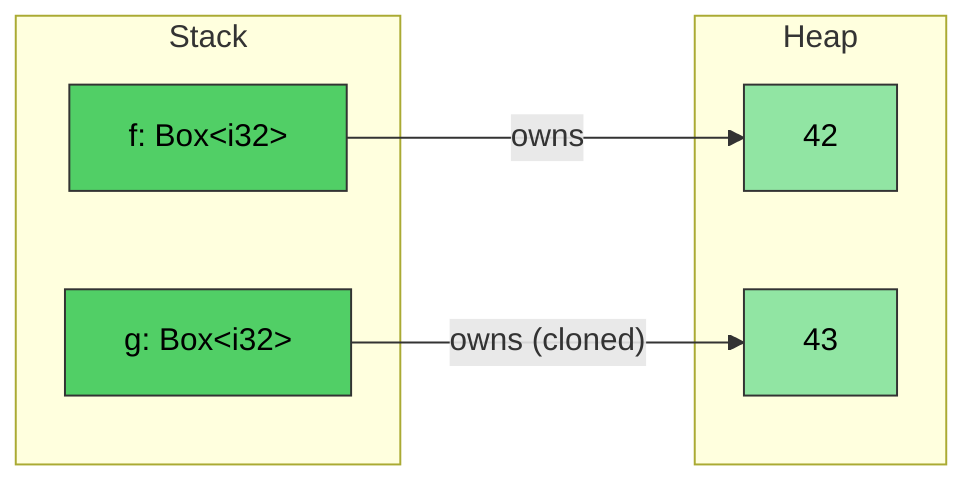
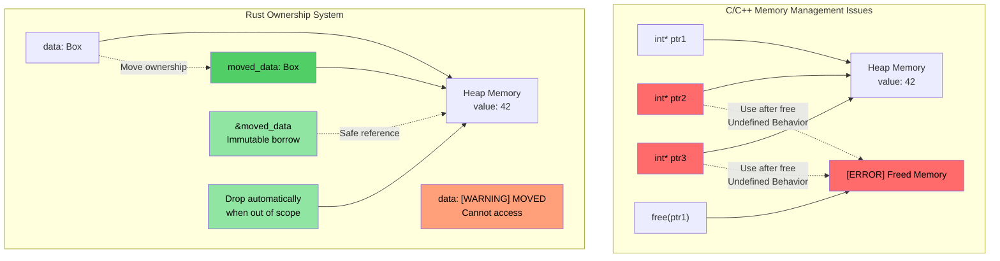
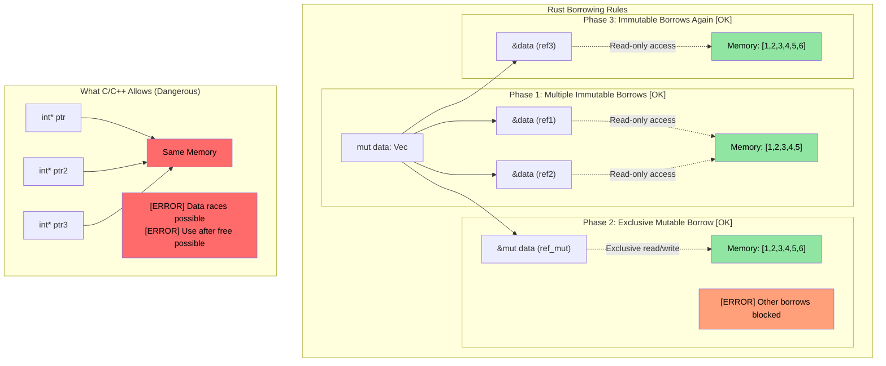

<a id="rust-boxt"></a>
# Rust `Box<T>`

> **이 장에서 배우는 것:** Rust의 스마트 포인터 타입들입니다. 힙 할당을 위한 `Box<T>`, 공유 소유권을 위한 `Rc<T>`, 내부 가변성을 위한 `Cell<T>`/`RefCell<T>`를 다룹니다. 이들은 앞 절에서 배운 소유권과 라이프타임 개념 위에 세워집니다. 또한 참조 순환을 끊기 위한 `Weak<T>`도 간단히 소개합니다.

**왜 `Box<T>`인가?** C에서는 힙 할당을 위해 `malloc`/`free`를 사용합니다. C++에서는 `std::unique_ptr<T>`가 `new`/`delete`를 감쌉니다. Rust의 `Box<T>`는 그에 해당하는 개념으로, 힙에 할당된 단일 소유자 포인터이며 스코프를 벗어나면 자동 해제됩니다. `malloc`처럼 짝이 되는 `free`를 잊을 일도 없고, `unique_ptr`처럼 move 후 사용도 불가능합니다. 컴파일러가 막습니다.

**언제 `Box`를 쓰고 언제 스택 할당을 쓰는가**
- 내부 타입이 커서 스택에 복사하고 싶지 않을 때
- 재귀 타입이 필요할 때 (예: 자기 자신을 포함하는 연결 리스트 노드)
- trait object가 필요할 때 (`Box<dyn Trait>`)

- `Box<T>`는 힙에 할당된 타입을 가리키는 포인터를 만드는 데 사용됩니다. 포인터 자체의 크기는 `<T>`의 실제 크기와 무관하게 항상 고정입니다.
```rust
fn main() {
    // 힙에 생성된 정수 42를 가리키는 포인터 생성
    let f = Box::new(42);
    println!("{} {}", *f, f);
    // Box를 clone하면 새로운 힙 할당이 생긴다
    let mut g = f.clone();
    *g = 43;
    println!("{f} {g}");
    // 여기서 g와 f가 스코프를 벗어나며 자동 해제된다
}
```


## 소유권과 대여 시각화

### C/C++ vs Rust: 포인터와 소유권 관리

```c
// C - 수동 메모리 관리, 여러 문제 가능
void c_pointer_problems() {
    int* ptr1 = malloc(sizeof(int));
    *ptr1 = 42;
    
    int* ptr2 = ptr1;  // 둘 다 같은 메모리를 가리킴
    int* ptr3 = ptr1;  // 셋 다 같은 메모리를 가리킴
    
    free(ptr1);        // 메모리 해제
    
    *ptr2 = 43;        // use after free - 정의되지 않은 동작
    *ptr3 = 44;        // use after free - 정의되지 않은 동작
}
```

> **C++ 개발자를 위한 참고:** 스마트 포인터는 도움은 되지만 모든 문제를 막지는 못합니다.
>
> ```cpp
> // C++ - 스마트 포인터가 도와주지만 완전한 해결책은 아님
> void cpp_pointer_issues() {
>     auto ptr1 = std::make_unique<int>(42);
>     
>     // auto ptr2 = ptr1;  // 컴파일 에러: unique_ptr은 복사 불가
>     auto ptr2 = std::move(ptr1);  // OK: 소유권 이전
>     
>     // 하지만 C++은 여전히 move 후 사용을 허용한다:
>     // std::cout << *ptr1;  // 컴파일됨! 하지만 정의되지 않은 동작
>     
>     // shared_ptr 별칭 문제:
>     auto shared1 = std::make_shared<int>(42);
>     auto shared2 = shared1;  // 둘 다 데이터를 소유
>     // 누가 "진짜" 소유자인가? 아무도 아니다. 참조 카운트 오버헤드는 계속 든다.
> }
> ```

```rust
// Rust - 소유권 시스템이 이런 문제를 막는다
fn rust_ownership_safety() {
    let data = Box::new(42);  // data가 힙 할당을 소유
    
    let moved_data = data;    // 소유권이 moved_data로 이전
    // data는 더 이상 접근 불가 - 사용하면 컴파일 에러
    
    let borrowed = &moved_data;  // 불변 대여
    println!("{}", borrowed);    // 안전하게 사용 가능
    
    // moved_data는 스코프를 벗어나면 자동 해제
}
```



### 대여 규칙 시각화

```rust
fn borrowing_rules_example() {
    let mut data = vec![1, 2, 3, 4, 5];
    
    // 여러 불변 대여 - OK
    let ref1 = &data;
    let ref2 = &data;
    println!("{:?} {:?}", ref1, ref2);
    
    // 가변 대여 - 배타적 접근
    let ref_mut = &mut data;
    ref_mut.push(6);
    // ref1과 ref2는 ref_mut이 살아 있는 동안 사용할 수 없다
    
    // ref_mut이 끝난 뒤에는 다시 불변 대여 가능
    let ref3 = &data;
    println!("{:?}", ref3);
}
```



---

<a id="interior-mutability-cellt-and-refcellt"></a>
## 내부 가변성: `Cell<T>`와 `RefCell<T>`

Rust에서는 기본적으로 변수가 불변입니다. 하지만 때로는 타입 대부분은 읽기 전용으로 두되, 특정 필드 하나만 쓰기 가능하게 만들고 싶을 때가 있습니다.

```rust
struct Employee {
    employee_id: u64,   // 이 값은 불변이어야 함
    on_vacation: bool,  // 이 필드만 바꾸고 싶다면?
}
```

- Rust는 *단 하나의 가변 참조* 와 *여러 개의 불변 참조* 만 허용하며, 이 규칙은 기본적으로 *컴파일 타임* 에 검사됩니다.
- 그런데 *불변* `Employee` 벡터를 넘기면서도, `on_vacation` 필드는 수정할 수 있게 하고 싶다면?

### `Cell<T>` - Copy 타입을 위한 내부 가변성

- `Cell<T>`는 **내부 가변성** 을 제공합니다. 즉, 겉으로는 읽기 전용 참조여도 특정 필드의 값을 바꿀 수 있게 합니다.
- 값 복사를 통해 동작하며, `.get()`을 쓰려면 `T: Copy`여야 합니다.

### `RefCell<T>` - 런타임 대여 검사 기반 내부 가변성

- `RefCell<T>`는 참조 기반으로 동작하는 변형입니다.
    - Rust의 대여 규칙을 **컴파일 타임이 아니라 런타임에** 검사합니다.
    - 가변 대여는 하나만 허용하지만, 다른 참조가 살아 있는데 가변 대여를 시도하면 **패닉**이 납니다.
    - 불변 접근은 `.borrow()`, 가변 접근은 `.borrow_mut()`를 사용합니다.

### `Cell`과 `RefCell`은 언제 어떤 걸 쓸까

| 기준 | `Cell<T>` | `RefCell<T>` |
|-----------|-----------|-------------|
| 다룰 수 있는 타입 | `Copy` 타입 (정수, bool, float) | 임의의 타입 (`String`, `Vec`, 구조체 등) |
| 접근 방식 | 값 복사 (`.get()`, `.set()`) | 제자리 대여 (`.borrow()`, `.borrow_mut()`) |
| 실패 방식 | 실패하지 않음 - 런타임 검사 없음 | 다른 대여가 남아 있을 때 가변 대여하면 **패닉** |
| 오버헤드 | 사실상 0 - 바이트 복사만 수행 | 작지만 존재 - 런타임에 대여 상태 추적 |
| 사용 시점 | 불변 구조체 안의 플래그, 카운터, 작은 값 | 불변 구조체 안의 `String`, `Vec`, 복잡한 타입을 변경해야 할 때 |

---

<a id="shared-ownership-rct"></a>
## 공유 소유권: `Rc<T>`

`Rc<T>`는 *불변 데이터*에 대한 참조 카운팅 기반 공유 소유권을 제공합니다. 같은 `Employee`를 복사 없이 여러 컬렉션에 저장하고 싶다면 어떻게 할까요?

```rust
#[derive(Debug)]
struct Employee {
    employee_id: u64,
}
fn main() {
    let mut us_employees = vec![];
    let mut all_global_employees = Vec::<Employee>::new();
    let employee = Employee { employee_id: 42 };
    us_employees.push(employee);
    // 컴파일되지 않음 - employee는 이미 이동됨
    // all_global_employees.push(employee);
}
```

`Rc<T>`는 공유 *불변* 접근을 허용함으로써 이 문제를 해결합니다.
- 내부 타입은 자동으로 역참조됩니다.
- 참조 카운트가 0이 되면 값이 drop됩니다.

```rust
use std::rc::Rc;
#[derive(Debug)]
struct Employee { employee_id: u64 }
fn main() {
    let mut us_employees = vec![];
    let mut all_global_employees = vec![];
    let employee = Employee { employee_id: 42 };
    let employee_rc = Rc::new(employee);
    us_employees.push(employee_rc.clone());
    all_global_employees.push(employee_rc.clone());
    let employee_one = all_global_employees.get(0); // 공유된 불변 참조
    for e in us_employees {
        println!("{}", e.employee_id);  // 공유된 불변 참조
    }
    println!("{employee_one:?}");
}
```

> **C++ 개발자를 위한 스마트 포인터 대응**
>
> | C++ 스마트 포인터 | Rust 대응 | 핵심 차이 |
> |---|---|---|
> | `std::unique_ptr<T>` | `Box<T>` | Rust에서는 이 개념이 기본에 가깝다 - move가 언어 차원 동작 |
> | `std::shared_ptr<T>` | `Rc<T>` (단일 스레드) / `Arc<T>` (멀티스레드) | `Rc`는 원자적 카운트 비용이 없다. 스레드 간 공유가 필요할 때만 `Arc` |
> | `std::weak_ptr<T>` | `Weak<T>` (`Rc::downgrade()` 또는 `Arc::downgrade()`) | 목적은 동일 - 참조 순환 끊기 |
>
> **핵심 차이:** C++에서는 스마트 포인터를 *선택해서* 씁니다. Rust에서는 기본 소유 타입(`T`)과 대여(`&T`)만으로도 대부분 해결됩니다. 힙 할당이나 공유 소유권이 정말 필요할 때만 `Box`/`Rc`/`Arc`를 쓰면 됩니다.

### `Weak<T>`로 참조 순환 끊기

`Rc<T>`는 참조 카운팅을 사용합니다. 따라서 두 `Rc`가 서로를 가리키면 어느 쪽도 drop되지 않는 순환이 생길 수 있습니다. 이를 해결하는 것이 `Weak<T>`입니다.

```rust
use std::rc::{Rc, Weak};

struct Node {
    value: i32,
    parent: Option<Weak<Node>>,  // Weak 참조 - drop을 막지 않음
}

fn main() {
    let parent = Rc::new(Node { value: 1, parent: None });
    let child = Rc::new(Node {
        value: 2,
        parent: Some(Rc::downgrade(&parent)),  // 부모를 가리키는 약한 참조
    });

    // Weak를 사용하려면 upgrade를 시도한다 - Option<Rc<T>> 반환
    if let Some(parent_rc) = child.parent.as_ref().unwrap().upgrade() {
        println!("Parent value: {}", parent_rc.value);
    }
    println!("Parent strong count: {}", Rc::strong_count(&parent)); // 1, not 2
}
```

> `Weak<T>`는 [Avoiding Excessive clone()](ch17-1-avoiding-excessive-clone.md)에서 더 자세히 다룹니다. 지금은 핵심만 기억하면 됩니다. **트리/그래프 구조의 역참조(back-reference)에는 `Weak`를 써서 메모리 누수를 피하라.**

---

## `Rc`와 내부 가변성 조합하기

진짜 힘은 `Rc<T>`(공유 소유권)와 `Cell<T>`/`RefCell<T>`(내부 가변성)를 함께 쓸 때 나옵니다. 이렇게 하면 여러 소유자가 같은 데이터를 **읽고 수정**할 수 있습니다.

| 패턴 | 사용 사례 |
|---------|----------|
| `Rc<RefCell<T>>` | 공유되지만 수정 가능한 데이터 (단일 스레드) |
| `Arc<Mutex<T>>` | 공유되며 수정 가능한 데이터 (멀티스레드 - [ch13](ch13-concurrency.md) 참고) |
| `Rc<Cell<T>>` | 공유되며 수정 가능한 Copy 타입 (플래그, 카운터 등) |

---

<a id="exercise-shared-ownership-and-interior-mutability"></a>
# 연습문제: 공유 소유권과 내부 가변성

🟡 **Intermediate**

- **1부 (`Rc`)**: `employee_id: u64`, `name: String`을 가진 `Employee` 구조체를 만들고 `Rc<Employee>`에 넣은 뒤, 이를 두 개의 `Vec`(`us_employees`, `global_employees`)에 clone해서 넣으세요. 두 벡터에서 출력해 같은 데이터를 공유함을 확인하세요.
- **2부 (`Cell`)**: `Employee`에 `on_vacation: Cell<bool>` 필드를 추가하세요. 불변 `&Employee` 참조를 함수로 넘기고, 함수 안에서 참조를 mutable로 만들지 않고 `on_vacation`을 토글해 보세요.
- **3부 (`RefCell`)**: `name: String`을 `name: RefCell<String>`으로 바꾸고, 불변 `&Employee`를 통해 이름 뒤에 suffix를 붙이는 함수를 작성하세요.

**시작 코드**
```rust
use std::cell::{Cell, RefCell};
use std::rc::Rc;

#[derive(Debug)]
struct Employee {
    employee_id: u64,
    name: RefCell<String>,
    on_vacation: Cell<bool>,
}

fn toggle_vacation(emp: &Employee) {
    // TODO: Cell::set()으로 on_vacation 뒤집기
}

fn append_title(emp: &Employee, title: &str) {
    // TODO: RefCell로 name을 가변 대여해서 title을 push_str
}

fn main() {
    // TODO: 직원을 만들고 Rc로 감싼 뒤, 두 Vec에 clone해서 넣고,
    // toggle_vacation과 append_title을 호출하고 결과를 출력
}
```

<details><summary>해답 (클릭하여 펼치기)</summary>

```rust
use std::cell::{Cell, RefCell};
use std::rc::Rc;

#[derive(Debug)]
struct Employee {
    employee_id: u64,
    name: RefCell<String>,
    on_vacation: Cell<bool>,
}

fn toggle_vacation(emp: &Employee) {
    emp.on_vacation.set(!emp.on_vacation.get());
}

fn append_title(emp: &Employee, title: &str) {
    emp.name.borrow_mut().push_str(title);
}

fn main() {
    let emp = Rc::new(Employee {
        employee_id: 42,
        name: RefCell::new("Alice".to_string()),
        on_vacation: Cell::new(false),
    });

    let mut us_employees = vec![];
    let mut global_employees = vec![];
    us_employees.push(Rc::clone(&emp));
    global_employees.push(Rc::clone(&emp));

    // 불변 참조를 통해 휴가 상태 토글
    toggle_vacation(&emp);
    println!("On vacation: {}", emp.on_vacation.get()); // true

    // 불변 참조를 통해 직함 추가
    append_title(&emp, ", Sr. Engineer");
    println!("Name: {}", emp.name.borrow()); // "Alice, Sr. Engineer"

    // 두 Vec 모두 같은 데이터를 본다 (Rc 공유)
    println!("US: {:?}", us_employees[0].name.borrow());
    println!("Global: {:?}", global_employees[0].name.borrow());
    println!("Rc strong count: {}", Rc::strong_count(&emp));
}
// Output:
// On vacation: true
// Name: Alice, Sr. Engineer
// US: "Alice, Sr. Engineer"
// Global: "Alice, Sr. Engineer"
// Rc strong count: 3
```

</details>
