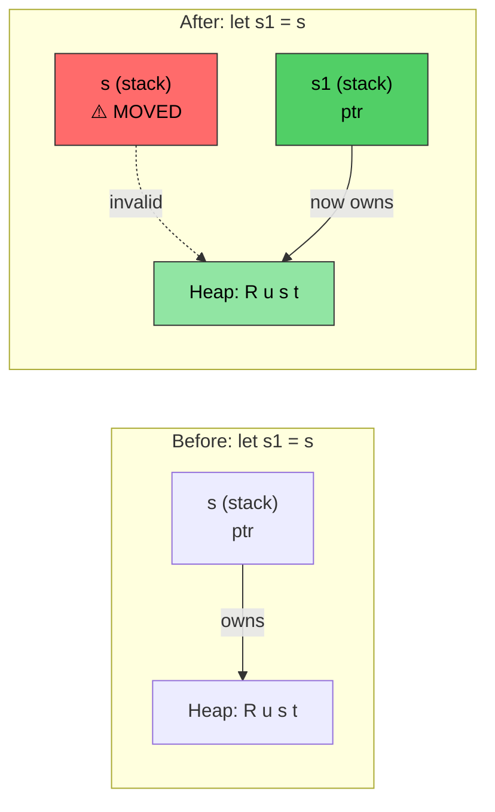
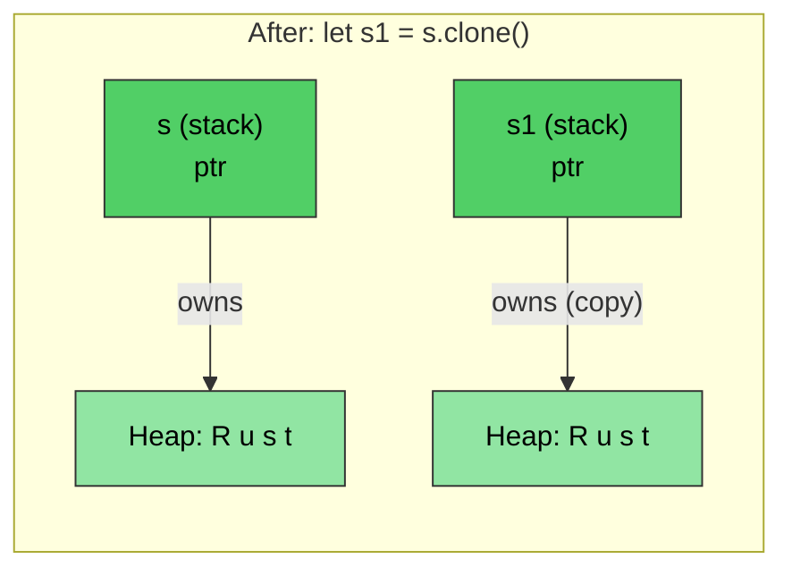

<a id="rust-memory-management"></a>
# Rust 메모리 관리

> **이 장에서 배우는 것:** Rust의 소유권 시스템입니다. 이 개념은 Rust에서 가장 중요합니다. 이 장을 마치면 move semantics, borrowing 규칙, `Drop` 트레잇을 이해하게 됩니다. 이 장이 잡히면 나머지 Rust도 자연스럽게 따라옵니다. 어렵다면 다시 읽으세요. 대부분의 C/C++ 개발자는 두 번째 읽을 때 감이 옵니다.

- C/C++의 메모리 관리는 버그의 주요 원인입니다.
    - C에서는 `malloc()`으로 메모리를 할당하고 `free()`로 해제합니다. 하지만 댕글링 포인터, use-after-free, double-free를 막는 장치가 없습니다.
    - C++에서는 RAII와 스마트 포인터가 도움이 되지만, `std::move(ptr)` 이후에도 사용이 컴파일되므로 use-after-move는 여전히 UB입니다.
- Rust는 RAII를 **실수할 수 없게** 만듭니다.
    - move는 **파괴적**이며, 컴파일러는 이동된 변수에 다시 접근하지 못하게 합니다.
    - Rule of Five가 필요 없습니다. copy ctor, move ctor, copy assign, move assign, destructor를 직접 관리하지 않습니다.
    - Rust는 메모리 할당 위치를 세밀하게 제어할 수 있게 하면서도, 안전성은 **컴파일 타임에** 강제합니다.
    - 이 보장은 소유권, 대여, 가변성, 라이프타임이 결합되어 만들어집니다.
    - Rust의 런타임 할당은 스택과 힙 모두에서 일어날 수 있습니다.

> **C++ 개발자를 위한 스마트 포인터 대응표**
>
> | **C++** | **Rust** | **안전성 향상점** |
> |---------|----------|----------------------|
> | `std::unique_ptr<T>` | `Box<T>` | use-after-move가 불가능 |
> | `std::shared_ptr<T>` | `Rc<T>` (단일 스레드) | 기본적으로 참조 순환을 만들지 않음 |
> | `std::shared_ptr<T>` (스레드 안전) | `Arc<T>` | 스레드 안전성이 명시적 |
> | `std::weak_ptr<T>` | `Weak<T>` | 유효성 검사를 반드시 해야 함 |
> | Raw pointer | `*const T` / `*mut T` | `unsafe` 블록 안에서만 사용 |
>
> C 개발자 관점에서는 `Box<T>`가 `malloc`/`free` 쌍을 대체하고, `Rc<T>`가 수동 참조 카운팅을 대체합니다. raw pointer도 존재하지만 `unsafe` 안으로 격리됩니다.

<a id="rust-ownership-borrowing-and-lifetimes"></a>
# Rust 소유권, 대여, 라이프타임
- Rust는 하나의 변수에 대해 가변 참조는 하나만, 불변 참조는 여러 개만 허용한다는 점을 기억하세요.
    - 변수의 최초 선언은 그 값의 **소유권(ownership)** 을 설정합니다.
    - 이후의 참조는 원래 소유자로부터 값을 **대여(borrow)** 합니다. 대여의 스코프는 소유자의 스코프를 넘을 수 없습니다. 즉, 대여의 **라이프타임(lifetime)** 은 소유자의 라이프타임보다 길 수 없습니다.
```rust
fn main() {
    let a = 42; // 소유자
    let b = &a; // 첫 번째 대여
    {
        let aa = 42;
        let c = &a; // 두 번째 대여; a는 여전히 스코프 안
        // OK: c는 여기서 스코프 종료
        // aa도 여기서 스코프 종료
    }
    // let d = &aa; // aa를 바깥 스코프로 옮기지 않으면 컴파일되지 않음
    // b는 a보다 먼저 암묵적으로 스코프 종료
    // a가 마지막에 스코프 종료
}
```

- Rust는 함수에 인자를 여러 방식으로 전달할 수 있습니다.
    - 값에 의한 전달(copy): 보통 `u8`, `u32`, `i8`, `i32`처럼 값 복사가 쉬운 타입에서 사용됩니다.
    - 참조에 의한 전달: 실제 값에 대한 포인터를 넘기는 것과 비슷합니다. 이것이 대여이며, 참조는 불변(`&`)일 수도 있고 가변(`&mut`)일 수도 있습니다.
    - move에 의한 전달: 값의 **소유권** 을 함수로 이전합니다. 호출자는 원래 값을 더 이상 사용할 수 없습니다.
```rust
fn foo(x: &u32) {
    println!("{x}");
}
fn bar(x: u32) {
    println!("{x}");
}
fn main() {
    let a = 42;
    foo(&a); // 참조로 전달
    bar(a);  // 값으로 전달 (copy)
}
```

- Rust는 함수에서 댕글링 참조를 반환하는 것을 금지합니다.
    - 반환되는 참조는 호출 시점에도 여전히 유효해야 합니다.
    - 참조가 스코프를 벗어나면 Rust가 자동으로 정리합니다.
```rust
fn no_dangling() -> &u32 {
    // a의 라이프타임 시작
    let a = 42;
    // 컴파일되지 않음. 여기서 a의 라이프타임 종료
    &a
}

fn ok_reference(a: &u32) -> &u32 {
    // a의 라이프타임은 항상 ok_reference()보다 길다
    a
}
fn main() {
    let a = 42; // a의 라이프타임 시작
    let b = ok_reference(&a);
    // b 라이프타임 종료
    // a 라이프타임 종료
}
```

<a id="rust-move-semantics"></a>
# Rust의 이동 의미론
- 기본적으로 Rust의 대입은 소유권을 이전합니다.
```rust
fn main() {
    let s = String::from("Rust"); // 힙에 문자열 할당
    let s1 = s; // 소유권이 s1으로 이전됨. s는 이제 무효
    println!("{s1}");
    // 컴파일되지 않음
    // println!("{s}");
    // s1이 스코프를 벗어나면 메모리가 해제됨
    // s는 더 이상 아무것도 소유하지 않으므로 별일 없음
}
```

*`let s1 = s` 이후에는 소유권이 `s1`로 이동합니다. 힙 데이터는 그대로 있고, 스택의 소유권 정보만 바뀝니다. `s`는 이제 무효입니다.*

----
# Rust move semantics와 대여
```rust
fn foo(s: String) {
    println!("{s}");
    // s가 가리키던 힙 메모리는 여기서 해제된다
}
fn bar(s: &String) {
    println!("{s}");
    // 아무 일도 일어나지 않음 -- s는 대여된 값
}
fn main() {
    let s = String::from("Rust string move example");
    foo(s); // 소유권 이전; s는 이제 무효
    // println!("{s}");  // 컴파일되지 않음
    let t = String::from("Rust string borrow example");
    bar(&t); // t는 계속 소유권을 유지
    println!("{t}");
}
```

# Rust move semantics와 소유권
- move를 통해 소유권을 이전할 수 있습니다.
    - move가 끝난 뒤에는 이전에 존재하던 참조를 사용하는 것이 불법입니다.
    - move가 바람직하지 않다면 borrow를 고려하세요.
```rust
struct Point {
    x: u32,
    y: u32,
}
fn consume_point(p: Point) {
    println!("{} {}", p.x, p.y);
}
fn borrow_point(p: &Point) {
    println!("{} {}", p.x, p.y);
}
fn main() {
    let p = Point { x: 10, y: 20 };
    // 아래 두 줄의 순서를 바꿔보세요
    borrow_point(&p);
    consume_point(p);
}
```

<a id="rust-clone"></a>
# Rust의 Clone
- `clone()` 메서드는 원래 메모리를 복사해 새 소유권을 만듭니다. 원래 값도 계속 유효합니다. 단점은 할당이 두 배가 된다는 점입니다.
```rust
fn main() {
    let s = String::from("Rust"); // 힙에 문자열 할당
    let s1 = s.clone(); // 문자열을 복사하고 새 힙 할당 생성
    println!("{s1}");
    println!("{s}");
    // s1은 스코프 종료 시 메모리 해제
    // s도 스코프 종료 시 메모리 해제
}
```

*`clone()`은 **별도의** 힙 할당을 만듭니다. `s`와 `s1`은 모두 유효하며, 각자 자기 복사본을 소유합니다.*

<a id="rust-copy-trait"></a>
# Rust Copy 트레잇
- Rust는 내장 기본 타입에 대해 `Copy` 트레잇으로 복사 의미론을 제공합니다.
    - 예를 들어 `u8`, `u32`, `i8`, `i32` 등이 이에 해당합니다. Copy 의미론은 값에 의한 전달입니다.
    - 사용자 정의 타입도 `derive` 매크로를 통해 `Copy` 트레잇을 자동 구현하도록 opt-in할 수 있습니다.
    - 새로 대입되면 컴파일러가 복사본을 위한 공간을 따로 만듭니다.
```rust
// 이 줄을 주석 처리하고 let p1 = p;의 동작 변화를 확인해보세요
#[derive(Copy, Clone, Debug)] // 자세한 설명은 뒤에서 다룸
struct Point { x: u32, y: u32 }
fn main() {
    let p = Point { x: 42, y: 40 };
    let p1 = p; // 이제 move가 아니라 copy 수행
    println!("p: {p:?}");
    println!("p1: {p:?}");
    let p2 = p1.clone(); // 의미적으로 copy와 동일
}
```

<a id="rust-drop-trait"></a>
# Rust Drop 트레잇

- Rust는 스코프가 끝날 때 자동으로 `drop()`을 호출합니다.
    - `drop`은 `Drop`이라는 일반 트레잇의 일부입니다. 컴파일러는 모든 타입에 대해 기본 no-op 구현을 제공하지만, 타입이 이를 직접 구현할 수 있습니다. 예를 들어 `String`은 힙 메모리를 해제하도록 이를 구현합니다.
    - C 개발자 관점에서는 이것이 수동 `free()` 호출을 대체합니다. 값이 스코프를 벗어나면 자원이 자동 해제됩니다.
- **핵심 안전성:** `.drop()` 메서드를 직접 호출할 수는 없습니다. 컴파일러가 막습니다. 대신 `drop(obj)`를 호출하면 값이 함수로 move되고, 소멸자가 실행되며, 이후 추가 사용도 막기 때문에 double-free 버그를 방지할 수 있습니다.

> **C++ 개발자를 위한 비교:** `Drop`은 C++의 destructor(`~ClassName()`)에 직접 대응합니다.
>
> | | **C++ destructor** | **Rust `Drop`** |
> |---|---|---|
> | **문법** | `~MyClass() { ... }` | `impl Drop for MyType { fn drop(&mut self) { ... } }` |
> | **호출 시점** | 스코프 종료 시 (RAII) | 스코프 종료 시 (동일) |
> | **move 후 동작** | 원본이 "유효하지만 정의되지 않은 상태"로 남고, moved-from 객체에도 destructor가 돈다 | 원본은 **사라진다**. moved-from 값에 대한 destructor 호출 자체가 없다 |
> | **수동 호출** | `obj.~MyClass()` (위험, 거의 쓰지 않음) | `drop(obj)` (안전 - 소유권을 가져가고 이후 사용 금지) |
> | **호출 순서** | 선언 역순 | 선언 역순 (동일) |
> | **Rule of Five** | copy ctor, move ctor, copy assign, move assign, destructor를 모두 고려해야 함 | `Drop`만 구현하면 된다. move semantics는 컴파일러가 처리하고, `Clone`은 opt-in |
> | **virtual dtor 필요?** | base pointer로 삭제한다면 필요 | 상속이 없으므로 불필요 |

```rust
struct Point { x: u32, y: u32 }

// C++의 ~Point() { printf(...); } 와 비슷하다
impl Drop for Point {
    fn drop(&mut self) {
        println!("Goodbye point x:{}, y:{}", self.x, self.y);
    }
}
fn main() {
    let p = Point { x: 42, y: 42 };
    {
        let p1 = Point { x: 43, y: 43 };
        println!("Exiting inner block");
        // p1.drop()가 여기서 호출된다
    }
    println!("Exiting main");
    // p.drop()가 여기서 호출된다
}
```

<a id="exercise-move-copy-and-drop"></a>
# 연습문제: Move, Copy, Drop

🟡 **Intermediate** - 자유롭게 실험하세요. 컴파일러가 방향을 잡아줄 것입니다.
- 아래의 `Point` 예제에서 `#[derive(Debug)]`에 `Copy`를 넣고 빼보면서 차이를 직접 확인해 보세요. 핵심은 move와 copy의 차이를 몸으로 익히는 것입니다.
- `Point`에 커스텀 `Drop`을 구현해서 `drop` 안에서 x와 y를 0으로 설정해 보세요. 이런 패턴은 lock이나 기타 자원을 정리할 때 응용할 수 있습니다.
```rust
struct Point { x: u32, y: u32 }
fn main() {
    // Point를 만들고, 다른 변수에 대입하고, 새 스코프를 만들고,
    // 함수를 통해 넘겨보는 실험을 해보세요.
}
```

<details><summary>해답 (클릭하여 펼치기)</summary>

```rust
#[derive(Debug)]
struct Point { x: u32, y: u32 }

impl Drop for Point {
    fn drop(&mut self) {
        println!("Dropping Point({}, {})", self.x, self.y);
        self.x = 0;
        self.y = 0;
        // 참고: drop 안에서 0으로 바꾸는 것은 패턴 설명용이다.
        // drop이 끝난 뒤에는 이 값을 관찰할 수 없다.
    }
}

fn consume(p: Point) {
    println!("Consuming: {:?}", p);
    // p는 여기서 drop된다
}

fn main() {
    let p1 = Point { x: 10, y: 20 };
    let p2 = p1;  // move - p1은 이제 유효하지 않다
    // println!("{:?}", p1);  // 컴파일되지 않음: p1은 이미 이동됨

    {
        let p3 = Point { x: 30, y: 40 };
        println!("p3 in inner scope: {:?}", p3);
        // p3는 여기서 drop됨 (스코프 종료)
    }

    consume(p2);  // p2는 consume으로 move되어 그 안에서 drop됨
    // println!("{:?}", p2);  // 컴파일되지 않음: p2는 이미 이동됨

    // 이제 Point에 #[derive(Copy, Clone)]를 추가해보고 (Drop 구현은 제거)
    // let p2 = p1; 이후에도 p1이 계속 유효한지 관찰해보세요.
}
// Output:
// p3 in inner scope: Point { x: 30, y: 40 }
// Dropping Point(30, 40)
// Consuming: Point { x: 10, y: 20 }
// Dropping Point(10, 20)
```

</details>
