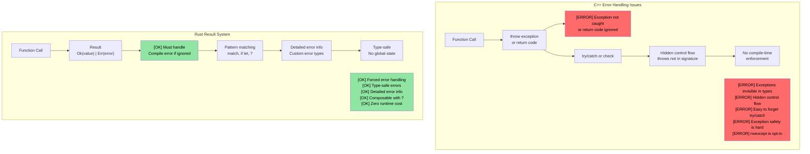
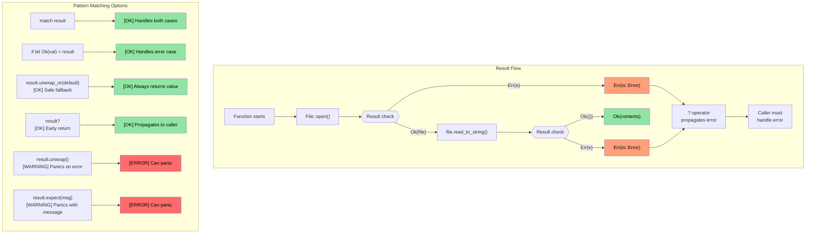

<a id="connecting-enums-to-option-and-result"></a>
## enum에서 Option과 Result로 연결하기

> **이 장에서 배우는 것:** Rust가 null pointer를 `Option<T>`로, 예외를 `Result<T, E>`로 어떻게 대체하는지, 그리고 `?` 연산자가 에러 전파를 얼마나 간결하게 만드는지 배웁니다. 이것은 Rust의 가장 독특한 패턴 중 하나입니다. 에러는 숨은 제어 흐름이 아니라 값입니다.

- 앞에서 배운 `enum`을 기억하세요. Rust의 `Option`과 `Result`도 표준 라이브러리에 정의된 enum일 뿐입니다.
```rust
// std에서 Option은 실제로 이렇게 정의된다:
enum Option<T> {
    Some(T),  // 값이 있음
    None,     // 값이 없음
}

// Result도 마찬가지:
enum Result<T, E> {
    Ok(T),    // 성공 + 값
    Err(E),   // 실패 + 에러 정보
}
```
- 즉, 앞서 배운 `match` 기반 패턴 매칭이 `Option`과 `Result`에도 그대로 적용됩니다.
- Rust에는 **null pointer가 없습니다**. 그 자리를 `Option<T>`가 대신하며, 컴파일러는 `None` 처리를 강제합니다.

### C++ 비교: 예외 vs Result
| **C++ 패턴** | **Rust 대응** | **장점** |
|----------------|--------------------|--------------|
| `throw std::runtime_error(msg)` | `Err(MyError::Runtime(msg))` | 에러가 반환 타입에 드러나므로 잊을 수 없음 |
| `try { } catch (...) { }` | `match result { Ok(v) => ..., Err(e) => ... }` | 숨은 제어 흐름 없음 |
| `std::optional<T>` | `Option<T>` | 모든 경우를 match해야 하므로 None을 놓칠 수 없음 |
| `noexcept` | 기본값 - 모든 Rust 함수는 사실상 "noexcept" | 예외 개념 자체가 없음 |
| `errno` / 반환 코드 | `Result<T, E>` | 타입 안전하고 무시하기 어려움 |

<a id="rust-option-type"></a>
# Rust Option 타입
- Rust의 `Option` 타입은 `Some<T>`와 `None` 두 variant만 가진 `enum`입니다.
    - 이는 "nullable type"을 표현한다고 보면 됩니다. 즉 유효한 값이 있으면 `Some<T>`, 값이 없으면 `None`입니다.
    - `Option`은 연산 결과가 성공해서 값이 나오거나, 실패했지만 구체적인 에러 정보는 중요하지 않을 때 많이 쓰입니다. 예를 들어 문자열에서 정수 찾기나 위치 찾기 같은 경우입니다.
```rust
fn main() {
    // Option<usize> 반환
    let a = "1234".find("1");
    match a {
        Some(a) => println!("Found 1 at index {a}"),
        None => println!("Couldn't find 1")
    }
}
```

# Rust Option 타입
- Rust의 `Option`은 여러 방식으로 처리할 수 있습니다.
    - `unwrap()`은 `Option<T>`가 `None`이면 패닉하고, `Some`이면 `T`를 꺼냅니다. 가장 덜 권장되는 방식입니다.
    - `or()`는 대체 값을 제공할 때 씁니다.
    - `if let`으로 `Some<T>`인 경우만 간단히 처리할 수 있습니다.

> **프로덕션 패턴:** 실제 코드에서 `unwrap_or`, `map`, `map_err`, `find_map`을 어떻게 쓰는지는 [Safe value extraction with unwrap_or](ch17-2-avoiding-unchecked-indexing.md#safe-value-extraction-with-unwrap_or)와 [Functional transforms: map, map_err, find_map](ch17-2-avoiding-unchecked-indexing.md#functional-transforms-map-map_err-find_map)를 참고하세요.
```rust
fn main() {
  // Option<usize> 반환
  let a = "1234".find("1");
  println!("{a:?} {}", a.unwrap());
  let a = "1234".find("5").or(Some(42));
  println!("{a:?}");
  if let Some(a) = "1234".find("1") {
      println!("{a}");
  } else {
    println!("Not found in string");
  }
  // 이 줄은 패닉
  // "1234".find("5").unwrap();
}
```

<a id="rust-result-type"></a>
# Rust Result 타입
- `Result`는 `Option`과 비슷한 `enum`이며, `Ok<T>`와 `Err<E>` 두 variant를 가집니다.
    - `Result`는 실패할 수 있는 Rust API에서 광범위하게 사용됩니다. 성공하면 `Ok<T>`, 실패하면 구체적인 에러를 담은 `Err<E>`를 반환합니다.
```rust
use std::num::ParseIntError;
fn main() {
  let a: Result<i32, ParseIntError> = "1234z".parse();
  match a {
      Ok(n) => println!("Parsed {n}"),
      Err(e) => println!("Parsing failed {e:?}"),
  }
  let a: Result<i32, ParseIntError> = "1234z".parse().or(Ok(-1));
  println!("{a:?}");
  if let Ok(a) = "1234".parse::<i32>() {
    println!("Let OK {a}");
  }
  // 이 줄은 패닉
  // "1234z".parse().unwrap();
}
```

## Option과 Result: 같은 동전의 양면

`Option`과 `Result`는 매우 가깝습니다. `Option<T>`는 사실상 `Result<T, ()>`와 비슷합니다. 즉, 에러 정보가 없는 결과 타입입니다.

| `Option<T>` | `Result<T, E>` | 의미 |
|-------------|---------------|---------|
| `Some(value)` | `Ok(value)` | 성공 - 값이 있다 |
| `None` | `Err(error)` | 실패 - 값이 없음(Option) 또는 에러 정보 있음(Result) |

**서로 변환하기**

```rust
fn main() {
    let opt: Option<i32> = Some(42);
    let res: Result<i32, &str> = opt.ok_or("value was None");  // Option → Result
    
    let res: Result<i32, &str> = Ok(42);
    let opt: Option<i32> = res.ok();  // Result → Option (에러는 버림)
    
    // 둘은 많은 메서드를 공유한다:
    // .map(), .and_then(), .unwrap_or(), .unwrap_or_else(), .is_some()/is_ok()
}
```

> **실전 기준:** "없음"이 정상 상황이면 `Option`을 쓰세요. 예: 키 조회. 실패 원인을 설명해야 하면 `Result`를 쓰세요. 예: 파일 I/O, 파싱.

<a id="exercise-log-function-implementation-with-option"></a>
# 연습문제: Option을 이용한 log() 함수 구현

🟢 **Starter**

- `Option<&str>`를 받는 `log()` 함수를 구현하세요. 인자가 `None`이면 기본 문자열을 출력해야 합니다.
- 함수는 성공/실패 타입 모두 `()`인 `Result`를 반환하세요. 이 예제에서는 실제 에러는 발생하지 않습니다.

<details><summary>해답 (클릭하여 펼치기)</summary>

```rust
fn log(message: Option<&str>) -> Result<(), ()> {
    match message {
        Some(msg) => println!("LOG: {msg}"),
        None => println!("LOG: (no message provided)"),
    }
    Ok(())
}

fn main() {
    let _ = log(Some("System initialized"));
    let _ = log(None);
    
    // unwrap_or를 쓰는 대안:
    let msg: Option<&str> = None;
    println!("LOG: {}", msg.unwrap_or("(default message)"));
}
// Output:
// LOG: System initialized
// LOG: (no message provided)
// LOG: (default message)
```

</details>

----
<a id="rust-error-handling"></a>
# Rust 에러 처리
 - Rust의 에러는 복구 불가능한 에러(fatal)와 복구 가능한 에러로 나뉩니다. fatal 에러는 `panic`으로 이어집니다.
    - 일반적으로 `panic`이 발생하는 상황은 피해야 합니다. 인덱스 범위 초과, `Option<None>`에 `unwrap()` 호출 등이 대표적입니다.
    - "절대 일어나지 않아야 하는 상황"에 대해서는 명시적 `panic`을 두는 것도 괜찮습니다. `panic!`이나 `assert!` 매크로로 sanity check를 할 수 있습니다.
```rust
fn main() {
   let x: Option<u32> = None;
   // println!("{x}", x.unwrap()); // 패닉
   println!("{}", x.unwrap_or(0));  // OK -- 0 출력
   let x = 41;
   // assert!(x == 42); // 패닉
   // panic!("Something went wrong"); // 무조건 패닉
   let _a = vec![0, 1];
   // println!("{}", a[2]); // 범위 초과 패닉; a.get(2)는 Option<T> 반환
}
```

## 에러 처리: C++ vs Rust

### C++ 예외 기반 에러 처리의 문제

```cpp
// C++ 에러 처리 - 예외는 숨은 제어 흐름을 만든다
#include <fstream>
#include <stdexcept>

std::string read_config(const std::string& path) {
    std::ifstream file(path);
    if (!file.is_open()) {
        throw std::runtime_error("Cannot open: " + path);
    }
    std::string content;
    // getline이 throw하면? file은 닫히겠지만 다른 자원은?
    std::getline(file, content);
    return content;  // 호출자가 try/catch 하지 않으면?
}

int main() {
    // ERROR: try/catch를 깜빡함
    auto config = read_config("nonexistent.txt");
    // 예외가 조용히 전파되고 프로그램이 종료
    // 함수 시그니처에는 이런 위험이 드러나지 않는다
    return 0;
}
```



### `Result<T, E>` 시각화

```rust
// Rust 에러 처리 - 포괄적이며 강제됨
use std::fs::File;
use std::io::Read;

fn read_file_content(filename: &str) -> Result<String, std::io::Error> {
    let mut file = File::open(filename)?;  // ?가 에러를 자동 전파
    let mut contents = String::new();
    file.read_to_string(&mut contents)?;
    Ok(contents)  // 성공 케이스
}

fn main() {
    match read_file_content("example.txt") {
        Ok(content) => println!("File content: {}", content),
        Err(error) => println!("Failed to read file: {}", error),
        // 컴파일러가 두 경우 모두 처리를 강제
    }
}
```



# Rust 에러 처리
- Rust는 복구 가능한 에러를 위해 `enum Result<T, E>`를 사용합니다.
    - 성공하면 `Ok<T>`에 결과가 들어 있고, 실패하면 `Err<E>`에 에러가 들어 있습니다.
```rust
fn main() {
    let x = "1234x".parse::<u32>();
    match x {
        Ok(x) => println!("Parsed number {x}"),
        Err(e) => println!("Parsing error {e:?}"),
    }
    let x = "1234".parse::<u32>();
    // 위와 같지만 이번에는 정상 숫자
    if let Ok(x) = &x {
        println!("Parsed number {x}")
    } else if let Err(e) = &x {
        println!("Error: {e:?}");
    }
}
```

# Rust 에러 처리
- try 연산자 `?`는 `match`를 이용한 `Ok` / `Err` 처리 패턴을 짧게 쓴 문법입니다.
    - `?`를 쓰려면 해당 함수가 `Result<T, E>`를 반환해야 합니다.
    - `Result<T, E>`의 에러 타입은 변환할 수 있습니다. 아래 예제에서는 `str::parse()`가 반환하는 `std::num::ParseIntError`를 그대로 돌려줍니다.
```rust
fn double_string_number(s: &str) -> Result<u32, std::num::ParseIntError> {
   let x = s.parse::<u32>()?; // 에러면 즉시 반환
   Ok(x * 2)
}
fn main() {
    let result = double_string_number("1234");
    println!("{result:?}");
    let result = double_string_number("1234x");
    println!("{result:?}");
}
```

# Rust 에러 처리
- 에러를 다른 타입으로 바꾸거나 기본값으로 치환할 수도 있습니다. 참고: https://doc.rust-lang.org/std/result/enum.Result.html#method.unwrap_or_default
```rust
// 에러가 나면 에러 타입을 ()로 바꾼다
fn double_string_number(s: &str) -> Result<u32, ()> {
   let x = s.parse::<u32>().map_err(|_| ())?; // 에러면 즉시 반환
   Ok(x * 2)
}
```
```rust
fn double_string_number(s: &str) -> Result<u32, ()> {
   let x = s.parse::<u32>().unwrap_or_default(); // 파싱 실패 시 0
   Ok(x * 2)
}
```
```rust
fn double_optional_number(x: Option<u32>) -> Result<u32, ()> {
    // 아래에서 ok_or가 Option<None>을 Result<u32, ()>로 바꿔준다
    x.ok_or(()).map(|x| x * 2) // .map()은 Ok(u32)에만 적용
}
```

<a id="exercise-error-handling"></a>
# 연습문제: 에러 처리

🟡 **Intermediate**
- `u32` 하나를 받는 `log()` 함수를 구현하세요. 값이 42가 아니면 에러를 반환해야 합니다. 성공과 에러 타입은 모두 `Result<(), ()>`입니다.
- `log()`가 에러를 반환하면 그대로 종료하는 `call_log()`도 구현하세요. 성공하면 `log was successfully called`를 출력합니다.

```rust
fn log(x: u32) -> ?? {

}

fn call_log(x: u32) -> ?? {
    // log(x)를 호출하고 에러면 즉시 반환
    println!("log was successfully called");
}

fn main() {
    call_log(42);
    call_log(43);
}
``` 

<details><summary>해답 (클릭하여 펼치기)</summary>

```rust
fn log(x: u32) -> Result<(), ()> {
    if x == 42 {
        Ok(())
    } else {
        Err(())
    }
}

fn call_log(x: u32) -> Result<(), ()> {
    log(x)?;  // log()가 에러면 즉시 반환
    println!("log was successfully called with {x}");
    Ok(())
}

fn main() {
    let _ = call_log(42);  // Prints: log was successfully called with 42
    let _ = call_log(43);  // Returns Err(()), nothing printed
}
// Output:
// log was successfully called with 42
```

</details>
