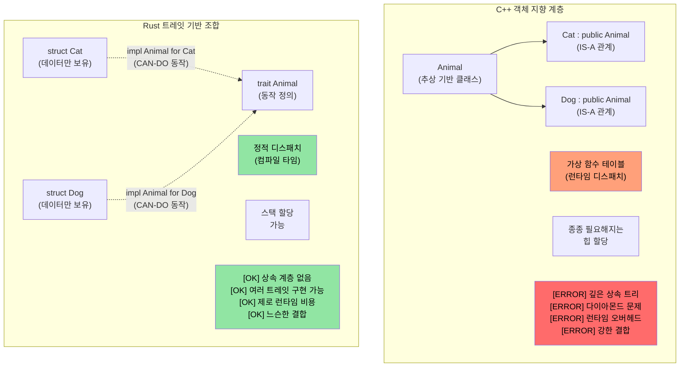
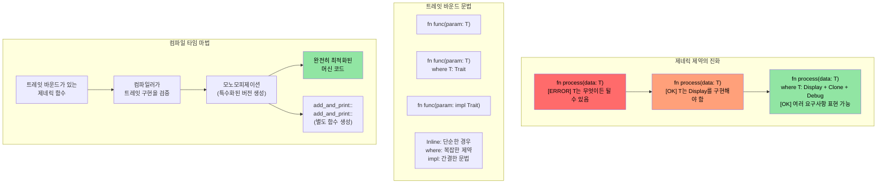

<a id="rust-traits"></a>
# Rust 트레잇

> **이 장에서 배우는 것:** 트레잇은 Rust에서 인터페이스, 추상 기반 클래스, 연산자 오버로딩에 해당하는 개념입니다. 트레잇을 정의하는 법, 내 타입에 구현하는 법, 동적 디스패치(`dyn Trait`)와 정적 디스패치(제네릭)를 언제 쓰는지 배웁니다. C++ 개발자에게는 트레잇이 virtual 함수, CRTP, concepts를 대신합니다. C 개발자에게는 Rust가 다형성을 구조적으로 표현하는 방식이라고 볼 수 있습니다.

- Rust의 트레잇은 다른 언어의 인터페이스와 비슷합니다.
    - 트레잇은 이를 구현하는 타입이 반드시 제공해야 하는 메서드를 정의합니다.
```rust
fn main() {
    trait Pet {
        fn speak(&self);
    }
    struct Cat;
    struct Dog;
    impl Pet for Cat {
        fn speak(&self) {
            println!("Meow");
        }
    }
    impl Pet for Dog {
        fn speak(&self) {
            println!("Woof!")
        }
    }
    let c = Cat{};
    let d = Dog{};
    c.speak();  // Cat과 Dog 사이에는 "is a" 관계가 없다
    d.speak();  // Cat과 Dog 사이에는 "is a" 관계가 없다
}
```

<a id="traits-vs-c-concepts-and-interfaces"></a>
## 트레잇 vs C++ concepts와 인터페이스

<a id="traditional-c-inheritance-vs-rust-traits"></a>
### 전통적인 C++ 상속 vs Rust 트레잇

```cpp
// C++ - 상속 기반 다형성
class Animal {
public:
    virtual void speak() = 0;  // 순수 가상 함수
    virtual ~Animal() = default;
};

class Cat : public Animal {  // "Cat IS-A Animal"
public:
    void speak() override {
        std::cout << "Meow" << std::endl;
    }
};

void make_sound(Animal* animal) {  // 런타임 다형성
    animal->speak();  // 가상 함수 호출
}
```

```rust
// Rust - 상속보다 조합을 택하고, 트레잇으로 동작을 표현한다
trait Animal {
    fn speak(&self);
}

struct Cat;  // Cat은 Animal이 "아니고", Animal 동작을 "구현"한다

impl Animal for Cat {  // "Cat CAN-DO Animal behavior"
    fn speak(&self) {
        println!("Meow");
    }
}

fn make_sound<T: Animal>(animal: &T) {  // 정적 다형성
    animal.speak();  // 직접 함수 호출(제로 코스트)
}
```



<a id="trait-bounds-and-generic-constraints"></a>
### 트레잇 바운드와 제네릭 제약

```rust
use std::fmt::Display;
use std::ops::Add;

// C++ 템플릿에 대응하는 예(제약이 약함)
// template<typename T>
// T add_and_print(T a, T b) {
//     // T가 + 또는 출력 연산을 지원하는지 보장되지 않는다
//     return a + b;  // 컴파일 타임에 실패할 수 있다
// }

// Rust - 명시적인 트레잇 바운드
fn add_and_print<T>(a: T, b: T) -> T
where
    T: Display + Add<Output = T> + Copy,
{
    println!("Adding {} + {}", a, b);  // Display 트레잇
    a + b  // Add 트레잇
}
```



<a id="c-operator-overloading--rust-stdops-traits"></a>
### C++ 연산자 오버로딩 → Rust `std::ops` 트레잇

C++에서는 특별한 이름을 가진 자유 함수나 멤버 함수(`operator+`, `operator<<`, `operator[]` 등)를 작성해 연산자를 오버로드합니다. Rust에서는 모든 연산자가 `std::ops`(출력은 `std::fmt`)의 트레잇에 대응합니다. 즉, 마법 같은 이름의 함수를 쓰는 대신 **그 트레잇을 구현**합니다.

<a id="side-by-side--operator"></a>
#### 나란히 비교해보기: `+` 연산자

```cpp
// C++: 멤버 함수 또는 자유 함수로 연산자 오버로딩
struct Vec2 {
    double x, y;
    Vec2 operator+(const Vec2& rhs) const {
        return {x + rhs.x, y + rhs.y};
    }
};

Vec2 a{1.0, 2.0}, b{3.0, 4.0};
Vec2 c = a + b;  // a.operator+(b)를 호출
```

```rust
use std::ops::Add;

#[derive(Debug, Clone, Copy)]
struct Vec2 { x: f64, y: f64 }

impl Add for Vec2 {
    type Output = Vec2;                     // 연관 타입 - +의 결과 타입
    fn add(self, rhs: Vec2) -> Vec2 {
        Vec2 { x: self.x + rhs.x, y: self.y + rhs.y }
    }
}

let a = Vec2 { x: 1.0, y: 2.0 };
let b = Vec2 { x: 3.0, y: 4.0 };
let c = a + b;  // <Vec2 as Add>::add(a, b)를 호출
println!("{c:?}"); // Vec2 { x: 4.0, y: 6.0 }
```

<a id="key-differences-from-c"></a>
#### C++와의 핵심 차이

| 항목 | C++ | Rust |
|------|-----|------|
| **메커니즘** | 마법 함수 이름(`operator+`) | 트레잇 구현(`impl Add for T`) |
| **찾아보기** | `operator+`를 검색하거나 헤더를 읽음 | 트레잇 impl을 보면 됨 - IDE 지원도 좋음 |
| **반환 타입** | 자유롭게 선택 가능 | `Output` 연관 타입으로 고정 |
| **리시버** | 보통 `const T&`를 받음(대여) | 기본적으로 값을 받는 `self`를 사용(이동!) |
| **대칭성** | `impl operator+(int, Vec2)` 같은 형태 가능 | `impl Add<Vec2> for i32`를 추가해야 함(외부 트레잇 규칙 적용) |
| **출력용 `<<`** | `operator<<(ostream&, T)` - *어떤* 스트림에도 오버로드 가능 | `impl fmt::Display for T` - 표준 `to_string` 표현 하나만 가짐 |

<a id="the-self-by-value-gotcha"></a>
#### `self`를 값으로 받는다는 함정

Rust에서 `Add::add(self, rhs)`는 `self`를 **값으로** 받습니다. `Copy` 타입(위의 `Vec2`처럼 `Copy`를 derive한 타입)에서는 컴파일러가 복사해주므로 문제가 없습니다. 하지만 `Copy`가 아닌 타입에서는 `+`가 피연산자를 **소비**합니다.

```rust
let s1 = String::from("hello ");
let s2 = String::from("world");
let s3 = s1 + &s2;  // s1은 s3로 MOVED 된다!
// println!("{s1}");  // ❌ 컴파일 에러: move 후 값 사용
println!("{s2}");     // ✅ s2는 단지 빌려졌을 뿐이다(&s2)
```

이 때문에 `String + &str`는 되지만 `&str + &str`는 되지 않습니다. `Add`는 `String + &str`에 대해서만 구현되어 있고, 왼쪽 `String`을 소비해 내부 버퍼를 재사용하기 때문입니다. 이는 C++의 `std::string::operator+`가 항상 새 문자열을 만드는 것과 다릅니다.

<a id="full-mapping-c-operators--rust-traits"></a>
#### 전체 대응표: C++ 연산자 → Rust 트레잇

| C++ 연산자 | Rust 트레잇 | 비고 |
|------------|-------------|------|
| `operator+` | `std::ops::Add` | `Output` 연관 타입 |
| `operator-` | `std::ops::Sub` | |
| `operator*` | `std::ops::Mul` | 포인터 역참조가 아님 - 그건 `Deref` |
| `operator/` | `std::ops::Div` | |
| `operator%` | `std::ops::Rem` | |
| `operator-` (단항) | `std::ops::Neg` | |
| `operator!` / `operator~` | `std::ops::Not` | Rust는 논리 NOT과 비트 NOT에 모두 `!`를 사용함(`~` 없음) |
| `operator&`, `\|`, `^` | `BitAnd`, `BitOr`, `BitXor` | |
| `operator<<`, `>>` (shift) | `Shl`, `Shr` | 스트림 I/O가 아니다! |
| `operator+=` | `std::ops::AddAssign` | `self`가 아니라 `&mut self`를 받음 |
| `operator[]` | `std::ops::Index` / `IndexMut` | `&Output` / `&mut Output` 반환 |
| `operator()` | `Fn` / `FnMut` / `FnOnce` | 클로저가 구현하며, 직접 `impl Fn`은 할 수 없음 |
| `operator==` | `PartialEq` (+ `Eq`) | `std::ops`가 아니라 `std::cmp`에 있음 |
| `operator<` | `PartialOrd` (+ `Ord`) | `std::cmp`에 있음 |
| `operator<<` (stream) | `fmt::Display` | `println!("{}", x)` |
| `operator<<` (debug) | `fmt::Debug` | `println!("{:?}", x)` |
| `operator bool` | 직접 대응 없음 | `impl From<T> for bool` 또는 `.is_empty()` 같은 이름 있는 메서드 사용 |
| `operator T()` (암시적 변환) | 암시적 변환 없음 | `From`/`Into` 트레잇 사용(명시적) |

<a id="guardrails-what-rust-prevents"></a>
#### Rust가 막아주는 위험 요소

1. **암시적 변환 없음**: C++의 `operator int()`는 조용하고 놀라운 형변환을 유발할 수 있습니다. Rust에는 암시적 변환 연산자가 없으므로 `From`/`Into`를 쓰고 `.into()`를 명시적으로 호출해야 합니다.
2. **`&&` / `||` 오버로딩 불가**: C++는 이를 허용해 short-circuit 의미를 깨뜨릴 수 있지만, Rust는 허용하지 않습니다.
3. **`=` 오버로딩 불가**: 대입은 항상 move 또는 copy이며, 사용자 정의가 아닙니다. 복합 대입(`+=`)은 `AddAssign` 등을 통해 오버로드할 수 있습니다.
4. **`,` 오버로딩 불가**: C++는 `operator,()`를 허용하는데, 이는 가장 악명 높은 footgun 중 하나입니다. Rust는 허용하지 않습니다.
5. **`&`(주소 얻기) 오버로딩 불가**: 이것도 C++의 대표적인 footgun입니다(`std::addressof`가 이를 우회하려고 존재합니다). Rust의 `&`는 언제나 "빌린다"는 뜻입니다.
6. **coherence 규칙**: 자신의 타입에 대해 `Add<Foreign>`를 구현하거나, 외부 타입에 대해 `Add<YourType>`를 구현할 수는 있지만, 외부 타입에 대해 `Add<Foreign>`를 구현할 수는 없습니다. 여러 크레이트가 충돌하는 연산자 정의를 넣지 못하게 하기 위함입니다.

> **핵심 요약**: C++의 연산자 오버로딩은 매우 강력하지만 제약이 적습니다. 쉼표나 주소 얻기까지 거의 모든 것을 오버로드할 수 있고, 암시적 변환도 조용히 발동할 수 있습니다. Rust는 트레잇을 통해 산술 및 비교 연산에 대해서는 충분한 표현력을 제공하면서도, **역사적으로 위험했던 오버로드는 차단**하고 모든 변환을 명시적으로 강제합니다.

----
<a id="rust-traits-1"></a>
# Rust 트레잇
- Rust에서는 이 예제처럼 `u32` 같은 기본 타입에도 사용자 정의 트레잇을 구현할 수 있습니다. 다만 트레잇이나 타입 중 하나는 반드시 현재 크레이트에 속해야 합니다.
```rust
trait IsSecret {
  fn is_secret(&self);
}
// IsSecret 트레잇은 현재 크레이트에 속하므로 괜찮다
impl IsSecret for u32 {
  fn is_secret(&self) {
      if *self == 42 {
          println!("Is secret of life");
      }
  }
}

fn main() {
  42u32.is_secret();
  43u32.is_secret();
}
```

<a id="rust-traits-2"></a>
# Rust 트레잇
- 트레잇은 인터페이스 상속과 기본 구현을 지원합니다.
```rust
trait Animal {
  // 기본 구현
  fn is_mammal(&self) -> bool {
    true
  }
}
trait Feline : Animal {
  // 기본 구현
  fn is_feline(&self) -> bool {
    true
  }
}

struct Cat;
// 기본 구현을 사용한다. 상위 트레잇의 모든 구현은 개별적으로 작성해야 한다
impl Feline for Cat {}
impl Animal for Cat {}
fn main() {
  let c = Cat{};
  println!("{} {}", c.is_mammal(), c.is_feline());
}
```
----
<a id="exercise-logger-trait-implementation"></a>
# 연습문제: Logger 트레잇 구현

🟡 **Intermediate**

- `u64`를 받는 `log()` 메서드 하나만 가진 `Log` 트레잇을 구현하세요.
    - `Log` 트레잇을 구현하는 `SimpleLogger`와 `ComplexLogger` 두 가지 로거를 만드세요. 하나는 `u64`와 함께 `"Simple logger"`를 출력하고, 다른 하나는 `u64`와 함께 `"Complex logger"`를 출력해야 합니다.

<details><summary>해답 (클릭하여 펼치기)</summary>

```rust
trait Log {
    fn log(&self, value: u64);
}

struct SimpleLogger;
struct ComplexLogger;

impl Log for SimpleLogger {
    fn log(&self, value: u64) {
        println!("Simple logger: {value}");
    }
}

impl Log for ComplexLogger {
    fn log(&self, value: u64) {
        println!("Complex logger: {value} (hex: 0x{value:x}, binary: {value:b})");
    }
}

fn main() {
    let simple = SimpleLogger;
    let complex = ComplexLogger;
    simple.log(42);
    complex.log(42);
}
// 출력:
// Simple logger: 42
// Complex logger: 42 (hex: 0x2a, binary: 101010)
```

</details>

----
<a id="rust-trait-associated-types"></a>
# Rust 트레잇 연관 타입
```rust
#[derive(Debug)]
struct Small(u32);
#[derive(Debug)]
struct Big(u32);
trait Double {
    type T;
    fn double(&self) -> Self::T;
}

impl Double for Small {
    type T = Big;
    fn double(&self) -> Self::T {
        Big(self.0 * 2)
    }
}
fn main() {
    let a = Small(42);
    println!("{:?}", a.double());
}
```

<a id="rust-trait-impl"></a>
# Rust 트레잇 구현
- `impl`은 트레잇과 함께 사용하여, 특정 트레잇을 구현한 아무 타입이나 받을 수 있게 해줍니다.
```rust
trait Pet {
    fn speak(&self);
}
struct Dog {}
struct Cat {}
impl Pet for Dog {
    fn speak(&self) {println!("Woof!")}
}
impl Pet for Cat {
    fn speak(&self) {println!("Meow")}
}
fn pet_speak(p: &impl Pet) {
    p.speak();
}
fn main() {
    let c = Cat {};
    let d = Dog {};
    pet_speak(&c);
    pet_speak(&d);
}
```

<a id="rust-trait-impl-1"></a>
# Rust 트레잇 구현
- `impl`은 반환값 위치에도 사용할 수 있습니다.
```rust
trait Pet {}
struct Dog;
struct Cat;
impl Pet for Cat {}
impl Pet for Dog {}
fn cat_as_pet() -> impl Pet {
    let c = Cat {};
    c
}
fn dog_as_pet() -> impl Pet {
    let d = Dog {};
    d
}
fn main() {
    let p = cat_as_pet();
    let d = dog_as_pet();
}
```
----
<a id="rust-dynamic-traits"></a>
# Rust 동적 트레잇
- 동적 트레잇을 사용하면 구체 타입을 알지 못해도 트레잇 기능을 호출할 수 있습니다. 이를 `type erasure`라고 부릅니다.
```rust
trait Pet {
    fn speak(&self);
}
struct Dog {}
struct Cat {x: u32}
impl Pet for Dog {
    fn speak(&self) {println!("Woof!")}
}
impl Pet for Cat {
    fn speak(&self) {println!("Meow")}
}
fn pet_speak(p: &dyn Pet) {
    p.speak();
}
fn main() {
    let c = Cat {x: 42};
    let d = Dog {};
    pet_speak(&c);
    pet_speak(&d);
}
```
----

<a id="when-to-use-enum-vs-dyn-trait"></a>
<a id="exercise-think-before-you-translate"></a>
## `impl Trait`, `dyn Trait`, `enum` 중 무엇을 선택할까

이 세 가지 접근은 모두 다형성을 구현하지만, 각각의 트레이드오프가 다릅니다.

| 접근 방식 | 디스패치 | 성능 | 이종 컬렉션 가능? | 언제 사용할까 |
|-----------|----------|------|-------------------|----------------|
| `impl Trait` / 제네릭 | 정적(모노모피제이션) | 제로 코스트 - 컴파일 타임에 인라인 가능 | 아니오 - 각 슬롯은 하나의 구체 타입만 가짐 | 기본 선택. 함수 인자와 반환 타입 |
| `dyn Trait` | 동적(vtable) | 호출당 작은 오버헤드(~포인터 간접 참조 1회) | 예 - `Vec<Box<dyn Trait>>` | 컬렉션에 서로 다른 타입을 담아야 하거나 플러그인식 확장이 필요할 때 |
| `enum` | `match` | 제로 코스트 - variant 집합을 컴파일 타임에 앎 | 예 - 다만 미리 알려진 variant만 가능 | variant 집합이 **닫혀 있고** 컴파일 타임에 확정될 때 |

```rust
trait Shape {
    fn area(&self) -> f64;
}
struct Circle { radius: f64 }
struct Rect { w: f64, h: f64 }
impl Shape for Circle { fn area(&self) -> f64 { std::f64::consts::PI * self.radius * self.radius } }
impl Shape for Rect   { fn area(&self) -> f64 { self.w * self.h } }

// 정적 디스패치 - 컴파일러가 타입별로 별도 코드를 생성
fn print_area(s: &impl Shape) { println!("{}", s.area()); }

// 동적 디스패치 - 포인터 뒤의 어떤 Shape든 처리하는 단일 함수
fn print_area_dyn(s: &dyn Shape) { println!("{}", s.area()); }

// enum - 닫힌 집합, 트레잇이 꼭 필요하지는 않다
enum ShapeEnum { Circle(f64), Rect(f64, f64) }
impl ShapeEnum {
    fn area(&self) -> f64 {
        match self {
            ShapeEnum::Circle(r) => std::f64::consts::PI * r * r,
            ShapeEnum::Rect(w, h) => w * h,
        }
    }
}
```

> **C++ 개발자를 위한 비교**: `impl Trait`는 C++ 템플릿과 비슷합니다(모노모피제이션, 제로 코스트). `dyn Trait`는 C++ virtual 함수와 비슷합니다(vtable 디스패치). Rust의 `match`가 있는 enum은 `std::variant` + `std::visit`과 비슷하지만, 모든 경우를 다뤘는지 컴파일러가 강제합니다.

> **경험칙**: 먼저 `impl Trait`(정적 디스패치)부터 고려하세요. 이종 컬렉션이 필요하거나 컴파일 타임에 구체 타입을 알 수 없을 때만 `dyn Trait`를 꺼내세요. 모든 variant를 직접 소유하고 있다면 `enum`이 좋습니다.
