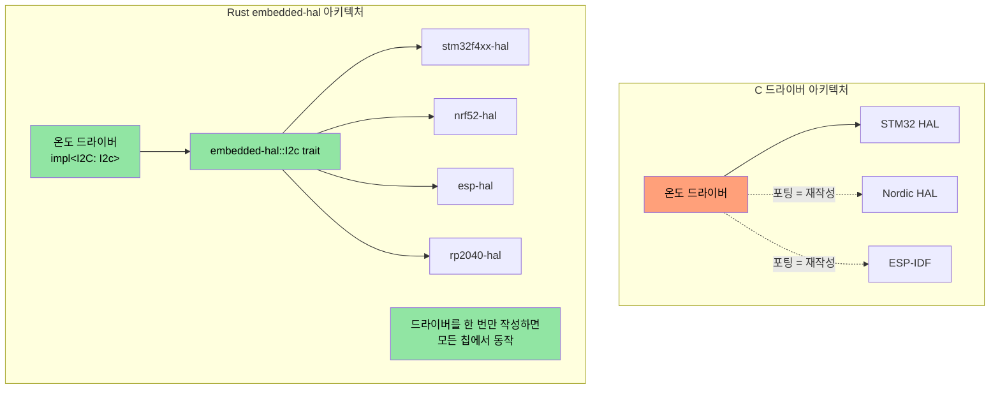
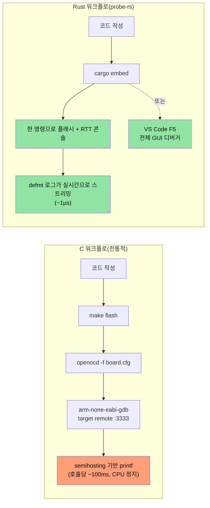

<a id="embedded-deep-dive"></a>
<a id="mmio-and-volatile-register-access"></a>
## MMIO와 volatile 레지스터 접근

> **이 장에서 배우는 것:** 임베디드 Rust에서 하드웨어 레지스터를 타입 안전하게 다루는 방법, 즉 volatile MMIO 패턴, 레지스터 추상화 크레이트, 그리고 C의 `volatile` 키워드만으로는 표현할 수 없는 레지스터 권한을 Rust의 타입 시스템이 어떻게 인코딩하는지 배웁니다.

C 펌웨어에서는 특정 메모리 주소에 대한 `volatile` 포인터를 통해 하드웨어 레지스터에 접근합니다. Rust에도 이에 대응하는 메커니즘이 있지만, 여기에 타입 안전성이 더해집니다.

<a id="c-volatile-vs-rust-volatile"></a>
### C의 `volatile` vs Rust의 volatile 접근

```c
// C - 전형적인 MMIO 레지스터 접근
#define GPIO_BASE     0x40020000
#define GPIO_MODER    (*(volatile uint32_t*)(GPIO_BASE + 0x00))
#define GPIO_ODR      (*(volatile uint32_t*)(GPIO_BASE + 0x14))

void toggle_led(void) {
    GPIO_ODR ^= (1 << 5);  // 5번 핀 토글
}
```

```rust
// Rust - raw volatile (저수준, 직접 쓰는 경우는 드묾)
use core::ptr;

const GPIO_BASE: usize = 0x4002_0000;
const GPIO_ODR: *mut u32 = (GPIO_BASE + 0x14) as *mut u32;

/// # Safety
/// 호출자는 GPIO_BASE가 유효하게 매핑된 주변장치 주소임을 보장해야 한다.
unsafe fn toggle_led() {
    let current = unsafe { ptr::read_volatile(GPIO_ODR) };
    unsafe { ptr::write_volatile(GPIO_ODR, current ^ (1 << 5)) };
}
```

<a id="svd2rust-type-safe-register-access-the-rust-way"></a>
### `svd2rust` - 타입 안전한 레지스터 접근(Rust 방식)

실전에서는 raw volatile 포인터를 **직접 거의 작성하지 않습니다**. 대신 `svd2rust`가 칩의 SVD 파일(IDE 디버그 뷰에서도 쓰는 같은 XML 파일)로부터 **PAC(Peripheral Access Crate)** 를 생성합니다.

```rust
// 생성된 PAC 코드(svd2rust가 만들어 준다 - 직접 작성하지 않음)
// PAC 덕분에 잘못된 레지스터 접근은 컴파일 에러가 된다

// PAC 사용 예:
use stm32f4::stm32f401;  // 대상 칩용 PAC 크레이트

fn configure_gpio(dp: stm32f401::Peripherals) {
    // GPIOA 클록 활성화 - 타입 안전, 매직 넘버 없음
    dp.RCC.ahb1enr.modify(|_, w| w.gpioaen().enabled());

    // 5번 핀을 출력으로 설정 - 읽기 전용 필드에 실수로 쓸 수 없음
    dp.GPIOA.moder.modify(|_, w| w.moder5().output());

    // 5번 핀 토글 - 필드 접근도 타입 검사됨
    dp.GPIOA.odr.modify(|r, w| {
        unsafe { w.bits(r.bits() ^ (1 << 5)) }
    });
}
```

| C 레지스터 접근 | Rust PAC 대응 |
|-------------------|---------------------|
| `#define REG (*(volatile uint32_t*)ADDR)` | `svd2rust`가 생성한 PAC 크레이트 |
| `REG |= BITMASK;` | `periph.reg.modify(\|_, w\| w.field().variant())` |
| `value = REG;` | `let val = periph.reg.read().field().bits()` |
| 잘못된 레지스터 필드 -> 조용한 UB | 컴파일 에러 - 그런 필드가 없음 |
| 잘못된 레지스터 폭 -> 조용한 UB | 타입 검사 - `u8` vs `u16` vs `u32` |

<a id="interrupt-handling-and-critical-sections"></a>
## 인터럽트 처리와 임계 구역

C 펌웨어에서는 `__disable_irq()` / `__enable_irq()`와 `void` 시그니처 ISR 함수를 사용합니다. Rust는 이에 대한 타입 안전한 대응 수단을 제공합니다.

<a id="c-vs-rust-interrupt-patterns"></a>
### C vs Rust: 인터럽트 패턴

```c
// C - 전통적인 인터럽트 핸들러
volatile uint32_t tick_count = 0;

void SysTick_Handler(void) {   // 이름 규약이 매우 중요하다 - 틀리면 HardFault
    tick_count++;
}

uint32_t get_ticks(void) {
    __disable_irq();
    uint32_t t = tick_count;   // 임계 구역 안에서 읽기
    __enable_irq();
    return t;
}
```

```rust
// Rust - cortex-m과 critical section 사용
use core::cell::Cell;
use cortex_m::interrupt::{self, Mutex};

// 임계 구역 Mutex로 보호되는 공유 상태
static TICK_COUNT: Mutex<Cell<u32>> = Mutex::new(Cell::new(0));

#[cortex_m_rt::exception]     // 올바른 벡터 테이블 위치를 보장하는 속성
fn SysTick() {                // 유효한 예외 이름이 아니면 컴파일 에러
    interrupt::free(|cs| {    // cs = 임계 구역 토큰(IRQ가 비활성화됐다는 증명)
        let count = TICK_COUNT.borrow(cs).get();
        TICK_COUNT.borrow(cs).set(count + 1);
    });
}

fn get_ticks() -> u32 {
    interrupt::free(|cs| TICK_COUNT.borrow(cs).get())
}
```

<a id="rtic-real-time-interrupt-driven-concurrency"></a>
### RTIC - 실시간 인터럽트 기반 동시성

인터럽트 우선순위가 여러 개인 복잡한 펌웨어에서는 RTIC(구 RTFM)이 **제로 오버헤드의 컴파일 타임 태스크 스케줄링**을 제공합니다.

```rust
#[rtic::app(device = stm32f4xx_hal::pac, dispatchers = [USART1])]
mod app {
    use stm32f4xx_hal::prelude::*;

    #[shared]
    struct Shared {
        temperature: f32,   // 태스크 간 공유 상태 - RTIC가 락을 관리함
    }

    #[local]
    struct Local {
        led: stm32f4xx_hal::gpio::Pin<'A', 5, stm32f4xx_hal::gpio::Output>,
    }

    #[init]
    fn init(cx: init::Context) -> (Shared, Local) {
        let dp = cx.device;
        let gpioa = dp.GPIOA.split();
        let led = gpioa.pa5.into_push_pull_output();
        (Shared { temperature: 25.0 }, Local { led })
    }

    // 하드웨어 태스크: SysTick 인터럽트에서 실행
    #[task(binds = SysTick, shared = [temperature], local = [led])]
    fn tick(mut cx: tick::Context) {
        cx.local.led.toggle();
        cx.shared.temperature.lock(|temp| {
            // 여기서는 RTIC가 배타적 접근을 보장한다 - 수동 락 불필요
            *temp += 0.1;
        });
    }
}
```

**C 펌웨어 개발자에게 RTIC가 중요한 이유:**
- `#[shared]` 애너테이션이 수동 mutex 관리 코드를 대체합니다.
- 우선순위 기반 선점은 컴파일 타임에 구성되므로 런타임 오버헤드가 없습니다.
- 구조적으로 데드락이 발생하지 않습니다(프레임워크가 컴파일 타임에 증명).
- ISR 이름 실수는 런타임 HardFault가 아니라 컴파일 에러가 됩니다.

<a id="panic-handler-strategies"></a>
## panic handler 전략

C에서는 펌웨어에서 문제가 생기면 보통 리셋하거나 LED를 깜빡입니다. Rust의 panic handler는 이 동작을 구조적으로 제어하게 해 줍니다.

```rust
// 전략 1: Halt(디버깅용 - 디버거를 붙여 상태를 조사)
use panic_halt as _;  // panic 시 무한 루프

// 전략 2: MCU 리셋
use panic_reset as _;  // 시스템 리셋 트리거

// 전략 3: 프로브로 로그 전송(개발용)
use panic_probe as _;  // 디버그 프로브로 panic 정보 전송(defmt와 함께)

// 전략 4: defmt로 로그를 남긴 뒤 halt
use defmt_panic as _;  // ITM/RTT로 풍부한 panic 메시지 전송

// 전략 5: 커스텀 핸들러(프로덕션 펌웨어)
use core::panic::PanicInfo;

#[panic_handler]
fn panic(info: &PanicInfo) -> ! {
    // 1. 추가 손상을 막기 위해 인터럽트 비활성화
    cortex_m::interrupt::disable();

    // 2. panic 정보를 예약된 RAM 영역에 기록(리셋 후에도 유지)
    // Safety: PANIC_LOG는 링커 스크립트에 정의된 예약 메모리 영역이다
    unsafe {
        let log = 0x2000_0000 as *mut [u8; 256];
        // 잘린 panic 메시지 기록
        use core::fmt::Write;
        let mut writer = FixedWriter::new(&mut *log);
        let _ = write!(writer, "{}", info);
    }

    // 3. watchdog 리셋 트리거(또는 에러 LED 점멸)
    loop {
        cortex_m::asm::wfi();  // 인터럽트를 기다림(멈춘 동안 저전력)
    }
}
```

<a id="linker-scripts-and-memory-layout"></a>
## 링커 스크립트와 메모리 레이아웃

C 펌웨어 개발자는 FLASH/RAM 영역을 정의하기 위해 링커 스크립트를 작성합니다. Rust 임베디드에서도 같은 개념을 `memory.x`로 사용합니다.

```ld
/* memory.x - 크레이트 루트에 두고, cortex-m-rt가 사용 */
MEMORY
{
  /* MCU에 맞게 조정 - 아래 값은 STM32F401 예시 */
  FLASH : ORIGIN = 0x08000000, LENGTH = 512K
  RAM   : ORIGIN = 0x20000000, LENGTH = 96K
}

/* 선택 사항: panic 로그용 공간 예약(위 panic handler 참고) */
_panic_log_start = ORIGIN(RAM);
_panic_log_size  = 256;
```

```toml
# .cargo/config.toml - 타깃과 링커 플래그 설정
[target.thumbv7em-none-eabihf]
runner = "probe-rs run --chip STM32F401RE"  # 디버그 프로브로 플래시 후 실행
rustflags = [
    "-C", "link-arg=-Tlink.x",              # cortex-m-rt 링커 스크립트
]

[build]
target = "thumbv7em-none-eabihf"            # 하드웨어 FPU가 있는 Cortex-M4F
```

| C 링커 스크립트 | Rust 대응 |
|-----------------|-----------------|
| `MEMORY { FLASH ..., RAM ... }` | 크레이트 루트의 `memory.x` |
| `__attribute__((section(".data")))` | `#[link_section = ".data"]` |
| Makefile의 `-T linker.ld` | `.cargo/config.toml`의 `-C link-arg=-Tlink.x` |
| `__bss_start__`, `__bss_end__` | `cortex-m-rt`가 자동 처리 |
| 시작 어셈블리(`startup.s`) | `cortex-m-rt`의 `#[entry]` 매크로 |

<a id="writing-embedded-hal-drivers"></a>
## `embedded-hal` 드라이버 작성하기

`embedded-hal` 크레이트는 SPI, I2C, GPIO, UART 등의 트레잇을 정의합니다. 이 트레잇에 맞춰 작성한 드라이버는 **어떤 MCU에서든** 동작합니다. 이것이 임베디드 재사용 측면에서 Rust의 결정적 장점입니다.

<a id="c-vs-rust-a-temperature-sensor-driver"></a>
### C vs Rust: 온도 센서 드라이버

```c
// C - STM32 HAL에 강하게 결합된 드라이버
#include "stm32f4xx_hal.h"

float read_temperature(I2C_HandleTypeDef* hi2c, uint8_t addr) {
    uint8_t buf[2];
    HAL_I2C_Mem_Read(hi2c, addr << 1, 0x00, I2C_MEMADD_SIZE_8BIT,
                     buf, 2, HAL_MAX_DELAY);
    int16_t raw = ((int16_t)buf[0] << 4) | (buf[1] >> 4);
    return raw * 0.0625;
}
// 문제: 이 드라이버는 STM32 HAL에서만 동작한다. Nordic으로 포팅하려면 다시 작성해야 한다.
```

```rust
// Rust - embedded-hal을 구현한 어떤 MCU에서도 동작하는 드라이버
use embedded_hal::i2c::I2c;

pub struct Tmp102<I2C> {
    i2c: I2C,
    address: u8,
}

impl<I2C: I2c> Tmp102<I2C> {
    pub fn new(i2c: I2C, address: u8) -> Self {
        Self { i2c, address }
    }

    pub fn read_temperature(&mut self) -> Result<f32, I2C::Error> {
        let mut buf = [0u8; 2];
        self.i2c.write_read(self.address, &[0x00], &mut buf)?;
        let raw = ((buf[0] as i16) << 4) | ((buf[1] as i16) >> 4);
        Ok(raw as f32 * 0.0625)
    }
}

// STM32, Nordic nRF, ESP32, RP2040 등 embedded-hal I2C 구현이 있는 어떤 칩에서도 동작
```



<a id="global-allocator-setup"></a>
## 전역 할당자 설정

`alloc` 크레이트는 `Vec`, `String`, `Box`를 제공하지만, 힙 메모리를 어디서 가져올지 Rust에 알려 줘야 합니다. 이는 플랫폼별 `malloc()`을 구현하는 것과 대응됩니다.

```rust
#![no_std]
extern crate alloc;

use alloc::vec::Vec;
use alloc::string::String;
use embedded_alloc::LlffHeap as Heap;

#[global_allocator]
static HEAP: Heap = Heap::empty();

#[cortex_m_rt::entry]
fn main() -> ! {
    // 메모리 영역으로 할당자 초기화
    // (보통 스택이나 정적 데이터가 쓰지 않는 RAM 일부)
    {
        const HEAP_SIZE: usize = 4096;
        static mut HEAP_MEM: [u8; HEAP_SIZE] = [0; HEAP_SIZE];
        // Safety: HEAP_MEM은 초기화 단계에서, 어떤 할당보다 먼저 여기서만 접근된다
        unsafe { HEAP.init(HEAP_MEM.as_ptr() as usize, HEAP_SIZE) }
    }

    // 이제 힙 타입을 사용할 수 있다!
    let mut log_buffer: Vec<u8> = Vec::with_capacity(256);
    let name: String = String::from("sensor_01");
    // ...

    loop {}
}
```

| C 힙 설정 | Rust 대응 |
|-------------|-----------------|
| `_sbrk()` / 커스텀 `malloc()` | `#[global_allocator]` + `Heap::init()` |
| `configTOTAL_HEAP_SIZE` (FreeRTOS) | `HEAP_SIZE` 상수 |
| `pvPortMalloc()` | `alloc::vec::Vec::new()` - 자동 |
| 힙 고갈 -> 정의되지 않은 동작 | `alloc_error_handler` -> 제어된 panic |

<a id="mixed-no_std-std-workspaces"></a>
## `no_std` + `std` 혼합 워크스페이스

실제 프로젝트(예: 큰 Rust 워크스페이스)에서는 흔히 다음 구성을 봅니다.
- 하드웨어 이식 가능한 로직을 담은 `no_std` 라이브러리 크레이트
- Linux 애플리케이션 계층을 담당하는 `std` 바이너리 크레이트

```text
workspace_root/
├── Cargo.toml              # [workspace] members = [...]
├── protocol/               # no_std - 와이어 프로토콜, 파싱
│   ├── Cargo.toml          # default-features 없음, std 없음
│   └── src/lib.rs          # #![no_std]
├── driver/                 # no_std - 하드웨어 추상화
│   ├── Cargo.toml
│   └── src/lib.rs          # #![no_std], embedded-hal 트레잇 사용
├── firmware/               # no_std - MCU 바이너리
│   ├── Cargo.toml          # protocol, driver에 의존
│   └── src/main.rs         # #![no_std] #![no_main]
└── host_tool/              # std - Linux CLI 도구
    ├── Cargo.toml          # protocol에 의존(같은 크레이트!)
    └── src/main.rs         # std::fs, std::net 등 사용
```

핵심 패턴은 이렇습니다. `protocol` 크레이트가 `#![no_std]`를 사용하므로 MCU 펌웨어와 Linux 호스트 도구 **둘 다**에서 컴파일됩니다. 코드는 공유되고, 중복은 없습니다.

```toml
# protocol/Cargo.toml
[package]
name = "protocol"

[features]
default = []
std = []  # 호스트 빌드 시 std 전용 기능을 켜는 선택적 기능 플래그

[dependencies]
serde = { version = "1", default-features = false, features = ["derive"] }
# 참고: default-features = false로 serde의 std 의존성을 제거
```

```rust
// protocol/src/lib.rs
#![cfg_attr(not(feature = "std"), no_std)]

#[cfg(feature = "std")]
extern crate std;

extern crate alloc;
use alloc::vec::Vec;
use serde::{Serialize, Deserialize};

#[derive(Debug, Serialize, Deserialize)]
pub struct DiagPacket {
    pub sensor_id: u16,
    pub value: i32,
    pub fault_code: u16,
}

// 이 함수는 no_std와 std 환경 양쪽에서 동작한다
pub fn parse_packet(data: &[u8]) -> Result<DiagPacket, &'static str> {
    if data.len() < 8 {
        return Err("packet too short");
    }
    Ok(DiagPacket {
        sensor_id: u16::from_le_bytes([data[0], data[1]]),
        value: i32::from_le_bytes([data[2], data[3], data[4], data[5]]),
        fault_code: u16::from_le_bytes([data[6], data[7]]),
    })
}
```

<a id="exercise-hardware-abstraction-layer-driver"></a>
## 연습문제: 하드웨어 추상화 계층 드라이버

SPI로 통신하는 가상의 LED 컨트롤러를 위한 `no_std` 드라이버를 작성해 보세요. 드라이버는 `embedded-hal`을 사용하는 어떤 SPI 구현에도 제네릭해야 합니다.

**요구 사항:**
1. `LedController<SPI>` struct를 정의한다
2. `new()`, `set_brightness(led: u8, brightness: u8)`, `all_off()`를 구현한다
3. SPI 프로토콜: `[led_index, brightness_value]`를 2바이트 트랜잭션으로 전송한다
4. mock SPI 구현으로 테스트를 작성한다

```rust
// 시작 코드
#![no_std]
use embedded_hal::spi::SpiDevice;

pub struct LedController<SPI> {
    spi: SPI,
    num_leds: u8,
}

// TODO: new(), set_brightness(), all_off() 구현
// TODO: 테스트용 MockSpi 작성
```

<details><summary>해답 (클릭하여 펼치기)</summary>

```rust
#![no_std]
use embedded_hal::spi::SpiDevice;

pub struct LedController<SPI> {
    spi: SPI,
    num_leds: u8,
}

impl<SPI: SpiDevice> LedController<SPI> {
    pub fn new(spi: SPI, num_leds: u8) -> Self {
        Self { spi, num_leds }
    }

    pub fn set_brightness(&mut self, led: u8, brightness: u8) -> Result<(), SPI::Error> {
        if led >= self.num_leds {
            return Ok(()); // 범위를 벗어난 LED는 조용히 무시
        }
        self.spi.write(&[led, brightness])
    }

    pub fn all_off(&mut self) -> Result<(), SPI::Error> {
        for led in 0..self.num_leds {
            self.spi.write(&[led, 0])?;
        }
        Ok(())
    }
}

#[cfg(test)]
mod tests {
    use super::*;

    // 모든 트랜잭션을 기록하는 Mock SPI
    struct MockSpi {
        transactions: Vec<Vec<u8>>,
    }

    // mock용 최소 에러 타입
    #[derive(Debug)]
    struct MockError;
    impl embedded_hal::spi::Error for MockError {
        fn kind(&self) -> embedded_hal::spi::ErrorKind {
            embedded_hal::spi::ErrorKind::Other
        }
    }

    impl embedded_hal::spi::ErrorType for MockSpi {
        type Error = MockError;
    }

    impl SpiDevice for MockSpi {
        fn write(&mut self, buf: &[u8]) -> Result<(), Self::Error> {
            self.transactions.push(buf.to_vec());
            Ok(())
        }
        fn read(&mut self, _buf: &mut [u8]) -> Result<(), Self::Error> { Ok(()) }
        fn transfer(&mut self, _r: &mut [u8], _w: &[u8]) -> Result<(), Self::Error> { Ok(()) }
        fn transfer_in_place(&mut self, _buf: &mut [u8]) -> Result<(), Self::Error> { Ok(()) }
        fn transaction(&mut self, _ops: &mut [embedded_hal::spi::Operation<'_, u8>]) -> Result<(), Self::Error> { Ok(()) }
    }

    #[test]
    fn test_set_brightness() {
        let mock = MockSpi { transactions: vec![] };
        let mut ctrl = LedController::new(mock, 4);
        ctrl.set_brightness(2, 128).unwrap();
        assert_eq!(ctrl.spi.transactions, vec![vec![2, 128]]);
    }

    #[test]
    fn test_all_off() {
        let mock = MockSpi { transactions: vec![] };
        let mut ctrl = LedController::new(mock, 3);
        ctrl.all_off().unwrap();
        assert_eq!(ctrl.spi.transactions, vec![
            vec![0, 0], vec![1, 0], vec![2, 0],
        ]);
    }

    #[test]
    fn test_out_of_range_led() {
        let mock = MockSpi { transactions: vec![] };
        let mut ctrl = LedController::new(mock, 2);
        ctrl.set_brightness(5, 255).unwrap(); // 범위 밖 - 무시됨
        assert!(ctrl.spi.transactions.is_empty());
    }
}
```

</details>

<a id="debugging-embedded-rust-probe-rs-defmt-and-vs-code"></a>
## 임베디드 Rust 디버깅 - `probe-rs`, `defmt`, VS Code

C 펌웨어 개발자는 보통 OpenOCD + GDB나 벤더 전용 IDE(Keil, IAR, Segger Ozone)로 디버깅합니다. Rust 임베디드 생태계는 **probe-rs**를 공통 디버그 프로브 인터페이스로 수렴했고, OpenOCD + GDB 스택을 Rust 네이티브 단일 도구로 대체하고 있습니다.

<a id="probe-rs-the-all-in-one-debug-probe-tool"></a>
### `probe-rs` - 올인원 디버그 프로브 도구

`probe-rs`는 OpenOCD + GDB 조합을 대체합니다. CMSIS-DAP, ST-Link, J-Link 등 다양한 디버그 프로브를 바로 지원합니다.

```bash
# probe-rs 설치(cargo-flash와 cargo-embed 포함)
cargo install probe-rs-tools

# 펌웨어 플래시 후 실행
cargo flash --chip STM32F401RE --release

# 플래시, 실행, RTT(Real-Time Transfer) 콘솔 열기
cargo embed --chip STM32F401RE
```

**`probe-rs` vs OpenOCD + GDB**:

| 항목 | OpenOCD + GDB | `probe-rs` |
|--------|--------------|----------|
| 설치 | 패키지 2개 + 스크립트 | `cargo install probe-rs-tools` |
| 설정 | 보드/프로브별 `.cfg` 파일 | `--chip` 플래그 또는 `Embed.toml` |
| 콘솔 출력 | Semihosting(매우 느림) | RTT(~10배 빠름) |
| 로깅 프레임워크 | `printf` | `defmt`(구조화, zero-cost) |
| 플래시 알고리즘 | XML pack 파일 | 1000개 이상 칩 내장 지원 |
| GDB 지원 | 기본 제공 | `probe-rs gdb` 어댑터 |

<a id="embedtoml-project-configuration"></a>
### `Embed.toml` - 프로젝트 설정

`.cfg`와 `.gdbinit` 파일을 따로 관리하는 대신, probe-rs는 단일 설정 파일을 사용합니다.

```toml
# Embed.toml - 프로젝트 루트에 둔다
[default.general]
chip = "STM32F401RETx"

[default.rtt]
enabled = true           # Real-Time Transfer 콘솔 활성화
channels = [
    { up = 0, mode = "BlockIfFull", name = "Terminal" },
]

[default.flashing]
enabled = true           # 실행 전에 플래시
restore_unwritten_bytes = false

[default.reset]
halt_afterwards = false  # 플래시 + 리셋 뒤 바로 실행

[default.gdb]
enabled = false          # true로 바꾸면 :1337에 GDB 서버 노출
gdb_connection_string = "127.0.0.1:1337"
```

```bash
# Embed.toml이 있으면 이렇게만 실행하면 된다:
cargo embed              # 플래시 + RTT 콘솔 - 플래그 불필요
cargo embed --release    # 릴리스 빌드
```

<a id="defmt-deferred-formatting-for-embedded-logging"></a>
### `defmt` - 임베디드 로깅을 위한 지연 포매팅

`defmt`(deferred formatting)는 `printf` 기반 디버깅을 대체합니다. 포맷 문자열은 flash가 아니라 ELF 파일에 저장되고, 타깃의 로그 호출은 인덱스 + 인자 바이트만 전송합니다. 그래서 로깅이 `printf`보다 **10-100배 빠르고** flash 공간도 훨씬 적게 사용합니다.

```rust
#![no_std]
#![no_main]

use defmt::{info, warn, error, debug, trace};
use defmt_rtt as _; // RTT 전송 계층 - defmt 출력을 probe-rs에 연결

#[cortex_m_rt::entry]
fn main() -> ! {
    info!("Boot complete, firmware v{}", env!("CARGO_PKG_VERSION"));

    let sensor_id: u16 = 0x4A;
    let temperature: f32 = 23.5;

    // 포맷 문자열은 flash가 아니라 ELF에 남는다 - 오버헤드가 거의 없음
    debug!("Sensor {:#06X}: {:.1}°C", sensor_id, temperature);

    if temperature > 80.0 {
        warn!("Overtemp on sensor {:#06X}: {:.1}°C", sensor_id, temperature);
    }

    loop {
        cortex_m::asm::wfi(); // 인터럽트를 기다림
    }
}

// 커스텀 타입 - Debug 대신 defmt::Format derive 사용
#[derive(defmt::Format)]
struct SensorReading {
    id: u16,
    value: i32,
    status: SensorStatus,
}

#[derive(defmt::Format)]
enum SensorStatus {
    Ok,
    Warning,
    Fault(u8),
}

// 사용 예:
// info!("Reading: {:?}", reading);  // <-- std Debug가 아니라 defmt::Format 사용
```

**`defmt` vs `printf` vs `log`**:

| 항목 | C `printf` (semihosting) | Rust `log` 크레이트 | `defmt` |
|---------|-------------------------|-------------------|---------|
| 속도 | 호출당 ~100ms | N/A (`std` 필요) | 호출당 ~1μs |
| flash 사용량 | 전체 포맷 문자열 | 전체 포맷 문자열 | 인덱스만(바이트 수준) |
| 전송 방식 | Semihosting(CPU 정지) | Serial/UART | RTT(논블로킹) |
| 구조화 출력 | 없음 | 텍스트만 | 타입 정보가 있는 바이너리 인코딩 |
| `no_std` | Semihosting 경유 | 파사드만 제공(백엔드는 `std` 필요) | ✅ 네이티브 |
| 필터 레벨 | 수동 `#ifdef` | `RUST_LOG=debug` | `defmt::println` + features |

<a id="vs-code-debug-configuration"></a>
### VS Code 디버그 설정

`probe-rs` VS Code 확장을 사용하면 브레이크포인트, 변수 조회, 콜 스택, 레지스터 뷰를 포함한 완전한 그래픽 디버깅을 사용할 수 있습니다.

```jsonc
// .vscode/launch.json
{
    "version": "0.2.0",
    "configurations": [
        {
            "type": "probe-rs-debug",
            "request": "launch",
            "name": "Flash & Debug (probe-rs)",
            "chip": "STM32F401RETx",
            "coreConfigs": [
                {
                    "programBinary": "target/thumbv7em-none-eabihf/debug/${workspaceFolderBasename}",
                    "rttEnabled": true,
                    "rttChannelFormats": [
                        {
                            "channelNumber": 0,
                            "dataFormat": "Defmt",
                            "showTimestamps": true
                        }
                    ]
                }
            ],
            "connectUnderReset": true,
            "speed": 4000
        }
    ]
}
```

확장 설치:
```rust
ext install probe-rs.probe-rs-debugger
```

<a id="c-debugger-workflow-vs-rust-embedded-debugging"></a>
### C 디버거 워크플로 vs Rust 임베디드 디버깅



| C 디버그 동작 | Rust 대응 |
|---------------|-----------------|
| `openocd -f board/st_nucleo_f4.cfg` | `probe-rs info` (프로브 + 칩 자동 감지) |
| `arm-none-eabi-gdb -x .gdbinit` | `probe-rs gdb --chip STM32F401RE` |
| `target remote :3333` | GDB가 `localhost:1337`에 연결 |
| `monitor reset halt` | `probe-rs reset --chip ...` |
| `load firmware.elf` | `cargo flash --chip ...` |
| `printf("debug: %d\n", val)` (semihosting) | `defmt::info!("debug: {}", val)` (RTT) |
| Keil/IAR GUI 디버거 | VS Code + `probe-rs-debugger` 확장 |
| Segger SystemView | `defmt` + `probe-rs` RTT 뷰어 |

> **교차 참조:** 임베디드 드라이버에서 쓰는 고급 unsafe 패턴
> (pin projection, 커스텀 arena/slab allocator)은 *Rust Patterns* 가이드의
> "Pin Projections — Structural Pinning" 및
> "Custom Allocators — Arena and Slab Patterns" 섹션을 참고하세요.

---
