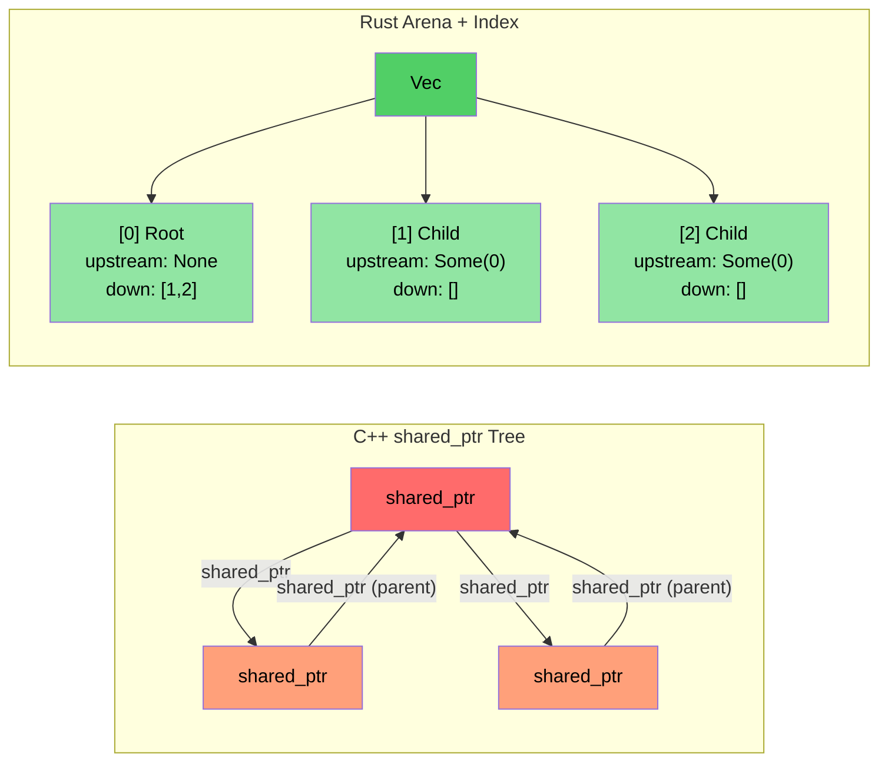

<a id="case-study-overview-c-to-rust-translation"></a>
# 사례 연구 개요: C++를 Rust로 옮기기

> **이 장에서 배우는 것:** 약 10만 줄의 C++를 약 20개 크레이트, 9만 줄 규모의 Rust로 옮긴 실제 프로젝트에서 얻은 교훈을 살펴봅니다. 다섯 가지 핵심 변환 패턴과, 그 뒤에 있는 아키텍처 선택을 정리합니다.

- 우리는 대규모 C++ 진단 시스템(약 10만 줄의 C++)을 Rust 구현(약 20개 Rust 크레이트, 약 9만 줄)으로 번역했습니다.
- 이 절에서는 **실제로 사용한 패턴**을 보여줍니다. 장난감 예제가 아니라, 실제 프로덕션 코드에서 나온 패턴입니다.
- 핵심 변환 다섯 가지는 다음과 같습니다:

| **#** | **C++ 패턴** | **Rust 패턴** | **효과** |
|-------|----------------|-----------------|-----------|
| 1 | 클래스 계층 + `dynamic_cast` | enum 디스패치 + `match` | `dynamic_cast` 약 400회 → 0회 |
| 2 | `shared_ptr` / `enable_shared_from_this` 트리 | arena + 인덱스 연결 | 참조 사이클 없음 |
| 3 | 모든 모듈에 있는 `Framework*` raw pointer | 라이프타임 대여를 사용하는 `DiagContext<'a>` | 컴파일 시점 유효성 보장 |
| 4 | God object | 조합 가능한 상태 구조체 | 테스트 가능, 모듈화 용이 |
| 5 | 어디에나 쓰인 `vector<unique_ptr<Base>>` | 꼭 필요한 곳에만 trait object(약 25회) | 기본은 정적 디스패치 |

<a id="before-and-after-metrics"></a>
### 전후 비교 지표

| **지표** | **C++ (원본)** | **Rust (재작성)** |
|------------|---------------------|------------------------|
| `dynamic_cast` / 타입 다운캐스트 | 약 400회 | 0 |
| `virtual` / `override` 메서드 | 약 900개 | 약 25개 (`Box<dyn Trait>`) |
| raw `new` 할당 | 약 200회 | 0 (모든 타입이 소유권 가짐) |
| `shared_ptr` / 참조 카운팅 | 약 10회 (토폴로지 라이브러리) | 0 (`Arc`는 FFI 경계에서만 사용) |
| `enum class` 정의 | 약 60개 | 약 190개 `pub enum` |
| 패턴 매칭 표현식 | 해당 없음 | 약 750개 `match` |
| God object(5K줄 초과) | 2개 | 0 |

----

<a id="case-study-1-inheritance-hierarchy--enum-dispatch"></a>
# 사례 연구 1: 상속 계층 → enum 디스패치

<a id="the-c-pattern-event-class-hierarchy"></a>
## C++ 패턴: 이벤트 클래스 계층
```cpp
// C++ 원본: 모든 GPU 이벤트 타입은 GpuEventBase를 상속하는 클래스다
class GpuEventBase {
public:
    virtual ~GpuEventBase() = default;
    virtual void Process(DiagFramework* fw) = 0;
    uint16_t m_recordId;
    uint8_t  m_sensorType;
    // ... 공통 필드
};

class GpuPcieDegradeEvent : public GpuEventBase {
public:
    void Process(DiagFramework* fw) override;
    uint8_t m_linkSpeed;
    uint8_t m_linkWidth;
};

class GpuPcieFatalEvent : public GpuEventBase { /* ... */ };
class GpuBootEvent : public GpuEventBase { /* ... */ };
// ... GpuEventBase를 상속하는 이벤트 클래스가 10개 이상 존재

// 처리하려면 dynamic_cast가 필요하다:
void ProcessEvents(std::vector<std::unique_ptr<GpuEventBase>>& events,
                   DiagFramework* fw) {
    for (auto& event : events) {
        if (auto* degrade = dynamic_cast<GpuPcieDegradeEvent*>(event.get())) {
            // degrade 처리...
        } else if (auto* fatal = dynamic_cast<GpuPcieFatalEvent*>(event.get())) {
            // fatal 처리...
        }
        // ... 분기가 10개 더 있음
    }
}
```

<a id="the-rust-solution-enum-dispatch"></a>
## Rust 해법: enum 디스패치
```rust
// 예시: types.rs — 상속도 없고, vtable도 없고, dynamic_cast도 없다
#[derive(Debug, Clone, PartialEq, Eq, Serialize, Deserialize)]
pub enum GpuEventKind {
    PcieDegrade,
    PcieFatal,
    PcieUncorr,
    Boot,
    BaseboardState,
    EccError,
    OverTemp,
    PowerRail,
    ErotStatus,
    Unknown,
}
```

```rust
// 예시: manager.rs — 타입별로 분리된 Vec, 다운캐스팅이 전혀 필요 없다
pub struct GpuEventManager {
    sku: SkuVariant,
    degrade_events: Vec<GpuPcieDegradeEvent>,   // Box<dyn>이 아닌 구체 타입
    fatal_events: Vec<GpuPcieFatalEvent>,
    uncorr_events: Vec<GpuPcieUncorrEvent>,
    boot_events: Vec<GpuBootEvent>,
    baseboard_events: Vec<GpuBaseboardEvent>,
    ecc_events: Vec<GpuEccEvent>,
    // ... 각 이벤트 타입이 자기 전용 Vec를 가진다
}

// 접근자는 타입이 지정된 슬라이스를 반환한다 — 모호함이 전혀 없다
impl GpuEventManager {
    pub fn degrade_events(&self) -> &[GpuPcieDegradeEvent] {
        &self.degrade_events
    }
    pub fn fatal_events(&self) -> &[GpuPcieFatalEvent] {
        &self.fatal_events
    }
}
```

<a id="why-not-vecboxdyn-gpuevent"></a>
### 왜 `Vec<Box<dyn GpuEvent>>`가 아닌가?
- **잘못된 접근**(직역): 모든 이벤트를 하나의 이종 컬렉션에 넣고 다운캐스트한다. 이것이 C++의 `vector<unique_ptr<Base>>`가 하는 일입니다.
- **올바른 접근**: 타입별로 분리된 Vec를 사용하면 다운캐스팅이 **완전히** 사라집니다. 각 소비자는 자신이 필요한 이벤트 타입만 정확히 요청합니다.
- **성능**: 분리된 Vec는 캐시 지역성도 더 좋습니다(모든 degrade 이벤트가 메모리에서 연속적임).

----

<a id="case-study-2-shared_ptr-tree--arenaindex-pattern"></a>
# 사례 연구 2: `shared_ptr` 트리 → arena/index 패턴

<a id="the-c-pattern-reference-counted-tree"></a>
## C++ 패턴: 참조 카운트 트리
```cpp
// C++ 토폴로지 라이브러리: PcieDevice는 enable_shared_from_this 를 쓴다
// 부모와 자식 노드가 서로를 참조해야 하기 때문이다
class PcieDevice : public std::enable_shared_from_this<PcieDevice> {
public:
    std::shared_ptr<PcieDevice> m_upstream;
    std::vector<std::shared_ptr<PcieDevice>> m_downstream;
    // ... 디바이스 데이터
    
    void AddChild(std::shared_ptr<PcieDevice> child) {
        child->m_upstream = shared_from_this();  // 부모 ↔ 자식 사이클!
        m_downstream.push_back(child);
    }
};
// 문제: parent→child 와 child→parent 가 참조 사이클을 만든다
// 사이클을 끊으려면 weak_ptr가 필요하지만, 빠뜨리기 쉽다
```

<a id="the-rust-solution-arena-with-index-linkage"></a>
## Rust 해법: 인덱스 연결을 사용하는 arena
```rust
// 예시: components.rs — 평평한 Vec 하나가 모든 디바이스를 소유한다
pub struct PcieDevice {
    pub base: PcieDeviceBase,
    pub kind: PcieDeviceKind,

    // 인덱스로 트리를 연결한다 — 참조 카운팅도 없고, 사이클도 없다
    pub upstream_idx: Option<usize>,      // arena Vec 안의 인덱스
    pub downstream_idxs: Vec<usize>,      // arena Vec 안의 인덱스들
}

// "arena"는 단순히 트리가 소유하는 Vec<PcieDevice> 하나다:
pub struct DeviceTree {
    devices: Vec<PcieDevice>,  // 평평한 소유권 — 하나의 Vec가 모든 것을 소유
}

impl DeviceTree {
    pub fn parent(&self, device_idx: usize) -> Option<&PcieDevice> {
        self.devices[device_idx].upstream_idx
            .map(|idx| &self.devices[idx])
    }
    
    pub fn children(&self, device_idx: usize) -> Vec<&PcieDevice> {
        self.devices[device_idx].downstream_idxs
            .iter()
            .map(|&idx| &self.devices[idx])
            .collect()
    }
}
```

<a id="key-insight"></a>
### 핵심 통찰
- **`shared_ptr`도, `weak_ptr`도, `enable_shared_from_this`도 필요 없습니다**
- **참조 사이클이 생길 수 없습니다**. 인덱스는 그저 `usize` 값일 뿐입니다.
- **캐시 성능이 더 좋습니다**. 모든 디바이스가 연속된 메모리에 놓입니다.
- **추론이 더 단순합니다**. 소유자는 하나(Vec), 바라보는 쪽은 여럿(인덱스)입니다.



----
