# C# 개발자를 위한 Rust 트레이닝

C# 경험이 있는 개발자를 위해 Rust를 배우는 종합 가이드로, 두 언어 사이의 개념적 전환과 실무적인 차이에 초점을 둡니다.

## 목차

### 1. 소개와 철학
- [언어 철학 비교](#language-philosophy-comparison)
- [메모리 관리: GC vs RAII](#memory-management-gc-vs-raii)
- [성능 특성](#performance-characteristics)

### 2. 타입 시스템 차이
- [null 안전성: Nullable&lt;T&gt; vs Option&lt;T&gt;](#null-safety-nullablet-vs-optiont)
- [값 타입 vs 참조 타입 vs 소유권](#value-types-vs-reference-types-vs-ownership)
- [대수적 데이터 타입 vs C# 유니온](#algebraic-data-types-vs-c-unions)
- [완전한 패턴 매칭: 컴파일러 보장 vs 런타임 오류](#exhaustive-pattern-matching-compiler-guarantees-vs-runtime-errors)
- [진짜 불변성 vs 레코드 환상](#true-immutability-vs-record-illusions)
- [메모리 안전성: 런타임 검사 vs 컴파일 타임 증명](#memory-safety-runtime-checks-vs-compile-time-proofs)

### 3. 객체 지향 vs 함수형 패러다임
- [상속 vs 합성](#inheritance-vs-composition)
- [인터페이스 vs 트레잇](#interfaces-vs-traits)
- [가상 메서드 vs 정적 디스패치](#virtual-methods-vs-static-dispatch)
- [sealed 클래스 vs Rust 불변성](#sealed-classes-vs-rust-immutability)

### 4. 에러 처리 철학
- [예외 vs Result&lt;T, E&gt;](#exceptions-vs-resultt-e)
- [try-catch vs 패턴 매칭](#try-catch-vs-pattern-matching)
- [에러 전파 패턴](#error-propagation-patterns)

### 5. 동시성과 안전
- [스레드 안전: 관례 vs 타입 시스템 보장](#thread-safety-convention-vs-type-system-guarantees)
- [async/await 비교](#asyncawait-comparison)
- [데이터 레이스 방지](#data-race-prevention)

### 6. 컬렉션과 이터레이터
- [LINQ vs Rust 이터레이터](#linq-vs-rust-iterators)
- [컬렉션 소유권](#collection-ownership)
- [지연 평가 패턴](#lazy-evaluation-patterns)

### 7. 제네릭과 제약
- [제네릭 제약: where vs 트레잇 바운드](#generic-constraints-where-vs-trait-bounds)
- [제네릭의 가변성](#variance-in-generics)
- [상위 종류 타입(HKT)](#higher-kinded-types)

### 8. 실무 마이그레이션 패턴
- [점진적 도입 전략](#incremental-adoption-strategy)
- [C# → Rust 개념 매핑](#c-to-rust-concept-mapping)
- [팀 도입 일정](#team-adoption-timeline)
- [Rust에서의 흔한 C# 패턴](#common-c-patterns-in-rust)
- [에코시스템 비교](#ecosystem-comparison)
- [테스트와 문서화](#testing-and-documentation)

### 9. 성능과 도입
- [성능 비교: 관리형 vs 네이티브](#performance-comparison-managed-vs-native)
- [언어 선택 기준](#when-to-choose-each-language)

### 10. 고급 주제
- [Unsafe 코드: 언제, 왜](#unsafe-code-when-and-why)
- [상호 운용 고려 사항](#interop-considerations)
- [성능 최적화](#performance-optimization)

### 11. C# 개발자를 위한 모범 사례
- [C# 개발자를 위한 관용적 Rust](#idiomatic-rust-for-c-developers)
- [흔한 실수와 해결](#common-mistakes-and-solutions)
- [C# 개발자에게 유용한 필수 크레이트](#essential-crates-for-c-developers)

***

<a id="language-philosophy-comparison"></a>
## 언어 철학 비교

### C#의 철학
- **생산성 우선**: 풍부한 도구, 방대한 프레임워크, “성공의 구덩이(pit of success)”
- **관리형 런타임**: 가비지 컬렉션이 메모리를 자동 관리
- **엔터프라이즈 지향**: 리플렉션을 동반한 강한 타입, 방대한 표준 라이브러리
- **객체 지향**: 클래스, 상속, 인터페이스가 주요 추상화

### Rust의 철학
- **희생 없는 성능**: 제로 코스트 추상화, 런타임 오버헤드 없음
- **메모리 안전성**: 컴파일 타임 보장으로 크래시와 보안 취약점 예방
- **시스템 프로그래밍**: 고수준 추상화와 함께 하드웨어에 직접 접근
- **함수형 + 시스템**: 기본이 불변, 소유권 기반 자원 관리

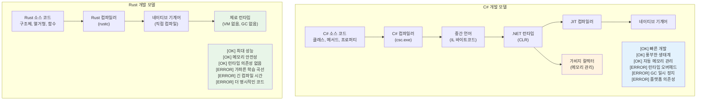

<a id="performance-characteristics"></a>
### 성능 특성

C#(.NET)은 JIT·GC·런타임 메타데이터로 인해 시작 시간과 작업 세트 메모리에 여유가 있고, Rust는 정적 링크된 네이티브 바이너리로 시작·지연 시간 예측이 쉽습니다. 장기 실행 서비스에서는 둘 다 충분히 빠를 수 있지만, GC 일시 정지와 할당 압박이 병목이 될 때 Rust의 결정적 자원 해제와 제로 코스트 추상화 이점이 두드러집니다.

***

<a id="memory-management-gc-vs-raii"></a>
## 메모리 관리: GC vs RAII

### C# 가비지 컬렉션
```csharp
// C# - 자동 메모리 관리
public class Person
{
    public string Name { get; set; }
    public List<string> Hobbies { get; set; } = new List<string>();
    
    public void AddHobby(string hobby)
    {
        Hobbies.Add(hobby);  // 메모리는 자동 할당
    }
    
    // 명시적 정리 불필요 - GC가 처리
    // 다만 리소스는 IDisposable 패턴
}

using var file = new FileStream("data.txt", FileMode.Open);
// 'using'이 Dispose() 호출을 보장
```

### Rust 소유권과 RAII
```rust
// Rust - 컴파일 타임 메모리 관리
pub struct Person {
    name: String,
    hobbies: Vec<String>,
}

impl Person {
    pub fn add_hobby(&mut self, hobby: String) {
        self.hobbies.push(hobby);  // 메모리 관리는 컴파일 타임에 추적
    }
    
    // Drop 트레잇이 자동 구현됨 - 정리가 보장됨
}

// RAII - 자원 획득은 초기화(Resource Acquisition Is Initialization)
{
    let file = std::fs::File::open("data.txt")?;
    // 'file'이 스코프를 벗어나면 파일이 자동으로 닫힘
    // 'using' 문 불필요 - 타입 시스템이 처리
}
```

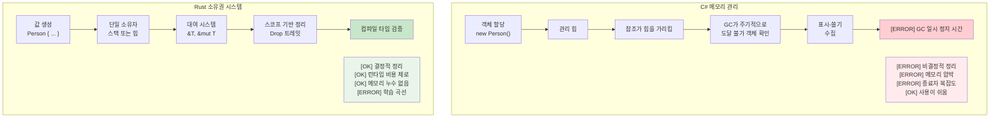

<a id="value-types-vs-reference-types-vs-ownership"></a>
### 값 타입 vs 참조 타입 vs 소유권

C#에서 `struct`는 값 타입, `class`는 참조 타입이며, 힙 할당과 참조 공유가 명시적입니다. Rust에는 `class`/`struct`의 이분법이 없고, **소유권**으로 값이 스택에 있든 힙(`Box` 등)에 있든 “누가 해제할지”가 타입 시스템에 묶입니다. 불변 공유는 `&T`, 단일 가변은 `&mut T`로 모델링해 데이터 레이스를 컴파일 타임에 막습니다.

***

<a id="null-safety-nullablet-vs-optiont"></a>
## null 안전성: Nullable&lt;T&gt; vs Option&lt;T&gt;

### C# null 처리의 변천
```csharp
// C# - 전통적 null 처리 (실수하기 쉬움)
public class User
{
    public string Name { get; set; }  // null일 수 있음!
    public string Email { get; set; } // null일 수 있음!
}

public string GetUserDisplayName(User user)
{
    if (user?.Name != null)  // null 조건 연산자
    {
        return user.Name;
    }
    return "알 수 없는 사용자";
}

// C# 8+ nullable 참조 타입
public class User
{
    public string Name { get; set; }    // 비-null
    public string? Email { get; set; }  // 명시적 nullable
}

// 값 타입용 C# Nullable<T>
int? maybeNumber = GetNumber();
if (maybeNumber.HasValue)
{
    Console.WriteLine(maybeNumber.Value);
}
```

### Rust의 Option&lt;T&gt; 시스템
```rust
// Rust - Option<T>로 명시적 null 처리
#[derive(Debug)]
pub struct User {
    name: String,           // 절대 null 아님
    email: Option<String>,  // 명시적 선택
}

impl User {
    pub fn get_display_name(&self) -> &str {
        &self.name  // null 검사 불필요 - 존재가 보장됨
    }
    
    pub fn get_email_or_default(&self) -> String {
        self.email
            .as_ref()
            .map(|e| e.clone())
            .unwrap_or_else(|| "no-email@example.com".to_string())
    }
}

// 패턴 매칭이 None 분기 처리를 강제
fn handle_optional_user(user: Option<User>) {
    match user {
        Some(u) => println!("사용자: {}", u.get_display_name()),
        None => println!("사용자 없음"),
        // None을 처리하지 않으면 컴파일 에러!
    }
}
```

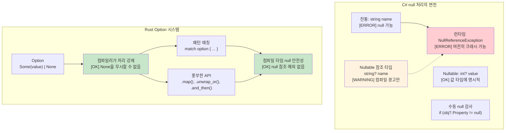

***

<a id="algebraic-data-types-vs-c-unions"></a>
## 대수적 데이터 타입 vs C# 유니온

### C# 판별 유니온 (제한적)
```csharp
// C# - 상속으로 우회하는 제한적 유니온
public abstract class Result
{
    public abstract T Match<T>(Func<Success, T> onSuccess, Func<Error, T> onError);
}

public class Success : Result
{
    public string Value { get; }
    public Success(string value) => Value = value;
    
    public override T Match<T>(Func<Success, T> onSuccess, Func<Error, T> onError)
        => onSuccess(this);
}

public class Error : Result
{
    public string Message { get; }
    public Error(string message) => Message = message;
    
    public override T Match<T>(Func<Success, T> onSuccess, Func<Error, T> onError)
        => onError(this);
}

// C# 9+ 레코드와 패턴 매칭 (더 나음)
public abstract record Shape;
public record Circle(double Radius) : Shape;
public record Rectangle(double Width, double Height) : Shape;

public static double Area(Shape shape) => shape switch
{
    Circle(var radius) => Math.PI * radius * radius,
    Rectangle(var width, var height) => width * height,
    _ => throw new ArgumentException("알 수 없는 도형")  // [ERROR] 런타임 오류 가능
};
```

### Rust 대수적 데이터 타입(열거형)
```rust
// Rust - 완전 패턴 매칭이 있는 진짜 대수적 데이터 타입
#[derive(Debug, Clone)]
pub enum Result<T, E> {
    Ok(T),
    Err(E),
}

#[derive(Debug, Clone)]
pub enum Shape {
    Circle { radius: f64 },
    Rectangle { width: f64, height: f64 },
    Triangle { base: f64, height: f64 },
}

impl Shape {
    pub fn area(&self) -> f64 {
        match self {
            Shape::Circle { radius } => std::f64::consts::PI * radius * radius,
            Shape::Rectangle { width, height } => width * height,
            Shape::Triangle { base, height } => 0.5 * base * height,
            // [OK] 변형이 하나라도 빠지면 컴파일 에러!
        }
    }
}

// 고급: 열거형은 서로 다른 타입을 담을 수 있음
#[derive(Debug)]
pub enum Value {
    Integer(i64),
    Float(f64),
    Text(String),
    Boolean(bool),
    List(Vec<Value>),  // 재귀 타입!
}

impl Value {
    pub fn type_name(&self) -> &'static str {
        match self {
            Value::Integer(_) => "정수",
            Value::Float(_) => "실수",
            Value::Text(_) => "텍스트",
            Value::Boolean(_) => "불리언",
            Value::List(_) => "리스트",
        }
    }
}
```

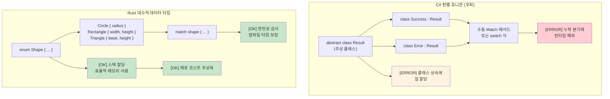

***

<a id="exhaustive-pattern-matching-compiler-guarantees-vs-runtime-errors"></a>
## 완전한 패턴 매칭: 컴파일러 보장 vs 런타임 오류

### C# switch 식 — 여전히 불완전
```csharp
// C# switch 식은 완전해 보이지만 보장되지 않음
public enum HttpStatus { Ok, NotFound, ServerError, Unauthorized }

public string HandleResponse(HttpStatus status) => status switch
{
    HttpStatus.Ok => "성공",
    HttpStatus.NotFound => "리소스를 찾을 수 없음",
    HttpStatus.ServerError => "내부 오류",
    // Unauthorized 분기 누락 - 그래도 컴파일됨!
    // 런타임: System.InvalidOperationException
};

// nullable 경고가 있어도 이 코드는 컴파일됨:
public class User 
{
    public string Name { get; set; }
    public bool IsActive { get; set; }
}

public string ProcessUser(User? user) => user switch
{
    { IsActive: true } => $"활성: {user.Name}",
    { IsActive: false } => $"비활성: {user.Name}",
    // null 분기 누락 - 경고만, 에러 아님
    // 런타임: NullReferenceException 가능
};

// 열거 값을 추가해도 기존 코드가 조용히 깨질 수 있음
public enum HttpStatus 
{ 
    Ok, 
    NotFound, 
    ServerError, 
    Unauthorized,
    Forbidden  // 이걸 추가해도 HandleResponse() 컴파일은 안 깨짐!
}
```

### Rust 패턴 매칭 — 진짜 완전성
```rust
#[derive(Debug)]
enum HttpStatus {
    Ok,
    NotFound, 
    ServerError,
    Unauthorized,
}

fn handle_response(status: HttpStatus) -> &'static str {
    match status {
        HttpStatus::Ok => "성공",
        HttpStatus::NotFound => "리소스를 찾을 수 없음", 
        HttpStatus::ServerError => "내부 오류",
        HttpStatus::Unauthorized => "인증 필요",
        // 분기가 하나라도 빠지면 컴파일 에러!
        // 말 그대로 컴파일되지 않음
    }
}

// 새 변형을 추가하면 사용처가 모두 컴파일 에러로 깨짐
#[derive(Debug)]
enum HttpStatus {
    Ok,
    NotFound,
    ServerError, 
    Unauthorized,
    Forbidden,  // 이걸 추가하면 handle_response()가 컴파일 에러
}
// 컴파일러가 모든 경우를 처리하도록 강제

// Option<T> 패턴 매칭도 완전함
fn process_optional_value(value: Option<i32>) -> String {
    match value {
        Some(n) => format!("값을 얻음: {}", n),
        None => "값 없음".to_string(),
        // Some/None 중 하나를 빼먹으면 컴파일 에러
    }
}
```

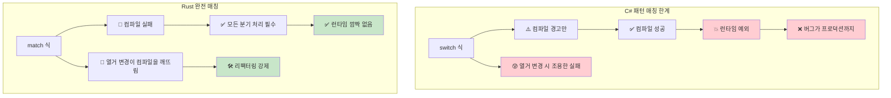

***

<a id="true-immutability-vs-record-illusions"></a>
## 진짜 불변성 vs 레코드 환상

### C# 레코드 — 불변성 연극
```csharp
// C# 레코드는 불변처럼 보이지만 빠져나갈 구멍이 있음
public record Person(string Name, int Age, List<string> Hobbies);

var person = new Person("John", 30, new List<string> { "reading" });

// 아래는 모두 “새 인스턴스를 만든 것처럼” 보임:
var older = person with { Age = 31 };  // 새 레코드
var renamed = person with { Name = "Jonathan" };  // 새 레코드

// 하지만 참조 타입 필드는 여전히 가변!
person.Hobbies.Add("gaming");  // 원본을 변경!
Console.WriteLine(older.Hobbies.Count);  // 2 - older에도 영향!
Console.WriteLine(renamed.Hobbies.Count); // 2 - renamed에도 영향!

// init 전용 프로퍼티도 리플렉션으로 설정 가능
typeof(Person).GetProperty("Age")?.SetValue(person, 25);

// 컬렉션 표현식이 도와주지만 근본 문제는 남음
public record BetterPerson(string Name, int Age, IReadOnlyList<string> Hobbies);

var betterPerson = new BetterPerson("Jane", 25, new List<string> { "painting" });
// 캐스팅으로 여전히 변경 가능:
((List<string>)betterPerson.Hobbies).Add("hacking the system");

// “불변” 컬렉션도 완전한 불변은 아님
using System.Collections.Immutable;
public record SafePerson(string Name, int Age, ImmutableList<string> Hobbies);
// 더 낫지만 규율이 필요하고 성능 오버헤드가 있음
```

### Rust — 기본이 진짜 불변
```rust
#[derive(Debug, Clone)]
struct Person {
    name: String,
    age: u32,
    hobbies: Vec<String>,
}

let person = Person {
    name: "John".to_string(),
    age: 30,
    hobbies: vec!["reading".to_string()],
};

// 아래는 컴파일되지 않음:
// person.age = 31;  // ERROR: 불변 필드에 대입 불가
// person.hobbies.push("gaming".to_string());  // ERROR: 가변 대여 불가

// 수정하려면 명시적으로 'mut'로 선택:
let mut older_person = person.clone();
older_person.age = 31;  // 이제 변이임이 분명함

// 또는 함수형 갱신 패턴:
let renamed = Person {
    name: "Jonathan".to_string(),
    ..person  // 나머지 필드 복사(이동 시맨틱 적용)
};

// 원본은 (이동 전까지) 불변이라는 것이 보장됨:
println!("{:?}", person.hobbies);  // 항상 ["reading"] - 불변

// 효율적인 불변 자료구조로 구조적 공유
use std::rc::Rc;

#[derive(Debug, Clone)]
struct EfficientPerson {
    name: String,
    age: u32,
    hobbies: Rc<Vec<String>>,  // 공유 불변 참조
}

// 새 버전을 만들 때 데이터를 효율적으로 공유
let person1 = EfficientPerson {
    name: "Alice".to_string(),
    age: 30,
    hobbies: Rc::new(vec!["reading".to_string(), "cycling".to_string()]),
};

let person2 = EfficientPerson {
    name: "Bob".to_string(),
    age: 25,
    hobbies: Rc::clone(&person1.hobbies),  // 공유 참조, 깊은 복사 없음
};
```

```mermaid
graph TD
    subgraph "C# 레코드 — 얕은 불변성"
        CS_RECORD["record Person(...)"]
        CS_WITH["with 식"]
        CS_SHALLOW["⚠️ 최상위만 불변"]
        CS_REF_MUT["❌ 참조 타입은 여전히 가변"]
        CS_REFLECTION["❌ 리플렉션으로 우회 가능"]
        CS_RUNTIME["❌ 런타임 깜짝 상황"]
        CS_DISCIPLINE["😓 팀 규율 필요"]
        
        CS_RECORD --> CS_WITH
        CS_WITH --> CS_SHALLOW
        CS_SHALLOW --> CS_REF_MUT
        CS_RECORD --> CS_REFLECTION
        CS_REF_MUT --> CS_RUNTIME
        CS_RUNTIME --> CS_DISCIPLINE
    end
    
    subgraph "Rust — 진짜 불변성"
        RUST_STRUCT["struct Person { ... }"]
        RUST_DEFAULT["✅ 기본이 불변"]
        RUST_COMPILE["✅ 컴파일 타임 강제"]
        RUST_MUT["🔒 명시적 'mut' 필요"]
        RUST_MOVE["🔄 이동 시맨틱"]
        RUST_ZERO["⚡ 런타임 오버헤드 없음"]
        RUST_SAFE["🛡️ 메모리 안전"]
        
        RUST_STRUCT --> RUST_DEFAULT
        RUST_DEFAULT --> RUST_COMPILE
        RUST_COMPILE --> RUST_MUT
        RUST_MUT --> RUST_MOVE
        RUST_MOVE --> RUST_ZERO
        RUST_ZERO --> RUST_SAFE
    end
    
    style CS_REF_MUT fill:#ffcdd2
    style CS_REFLECTION fill:#ffcdd2
    style CS_RUNTIME fill:#ffcdd2
    style RUST_COMPILE fill:#c8e6c9
    style RUST_ZERO fill:#c8e6c9
    style RUST_SAFE fill:#c8e6c9
```

***

<a id="memory-safety-runtime-checks-vs-compile-time-proofs"></a>
## 메모리 안전성: 런타임 검사 vs 컴파일 타임 증명

### C# — 런타임 안전망
```csharp
// C#은 런타임 검사와 GC에 의존
public class Buffer
{
    private byte[] data;
    
    public Buffer(int size)
    {
        data = new byte[size];
    }
    
    public void ProcessData(int index)
    {
        // 런타임 범위 검사
        if (index >= data.Length)
            throw new IndexOutOfRangeException();
            
        data[index] = 42;  // 안전하지만 런타임에 검사
    }
    
    // 이벤트/정적 참조로 여전히 메모리 누수 가능
    public static event Action<string> GlobalEvent;
    
    public void Subscribe()
    {
        GlobalEvent += HandleEvent;  // 메모리 누수 유발 가능
        // 구독 해제를 잊으면 객체가 수거되지 않음
    }
    
    private void HandleEvent(string message) { /* ... */ }
    
    // null 참조 예외는 여전히 가능
    public void ProcessUser(User user)
    {
        Console.WriteLine(user.Name.ToUpper());  // user.Name이 null이면 NullReferenceException
    }
    
    // 배열 접근은 런타임에 실패할 수 있음
    public int GetValue(int[] array, int index)
    {
        return array[index];  // IndexOutOfRangeException 가능
    }
}
```

### Rust — 컴파일 타임 보장
```rust
struct Buffer {
    data: Vec<u8>,
}

impl Buffer {
    fn new(size: usize) -> Self {
        Buffer {
            data: vec![0; size],
        }
    }
    
    fn process_data(&mut self, index: usize) {
        // 컴파일러가 안전하다고 증명하면 범위 검사를 최적화로 없앨 수 있음
        if let Some(item) = self.data.get_mut(index) {
            *item = 42;  // 안전한 접근, 컴파일 타임에 입증
        }
        // 또는 인덱싱(명시적 범위 검사):
        // self.data[index] = 42;  // 디버그에선 패닉, 메모리는 안전
    }
    
    // 메모리 누수 불가능 - 소유권 시스템이 방지
    fn process_with_closure<F>(&mut self, processor: F) 
    where F: FnOnce(&mut Vec<u8>)
    {
        processor(&mut self.data);
        // processor가 스코프를 벗어나면 자동 정리
        // 댕글링 참조나 메모리 누수를 만들 방법이 없음
    }
    
    // null 역참조 불가능 - null 포인터가 없음!
    fn process_user(&self, user: &User) {
        println!("{}", user.name.to_uppercase());  // user.name은 null일 수 없음
    }
    
    // 배열 접근은 범위 검사되거나 명시적으로 unsafe
    fn get_value(array: &[i32], index: usize) -> Option<i32> {
        array.get(index).copied()  // 범위 밖이면 None
    }
    
    // 또는 직접 unsafe:
    unsafe fn get_value_unchecked(array: &[i32], index: usize) -> i32 {
        *array.get_unchecked(index)  // 빠르지만 범위를 수동으로 증명해야 함
    }
}

struct User {
    name: String,  // Rust에서 String은 null 불가
}

// 소유권이 use-after-free 방지
fn ownership_example() {
    let data = vec![1, 2, 3, 4, 5];
    let reference = &data[0];  // data 대여
    
    // drop(data);  // ERROR: 대여 중에는 drop 불가
    println!("{}", reference);  // 안전함이 보장됨
}

// 대여가 데이터 레이스 방지
fn borrowing_example(data: &mut Vec<i32>) {
    let first = &data[0];  // 불변 대여
    // data.push(6);  // ERROR: 불변 대여 중에는 가변 대여 불가
    println!("{}", first);  // 데이터 레이스 없음이 보장됨
}
```

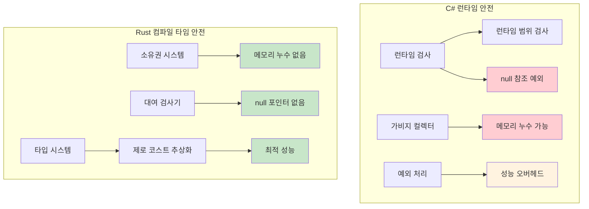

***

<a id="inheritance-vs-composition"></a>
## 상속 vs 합성

C#은 클래스 상속으로 동작을 공유·확장하는 경우가 많고, Rust는 **트레잇 + 구조체 합성**으로 같은 목표를 달성합니다.

<a id="interfaces-vs-traits"></a>
### 인터페이스 vs 트레잇

C#의 `interface`는 메서드 집합으로 계약을 정의하고, Rust의 `trait`도 동작을 묶지만 **구현은 타입 바깥의 `impl Trait for Type`**에 둡니다. 기본 구현·연관 타입·`dyn Trait`까지 같은 패턴으로 확장할 수 있습니다.

<a id="virtual-methods-vs-static-dispatch"></a>
### 가상 메서드 vs 정적 디스패치

C#의 `virtual`/`override`는 보통 **vtable**을 통한 동적 디스패치입니다. Rust의 일반적인 `impl`과 제네릭은 **단형화**되어 정적 디스패치가 되며, `dyn Trait`를 쓸 때만 동적 디스패치를 선택합니다.

<a id="sealed-classes-vs-rust-immutability"></a>
### sealed 클래스 vs Rust에서의 확장 통제

C#의 `sealed class`는 상속을 막아 API 표면을 닫습니다. Rust에는 상속이 없고, 트레잇 구현은 **고아 규칙(orphan rule)**과 가시성으로 “누가 어디에 `impl`할 수 있는지”를 제한합니다. 필요하면 봉인 트레잇(sealed trait) 패턴으로 외부 구현을 막을 수 있습니다.

```csharp
// C# - 클래스 기반 상속
public abstract class Animal
{
    public string Name { get; protected set; }
    public abstract void MakeSound();
    
    public virtual void Sleep()
    {
        Console.WriteLine($"{Name}은(는) 잠자는 중");
    }
}

public class Dog : Animal
{
    public Dog(string name) { Name = name; }
    
    public override void MakeSound()
    {
        Console.WriteLine("멍멍!");
    }
    
    public void Fetch()
    {
        Console.WriteLine($"{Name}은(는) 물어오기 중");
    }
}

// 인터페이스 기반 계약
public interface IFlyable
{
    void Fly();
}

public class Bird : Animal, IFlyable
{
    public Bird(string name) { Name = name; }
    
    public override void MakeSound()
    {
        Console.WriteLine("짹짹!");
    }
    
    public void Fly()
    {
        Console.WriteLine($"{Name}은(는) 날는 중");
    }
}
```

### Rust 합성 모델
```rust
// Rust - 트레잇으로 상속 대신 합성
pub trait Animal {
    fn name(&self) -> &str;
    fn make_sound(&self);
    
    // 기본 구현(C# 가상 메서드와 유사)
    fn sleep(&self) {
        println!("{}은(는) 잠자는 중", self.name());
    }
}

pub trait Flyable {
    fn fly(&self);
}

// 데이터와 동작 분리
#[derive(Debug)]
pub struct Dog {
    name: String,
}

#[derive(Debug)]
pub struct Bird {
    name: String,
    wingspan: f64,
}

// 타입에 동작 구현
impl Animal for Dog {
    fn name(&self) -> &str {
        &self.name
    }
    
    fn make_sound(&self) {
        println!("멍멍!");
    }
}

impl Dog {
    pub fn new(name: String) -> Self {
        Dog { name }
    }
    
    pub fn fetch(&self) {
        println!("{}은(는) 물어오기 중", self.name);
    }
}

impl Animal for Bird {
    fn name(&self) -> &str {
        &self.name
    }
    
    fn make_sound(&self) {
        println!("짹짹!");
    }
}

impl Flyable for Bird {
    fn fly(&self) {
        println!("{}은(는) 날개폭 {:.1}m로 날아감", self.name, self.wingspan);
    }
}

// 다중 트레잇 바운드(다중 인터페이스와 유사)
fn make_flying_animal_sound<T>(animal: &T) 
where 
    T: Animal + Flyable,
{
    animal.make_sound();
    animal.fly();
}
```

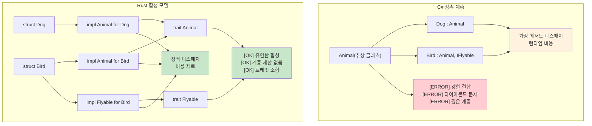

***

<a id="exceptions-vs-resultt-e"></a>
## 예외 vs Result&lt;T, E&gt;

<a id="try-catch-vs-pattern-matching"></a>
### try-catch vs 패턴 매칭

C#은 `try`/`catch`로 예외를 잡고, Rust는 `match`·`if let`·`?`로 `Result`/`Option`을 분기합니다. 제어 흐름이 타입에 드러나 컴파일러가 누락을 잡기 쉽습니다.

<a id="error-propagation-patterns"></a>
### 에러 전파 패턴

C#에서는 예외가 스택을 타고 전파되고, Rust에서는 `?`로 동일한 에러 타입을 상위로 넘기거나 `map_err`·`and_then`으로 변환·연결합니다. 도메인별 `enum` 에러와 `thiserror`로 메시지·원인을 구조화하는 패턴이 흔합니다.

### C# 예외 기반 에러 처리
```csharp
// C# - 예외 기반 에러 처리
public class UserService
{
    public User GetUser(int userId)
    {
        if (userId <= 0)
        {
            throw new ArgumentException("사용자 ID는 양수여야 합니다");
        }
        
        var user = database.FindUser(userId);
        if (user == null)
        {
            throw new UserNotFoundException($"사용자 {userId}을(를) 찾을 수 없습니다");
        }
        
        return user;
    }
    
    public async Task<string> GetUserEmailAsync(int userId)
    {
        try
        {
            var user = GetUser(userId);
            return user.Email ?? throw new InvalidOperationException("사용자에게 이메일이 없습니다");
        }
        catch (UserNotFoundException ex)
        {
            logger.Warning("사용자를 찾을 수 없음: {UserId}", userId);
            return "noreply@company.com";
        }
        catch (Exception ex)
        {
            logger.Error(ex, "사용자 이메일 조회 중 예기치 않은 오류");
            throw; // 재throw
        }
    }
}
```

### Rust Result 기반 에러 처리
```rust
use std::fmt;

#[derive(Debug)]
pub enum UserError {
    InvalidId(i32),
    NotFound(i32),
    NoEmail,
    DatabaseError(String),
}

impl fmt::Display for UserError {
    fn fmt(&self, f: &mut fmt::Formatter<'_>) -> fmt::Result {
        match self {
            UserError::InvalidId(id) => write!(f, "잘못된 사용자 ID: {}", id),
            UserError::NotFound(id) => write!(f, "사용자 {}을(를) 찾을 수 없습니다", id),
            UserError::NoEmail => write!(f, "사용자에게 이메일 주소가 없습니다"),
            UserError::DatabaseError(msg) => write!(f, "데이터베이스 오류: {}", msg),
        }
    }
}

impl std::error::Error for UserError {}

pub struct UserService {
    // DB 연결 등
}

impl UserService {
    pub fn get_user(&self, user_id: i32) -> Result<User, UserError> {
        if user_id <= 0 {
            return Err(UserError::InvalidId(user_id));
        }
        
        // DB 조회 시뮬레이션
        self.database_find_user(user_id)
            .ok_or(UserError::NotFound(user_id))
    }
    
    pub fn get_user_email(&self, user_id: i32) -> Result<String, UserError> {
        let user = self.get_user(user_id)?; // ? 연산자로 에러 전파
        
        user.email
            .ok_or(UserError::NoEmail)
    }
    
    pub fn get_user_email_or_default(&self, user_id: i32) -> String {
        match self.get_user_email(user_id) {
            Ok(email) => email,
            Err(UserError::NotFound(_)) => {
                log::warn!("사용자를 찾을 수 없음: {}", user_id);
                "noreply@company.com".to_string()
            }
            Err(err) => {
                log::error!("사용자 이메일 조회 오류: {}", err);
                "error@company.com".to_string()
            }
        }
    }
}
```

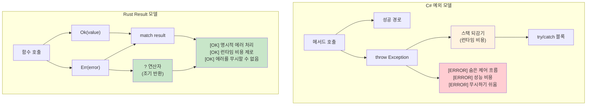

***

<a id="linq-vs-rust-iterators"></a>
## LINQ vs Rust 이터레이터

<a id="collection-ownership"></a>
### 컬렉션 소유권

C#의 `List<T>` 등은 참조로 공유하기 쉽고, Rust의 `Vec<T>`는 **소유**가 한 곳에 있으며 공유는 `&[T]`·`Arc<[T]>` 등으로 명시합니다. 이터레이터 체인은 소비(`into_iter`)와 대여(`iter`/`iter_mut`)를 구분합니다.

<a id="lazy-evaluation-patterns"></a>
### 지연 평가 패턴

LINQ와 마찬가지로 Rust 이터레이터도 `.collect()` 등으로 **구체화**하기 전까지는 지연됩니다. 다만 Rust는 중간 컬렉션 할당 없이 루프로 최적화되는 경우가 많습니다.

### C# LINQ (언어 통합 쿼리)
```csharp
// C# LINQ - 선언적 데이터 처리
var numbers = new[] { 1, 2, 3, 4, 5, 6, 7, 8, 9, 10 };

var result = numbers
    .Where(n => n % 2 == 0)           // 짝수만
    .Select(n => n * n)               // 제곱
    .Where(n => n > 10)               // 10 초과만
    .OrderByDescending(n => n)        // 내림차순 정렬
    .Take(3)                          // 앞에서 3개
    .ToList();                        // 구체화

// 복잡한 객체와 LINQ
var users = GetUsers();
var activeAdults = users
    .Where(u => u.IsActive && u.Age >= 18)
    .GroupBy(u => u.Department)
    .Select(g => new {
        Department = g.Key,
        Count = g.Count(),
        AverageAge = g.Average(u => u.Age)
    })
    .OrderBy(x => x.Department)
    .ToList();

// 비동기 LINQ (추가 라이브러리 필요)
var results = await users
    .ToAsyncEnumerable()
    .WhereAwait(async u => await IsActiveAsync(u.Id))
    .SelectAwait(async u => await EnrichUserAsync(u))
    .ToListAsync();
```

### Rust 이터레이터
```rust
// Rust 이터레이터 - 지연, 제로 코스트 추상화
let numbers = vec![1, 2, 3, 4, 5, 6, 7, 8, 9, 10];

let result: Vec<i32> = numbers
    .iter()
    .filter(|&&n| n % 2 == 0)        // 짝수만
    .map(|&n| n * n)                 // 제곱
    .filter(|&n| n > 10)             // 10 초과만
    .collect::<Vec<_>>()             // Vec으로 수집
    .into_iter()
    .rev()                           // 역순(내림차순에 해당)
    .take(3)                         // 앞에서 3개
    .collect();                      // 구체화

// 복잡한 이터레이터 체인
use std::collections::HashMap;

#[derive(Debug, Clone)]
struct User {
    name: String,
    age: u32,
    department: String,
    is_active: bool,
}

fn process_users(users: Vec<User>) -> HashMap<String, (usize, f64)> {
    users
        .into_iter()
        .filter(|u| u.is_active && u.age >= 18)
        .fold(HashMap::new(), |mut acc, user| {
            let entry = acc.entry(user.department.clone()).or_insert((0, 0.0));
            entry.0 += 1;  // 개수
            entry.1 += user.age as f64;  // 나이 합
            acc
        })
        .into_iter()
        .map(|(dept, (count, sum))| (dept, (count, sum / count as f64)))  // 평균
        .collect()
}

// rayon으로 병렬 처리
use rayon::prelude::*;

fn parallel_processing(numbers: Vec<i32>) -> Vec<i32> {
    numbers
        .par_iter()                  // 병렬 이터레이터
        .filter(|&&n| n % 2 == 0)
        .map(|&n| expensive_computation(n))
        .collect()
}

fn expensive_computation(n: i32) -> i32 {
    // 무거운 계산 시뮬레이션
    (0..1000).fold(n, |acc, _| acc + 1)
}
```

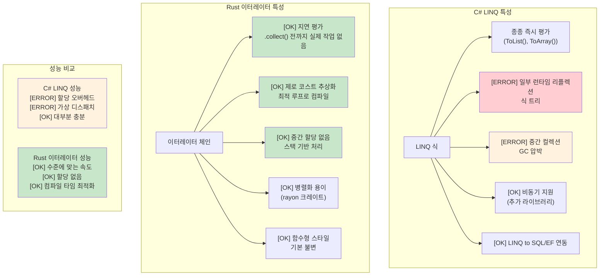

***

<a id="generic-constraints-where-vs-trait-bounds"></a>
## 제네릭 제약: where vs 트레잇 바운드

### C# 제네릭 제약
```csharp
// C# where 절 제네릭 제약
public class Repository<T> where T : class, IEntity, new()
{
    public T Create()
    {
        return new T();  // new() 제약: 무인자 생성자 허용
    }
    
    public void Save(T entity)
    {
        if (entity.Id == 0)  // IEntity 제약으로 Id 프로퍼티 사용
        {
            entity.Id = GenerateId();
        }
        // DB에 저장
    }
}

// 여러 타입 매개변수와 제약
public class Converter<TInput, TOutput> 
    where TInput : IConvertible
    where TOutput : class, new()
{
    public TOutput Convert(TInput input)
    {
        var output = new TOutput();
        // IConvertible을 이용한 변환 로직
        return output;
    }
}

// 제네릭의 가변성
public interface IRepository<out T> where T : IEntity
{
    IEnumerable<T> GetAll();  // 공변 - 더 파생된 타입 반환 가능
}

public interface IWriter<in T> where T : IEntity
{
    void Write(T entity);  // 반공변 - 더 기본 타입을 받을 수 있음
}
```

### Rust 트레잇 바운드 제네릭 제약
```rust
use std::fmt::{Debug, Display};
use std::clone::Clone;

// 기본 트레잇 바운드
pub struct Repository<T> 
where 
    T: Clone + Debug + Default,
{
    items: Vec<T>,
}

impl<T> Repository<T> 
where 
    T: Clone + Debug + Default,
{
    pub fn new() -> Self {
        Repository { items: Vec::new() }
    }
    
    pub fn create(&self) -> T {
        T::default()  // Default 트레잇이 기본값 제공
    }
    
    pub fn add(&mut self, item: T) {
        println!("항목 추가: {:?}", item);  // 출력용 Debug 트레잇
        self.items.push(item);
    }
    
    pub fn get_all(&self) -> Vec<T> {
        self.items.clone()  // 복제용 Clone 트레잇
    }
}

// 여러 트레잇 바운드(문법은 여러 가지)
pub fn process_data<T, U>(input: T) -> U 
where 
    T: Display + Clone,
    U: From<T> + Debug,
{
    println!("처리 중: {}", input);  // Display 트레잇
    let cloned = input.clone();         // Clone 트레잇
    let output = U::from(cloned);       // 변환용 From 트레잇
    println!("결과: {:?}", output);   // Debug 트레잇
    output
}

// 연관 타입(C# 제네릭 제약과 유사한 역할)
pub trait Iterator {
    type Item;  // 제네릭 매개변수 대신 연관 타입
    
    fn next(&mut self) -> Option<Self::Item>;
}

pub trait Collect<T> {
    fn collect<I: Iterator<Item = T>>(iter: I) -> Self;
}

// 상위 순위 트레잇 바운드(고급)
fn apply_to_all<F>(items: &[String], f: F) -> Vec<String>
where 
    F: for<'a> Fn(&'a str) -> String,  // 모든 수명에 대해 동작하는 함수
{
    items.iter().map(|s| f(s)).collect()
}

// 조건부 트레잇 구현
impl<T> PartialEq for Repository<T> 
where 
    T: PartialEq + Clone + Debug + Default,
{
    fn eq(&self, other: &Self) -> bool {
        self.items == other.items
    }
}
```

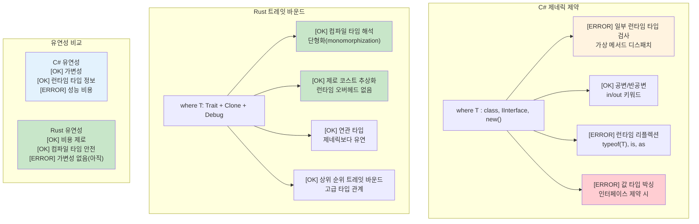

<a id="variance-in-generics"></a>
### 제네릭의 가변성

C#의 `out`/`in`으로 인터페이스와 대리 타입의 공변·반공변을 표현합니다. Rust 제네릭은 **가변성을 이렇게 표기하지 않으며**, 대신 수명·소유권·`Subtrait` 관계로 API를 설계합니다(예: `fn` 포인터와 트레잇 객체에서의 규칙이 다름).

<a id="higher-kinded-types"></a>
### 상위 종류 타입(HKT)

C#에서 일부 HKT 스타일 패턴은 자체 인터페이스로 흉내 내지만, Rust는 **고차 트레잇 바운드**(`for<'a>` 등)와 연관 타입으로 비슷한 표현력을 얻습니다. 완전한 HKT는 언어 차원에서 다르게 대우됩니다.

***

<a id="common-c-patterns-in-rust"></a>
## Rust에서의 흔한 C# 패턴

### 리포지토리 패턴
```csharp
// C# 리포지토리 패턴
public interface IRepository<T> where T : IEntity
{
    Task<T> GetByIdAsync(int id);
    Task<IEnumerable<T>> GetAllAsync();
    Task<T> AddAsync(T entity);
    Task UpdateAsync(T entity);
    Task DeleteAsync(int id);
}

public class UserRepository : IRepository<User>
{
    private readonly DbContext _context;
    
    public UserRepository(DbContext context)
    {
        _context = context;
    }
    
    public async Task<User> GetByIdAsync(int id)
    {
        return await _context.Users.FindAsync(id);
    }
    
    // ... 나머지 구현
}
```

```rust
// Rust: 트레잇과 제네릭을 쓴 리포지토리 패턴
use async_trait::async_trait;
use std::fmt::Debug;

#[async_trait]
pub trait Repository<T, E> 
where 
    T: Clone + Debug + Send + Sync,
    E: std::error::Error + Send + Sync,
{
    async fn get_by_id(&self, id: u64) -> Result<Option<T>, E>;
    async fn get_all(&self) -> Result<Vec<T>, E>;
    async fn add(&self, entity: T) -> Result<T, E>;
    async fn update(&self, entity: T) -> Result<T, E>;
    async fn delete(&self, id: u64) -> Result<(), E>;
}

#[derive(Debug, Clone)]
pub struct User {
    pub id: u64,
    pub name: String,
    pub email: String,
}

#[derive(Debug)]
pub enum RepositoryError {
    NotFound(u64),
    DatabaseError(String),
    ValidationError(String),
}

impl std::fmt::Display for RepositoryError {
    fn fmt(&self, f: &mut std::fmt::Formatter<'_>) -> std::fmt::Result {
        match self {
            RepositoryError::NotFound(id) => write!(f, "id {}인 엔터티를 찾을 수 없습니다", id),
            RepositoryError::DatabaseError(msg) => write!(f, "데이터베이스 오류: {}", msg),
            RepositoryError::ValidationError(msg) => write!(f, "유효성 검사 오류: {}", msg),
        }
    }
}

impl std::error::Error for RepositoryError {}

pub struct UserRepository {
    // DB 연결 풀 등
}

#[async_trait]
impl Repository<User, RepositoryError> for UserRepository {
    async fn get_by_id(&self, id: u64) -> Result<Option<User>, RepositoryError> {
        // DB 조회 시뮬레이션
        if id == 0 {
            return Ok(None);
        }
        
        Ok(Some(User {
            id,
            name: format!("User {}", id),
            email: format!("user{}@example.com", id),
        }))
    }
    
    async fn get_all(&self) -> Result<Vec<User>, RepositoryError> {
        // 여기에 구현
        Ok(vec![])
    }
    
    async fn add(&self, entity: User) -> Result<User, RepositoryError> {
        // 검증 및 DB 삽입
        if entity.name.is_empty() {
            return Err(RepositoryError::ValidationError("이름은 비울 수 없습니다".to_string()));
        }
        Ok(entity)
    }
    
    async fn update(&self, entity: User) -> Result<User, RepositoryError> {
        // 여기에 구현
        Ok(entity)
    }
    
    async fn delete(&self, id: u64) -> Result<(), RepositoryError> {
        // 여기에 구현
        Ok(())
    }
}
```

<a id="builder-pattern"></a>
### 빌더 패턴
```csharp
// C# 빌더 패턴(플루언트 인터페이스)
public class HttpClientBuilder
{
    private TimeSpan? _timeout;
    private string _baseAddress;
    private Dictionary<string, string> _headers = new();
    
    public HttpClientBuilder WithTimeout(TimeSpan timeout)
    {
        _timeout = timeout;
        return this;
    }
    
    public HttpClientBuilder WithBaseAddress(string baseAddress)
    {
        _baseAddress = baseAddress;
        return this;
    }
    
    public HttpClientBuilder WithHeader(string name, string value)
    {
        _headers[name] = value;
        return this;
    }
    
    public HttpClient Build()
    {
        var client = new HttpClient();
        if (_timeout.HasValue)
            client.Timeout = _timeout.Value;
        if (!string.IsNullOrEmpty(_baseAddress))
            client.BaseAddress = new Uri(_baseAddress);
        foreach (var header in _headers)
            client.DefaultRequestHeaders.Add(header.Key, header.Value);
        return client;
    }
}

// 사용 예
var client = new HttpClientBuilder()
    .WithTimeout(TimeSpan.FromSeconds(30))
    .WithBaseAddress("https://api.example.com")
    .WithHeader("Accept", "application/json")
    .Build();
```

```rust
// Rust 빌더 패턴(소비형 빌더)
use std::collections::HashMap;
use std::time::Duration;

#[derive(Debug)]
pub struct HttpClient {
    timeout: Duration,
    base_address: String,
    headers: HashMap<String, String>,
}

pub struct HttpClientBuilder {
    timeout: Option<Duration>,
    base_address: Option<String>,
    headers: HashMap<String, String>,
}

impl HttpClientBuilder {
    pub fn new() -> Self {
        HttpClientBuilder {
            timeout: None,
            base_address: None,
            headers: HashMap::new(),
        }
    }
    
    pub fn with_timeout(mut self, timeout: Duration) -> Self {
        self.timeout = Some(timeout);
        self
    }
    
    pub fn with_base_address<S: Into<String>>(mut self, base_address: S) -> Self {
        self.base_address = Some(base_address.into());
        self
    }
    
    pub fn with_header<K: Into<String>, V: Into<String>>(mut self, name: K, value: V) -> Self {
        self.headers.insert(name.into(), value.into());
        self
    }
    
    pub fn build(self) -> Result<HttpClient, String> {
        let base_address = self.base_address.ok_or("기본 주소가 필요합니다")?;
        
        Ok(HttpClient {
            timeout: self.timeout.unwrap_or(Duration::from_secs(30)),
            base_address,
            headers: self.headers,
        })
    }
}

// 사용 예
let client = HttpClientBuilder::new()
    .with_timeout(Duration::from_secs(30))
    .with_base_address("https://api.example.com")
    .with_header("Accept", "application/json")
    .build()?;

// 대안: 흔한 경우에 Default 트레잇 사용
impl Default for HttpClientBuilder {
    fn default() -> Self {
        Self::new()
    }
}
```

***

<a id="essential-crates-for-c-developers"></a>
## C# 개발자에게 유용한 필수 크레이트

<a id="core-functionality-equivalents"></a>
### 핵심 기능에 대응하는 크레이트

```rust
// C# 개발자를 위한 Cargo.toml 의존성 예시
[dependencies]
# 직렬화(Newtonsoft.Json 또는 System.Text.Json에 해당)
serde = { version = "1.0", features = ["derive"] }
serde_json = "1.0"

# HTTP 클라이언트(HttpClient에 해당)
reqwest = { version = "0.11", features = ["json"] }

# 비동기 런타임(Task.Run, async/await에 해당)
tokio = { version = "1.0", features = ["full"] }

# 에러 처리(사용자 정의 예외에 해당)
thiserror = "1.0"
anyhow = "1.0"

# 로깅(ILogger, Serilog에 해당)
log = "0.4"
env_logger = "0.10"

# 날짜·시간(DateTime에 해당)
chrono = { version = "0.4", features = ["serde"] }

# UUID(System.Guid에 해당)
uuid = { version = "1.0", features = ["v4", "serde"] }

# 컬렉션(List<T>, Dictionary<K,V>에 해당)
# 고급 컬렉션은 표준 라이브러리 외에:
indexmap = "2.0"  # 순서 보존 HashMap

# 설정(IConfiguration에 해당)
config = "0.13"

# 데이터베이스(Entity Framework에 해당)
sqlx = { version = "0.7", features = ["runtime-tokio-rustls", "postgres", "uuid", "chrono"] }

# 테스트(xUnit, NUnit에 해당)
# 표준에 더해:
rstest = "0.18"  # 매개변수화 테스트

# 모킹(Moq에 해당)
mockall = "0.11"

# 병렬 처리(Parallel.ForEach에 해당)
rayon = "1.7"
```

<a id="example-usage-patterns"></a>
### 사용 예시 패턴

```rust
use serde::{Deserialize, Serialize};
use reqwest;
use tokio;
use thiserror::Error;
use chrono::{DateTime, Utc};
use uuid::Uuid;

// 데이터 모델(C# POCO + 특성에 해당)
#[derive(Debug, Clone, Serialize, Deserialize)]
pub struct User {
    pub id: Uuid,
    pub name: String,
    pub email: String,
    #[serde(with = "chrono::serde::ts_seconds")]
    pub created_at: DateTime<Utc>,
}

// 사용자 정의 에러 타입(사용자 정의 예외에 해당)
#[derive(Error, Debug)]
pub enum ApiError {
    #[error("HTTP 요청 실패: {0}")]
    Http(#[from] reqwest::Error),
    
    #[error("직렬화 실패: {0}")]
    Serialization(#[from] serde_json::Error),
    
    #[error("사용자를 찾을 수 없음: {id}")]
    UserNotFound { id: Uuid },
    
    #[error("유효성 검사 실패: {message}")]
    Validation { message: String },
}

// 서비스 클래스에 해당
pub struct UserService {
    client: reqwest::Client,
    base_url: String,
}

impl UserService {
    pub fn new(base_url: String) -> Self {
        let client = reqwest::Client::builder()
            .timeout(std::time::Duration::from_secs(30))
            .build()
            .expect("HTTP 클라이언트 생성 실패");
            
        UserService { client, base_url }
    }
    
    // 비동기 메서드(C#의 async Task<User>에 해당)
    pub async fn get_user(&self, id: Uuid) -> Result<User, ApiError> {
        let url = format!("{}/users/{}", self.base_url, id);
        
        let response = self.client
            .get(&url)
            .send()
            .await?;
        
        if response.status() == 404 {
            return Err(ApiError::UserNotFound { id });
        }
        
        let user = response.json::<User>().await?;
        Ok(user)
    }
    
    // 사용자 생성(C#의 async Task<User>에 해당)
    pub async fn create_user(&self, name: String, email: String) -> Result<User, ApiError> {
        if name.trim().is_empty() {
            return Err(ApiError::Validation {
                message: "이름은 비울 수 없습니다".to_string(),
            });
        }
        
        let new_user = User {
            id: Uuid::new_v4(),
            name,
            email,
            created_at: Utc::now(),
        };
        
        let response = self.client
            .post(&format!("{}/users", self.base_url))
            .json(&new_user)
            .send()
            .await?;
        
        let created_user = response.json::<User>().await?;
        Ok(created_user)
    }
}

// 사용 예(C#의 Main 메서드에 해당)
#[tokio::main]
async fn main() -> Result<(), ApiError> {
    // 로깅 초기화(ILogger 설정에 해당)
    env_logger::init();
    
    let service = UserService::new("https://api.example.com".to_string());
    
    // 사용자 생성
    let user = service.create_user(
        "John Doe".to_string(),
        "john@example.com".to_string(),
    ).await?;
    
    println!("생성된 사용자: {:?}", user);
    
    // 사용자 조회
    let retrieved_user = service.get_user(user.id).await?;
    println!("조회된 사용자: {:?}", retrieved_user);
    
    Ok(())
}

#[cfg(test)]
mod tests {
    use super::*;
    
    #[tokio::test]  // C#의 [Test] 또는 [Fact]에 해당
    async fn test_user_creation() {
        let service = UserService::new("http://localhost:8080".to_string());
        
        let result = service.create_user(
            "Test User".to_string(),
            "test@example.com".to_string(),
        ).await;
        
        assert!(result.is_ok());
        let user = result.unwrap();
        assert_eq!(user.name, "Test User");
        assert_eq!(user.email, "test@example.com");
    }
    
    #[test]
    fn test_validation() {
        // 동기 테스트
        let error = ApiError::Validation {
            message: "잘못된 입력".to_string(),
        };
        
        assert_eq!(error.to_string(), "유효성 검사 실패: 잘못된 입력");
    }
}
```

***

<a id="thread-safety-convention-vs-type-system-guarantees"></a>
## 스레드 안전: 관례 vs 타입 시스템 보장

<a id="asyncawait-comparison"></a>
### async/await 비교

C#의 `async`/`await`는 대부분 `Task`와 SynchronizationContext 위에서 동작하고, Rust의 `async`는 **폴링 기반 Future**로 런타임(`tokio` 등)이 실행합니다. 취소·백프레셔·`Send` 요구 등 세부 규칙이 다르므로 [Async Rust](../async-book/src/SUMMARY.md) 보조 과정을 함께 보는 것이 좋습니다.

<a id="data-race-prevention"></a>
### 데이터 레이스 방지

C#은 락·동시 컬렉션·관례로 레이스를 막아야 하고, Rust는 **동시에 두 개의 가변 대여**가 불가능하도록 해 데이터 레이스를 컴파일 타임에 차단합니다. 공유 가변은 `Mutex`/`RwLock`·채널 등으로 명시합니다.

### C# — 관례에 의한 스레드 안전
```csharp
// C# 컬렉션은 기본적으로 스레드 안전하지 않음
public class UserService
{
    private readonly List<string> items = new();
    private readonly Dictionary<int, User> cache = new();

    // 데이터 레이스를 일으킬 수 있음:
    public void AddItem(string item)
    {
        items.Add(item);  // 스레드 안전 아님!
    }

    // 수동으로 락을 써야 함:
    private readonly object lockObject = new();

    public void SafeAddItem(string item)
    {
        lock (lockObject)
        {
            items.Add(item);  // 안전하지만 런타임 오버헤드
        }
        // 다른 곳에서 락을 빼먹기 쉬움
    }

    // ConcurrentCollection은 도움이 되지만 제한적:
    private readonly ConcurrentBag<string> safeItems = new();
    
    public void ConcurrentAdd(string item)
    {
        safeItems.Add(item);  // 스레드 안전하지만 연산이 제한적
    }

    // 복잡한 공유 상태 관리
    private readonly ConcurrentDictionary<int, User> threadSafeCache = new();
    private volatile bool isShutdown = false;
    
    public async Task ProcessUser(int userId)
    {
        if (isShutdown) return;  // 레이스 컨디션 가능!
        
        var user = await GetUser(userId);
        threadSafeCache.TryAdd(userId, user);  // 어떤 컬렉션이 안전한지 기억해야 함
    }

    // 스레드 로컬 저장소는 관리를 잘해야 함
    private static readonly ThreadLocal<Random> threadLocalRandom = 
        new ThreadLocal<Random>(() => new Random());
        
    public int GetRandomNumber()
    {
        return threadLocalRandom.Value.Next();  // 안전하지만 수동 관리
    }
}

// 레이스가 날 수 있는 이벤트 처리
public class EventProcessor
{
    public event Action<string> DataReceived;
    private readonly List<string> eventLog = new();
    
    public void OnDataReceived(string data)
    {
        // 레이스: 검사와 호출 사이에 이벤트가 null일 수 있음
        if (DataReceived != null)
        {
            DataReceived(data);
        }
        
        // 또 다른 레이스: 리스트는 스레드 안전하지 않음
        eventLog.Add($"Processed: {data}");
    }
}
```

### Rust — 타입 시스템이 보장하는 스레드 안전
```rust
use std::sync::{Arc, Mutex, RwLock};
use std::thread;
use std::collections::HashMap;
use tokio::sync::{mpsc, broadcast};

// Rust는 컴파일 타임에 데이터 레이스를 막음
pub struct UserService {
    items: Arc<Mutex<Vec<String>>>,
    cache: Arc<RwLock<HashMap<i32, User>>>,
}

impl UserService {
    pub fn new() -> Self {
        UserService {
            items: Arc::new(Mutex::new(Vec::new())),
            cache: Arc::new(RwLock::new(HashMap::new())),
        }
    }
    
    pub fn add_item(&self, item: String) {
        let mut items = self.items.lock().unwrap();
        items.push(item);
        // `items`가 스코프를 벗어나면 락이 자동 해제됨
    }
    
    // 다중 읽기·단일 쓰기 — 자동으로 강제됨
    pub async fn get_user(&self, user_id: i32) -> Option<User> {
        let cache = self.cache.read().unwrap();
        cache.get(&user_id).cloned()
    }
    
    pub async fn cache_user(&self, user_id: i32, user: User) {
        let mut cache = self.cache.write().unwrap();
        cache.insert(user_id, user);
    }
    
    // 스레드 간 공유를 위해 Arc 복제
    pub fn process_in_background(&self) {
        let items = Arc::clone(&self.items);
        
        thread::spawn(move || {
            let items = items.lock().unwrap();
            for item in items.iter() {
                println!("처리 중: {}", item);
            }
        });
    }
}

// 채널 기반 통신 — 공유 상태가 필요 없을 수 있음
pub struct MessageProcessor {
    sender: mpsc::UnboundedSender<String>,
}

impl MessageProcessor {
    pub fn new() -> (Self, mpsc::UnboundedReceiver<String>) {
        let (tx, rx) = mpsc::unbounded_channel();
        (MessageProcessor { sender: tx }, rx)
    }
    
    pub fn send_message(&self, message: String) -> Result<(), mpsc::error::SendError<String>> {
        self.sender.send(message)
    }
}

// 아래는 컴파일되지 않음 — Rust가 가변 데이터를 안전하지 않게 공유하는 것을 막음:
fn impossible_data_race() {
    let mut items = vec![1, 2, 3];
    
    // 컴파일되지 않음 — `items`를 여러 클로저로 이동할 수 없음
    /*
    thread::spawn(move || {
        items.push(4);  // ERROR: 이미 이동된 값 사용
    });
    
    thread::spawn(move || {
        items.push(5);  // ERROR: 이미 이동된 값 사용
    });
    */
}

// 안전한 병렬 데이터 처리
use rayon::prelude::*;

fn parallel_processing() {
    let data = vec![1, 2, 3, 4, 5];
    
    // 병렬 이터레이션 — 스레드 안전이 보장됨
    let results: Vec<i32> = data
        .par_iter()
        .map(|&x| x * x)
        .collect();
        
    println!("{:?}", results);
}

// 메시지 패싱을 쓴 비동기 동시성
async fn async_message_passing() {
    let (tx, mut rx) = mpsc::channel(100);
    
    // 생산자 태스크
    let producer = tokio::spawn(async move {
        for i in 0..10 {
            if tx.send(i).await.is_err() {
                break;
            }
        }
    });
    
    // 소비자 태스크
    let consumer = tokio::spawn(async move {
        while let Some(value) = rx.recv().await {
            println!("수신: {}", value);
        }
    });
    
    // 두 태스크 대기
    let (producer_result, consumer_result) = tokio::join!(producer, consumer);
    producer_result.unwrap();
    consumer_result.unwrap();
}

#[derive(Clone)]
struct User {
    id: i32,
    name: String,
}
```

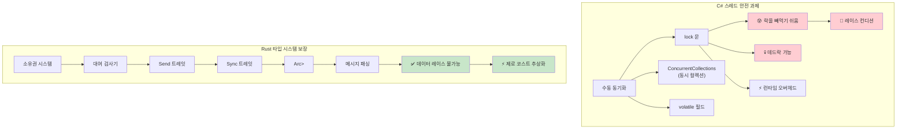

***

<a id="incremental-adoption-strategy"></a>
## 점진적 도입 전략

<a id="phase-1-learning-and-experimentation-weeks-1-4"></a>
### 1단계: 학습과 실험(1~4주)
```rust
// CLI 도구·유틸리티부터 시작
// 예: 로그 파일 분석기
use std::fs;
use std::collections::HashMap;
use clap::Parser;

#[derive(Parser)]
#[command(author, version, about)]
struct Args {
    #[arg(short, long)]
    file: String,
    
    #[arg(short, long, default_value = "10")]
    top: usize,
}

fn main() -> Result<(), Box<dyn std::error::Error>> {
    let args = Args::parse();
    
    let content = fs::read_to_string(&args.file)?;
    let mut word_count = HashMap::new();
    
    for line in content.lines() {
        for word in line.split_whitespace() {
            let word = word.to_lowercase();
            *word_count.entry(word).or_insert(0) += 1;
        }
    }
    
    let mut sorted: Vec<_> = word_count.into_iter().collect();
    sorted.sort_by(|a, b| b.1.cmp(&a.1));
    
    for (word, count) in sorted.into_iter().take(args.top) {
        println!("{}: {}", word, count);
    }
    
    Ok(())
}
```

<a id="phase-2-replace-performance-critical-components-weeks-5-8"></a>
### 2단계: 성능이 중요한 구성 요소 교체(5~8주)
```rust
// CPU 집약적 데이터 처리 교체
// 예: 이미지 처리 마이크로서비스
use image::{DynamicImage, ImageBuffer, Rgb};
use serde::{Deserialize, Serialize};
use tokio::io::{AsyncReadExt, AsyncWriteExt};
use warp::Filter;

#[derive(Serialize, Deserialize)]
struct ProcessingRequest {
    image_data: Vec<u8>,
    operation: String,
    parameters: serde_json::Value,
}

#[derive(Serialize)]
struct ProcessingResponse {
    processed_image: Vec<u8>,
    processing_time_ms: u64,
}

async fn process_image(request: ProcessingRequest) -> Result<ProcessingResponse, Box<dyn std::error::Error + Send + Sync>> {
    let start = std::time::Instant::now();
    
    let img = image::load_from_memory(&request.image_data)?;
    
    let processed = match request.operation.as_str() {
        "blur" => {
            let radius = request.parameters["radius"].as_f64().unwrap_or(2.0) as f32;
            img.blur(radius)
        }
        "grayscale" => img.grayscale(),
        "resize" => {
            let width = request.parameters["width"].as_u64().unwrap_or(100) as u32;
            let height = request.parameters["height"].as_u64().unwrap_or(100) as u32;
            img.resize(width, height, image::imageops::FilterType::Lanczos3)
        }
        _ => return Err("알 수 없는 작업".into()),
    };
    
    let mut buffer = Vec::new();
    processed.write_to(&mut std::io::Cursor::new(&mut buffer), image::ImageOutputFormat::Png)?;
    
    Ok(ProcessingResponse {
        processed_image: buffer,
        processing_time_ms: start.elapsed().as_millis() as u64,
    })
}

#[tokio::main]
async fn main() {
    let process_route = warp::path("process")
        .and(warp::post())
        .and(warp::body::json())
        .and_then(|req: ProcessingRequest| async move {
            match process_image(req).await {
                Ok(response) => Ok(warp::reply::json(&response)),
                Err(e) => Err(warp::reject::custom(ProcessingError(e.to_string()))),
            }
        });

    warp::serve(process_route)
        .run(([127, 0, 0, 1], 3030))
        .await;
}

#[derive(Debug)]
struct ProcessingError(String);
impl warp::reject::Reject for ProcessingError {}
```

<a id="phase-3-new-microservices-weeks-9-12"></a>
### 3단계: 새 마이크로서비스(9~12주)
```rust
// Rust로 새 서비스를 처음부터 구축
// 예: 인증 서비스
use axum::{
    extract::{Query, State},
    http::StatusCode,
    response::Json,
    routing::{get, post},
    Router,
};
use jsonwebtoken::{encode, decode, Header, Validation, EncodingKey, DecodingKey};
use serde::{Deserialize, Serialize};
use sqlx::{Pool, Postgres};
use uuid::Uuid;
use bcrypt::{hash, verify, DEFAULT_COST};

#[derive(Clone)]
struct AppState {
    db: Pool<Postgres>,
    jwt_secret: String,
}

#[derive(Serialize, Deserialize)]
struct Claims {
    sub: String,
    exp: usize,
}

#[derive(Deserialize)]
struct LoginRequest {
    email: String,
    password: String,
}

#[derive(Serialize)]
struct LoginResponse {
    token: String,
    user_id: Uuid,
}

async fn login(
    State(state): State<AppState>,
    Json(request): Json<LoginRequest>,
) -> Result<Json<LoginResponse>, StatusCode> {
    let user = sqlx::query!(
        "SELECT id, password_hash FROM users WHERE email = $1",
        request.email
    )
    .fetch_optional(&state.db)
    .await
    .map_err(|_| StatusCode::INTERNAL_SERVER_ERROR)?;

    let user = user.ok_or(StatusCode::UNAUTHORIZED)?;

    if !verify(&request.password, &user.password_hash)
        .map_err(|_| StatusCode::INTERNAL_SERVER_ERROR)?
    {
        return Err(StatusCode::UNAUTHORIZED);
    }

    let claims = Claims {
        sub: user.id.to_string(),
        exp: (chrono::Utc::now() + chrono::Duration::hours(24)).timestamp() as usize,
    };

    let token = encode(
        &Header::default(),
        &claims,
        &EncodingKey::from_secret(state.jwt_secret.as_ref()),
    )
    .map_err(|_| StatusCode::INTERNAL_SERVER_ERROR)?;

    Ok(Json(LoginResponse {
        token,
        user_id: user.id,
    }))
}

#[tokio::main]
async fn main() -> Result<(), Box<dyn std::error::Error>> {
    let database_url = std::env::var("DATABASE_URL")?;
    let jwt_secret = std::env::var("JWT_SECRET")?;
    
    let pool = sqlx::postgres::PgPoolOptions::new()
        .max_connections(20)
        .connect(&database_url)
        .await?;

    let app_state = AppState {
        db: pool,
        jwt_secret,
    };

    let app = Router::new()
        .route("/login", post(login))
        .with_state(app_state);

    let listener = tokio::net::TcpListener::bind("0.0.0.0:3000").await?;
    axum::serve(listener, app).await?;
    
    Ok(())
}
```

***

<a id="c-to-rust-concept-mapping"></a>
## C# → Rust 개념 매핑

### 의존성 주입 → 생성자 주입 + 트레잇
```csharp
// C# DI 컨테이너 사용
services.AddScoped<IUserRepository, UserRepository>();
services.AddScoped<IUserService, UserService>();

public class UserService
{
    private readonly IUserRepository _repository;
    
    public UserService(IUserRepository repository)
    {
        _repository = repository;
    }
}
```

```rust
// Rust: 트레잇을 쓴 생성자 주입
pub trait UserRepository {
    async fn find_by_id(&self, id: Uuid) -> Result<Option<User>, Error>;
    async fn save(&self, user: &User) -> Result<(), Error>;
}

pub struct UserService<R> 
where 
    R: UserRepository,
{
    repository: R,
}

impl<R> UserService<R> 
where 
    R: UserRepository,
{
    pub fn new(repository: R) -> Self {
        Self { repository }
    }
    
    pub async fn get_user(&self, id: Uuid) -> Result<Option<User>, Error> {
        self.repository.find_by_id(id).await
    }
}

// 사용
let repository = PostgresUserRepository::new(pool);
let service = UserService::new(repository);
```

### LINQ → 이터레이터 체인
```csharp
// C# LINQ
var result = users
    .Where(u => u.Age > 18)
    .Select(u => u.Name.ToUpper())
    .OrderBy(name => name)
    .Take(10)
    .ToList();
```

```rust
// Rust: 이터레이터 체인(제로 코스트!)
let result: Vec<String> = users
    .iter()
    .filter(|u| u.age > 18)
    .map(|u| u.name.to_uppercase())
    .collect::<Vec<_>>()
    .into_iter()
    .sorted()
    .take(10)
    .collect();

// itertools 크레이트로 LINQ에 더 가깝게
use itertools::Itertools;

let result: Vec<String> = users
    .iter()
    .filter(|u| u.age > 18)
    .map(|u| u.name.to_uppercase())
    .sorted()
    .take(10)
    .collect();
```

### Entity Framework → SQLx + 마이그레이션
```csharp
// C# Entity Framework
public class ApplicationDbContext : DbContext
{
    public DbSet<User> Users { get; set; }
}

var user = await context.Users
    .Where(u => u.Email == email)
    .FirstOrDefaultAsync();
```

```rust
// Rust: 컴파일 타임에 검사되는 쿼리(SQLx)
use sqlx::{PgPool, FromRow};

#[derive(FromRow)]
struct User {
    id: Uuid,
    email: String,
    name: String,
}

// 컴파일 타임에 검사되는 쿼리
let user = sqlx::query_as!(
    User,
    "SELECT id, email, name FROM users WHERE email = $1",
    email
)
.fetch_optional(&pool)
.await?;

// 또는 동적 쿼리
let user = sqlx::query_as::<_, User>(
    "SELECT id, email, name FROM users WHERE email = $1"
)
.bind(email)
.fetch_optional(&pool)
.await?;
```

### 설정 → config 크레이트
```csharp
// C# 설정
public class AppSettings
{
    public string DatabaseUrl { get; set; }
    public int Port { get; set; }
}

var config = builder.Configuration.Get<AppSettings>();
```

```rust
// Rust: serde와 함께 쓰는 config
use config::{Config, ConfigError, Environment, File};
use serde::Deserialize;

#[derive(Debug, Deserialize)]
struct AppSettings {
    database_url: String,
    port: u16,
}

impl AppSettings {
    pub fn new() -> Result<Self, ConfigError> {
        let s = Config::builder()
            .add_source(File::with_name("config/default"))
            .add_source(Environment::with_prefix("APP"))
            .build()?;

        s.try_deserialize()
    }
}

// 사용
let settings = AppSettings::new()?;
```

***

<a id="team-adoption-timeline"></a>
## 팀 도입 일정

<a id="ecosystem-comparison"></a>
### 에코시스템 비교

NuGet·.NET 런타임·Visual Studio 생태계와 달리 Rust는 **crates.io**와 **rustup** 중심이며, 웹·CLI·임베디드까지 동일한 툴체인으로 맞춥니다. 팀 표준은 `rustfmt`·`clippy`·`cargo deny` 등으로 정하면 C#의 에디터 설정·분석기와 비슷한 역할을 합니다.

<a id="testing-and-documentation"></a>
### 테스트와 문서화

`cargo test`로 단위·통합 테스트를 묶고, `rustdoc`으로 API 문서를 생성합니다. CI에서는 `cargo test`·`cargo clippy -- -D warnings`·커버리지 도구를 C#의 테스트 파이프라인처럼 묶으면 됩니다.

### 1개월차: 기초
**1~2주: 문법과 소유권**
- C#과 다른 기본 문법
- 소유권·대여·라이프타임 이해
- 소규모 실습: CLI 도구, 파일 처리

**3~4주: 에러 처리와 타입**
- `Result<T, E>` vs 예외
- `Option<T>` vs nullable 타입
- 패턴 매칭과 완전성 검사

**권장 실습:**
```rust
// 1~2주: 파일 처리기
fn process_log_file(path: &str) -> Result<Vec<String>, std::io::Error> {
    let content = std::fs::read_to_string(path)?;
    let errors: Vec<String> = content
        .lines()
        .filter(|line| line.contains("ERROR"))
        .map(|line| line.to_string())
        .collect();
    Ok(errors)
}

// 3~4주: 에러 처리를 곁들인 JSON 처리
use serde::{Deserialize, Serialize};

#[derive(Deserialize, Serialize, Debug)]
struct LogEntry {
    timestamp: String,
    level: String,
    message: String,
}

fn parse_log_entries(json_str: &str) -> Result<Vec<LogEntry>, Box<dyn std::error::Error>> {
    let entries: Vec<LogEntry> = serde_json::from_str(json_str)?;
    Ok(entries)
}
```

### 2개월차: 실전 응용
**5~6주: 트레잇과 제네릭**
- 트레잇 시스템 vs 인터페이스
- 제네릭 제약과 바운드
- 흔한 패턴과 관용구

**7~8주: 비동기 프로그래밍과 동시성**
- `async`/`await`의 유사점과 차이
- 통신용 채널
- 스레드 안전 보장

**권장 프로젝트:**
```rust
// 5~6주: 제네릭 데이터 처리기
trait DataProcessor<T> {
    type Output;
    type Error;
    
    fn process(&self, data: T) -> Result<Self::Output, Self::Error>;
}

struct JsonProcessor;

impl DataProcessor<&str> for JsonProcessor {
    type Output = serde_json::Value;
    type Error = serde_json::Error;
    
    fn process(&self, data: &str) -> Result<Self::Output, Self::Error> {
        serde_json::from_str(data)
    }
}

// 7~8주: 비동기 웹 클라이언트
async fn fetch_and_process_data(urls: Vec<&str>) -> Result<(), Box<dyn std::error::Error>> {
    let client = reqwest::Client::new();
    
    let tasks: Vec<_> = urls
        .into_iter()
        .map(|url| {
            let client = client.clone();
            tokio::spawn(async move {
                let response = client.get(url).send().await?;
                let text = response.text().await?;
                println!("{}에서 {}바이트 가져옴", url, text.len());
                Ok::<(), reqwest::Error>(())
            })
        })
        .collect();
    
    for task in tasks {
        task.await??;
    }
    
    Ok(())
}
```

### 3개월 이후: 프로덕션 통합
**9~12주: 실제 프로젝트 작업**
- 비핵심 구성 요소를 골라 재작성
- 포괄적인 에러 처리 구현
- 로깅·메트릭·테스트 추가
- 성능 프로파일링과 최적화

**지속: 팀 리뷰와 멘토링**
- Rust 관용구를 중심으로 한 코드 리뷰
- 페어 프로그래밍
- 지식 공유 세션

***

<a id="performance-comparison-managed-vs-native"></a>
## 성능 비교: 관리형 vs 네이티브

<a id="real-world-performance-characteristics"></a>
### 실무에서의 성능 특성

| **항목** | **C# (.NET)** | **Rust** | **성능 영향** |
|------------|---------------|----------|------------------------|
| **시작 시간** | 100–500ms(JIT 컴파일) | 1–10ms(네이티브 바이너리) | 🚀 **50–500배 빠를 수 있음** |
| **메모리 사용** | +30–100%(GC 오버헤드 + 메타데이터) | 기준선(최소 런타임) | 💾 **RAM 30–50% 절감** |
| **GC 일시 정지** | 1–100ms 주기적 정지 | 없음(GC 없음) | ⚡ **일관된 지연 시간** |
| **CPU 사용** | +10–20%(GC + JIT 오버헤드) | 기준선(직접 실행) | 🔋 **효율 10–20% 향상** |
| **바이너리 크기** | 30–200MB(런타임 포함) | 1–20MB(정적 바이너리) | 📦 **배포물 크기 대폭 감소** |
| **메모리 안전** | 런타임 검사 | 컴파일 타임 증명 | 🛡️ **오버헤드 없는 안전** |
| **동시성 성능** | 좋음(동기화에 유의) | 우수(두려움 없는 동시성) | 🏃 **확장성 유리** |

위 표는 같은 맥락에서의 대략적인 경향을 정리한 것입니다. 실제 수치는 워크로드·하드웨어·런타임 버전에 따라 달라집니다.

<a id="benchmark-examples"></a>
### 벤치마크 예시

```csharp
// C# — JSON 처리 벤치마크
public class JsonProcessor
{
    public async Task<List<User>> ProcessJsonFile(string path)
    {
        var json = await File.ReadAllTextAsync(path);
        var users = JsonSerializer.Deserialize<List<User>>(json);
        
        return users.Where(u => u.Age > 18)
                   .OrderBy(u => u.Name)
                   .Take(1000)
                   .ToList();
    }
}

// 대략적 성능: 100MB 파일에 ~200ms
// 메모리: 피크 ~500MB(GC 오버헤드)
// 바이너리: ~80MB(자체 포함)
```

```rust
// Rust — 동등한 JSON 처리
use serde::{Deserialize, Serialize};
use tokio::fs;

#[derive(Deserialize, Serialize)]
struct User {
    name: String,
    age: u32,
}

pub async fn process_json_file(path: &str) -> Result<Vec<User>, Box<dyn std::error::Error>> {
    let json = fs::read_to_string(path).await?;
    let mut users: Vec<User> = serde_json::from_str(&json)?;
    
    users.retain(|u| u.age > 18);
    users.sort_by(|a, b| a.name.cmp(&b.name));
    users.truncate(1000);
    
    Ok(users)
}

// 대략적 성능: 동일 100MB 파일에 ~120ms
// 메모리: 피크 ~200MB(GC 오버헤드 없음)
// 바이너리: ~8MB(정적 바이너리)
```

<a id="cpu-intensive-workloads"></a>
### CPU 집약 작업

```csharp
// C# — 수학 연산
public class Mandelbrot
{
    public static int[,] Generate(int width, int height, int maxIterations)
    {
        var result = new int[height, width];
        
        Parallel.For(0, height, y =>
        {
            for (int x = 0; x < width; x++)
            {
                var c = new Complex(
                    (x - width / 2.0) * 4.0 / width,
                    (y - height / 2.0) * 4.0 / height);
                
                result[y, x] = CalculateIterations(c, maxIterations);
            }
        });
        
        return result;
    }
}

// 성능: ~2.3초(8코어 기준)
// 메모리: ~500MB
```

```rust
// Rust — Rayon으로 동일 계산
use rayon::prelude::*;
use num_complex::Complex;

pub fn generate_mandelbrot(width: usize, height: usize, max_iterations: u32) -> Vec<Vec<u32>> {
    (0..height)
        .into_par_iter()
        .map(|y| {
            (0..width)
                .map(|x| {
                    let c = Complex::new(
                        (x as f64 - width as f64 / 2.0) * 4.0 / width as f64,
                        (y as f64 - height as f64 / 2.0) * 4.0 / height as f64,
                    );
                    calculate_iterations(c, max_iterations)
                })
                .collect()
        })
        .collect()
}

// 성능: ~1.1초(동일 8코어)
// 메모리: ~200MB
// 약 2배 빠르고 메모리는 약 60% 절감
```

<a id="when-to-choose-each-language"></a>
### 언어 선택 기준

**C#을 고를 때:**
- **빠른 개발이 중요할 때** — 풍부한 도구 생태계
- **팀이 .NET에 익숙할 때** — 기존 지식과 기술 활용
- **엔터프라이즈 연동** — Microsoft 생태계를 많이 쓸 때
- **성능 요구가 보통일 때** — 현재 성능으로 충분할 때
- **풍부한 UI** — WPF, WinUI, Blazor 등
- **프로토타입·MVP** — 출시까지 시간이 중요할 때

**Rust를 고를 때:**
- **성능이 결정적일 때** — CPU/메모리 집약 애플리케이션
- **자원 제약이 클 때** — 임베디드, 엣지, 서버리스
- **장기 실행 서비스** — 웹 서버, DB, 시스템 서비스
- **시스템 수준 프로그래밍** — OS 구성요소, 드라이버, 네트워크 도구
- **신뢰성 요구가 높을 때** — 금융, 안전 필수 시스템
- **동시·병렬 처리량** — 높은 처리량이 필요할 때

<a id="migration-strategy-decision-tree"></a>
### 마이그레이션 전략 의사결정 트리

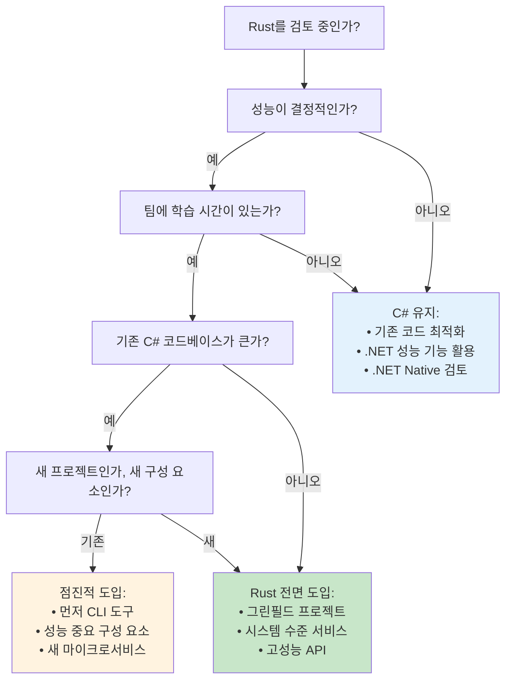

***

<a id="unsafe-code-when-and-why"></a>
### Unsafe 코드: 언제, 왜

`unsafe`는 컴파일러가 입증하지 못하는 불변식을 개발자가 보증할 때만 최소 범위로 사용합니다. FFI, 잠금 없는 자료구조, 특정 최적화에 필요할 수 있으며, 안전한 래퍼로 감싸는 것이 일반적입니다. 자세한 내용은 위의 `unsafe fn` 예와 [Rustonomicon](https://doc.rust-lang.org/nomicon/)을 참고하세요.

<a id="interop-considerations"></a>
### 상호 운용 고려 사항

C#에서는 P/Invoke·COM으로 네이티브와 연동합니다. Rust는 `extern "C"`·`cbindgen`·`uniffi` 등으로 C ABI를 맞추고, .NET 쪽에서는 동일한 ABI의 DLL을 호출하면 됩니다. 문자열·수명·스레드 모델을 경계에서 명확히 정의하세요.

<a id="performance-optimization"></a>
### 성능 최적화

`cargo build --release`, 프로파일 가이드 힌트(`#[inline]`, `LTO`), 할당 줄이기(`Vec` 예약, `SmallVec` 등), `rayon`·`tokio` 튜닝을 점진적으로 적용합니다. C#의 `Span<T>`·`ArrayPool`과 마찬가지로 **측정 후** 최적화하세요.

<a id="best-practices-for-csharp-developers"></a>
<a id="idiomatic-rust-for-c-developers"></a>
## C# 개발자를 위한 모범 사례

### 1. **사고방식 전환**
- **GC에서 소유권으로**: 데이터를 누가 소유하고 언제 해제되는지 생각합니다.
- **예외에서 Result로**: 에러 처리를 타입과 제어 흐름에 드러냅니다.
- **상속에서 합성으로**: 트레잇으로 동작을 조합합니다.
- **null에서 Option으로**: 값 부재를 타입으로 표현합니다.

### 2. **코드 구성**
```rust
// C# 솔루션처럼 프로젝트를 나눔
src/
├── main.rs          // Program.cs에 해당
├── lib.rs           // 라이브러리 진입점
├── models/          // C#의 Models/ 폴더에 해당
│   ├── mod.rs
│   ├── user.rs
│   └── product.rs
├── services/        // Services/ 폴더에 해당
│   ├── mod.rs
│   ├── user_service.rs
│   └── product_service.rs
├── controllers/     // (웹 앱의) Controllers/에 해당
├── repositories/    // Repositories/에 해당
└── utils/          // Utilities/에 해당
```

### 3. **에러 처리 전략**
```rust
// 애플리케이션 공통 Result 타입
pub type AppResult<T> = Result<T, AppError>;

#[derive(Error, Debug)]
pub enum AppError {
    #[error("데이터베이스 오류: {0}")]
    Database(#[from] sqlx::Error),
    
    #[error("HTTP 오류: {0}")]
    Http(#[from] reqwest::Error),
    
    #[error("유효성 검사 오류: {message}")]
    Validation { message: String },
    
    #[error("비즈니스 로직 오류: {message}")]
    Business { message: String },
}

// 애플리케이션 전반에서 사용
pub async fn create_user(data: CreateUserRequest) -> AppResult<User> {
    validate_user_data(&data)?;  // AppError::Validation 반환
    let user = repository.create_user(data).await?;  // AppError::Database 반환
    Ok(user)
}
```

### 4. **테스트 패턴**
```rust
// C# 단위 테스트처럼 구성
#[cfg(test)]
mod tests {
    use super::*;
    use rstest::*;  // C# [Theory]에 가까운 매개변수화 테스트
    
    #[test]
    fn test_basic_functionality() {
        // 준비
        let input = "테스트 데이터";
        
        // 실행
        let result = process_data(input);
        
        // 검증
        assert_eq!(result, "기대 출력");
    }
    
    #[rstest]
    #[case(1, 2, 3)]
    #[case(5, 5, 10)]
    #[case(0, 0, 0)]
    fn test_addition(#[case] a: i32, #[case] b: i32, #[case] expected: i32) {
        assert_eq!(add(a, b), expected);
    }
    
    #[tokio::test]  // 비동기 테스트
    async fn test_async_functionality() {
        let result = async_function().await;
        assert!(result.is_ok());
    }
}
```

<a id="common-mistakes-and-solutions"></a>
### 5. **피해야 할 흔한 실수**
```rust
// [ERROR] 상속을 그대로 옮기려 하지 말 것
// 다음은 불가:
// struct Manager : Employee  // Rust에 없음

// [OK] 트레잇으로 합성
trait Employee {
    fn get_salary(&self) -> u32;
}

trait Manager: Employee {
    fn get_team_size(&self) -> usize;
}

// [ERROR] 어디서나 unwrap() (예외를 무시하는 것과 유사)
let value = might_fail().unwrap();  // 패닉 가능!

// [OK] 에러를 적절히 처리
let value = match might_fail() {
    Ok(v) => v,
    Err(e) => {
        log::error!("작업 실패: {}", e);
        return Err(e.into());
    }
};

// [ERROR] 불필요한 clone 남발 (객체를 허투로 복사하는 것과 유사)
let data = expensive_data.clone();  // 비쌈!

// [OK] 가능하면 대여
let data = &expensive_data;  // 참조만

// [ERROR] RefCell을 남용 (모든 것을 가변처럼 쓰는 것과 유사)
struct Data {
    value: RefCell<i32>,  // 내부 가변성 — 신중히
}

// [OK] 소유·대여를 단순하게
struct Data {
    value: i32,  // 단순·명확
}
```

이 가이드는 C#에서 쌓은 지식이 Rust에서 어떻게 대응되는지, 접근 방식의 유사점과 근본적인 차이를 함께 이해하도록 돕습니다. 핵심은 Rust의 제약(소유권 등)이 초기 복잡도 대신 C#에서도 흔한 한 범주의 버그를 막도록 설계되었다는 점을 받아들이는 것입니다.


