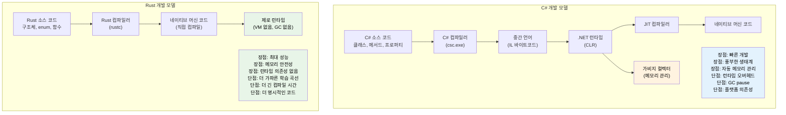

<a id="speaker-intro-and-general-approach"></a>
## 발표자 소개와 전체 진행 방식

- 발표자 소개
    - Microsoft SCHIE(Silicon and Cloud Hardware Infrastructure Engineering) 팀의 Principal Firmware Architect
    - 보안, 시스템 프로그래밍(펌웨어, 운영체제, 하이퍼바이저), CPU 및 플랫폼 아키텍처, C++ 시스템 분야 경력을 가진 업계 베테랑
    - 2017년(@AWS EC2)부터 Rust를 사용하기 시작했고, 그 이후로 계속 이 언어를 사랑하게 됨
- 이 과정은 가능한 한 상호작용적으로 진행하는 것을 목표로 합니다.
    - 전제: 독자는 C#과 .NET 개발에 익숙합니다.
    - 예제는 의도적으로 C# 개념을 Rust 대응 개념에 매핑합니다.
    - **언제든지 편하게 질문해 주세요.**

---

<a id="the-case-for-rust-for-c-developers"></a>
## C# 개발자에게 Rust가 필요한 이유

> **이 절에서 배울 내용:** 관리형 코드와 네이티브 코드의 성능 차이, Rust가 null 참조 예외와 숨겨진 제어 흐름을 어떻게 컴파일 타임에 제거하는지, 그리고 Rust가 C#을 보완하거나 대체하는 핵심 시나리오를 배웁니다.
>
> **난이도:** 🟢 입문

<a id="performance-without-the-runtime-tax"></a>
### 런타임 세금 없는 성능
```csharp
// C# - 생산성은 높지만 런타임 오버헤드가 있다
public class DataProcessor
{
    private List<int> data = new List<int>();
    
    public void ProcessLargeDataset()
    {
        // 할당이 GC를 유발한다
        for (int i = 0; i < 10_000_000; i++)
        {
            data.Add(i * 2); // GC 압박
        }
        // 처리 중 예측 불가능한 GC pause가 생길 수 있다
    }
}
// 실행 시간: 가변적 (GC 때문에 50-200ms)
// 메모리: 약 80MB (GC 오버헤드 포함)
// 예측 가능성: 낮음 (GC pause)
```

```rust
// Rust - 같은 표현력, 런타임 오버헤드는 0
struct DataProcessor {
    data: Vec<i32>,
}

impl DataProcessor {
    fn process_large_dataset(&mut self) {
        // zero-cost 추상화
        for i in 0..10_000_000 {
            self.data.push(i * 2); // GC 압박 없음
        }
        // 결정적 성능
    }
}
// 실행 시간: 일관적 (~30ms)
// 메모리: 약 40MB (정확한 할당)
// 예측 가능성: 높음 (GC 없음)
```

<a id="memory-safety-without-runtime-checks"></a>
### 런타임 검사 없는 메모리 안전성
```csharp
// C# - 런타임 비용을 내고 안전성을 확보한다
public class UnsafeOperations
{
    public string ProcessArray(int[] array)
    {
        // 런타임 경계 검사
        if (array.Length > 0)
        {
            return array[0].ToString(); // NullReferenceException 가능
        }
        return null; // null 전파
    }
    
    public void ProcessConcurrently()
    {
        var list = new List<int>();
        
        // 데이터 레이스 가능, 세심한 락 관리가 필요
        Parallel.For(0, 1000, i =>
        {
            lock (list) // 런타임 오버헤드
            {
                list.Add(i);
            }
        });
    }
}
```

```rust
// Rust - 컴파일 타임 안전성, 런타임 비용은 0
struct SafeOperations;

impl SafeOperations {
    // 컴파일 타임 null 안전성, 런타임 null 검사 없음
    fn process_array(array: &[i32]) -> Option<String> {
        array.first().map(|x| x.to_string())
        // null 참조 자체가 불가능하다
        // 안전하다고 증명되면 경계 검사도 최적화로 제거된다
    }
    
    fn process_concurrently() {
        use std::sync::{Arc, Mutex};
        use std::thread;
        
        let data = Arc::new(Mutex::new(Vec::new()));
        
        // 데이터 레이스가 컴파일 타임에 차단된다
        let handles: Vec<_> = (0..1000).map(|i| {
            let data = Arc::clone(&data);
            thread::spawn(move || {
                data.lock().unwrap().push(i);
            })
        }).collect();
        
        for handle in handles {
            handle.join().unwrap();
        }
    }
}
```

***

<a id="common-c-pain-points-that-rust-addresses"></a>
## Rust가 해결하는 C#의 대표적인 문제점

<a id="the-billion-dollar-mistake-null-references"></a>
### 1. 수십억 달러짜리 실수: null 참조
```csharp
// C# - null 참조 예외는 런타임 시한폭탄이다
public class UserService
{
    public string GetUserDisplayName(User user)
    {
        // 아래 어느 곳에서든 NullReferenceException이 날 수 있다
        return user.Profile.DisplayName.ToUpper();
        //     ^^^^^ ^^^^^^^ ^^^^^^^^^^^ ^^^^^^^
        //     런타임에 null일 수 있다
    }
    
    // nullable reference types(C# 8+)를 써도
    public string GetDisplayName(User? user)
    {
        return user?.Profile?.DisplayName?.ToUpper() ?? "Unknown";
        // 여전히 런타임 null 가능성은 남아 있다
    }
}
```

```rust
// Rust - null 안전성이 컴파일 타임에 보장된다
struct UserService;

impl UserService {
    fn get_user_display_name(user: &User) -> Option<String> {
        user.profile.as_ref()?
            .display_name.as_ref()
            .map(|name| name.to_uppercase())
        // 컴파일러가 None 처리를 강제한다
        // null 포인터 예외는 구조적으로 불가능하다
    }
    
    fn get_display_name_safe(user: Option<&User>) -> String {
        user.and_then(|u| u.profile.as_ref())
            .and_then(|p| p.display_name.as_ref())
            .map(|name| name.to_uppercase())
            .unwrap_or_else(|| "Unknown".to_string())
        // 예외 없이 명시적으로 처리된다
    }
}
```

<a id="hidden-exceptions-and-control-flow"></a>
### 2. 숨겨진 예외와 제어 흐름
```csharp
// C# - 예외는 어디서든 던져질 수 있다
public async Task<UserData> GetUserDataAsync(int userId)
{
    // 각 호출은 서로 다른 예외를 던질 수 있다
    var user = await userRepository.GetAsync(userId);        // SqlException
    var permissions = await permissionService.GetAsync(user); // HttpRequestException  
    var preferences = await preferenceService.GetAsync(user); // TimeoutException
    
    return new UserData(user, permissions, preferences);
    // 호출자는 어떤 예외가 가능한지 알기 어렵다
}
```

```rust
// Rust - 함수 시그니처에 모든 에러가 명시된다
#[derive(Debug)]
enum UserDataError {
    DatabaseError(String),
    NetworkError(String),
    Timeout,
    UserNotFound(i32),
}

async fn get_user_data(user_id: i32) -> Result<UserData, UserDataError> {
    // 가능한 에러가 모두 드러나고 처리된다
    let user = user_repository.get(user_id).await
        .map_err(UserDataError::DatabaseError)?;
    
    let permissions = permission_service.get(&user).await
        .map_err(UserDataError::NetworkError)?;
    
    let preferences = preference_service.get(&user).await
        .map_err(|_| UserDataError::Timeout)?;
    
    Ok(UserData::new(user, permissions, preferences))
    // 호출자는 어떤 에러가 가능한지 정확히 안다
}
```

<a id="correctness-the-type-system-as-a-proof-engine"></a>
### 3. 정확성: 증명 엔진으로서의 타입 시스템

Rust의 타입 시스템은 C#이 런타임에서야 잡거나, 아예 놓칠 수도 있는 논리 버그 범주를 컴파일 타임에 통째로 제거합니다.

<a id="adts-vs-sealed-class-workarounds"></a>
#### ADT vs sealed class 우회 패턴
```csharp
// C# - 판별 유니온을 흉내 내려면 sealed class 보일러플레이트가 필요하고
// 컴파일러는 여전히 완전 매칭을 강제하지 않는다.
public abstract record Shape;
public sealed record Circle(double Radius)   : Shape;
public sealed record Rectangle(double W, double H) : Shape;
public sealed record Triangle(double A, double B, double C) : Shape;

public static double Area(Shape shape) => shape switch
{
    Circle c    => Math.PI * c.Radius * c.Radius,
    Rectangle r => r.W * r.H,
    // Triangle을 빼먹어도? 컴파일은 된다. 런타임에 터진다.
    _           => throw new ArgumentException("Unknown shape")
};
// 6개월 뒤 variant를 하나 추가해도
// 수정이 필요한 47개의 switch를 컴파일러가 알려주지 않는다.
```

```rust
// Rust - ADT + 완전 매칭 = 컴파일 타임 증명
enum Shape {
    Circle { radius: f64 },
    Rectangle { w: f64, h: f64 },
    Triangle { a: f64, b: f64, c: f64 },
}

fn area(shape: &Shape) -> f64 {
    match shape {
        Shape::Circle { radius }    => std::f64::consts::PI * radius * radius,
        Shape::Rectangle { w, h }   => w * h,
        // Triangle을 빼먹으면? ERROR: non-exhaustive pattern
        Shape::Triangle { a, b, c } => {
            let s = (a + b + c) / 2.0;
            (s * (s - a) * (s - b) * (s - c)).sqrt()
        }
    }
}
// variant를 새로 추가하면 -> 수정이 필요한 모든 match를 컴파일러가 보여준다.
```

<a id="immutability-by-default-vs-opt-in-immutability"></a>
#### 기본 불변성 vs 선택적 불변성
```csharp
// C# - 기본값은 전부 가변이다
public class Config
{
    public string Host { get; set; }   // 기본적으로 가변
    public int Port { get; set; }
}

// "readonly"와 "record"가 도움은 되지만 깊은 변이는 막지 못한다.
public record ServerConfig(string Host, int Port, List<string> AllowedOrigins);

var config = new ServerConfig("localhost", 8080, new List<string> { "*.example.com" });
// record가 "불변"처럼 보여도 참조 타입 필드는 여전히 가변이다:
config.AllowedOrigins.Add("*.evil.com"); // 컴파일되고 실제로 변한다! <- 버그
// 컴파일러는 아무 경고도 주지 않는다.
```

```rust
// Rust - 기본은 불변, 변이는 명시적이며 눈에 보인다
struct Config {
    host: String,
    port: u16,
    allowed_origins: Vec<String>,
}

let config = Config {
    host: "localhost".into(),
    port: 8080,
    allowed_origins: vec!["*.example.com".into()],
};

// config.allowed_origins.push("*.evil.com".into()); // ERROR: cannot borrow as mutable

// 변이는 명시적으로 opt-in 해야 한다:
let mut config = config;
config.allowed_origins.push("*.safe.com".into()); // OK - 가변이라는 사실이 드러난다

// 시그니처의 "mut"는 모든 독자에게 "이 함수는 데이터를 바꾼다"라고 알려준다
fn add_origin(config: &mut Config, origin: String) {
    config.allowed_origins.push(origin);
}
```

<a id="functional-programming-first-class-vs-afterthought"></a>
#### 함수형 프로그래밍: 일급 시민인가, 사후 추가인가
```csharp
// C# - FP가 덧붙여진 느낌이다; LINQ는 표현력 있지만 언어가 계속 발목을 잡는다
public IEnumerable<Order> GetHighValueOrders(IEnumerable<Order> orders)
{
    return orders
        .Where(o => o.Total > 1000)   // Func<Order, bool> - 힙 할당 delegate
        .Select(o => new OrderSummary  // 익명 타입 또는 별도 클래스 필요
        {
            Id = o.Id,
            Total = o.Total
        })
        .OrderByDescending(o => o.Total);
    // 결과에 대한 완전 매칭이 없다
    // 파이프라인 어디서든 null이 스며들 수 있다
    // 순수성을 강제할 수 없다 - 어떤 람다든 부작용을 낼 수 있다
}
```

```rust
// Rust - FP가 일급 시민이다
fn get_high_value_orders(orders: &[Order]) -> Vec<OrderSummary> {
    orders.iter()
        .filter(|o| o.total > 1000)      // zero-cost closure, 힙 할당 없음
        .map(|o| OrderSummary {           // 타입 검사가 되는 구조체
            id: o.id,
            total: o.total,
        })
        .sorted_by(|a, b| b.total.cmp(&a.total)) // itertools
        .collect()
    // 파이프라인 어디에도 null이 없다
    // 클로저는 monomorphization되어 수작업 루프와 오버헤드가 같다
    // 순수성도 드러난다: &[Order]는 이 함수가 orders를 바꿀 수 없다는 뜻이다
}
```

<a id="inheritance-elegant-in-theory-fragile-in-practice"></a>
#### 상속: 이론적으로는 우아하지만 실전에서는 깨지기 쉽다
```csharp
// C# - 깨지기 쉬운 기반 클래스 문제
public class Animal
{
    public virtual string Speak() => "...";
    public void Greet() => Console.WriteLine($"I say: {Speak()}");
}

public class Dog : Animal
{
    public override string Speak() => "Woof!";
}

public class RobotDog : Dog
{
    // Greet()는 어떤 Speak()를 호출할까? Dog가 바뀌면?
    // interface + default method까지 섞이면 diamond problem
    // 강한 결합: Animal 변경이 RobotDog를 조용히 깨뜨릴 수 있다
}

// 흔한 C# 안티패턴:
// - virtual 메서드가 20개 달린 거대 base class
// - 누구도 추적 못 하는 깊은 계층 구조(5단계 이상)
// - 숨겨진 결합을 만드는 "protected" 필드
// - base class 변경으로 파생 클래스 동작이 조용히 달라짐
```

```rust
// Rust - 언어 차원에서 조합을 상속보다 우선시한다
trait Speaker {
    fn speak(&self) -> &str;
}

trait Greeter: Speaker {
    fn greet(&self) {
        println!("I say: {}", self.speak());
    }
}

struct Dog;
impl Speaker for Dog {
    fn speak(&self) -> &str { "Woof!" }
}
impl Greeter for Dog {} // 기본 greet() 사용

struct RobotDog {
    voice: String, // 조합: 자신의 데이터를 직접 소유
}
impl Speaker for RobotDog {
    fn speak(&self) -> &str { &self.voice }
}
impl Greeter for RobotDog {} // 명확하고 명시적인 동작

// 깨지기 쉬운 base class 문제가 없다 - 애초에 base class가 없다
// 숨겨진 결합이 없다 - trait는 명시적인 계약이다
// diamond problem이 없다 - trait coherence 규칙이 모호함을 막는다
// Speaker에 메서드를 추가하면? 구현이 필요한 모든 곳을 컴파일러가 알려준다
```

> **핵심 통찰:** C#에서 정확성은 하나의 훈련입니다. 개발자가 관례를 잘 지키고, 테스트를 꼼꼼히 쓰고, 코드 리뷰에서 빠진 케이스를 발견하길 기대합니다. Rust에서 정확성은 **타입 시스템의 성질**입니다. null 역참조, 누락된 variant, 의도치 않은 변이, 데이터 레이스 같은 버그 범주가 구조적으로 불가능해집니다.

***

<a id="unpredictable-performance-due-to-gc"></a>
### 4. GC로 인한 예측 불가능한 성능
```csharp
// C# - GC는 언제든 실행을 멈출 수 있다
public class HighFrequencyTrader
{
    private List<Trade> trades = new List<Trade>();
    
    public void ProcessMarketData(MarketTick tick)
    {
        // 최악의 순간에 할당이 GC를 유발할 수 있다
        var analysis = new MarketAnalysis(tick);
        trades.Add(new Trade(analysis.Signal, tick.Price));
        
        // 중요한 시장 타이밍에 여기서 GC pause가 올 수 있다
        // pause 시간: 힙 크기에 따라 1-100ms
    }
}
```

```rust
// Rust - 예측 가능하고 결정적인 성능
struct HighFrequencyTrader {
    trades: Vec<Trade>,
}

impl HighFrequencyTrader {
    fn process_market_data(&mut self, tick: MarketTick) {
        // 할당이 없고 성능이 예측 가능하다
        let analysis = MarketAnalysis::from(tick);
        self.trades.push(Trade::new(analysis.signal(), tick.price));
        
        // GC pause가 없으므로 마이크로초 이하 지연을 일관되게 유지할 수 있다
        // 성능 특성이 타입 시스템과 소유권 모델 위에 놓인다
    }
}
```

***

<a id="when-to-choose-rust-over-c"></a>
## 언제 C#보다 Rust를 선택해야 하는가

<a id="choose-rust-when"></a>
### ✅ 이런 경우 Rust를 선택하세요
- **정확성이 중요할 때**: 상태 머신, 프로토콜 구현, 금융 로직처럼 케이스 하나 놓치면 테스트 실패가 아니라 운영 사고가 되는 경우
- **성능이 핵심일 때**: 실시간 시스템, 초고빈도 거래, 게임 엔진
- **메모리 사용량이 중요할 때**: 임베디드 시스템, 클라우드 비용 최적화, 모바일 애플리케이션
- **예측 가능성이 필요할 때**: 의료 기기, 자동차, 금융 시스템
- **보안이 최우선일 때**: 암호학, 네트워크 보안, 시스템 레벨 코드
- **장시간 실행 서비스일 때**: GC pause가 문제를 일으키는 환경
- **리소스가 제한된 환경일 때**: IoT, 엣지 컴퓨팅
- **시스템 프로그래밍일 때**: CLI 도구, 데이터베이스, 웹 서버, 운영체제

<a id="stay-with-c-when"></a>
### ✅ 이런 경우 C#에 머무르세요
- **빠른 애플리케이션 개발이 중요할 때**: 비즈니스 애플리케이션, CRUD 애플리케이션
- **기존 코드베이스가 매우 클 때**: 마이그레이션 비용이 지나치게 클 경우
- **팀 전문성이 더 중요할 때**: Rust 학습 곡선이 이득을 상쇄하지 못하는 경우
- **엔터프라이즈 통합 의존성이 클 때**: .NET Framework 또는 Windows 의존성이 무거운 환경
- **GUI 애플리케이션일 때**: WPF, WinUI, Blazor 생태계
- **출시 속도가 최우선일 때**: 개발 속도가 성능보다 더 중요한 경우

<a id="consider-both-hybrid-approach"></a>
### 🔄 둘 다 고려하세요 (하이브리드 접근)
- **성능이 중요한 컴포넌트는 Rust로**: P/Invoke를 통해 C#에서 호출
- **비즈니스 로직은 C#으로**: 익숙하고 생산성이 높음
- **점진적 마이그레이션**: 새 서비스부터 Rust로 시작

***

<a id="real-world-impact-why-companies-choose-rust"></a>
## 실제 영향: 기업들이 Rust를 선택하는 이유

<a id="dropbox-storage-infrastructure"></a>
### Dropbox: 스토리지 인프라
- **이전 (Python)**: 높은 CPU 사용량, 메모리 오버헤드
- **이후 (Rust)**: 성능 10배 향상, 메모리 50% 절감
- **결과**: 인프라 비용을 수백만 달러 단위로 절감

<a id="discord-voice-video-backend"></a>
### Discord: 음성/영상 백엔드
- **이전 (Go)**: GC pause로 인한 오디오 끊김
- **이후 (Rust)**: 일관된 저지연 성능
- **결과**: 사용자 경험 향상, 서버 비용 절감

<a id="microsoft-windows-components"></a>
### Microsoft: Windows 구성 요소
- **Windows에서의 Rust**: 파일 시스템, 네트워크 스택 구성 요소
- **이점**: 성능 비용 없는 메모리 안전성
- **영향**: 보안 취약점 감소, 성능은 동일하게 유지

<a id="why-this-matters-for-c-developers"></a>
### 이것이 C# 개발자에게 중요한 이유
1. **상호 보완적인 기술**: Rust와 C#은 서로 다른 문제를 해결합니다.
2. **커리어 성장**: 시스템 프로그래밍 전문성의 가치가 점점 커지고 있습니다.
3. **성능 이해**: zero-cost abstraction을 몸으로 익히게 됩니다.
4. **안전성 사고방식**: 소유권 사고를 다른 언어에도 적용할 수 있습니다.
5. **클라우드 비용**: 성능은 곧 인프라 비용과 연결됩니다.

***

<a id="language-philosophy-comparison"></a>
## 언어 철학 비교

<a id="c-philosophy"></a>
### C#의 철학
- **생산성 우선**: 풍부한 툴링, 방대한 프레임워크, 성공하기 쉬운 기본 경로
- **관리형 런타임**: 가비지 컬렉터가 메모리를 자동으로 관리
- **엔터프라이즈 중심**: 리플렉션을 포함한 강한 타입 시스템, 폭넓은 표준 라이브러리
- **객체지향 중심**: 클래스, 상속, 인터페이스가 핵심 추상화 수단

<a id="rust-philosophy"></a>
### Rust의 철학
- **희생 없는 성능**: zero-cost abstraction, 런타임 오버헤드 없음
- **메모리 안전성**: 컴파일 타임 보장으로 크래시와 보안 취약점을 예방
- **시스템 프로그래밍**: 고수준 추상화를 유지하면서 하드웨어에 직접 접근
- **함수형 + 시스템**: 기본 불변성, 소유권 기반 리소스 관리



***

<a id="quick-reference-rust-vs-c"></a>
## 빠른 비교: Rust vs C#

| **개념** | **C#** | **Rust** | **핵심 차이** |
|-------------|--------|----------|-------------------|
| 메모리 관리 | 가비지 컬렉터 | 소유권 시스템 | zero-cost, 결정적 정리 |
| null 참조 | `null`이 어디에나 존재 | `Option<T>` | 컴파일 타임 null 안전성 |
| 에러 처리 | 예외 | `Result<T, E>` | 명시적이고 숨겨진 제어 흐름이 없음 |
| 가변성 | 기본적으로 가변 | 기본적으로 불변 | 변이는 opt-in |
| 타입 시스템 | 참조 타입 / 값 타입 | 소유권 타입 | move semantics, borrowing |
| 어셈블리 | GAC, 앱 도메인 | 크레이트 | 정적 링크, 런타임 없음 |
| 네임스페이스 | `using System.IO` | `use std::fs` | 모듈 시스템 |
| 인터페이스 | `interface IFoo` | `trait Foo` | 기본 구현 가능 |
| 제네릭 | `List<T>` where T : class | `Vec<T>` where T: Clone | zero-cost abstraction |
| 스레딩 | 락, async/await | 소유권 + Send/Sync | 데이터 레이스 방지 |
| 성능 | JIT 컴파일 | AOT 컴파일 | 예측 가능, GC pause 없음 |

***
