<a id="true-immutability-vs-record-illusions"></a>
## 진짜 불변성과 레코드 환상

> **이 절에서 배울 내용:** 왜 C#의 `record` 타입이 실제로는 완전한 불변이 아닌지(가변 필드, reflection 우회), Rust가 어떻게 컴파일 타임에 진짜 불변성을 강제하는지, 그리고 언제 내부 가변성 패턴을 써야 하는지를 배웁니다.
>
> **난이도:** 🟡 중급

<a id="c-records-immutability-theater"></a>
### C# record - 불변성 연극
```csharp
// C# record는 불변처럼 보이지만 탈출구가 있다
public record Person(string Name, int Age, List<string> Hobbies);

var person = new Person("John", 30, new List<string> { "reading" });

// 겉보기에는 모두 새 인스턴스를 만드는 것처럼 보인다:
var older = person with { Age = 31 };  // 새 record
var renamed = person with { Name = "Jonathan" };  // 새 record

// 하지만 참조 타입 필드는 여전히 가변이다!
person.Hobbies.Add("gaming");  // 원본을 바꿔 버린다!
Console.WriteLine(older.Hobbies.Count);   // 2 - older도 영향받음!
Console.WriteLine(renamed.Hobbies.Count); // 2 - renamed도 영향받음!

// init-only 프로퍼티도 reflection으로는 바꿀 수 있다
typeof(Person).GetProperty("Age")?.SetValue(person, 25);

// collection expression이 도움은 되지만 근본 문제를 해결하지는 못한다
public record BetterPerson(string Name, int Age, IReadOnlyList<string> Hobbies);

var betterPerson = new BetterPerson("Jane", 25, new List<string> { "painting" });
// 캐스팅을 통해 여전히 변경 가능:
((List<string>)betterPerson.Hobbies).Add("hacking the system");

// 심지어 "불변" 컬렉션도 완전한 해결책은 아니다
using System.Collections.Immutable;
public record SafePerson(string Name, int Age, ImmutableList<string> Hobbies);
// 더 낫기는 하지만, 규율이 필요하고 성능 비용도 든다
```

<a id="rust-true-immutability-by-default"></a>
### Rust - 기본이 진짜 불변성
```rust
#[derive(Debug, Clone)]
struct Person {
    name: String,
    age: u32,
    hobbies: Vec<String>,
}

let person = Person {
    name: "John".to_string(),
    age: 30,
    hobbies: vec!["reading".to_string()],
};

// 아래 코드는 그냥 컴파일되지 않는다:
// person.age = 31;  // ERROR: immutable field에 대입 불가
// person.hobbies.push("gaming".to_string());  // ERROR: mutable borrow 불가

// 수정하려면 반드시 'mut'로 명시적 opt-in이 필요하다:
let mut older_person = person.clone();
older_person.age = 31;  // 이제 mutation이라는 사실이 분명하다

// 또는 함수형 업데이트 패턴을 사용할 수 있다:
let renamed = Person {
    name: "Jonathan".to_string(),
    ..person  // 나머지 필드를 복사/이동 (move semantics 적용)
};

// 원본이 이동되기 전까지는 바뀌지 않음이 보장된다:
println!("{:?}", person.hobbies);  // 항상 ["reading"] - 불변

// 효율적인 불변 자료구조와 구조적 공유
use std::rc::Rc;

#[derive(Debug, Clone)]
struct EfficientPerson {
    name: String,
    age: u32,
    hobbies: Rc<Vec<String>>,  // 공유되지만 불변인 참조
}

// 새 버전을 만들어도 데이터를 효율적으로 공유할 수 있다
let person1 = EfficientPerson {
    name: "Alice".to_string(),
    age: 30,
    hobbies: Rc::new(vec!["reading".to_string(), "cycling".to_string()]),
};

let person2 = EfficientPerson {
    name: "Bob".to_string(),
    age: 25,
    hobbies: Rc::clone(&person1.hobbies),  // 공유 참조, 깊은 복사 없음
};
```



```mermaid
graph TD
    subgraph "C# record - 얕은 불변성"
        CS_RECORD["record Person(...)"]
        CS_WITH["with 표현식"]
        CS_SHALLOW["⚠️ 최상위 수준만 불변"]
        CS_REF_MUT["❌ 참조 타입 내용은 여전히 가변"]
        CS_REFLECTION["❌ reflection으로 우회 가능"]
        CS_RUNTIME["❌ 런타임 놀라움"]
        CS_DISCIPLINE["😓 팀 차원의 규율이 필요"]
        
        CS_RECORD --> CS_WITH
        CS_WITH --> CS_SHALLOW
        CS_SHALLOW --> CS_REF_MUT
        CS_RECORD --> CS_REFLECTION
        CS_REF_MUT --> CS_RUNTIME
        CS_RUNTIME --> CS_DISCIPLINE
    end
    
    subgraph "Rust - 진짜 불변성"
        RUST_STRUCT["struct Person { ... }"]
        RUST_DEFAULT["✅ 기본이 불변"]
        RUST_COMPILE["✅ 컴파일 타임 강제"]
        RUST_MUT["🔒 명시적 'mut' 필요"]
        RUST_MOVE["🔄 move semantics"]
        RUST_ZERO["⚡ 런타임 오버헤드 없음"]
        RUST_SAFE["🛡️ 메모리 안전"]
        
        RUST_STRUCT --> RUST_DEFAULT
        RUST_DEFAULT --> RUST_COMPILE
        RUST_COMPILE --> RUST_MUT
        RUST_MUT --> RUST_MOVE
        RUST_MOVE --> RUST_ZERO
        RUST_ZERO --> RUST_SAFE
    end
    
    style CS_REF_MUT fill:#ffcdd2,color:#000
    style CS_REFLECTION fill:#ffcdd2,color:#000
    style CS_RUNTIME fill:#ffcdd2,color:#000
    style RUST_COMPILE fill:#c8e6c9,color:#000
    style RUST_ZERO fill:#c8e6c9,color:#000
    style RUST_SAFE fill:#c8e6c9,color:#000
```

---

<a id="exercises"></a>
## 연습문제

<details>
<summary><strong>🏋️ 연습문제: 불변성을 증명하라</strong> (클릭해서 펼치기)</summary>

한 C# 동료가 자신의 `record`가 불변이라고 주장합니다. 아래 C# 코드를 Rust로 옮기고, 왜 Rust 버전이 진짜 불변인지 설명해 보세요.

```csharp
public record Config(string Host, int Port, List<string> AllowedOrigins);

var config = new Config("localhost", 8080, new List<string> { "example.com" });
// "Immutable" record... but:
config.AllowedOrigins.Add("evil.com"); // Compiles! List is mutable.
```

1. **정말** 불변인 Rust 구조체를 만든다.
2. `allowed_origins`를 변경하려는 시도가 **컴파일 에러**임을 보여준다.
3. mutation 없이 수정된 복사본(새 host)을 만드는 함수를 작성한다.

<details>
<summary>🔑 해답</summary>

```rust
#[derive(Debug, Clone)]
struct Config {
    host: String,
    port: u16,
    allowed_origins: Vec<String>,
}

impl Config {
    fn with_host(&self, host: impl Into<String>) -> Self {
        Config {
            host: host.into(),
            ..self.clone()
        }
    }
}

fn main() {
    let config = Config {
        host: "localhost".into(),
        port: 8080,
        allowed_origins: vec!["example.com".into()],
    };

    // config.allowed_origins.push("evil.com".into());
    // ❌ ERROR: `config.allowed_origins`를 mutable하게 빌릴 수 없다

    let production = config.with_host("prod.example.com");
    println!("Dev: {:?}", config);       // 원본은 그대로 유지
    println!("Prod: {:?}", production);  // host만 바뀐 새 복사본
}
```

**핵심 통찰:** Rust에서 `let config = ...` (`mut` 없음)은 중첩된 `Vec`까지 포함한 *값 전체 트리*를 불변으로 만듭니다. C#의 record는 *참조 자체*만 불변일 뿐, 그 안의 내용은 그렇지 않습니다.

</details>
</details>

***
