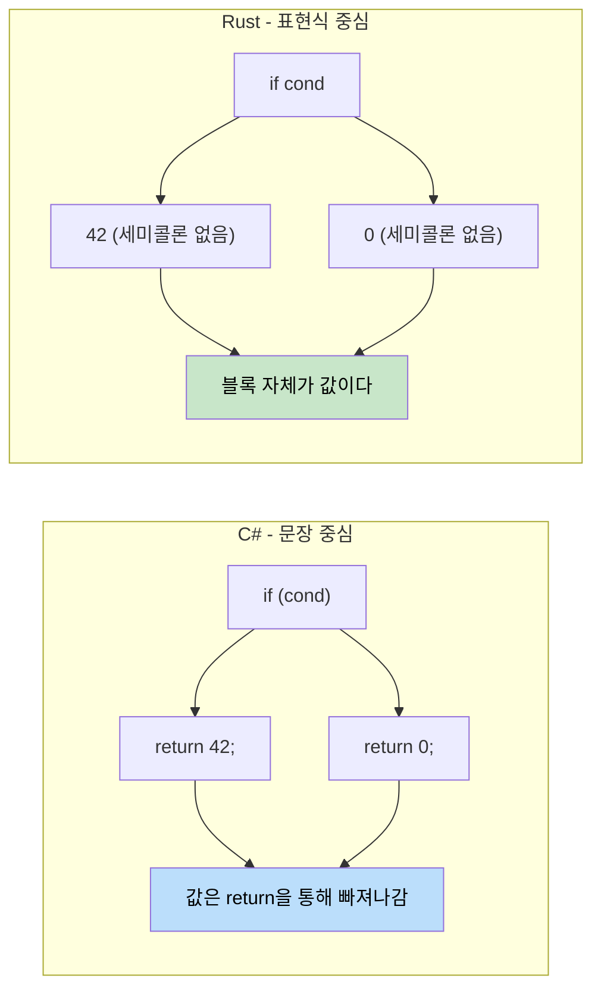

<a id="functions-vs-methods"></a>
## 함수 vs 메서드

> **이 절에서 배울 내용:** Rust와 C#에서의 함수와 메서드, 표현식과 문장의 중요한 차이, `if`/`match`/`loop`/`while`/`for` 문법, 그리고 표현식 중심 설계 덕분에 Rust에서 삼항 연산자가 거의 필요 없다는 점을 배웁니다.
>
> **난이도:** 🟢 입문

<a id="c-function-declaration"></a>
### C# 함수 선언
```csharp
// C# - 클래스 내부의 메서드
public class Calculator
{
    // 인스턴스 메서드
    public int Add(int a, int b)
    {
        return a + b;
    }
    
    // 정적 메서드
    public static int Multiply(int a, int b)
    {
        return a * b;
    }
    
    // ref 파라미터를 받는 메서드
    public void Increment(ref int value)
    {
        value++;
    }
}
```

<a id="rust-function-declaration"></a>
### Rust 함수 선언
```rust
// Rust - 독립 함수
fn add(a: i32, b: i32) -> i32 {
    a + b  // 마지막 표현식에는 return이 필요 없다
}

fn multiply(a: i32, b: i32) -> i32 {
    return a * b;  // 명시적 return도 가능하다
}

// 가변 참조를 받는 함수
fn increment(value: &mut i32) {
    *value += 1;
}

fn main() {
    let result = add(5, 3);
    println!("5 + 3 = {}", result);
    
    let mut x = 10;
    increment(&mut x);
    println!("After increment: {}", x);
}
```

<a id="expression-vs-statement-important"></a>
### 표현식 vs 문장 (중요!)



```csharp
// C# - 문장과 표현식
public int GetValue()
{
    if (condition)
    {
        return 42;  // 문장
    }
    return 0;       // 문장
}
```

```rust
// Rust - 거의 모든 것이 표현식이 될 수 있다
fn get_value(condition: bool) -> i32 {
    if condition {
        42  // 표현식 (세미콜론 없음)
    } else {
        0   // 표현식 (세미콜론 없음)
    }
    // if-else 블록 자체가 값을 돌려주는 표현식이다
}

// 더 짧게도 쓸 수 있다
fn get_value_ternary(condition: bool) -> i32 {
    if condition { 42 } else { 0 }
}
```

<a id="function-parameters-and-return-types"></a>
### 함수 매개변수와 반환 타입
```rust
// 매개변수도 없고 반환값도 없음 (unit type () 반환)
fn say_hello() {
    println!("Hello!");
}

// 여러 개의 매개변수
fn greet(name: &str, age: u32) {
    println!("{} is {} years old", name, age);
}

// tuple을 이용한 다중 반환
fn divide_and_remainder(dividend: i32, divisor: i32) -> (i32, i32) {
    (dividend / divisor, dividend % divisor)
}

fn main() {
    let (quotient, remainder) = divide_and_remainder(10, 3);
    println!("10 ÷ 3 = {} remainder {}", quotient, remainder);
}
```

***

<a id="control-flow-basics"></a>
## 제어 흐름 기초

<a id="conditional-statements"></a>
### 조건문
```csharp
// C# if 문
int x = 5;
if (x > 10)
{
    Console.WriteLine("Big number");
}
else if (x > 5)
{
    Console.WriteLine("Medium number");
}
else
{
    Console.WriteLine("Small number");
}

// C# 삼항 연산자
string message = x > 10 ? "Big" : "Small";
```

```rust
// Rust if 표현식
let x = 5;
if x > 10 {
    println!("Big number");
} else if x > 5 {
    println!("Medium number");
} else {
    println!("Small number");
}

// Rust에서 if는 표현식으로도 사용된다 (삼항 연산자와 비슷)
let message = if x > 10 { "Big" } else { "Small" };

// 여러 조건도 자연스럽게 연결 가능
let message = if x > 10 {
    "Big"
} else if x > 5 {
    "Medium"
} else {
    "Small"
};
```

<a id="loops"></a>
### 반복문과 순회
```csharp
// C# 반복문
// for 루프
for (int i = 0; i < 5; i++)
{
    Console.WriteLine(i);
}

// foreach 루프
var numbers = new[] { 1, 2, 3, 4, 5 };
foreach (var num in numbers)
{
    Console.WriteLine(num);
}

// while 루프
int count = 0;
while (count < 3)
{
    Console.WriteLine(count);
    count++;
}
```

```rust
// Rust 반복문
// 범위 기반 for 루프
for i in 0..5 {  // 0부터 4까지 (끝은 제외)
    println!("{}", i);
}

// 컬렉션 순회
let numbers = vec![1, 2, 3, 4, 5];
for num in numbers {  // 소유권을 가져간다
    println!("{}", num);
}

// 참조를 순회 (더 흔한 패턴)
let numbers = vec![1, 2, 3, 4, 5];
for num in &numbers {  // 요소를 빌린다
    println!("{}", num);
}

// while 루프
let mut count = 0;
while count < 3 {
    println!("{}", count);
    count += 1;
}

// break를 쓰는 무한 루프
let mut counter = 0;
loop {
    if counter >= 3 {
        break;
    }
    println!("{}", counter);
    counter += 1;
}
```

<a id="loop-control"></a>
### 반복 제어
```csharp
// C# 반복 제어
for (int i = 0; i < 10; i++)
{
    if (i == 3) continue;
    if (i == 7) break;
    Console.WriteLine(i);
}
```

```rust
// Rust 반복 제어
for i in 0..10 {
    if i == 3 { continue; }
    if i == 7 { break; }
    println!("{}", i);
}

// 루프 라벨 (중첩 루프에서 유용)
'outer: for i in 0..3 {
    'inner: for j in 0..3 {
        if i == 1 && j == 1 {
            break 'outer;  // 바깥 루프까지 한 번에 탈출
        }
        println!("i: {}, j: {}", i, j);
    }
}
```

***

<a id="exercises"></a>
<details>
<summary><strong>🏋️ 연습문제: 온도 변환기</strong> (클릭해서 펼치기)</summary>

**도전 과제**: 아래 C# 프로그램을 Rust다운 코드로 바꿔 보세요. 표현식, 패턴 매칭, 적절한 에러 처리를 활용해 보세요.

```csharp
// C# - 이것을 Rust로 옮겨 보자
public static double Convert(double value, string from, string to)
{
    double celsius = from switch
    {
        "F" => (value - 32.0) * 5.0 / 9.0,
        "K" => value - 273.15,
        "C" => value,
        _ => throw new ArgumentException($"Unknown unit: {from}")
    };
    return to switch
    {
        "F" => celsius * 9.0 / 5.0 + 32.0,
        "K" => celsius + 273.15,
        "C" => celsius,
        _ => throw new ArgumentException($"Unknown unit: {to}")
    };
}
```

<details>
<summary>🔑 해답</summary>

```rust
#[derive(Debug, Clone, Copy)]
enum TempUnit { Celsius, Fahrenheit, Kelvin }

fn parse_unit(s: &str) -> Result<TempUnit, String> {
    match s {
        "C" => Ok(TempUnit::Celsius),
        "F" => Ok(TempUnit::Fahrenheit),
        "K" => Ok(TempUnit::Kelvin),
        _   => Err(format!("Unknown unit: {s}")),
    }
}

fn convert(value: f64, from: TempUnit, to: TempUnit) -> f64 {
    let celsius = match from {
        TempUnit::Fahrenheit => (value - 32.0) * 5.0 / 9.0,
        TempUnit::Kelvin     => value - 273.15,
        TempUnit::Celsius    => value,
    };
    match to {
        TempUnit::Fahrenheit => celsius * 9.0 / 5.0 + 32.0,
        TempUnit::Kelvin     => celsius + 273.15,
        TempUnit::Celsius    => celsius,
    }
}

fn main() -> Result<(), String> {
    let from = parse_unit("F")?;
    let to   = parse_unit("C")?;
    println!("212°F = {:.1}°C", convert(212.0, from, to));
    Ok(())
}
```

**핵심 정리**
- enum이 매직 문자열을 대체하므로, 누락된 단위를 컴파일 타임 완전 매칭으로 잡을 수 있습니다.
- `Result<T, E>`가 예외를 대체하므로, 호출자는 시그니처만 봐도 실패 가능성을 알 수 있습니다.
- `match`는 값을 반환하는 표현식이므로, 별도 `return` 문 없이도 자연스럽게 쓸 수 있습니다.

</details>
</details>
