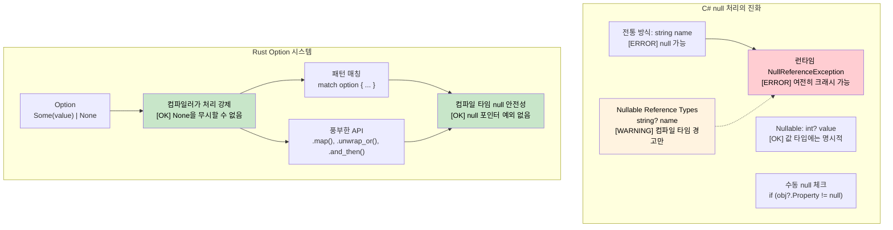

```mermaid
graph TD
    subgraph "C# 패턴 매칭의 한계"
        CS_SWITCH["switch 표현식"]
        CS_WARNING["⚠️ 컴파일러 경고만 표시"]
        CS_COMPILE["✅ 일단 컴파일은 성공"]
        CS_RUNTIME["💥 런타임 예외"]
        CS_DEPLOY["❌ 버그가 프로덕션까지 도달"]
        CS_SILENT["😰 enum 변경 시 조용히 실패"]
        
        CS_SWITCH --> CS_WARNING
        CS_WARNING --> CS_COMPILE
        CS_COMPILE --> CS_RUNTIME
        CS_RUNTIME --> CS_DEPLOY
        CS_SWITCH --> CS_SILENT
    end
    
    subgraph "Rust의 완전한 매칭"
        RUST_MATCH["match 표현식"]
        RUST_ERROR["🛑 컴파일 실패"]
        RUST_FIX["✅ 모든 경우를 반드시 처리"]
        RUST_SAFE["✅ 런타임 놀라움이 없음"]
        RUST_EVOLUTION["🔄 enum 변경 시 컴파일 깨짐"]
        RUST_REFACTOR["🛠️ 강제 리팩터링"]
        
        RUST_MATCH --> RUST_ERROR
        RUST_ERROR --> RUST_FIX
        RUST_FIX --> RUST_SAFE
        RUST_MATCH --> RUST_EVOLUTION
        RUST_EVOLUTION --> RUST_REFACTOR
    end
    
    style CS_RUNTIME fill:#ffcdd2,color:#000
    style CS_DEPLOY fill:#ffcdd2,color:#000
    style CS_SILENT fill:#ffcdd2,color:#000
    style RUST_SAFE fill:#c8e6c9,color:#000
    style RUST_REFACTOR fill:#c8e6c9,color:#000
```

<a id="exhaustive-pattern-matching-compiler-guarantees-vs-runtime-errors"></a>
## 완전한 패턴 매칭: 컴파일러 보장 vs 런타임 오류

> **학습할 내용:** 왜 C#의 `switch` 표현식은 분기를 조용히 놓칠 수 있지만 Rust의 `match`는 이를 컴파일 타임에 잡아내는지,
> null 안전성을 위한 `Option<T>`와 `Nullable<T>`의 차이, 그리고 `Result<T, E>`를 활용한 사용자 정의 오류 타입.
>
> **난이도:** 🟡 중급

### C# switch 표현식 - 여전히 불완전함
```csharp
// C# switch 표현식은 완전해 보이지만 보장되지는 않습니다.
public enum HttpStatus { Ok, NotFound, ServerError, Unauthorized }

public string HandleResponse(HttpStatus status) => status switch
{
    HttpStatus.Ok => "Success",
    HttpStatus.NotFound => "Resource not found",
    HttpStatus.ServerError => "Internal error",
    // Unauthorized 분기가 빠져 있어도 컴파일은 됩니다!
    // 런타임: System.InvalidOperationException 발생
};

// nullable 경고가 있어도 이것은 컴파일됩니다.
public class User 
{
    public string Name { get; set; }
    public bool IsActive { get; set; }
}

public string ProcessUser(User? user) => user switch
{
    { IsActive: true } => $"Active: {user.Name}",
    { IsActive: false } => $"Inactive: {user.Name}",
    // null 분기가 빠져도 경고일 뿐 오류는 아닙니다.
    // 런타임: NullReferenceException 가능
};

// enum 값을 추가해도 기존 코드가 조용히 깨집니다.
public enum HttpStatus 
{ 
    Ok, 
    NotFound, 
    ServerError, 
    Unauthorized,
    Forbidden  // 이것을 추가해도 HandleResponse()는 컴파일이 깨지지 않음!
}
```

### Rust 패턴 매칭 - 진짜 완전성
```rust
#[derive(Debug)]
enum HttpStatus {
    Ok,
    NotFound, 
    ServerError,
    Unauthorized,
}

fn handle_response(status: HttpStatus) -> &'static str {
    match status {
        HttpStatus::Ok => "Success",
        HttpStatus::NotFound => "Resource not found", 
        HttpStatus::ServerError => "Internal error",
        HttpStatus::Unauthorized => "Authentication required",
        // 분기가 하나라도 빠지면 컴파일러가 오류를 냅니다!
        // 실제로 컴파일되지 않습니다.
    }
}

// 새 변형을 추가하면 사용하는 모든 곳의 컴파일이 깨집니다.
#[derive(Debug)]
enum HttpStatus {
    Ok,
    NotFound,
    ServerError, 
    Unauthorized,
    Forbidden,  // 이것을 추가하면 handle_response() 컴파일이 깨짐
}
// 컴파일러가 모든 경우를 처리하도록 강제합니다.

// Option<T>에 대한 패턴 매칭도 완전해야 합니다.
fn process_optional_value(value: Option<i32>) -> String {
    match value {
        Some(n) => format!("Got value: {}", n),
        None => "No value".to_string(),
        // 둘 중 하나라도 빠뜨리면 컴파일 오류
    }
}
```



***

<a id="null-safety-nullablet-vs-optiont"></a>
## null 안전성: `Nullable<T>` vs `Option<T>`

### C# null 처리의 진화
```csharp
// C# - 전통적인 null 처리(오류가 나기 쉬움)
public class User
{
    public string Name { get; set; }  // null일 수 있음!
    public string Email { get; set; } // null일 수 있음!
}

public string GetUserDisplayName(User user)
{
    if (user?.Name != null)  // null 조건부 연산자
    {
        return user.Name;
    }
    return "Unknown User";
}

// C# 8+ Nullable Reference Types
public class User
{
    public string Name { get; set; }    // nullable 아님
    public string? Email { get; set; }  // 명시적으로 nullable
}

// 값 타입을 위한 C# Nullable<T>
int? maybeNumber = GetNumber();
if (maybeNumber.HasValue)
{
    Console.WriteLine(maybeNumber.Value);
}
```

### Rust `Option<T>` 시스템
```rust
// Rust - Option<T>를 통한 명시적 null 처리
#[derive(Debug)]
pub struct User {
    name: String,           // 절대 null이 아님
    email: Option<String>,  // 명시적으로 선택 사항
}

impl User {
    pub fn get_display_name(&self) -> &str {
        &self.name  // null 체크가 필요 없음 - 항상 존재함
    }
    
    pub fn get_email_or_default(&self) -> String {
        self.email
            .as_ref()
            .map(|e| e.clone())
            .unwrap_or_else(|| "no-email@example.com".to_string())
    }
}

// 패턴 매칭은 None 처리도 강제합니다.
fn handle_optional_user(user: Option<User>) {
    match user {
        Some(u) => println!("User: {}", u.get_display_name()),
        None => println!("No user found"),
        // None 분기를 처리하지 않으면 컴파일 오류!
    }
}
```



***

```rust
#[derive(Debug)]
struct Point {
    x: i32,
    y: i32,
}

fn describe_point(point: Point) -> String {
    match point {
        Point { x: 0, y: 0 } => "origin".to_string(),
        Point { x: 0, y } => format!("on y-axis at y={}", y),
        Point { x, y: 0 } => format!("on x-axis at x={}", x),
        Point { x, y } if x == y => format!("on diagonal at ({}, {})", x, y),
        Point { x, y } => format!("point at ({}, {})", x, y),
    }
}
```

### Option과 Result 타입
```csharp
// C# nullable reference types (C# 8+)
public class PersonService
{
    private Dictionary<int, string> people = new();
    
    public string? FindPerson(int id)
    {
        return people.TryGetValue(id, out string? name) ? name : null;
    }
    
    public string GetPersonOrDefault(int id)
    {
        return FindPerson(id) ?? "Unknown";
    }
    
    // 예외 기반 오류 처리
    public void SavePerson(int id, string name)
    {
        if (string.IsNullOrEmpty(name))
            throw new ArgumentException("Name cannot be empty");
        
        people[id] = name;
    }
}
```

```rust
use std::collections::HashMap;

// Rust는 null 대신 Option<T>를 사용합니다.
struct PersonService {
    people: HashMap<i32, String>,
}

impl PersonService {
    fn new() -> Self {
        PersonService {
            people: HashMap::new(),
        }
    }
    
    // Option<T> 반환 - null 없음!
    fn find_person(&self, id: i32) -> Option<&String> {
        self.people.get(&id)
    }
    
    // Option에 대한 패턴 매칭
    fn get_person_or_default(&self, id: i32) -> String {
        match self.find_person(id) {
            Some(name) => name.clone(),
            None => "Unknown".to_string(),
        }
    }
    
    // Option 메서드 사용(좀 더 함수형 스타일)
    fn get_person_or_default_functional(&self, id: i32) -> String {
        self.find_person(id)
            .map(|name| name.clone())
            .unwrap_or_else(|| "Unknown".to_string())
    }
    
    // 오류 처리를 위한 Result<T, E>
    fn save_person(&mut self, id: i32, name: String) -> Result<(), String> {
        if name.is_empty() {
            return Err("Name cannot be empty".to_string());
        }
        
        self.people.insert(id, name);
        Ok(())
    }
    
    // 연산 체이닝
    fn get_person_length(&self, id: i32) -> Option<usize> {
        self.find_person(id).map(|name| name.len())
    }
}

fn main() {
    let mut service = PersonService::new();
    
    // Result 처리
    match service.save_person(1, "Alice".to_string()) {
        Ok(()) => println!("Person saved successfully"),
        Err(error) => println!("Error: {}", error),
    }
    
    // Option 처리
    match service.find_person(1) {
        Some(name) => println!("Found: {}", name),
        None => println!("Person not found"),
    }
    
    // Option을 활용한 함수형 스타일
    let name_length = service.get_person_length(1)
        .unwrap_or(0);
    println!("Name length: {}", name_length);
    
    // 조기 반환을 위한 물음표 연산자
    fn try_operation(service: &mut PersonService) -> Result<String, String> {
        service.save_person(2, "Bob".to_string())?; // 오류면 즉시 반환
        let name = service.find_person(2).ok_or("Person not found")?; // Option을 Result로 변환
        Ok(format!("Hello, {}", name))
    }
    
    match try_operation(&mut service) {
        Ok(message) => println!("{}", message),
        Err(error) => println!("Operation failed: {}", error),
    }
}
```

<a id="custom-error-types"></a>
### 사용자 정의 오류 타입
```rust
// 사용자 정의 오류 enum 정의
#[derive(Debug)]
enum PersonError {
    NotFound(i32),
    InvalidName(String),
    DatabaseError(String),
}

impl std::fmt::Display for PersonError {
    fn fmt(&self, f: &mut std::fmt::Formatter<'_>) -> std::fmt::Result {
        match self {
            PersonError::NotFound(id) => write!(f, "Person with ID {} not found", id),
            PersonError::InvalidName(name) => write!(f, "Invalid name: '{}'", name),
            PersonError::DatabaseError(msg) => write!(f, "Database error: {}", msg),
        }
    }
}

impl std::error::Error for PersonError {}

// 사용자 정의 오류를 쓰는 향상된 PersonService
impl PersonService {
    fn save_person_enhanced(&mut self, id: i32, name: String) -> Result<(), PersonError> {
        if name.is_empty() || name.len() > 50 {
            return Err(PersonError::InvalidName(name));
        }
        
        // 실패할 수 있는 데이터베이스 작업을 시뮬레이션
        if id < 0 {
            return Err(PersonError::DatabaseError("Negative IDs not allowed".to_string()));
        }
        
        self.people.insert(id, name);
        Ok(())
    }
    
    fn find_person_enhanced(&self, id: i32) -> Result<&String, PersonError> {
        self.people.get(&id).ok_or(PersonError::NotFound(id))
    }
}

fn demo_error_handling() {
    let mut service = PersonService::new();
    
    // 서로 다른 오류 타입 처리
    match service.save_person_enhanced(-1, "Invalid".to_string()) {
        Ok(()) => println!("Success"),
        Err(PersonError::NotFound(id)) => println!("Not found: {}", id),
        Err(PersonError::InvalidName(name)) => println!("Invalid name: {}", name),
        Err(PersonError::DatabaseError(msg)) => println!("DB Error: {}", msg),
    }
}
```

---

## 연습문제

<details>
<summary><strong>🏋️ 연습문제: Option 조합자</strong> (펼쳐서 보기)</summary>

깊게 중첩된 다음 C# null 검사 코드를 Rust의 `Option` 조합자(`and_then`, `map`, `unwrap_or`)로 다시 작성해 보세요.

```csharp
string GetCityName(User? user)
{
    if (user != null)
        if (user.Address != null)
            if (user.Address.City != null)
                return user.Address.City.ToUpper();
    return "UNKNOWN";
}
```

다음 Rust 타입을 사용하세요.
```rust
struct User { address: Option<Address> }
struct Address { city: Option<String> }
```

`if let`이나 `match` 없이 **단일 표현식**으로 작성하세요.

<details>
<summary>🔑 해답</summary>

```rust
struct User { address: Option<Address> }
struct Address { city: Option<String> }

fn get_city_name(user: Option<&User>) -> String {
    user.and_then(|u| u.address.as_ref())
        .and_then(|a| a.city.as_ref())
        .map(|c| c.to_uppercase())
        .unwrap_or_else(|| "UNKNOWN".to_string())
}

fn main() {
    let user = User {
        address: Some(Address { city: Some("seattle".to_string()) }),
    };
    assert_eq!(get_city_name(Some(&user)), "SEATTLE");
    assert_eq!(get_city_name(None), "UNKNOWN");

    let no_city = User { address: Some(Address { city: None }) };
    assert_eq!(get_city_name(Some(&no_city)), "UNKNOWN");
}
```

**핵심 통찰:** `and_then`은 `Option`에 대한 Rust의 `?.` 연산자처럼 동작합니다. 각 단계가 `Option`을 반환하고, `None`이 나오면 체인이 즉시 중단됩니다. 즉, C#의 null 조건부 연산자 `?.`와 비슷하지만 더 명시적이고 타입 안전합니다.

</details>
</details>

***