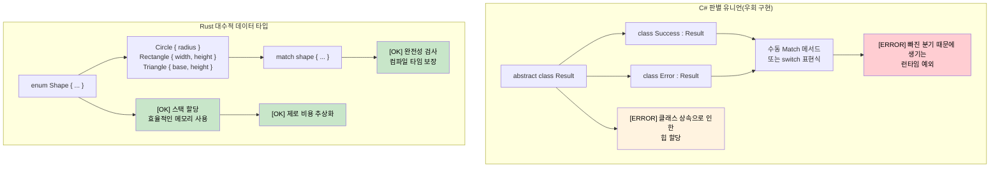

<a id="algebraic-data-types-vs-c-unions"></a>
## 대수적 데이터 타입과 C# 유니언

> **학습할 내용:** 데이터가 들어가는 Rust의 대수적 데이터 타입(enum)과 C#의 제한적인 판별 유니언 비교,
> 완전성 검사를 수행하는 `match` 표현식, 가드 절, 중첩 패턴 구조 분해.
>
> **난이도:** 🟡 중급

### C# 판별 유니언(제한적)
```csharp
// C# - 상속으로 흉내 내는 제한적인 유니언 지원
public abstract class Result
{
    public abstract T Match<T>(Func<Success, T> onSuccess, Func<Error, T> onError);
}

public class Success : Result
{
    public string Value { get; }
    public Success(string value) => Value = value;
    
    public override T Match<T>(Func<Success, T> onSuccess, Func<Error, T> onError)
        => onSuccess(this);
}

public class Error : Result
{
    public string Message { get; }
    public Error(string message) => Message = message;
    
    public override T Match<T>(Func<Success, T> onSuccess, Func<Error, T> onError)
        => onError(this);
}

// 패턴 매칭을 갖춘 C# 9+ record(개선되긴 했지만 여전히 제한적)
public abstract record Shape;
public record Circle(double Radius) : Shape;
public record Rectangle(double Width, double Height) : Shape;

public static double Area(Shape shape) => shape switch
{
    Circle(var radius) => Math.PI * radius * radius,
    Rectangle(var width, var height) => width * height,
    _ => throw new ArgumentException("Unknown shape")  // [ERROR] 런타임 오류 가능
};
```

### Rust 대수적 데이터 타입(enum)
```rust
// Rust - 완전한 패턴 매칭을 갖춘 진짜 대수적 데이터 타입
#[derive(Debug, Clone)]
pub enum Result<T, E> {
    Ok(T),
    Err(E),
}

#[derive(Debug, Clone)]
pub enum Shape {
    Circle { radius: f64 },
    Rectangle { width: f64, height: f64 },
    Triangle { base: f64, height: f64 },
}

impl Shape {
    pub fn area(&self) -> f64 {
        match self {
            Shape::Circle { radius } => std::f64::consts::PI * radius * radius,
            Shape::Rectangle { width, height } => width * height,
            Shape::Triangle { base, height } => 0.5 * base * height,
            // [OK] 변형이 하나라도 빠지면 컴파일 오류!
        }
    }
}

// 심화: enum은 서로 다른 타입도 담을 수 있습니다.
#[derive(Debug)]
pub enum Value {
    Integer(i64),
    Float(f64),
    Text(String),
    Boolean(bool),
    List(Vec<Value>),  // 재귀 타입도 가능!
}

impl Value {
    pub fn type_name(&self) -> &'static str {
        match self {
            Value::Integer(_) => "integer",
            Value::Float(_) => "float",
            Value::Text(_) => "text",
            Value::Boolean(_) => "boolean",
            Value::List(_) => "list",
        }
    }
}
```



***

## 열거형과 패턴 매칭

Rust의 enum은 C#의 enum보다 훨씬 강력합니다. 데이터를 담을 수 있고, 타입 안전한 프로그래밍의 핵심 기반이 됩니다.

### C# enum의 한계
```csharp
// C# enum - 이름 붙은 상수일 뿐입니다.
public enum Status
{
    Pending,
    Approved,
    Rejected
}

// 기반 값을 가진 C# enum
public enum HttpStatusCode
{
    OK = 200,
    NotFound = 404,
    InternalServerError = 500
}

// 복잡한 데이터를 담으려면 별도의 클래스가 필요
public abstract class Result
{
    public abstract bool IsSuccess { get; }
}

public class Success : Result
{
    public string Value { get; }
    public override bool IsSuccess => true;
    
    public Success(string value)
    {
        Value = value;
    }
}

public class Error : Result
{
    public string Message { get; }
    public override bool IsSuccess => false;
    
    public Error(string message)
    {
        Message = message;
    }
}
```

### Rust enum의 강점
```rust
// 단순 enum(C# enum과 비슷함)
#[derive(Debug, PartialEq)]
enum Status {
    Pending,
    Approved,
    Rejected,
}

// 데이터를 담는 enum(이 지점이 Rust의 강점!)
#[derive(Debug)]
enum Result<T, E> {
    Ok(T),      // T 타입의 값을 담는 성공 변형
    Err(E),     // E 타입의 오류를 담는 실패 변형
}

// 서로 다른 데이터 타입을 담는 복잡한 enum
#[derive(Debug)]
enum Message {
    Quit,                       // 데이터 없음
    Move { x: i32, y: i32 },   // 구조체 형태의 변형
    Write(String),             // 튜플 형태의 변형
    ChangeColor(i32, i32, i32), // 여러 값
}

// 실전 예시: HTTP 응답
#[derive(Debug)]
enum HttpResponse {
    Ok { body: String, headers: Vec<String> },
    NotFound { path: String },
    InternalError { message: String, code: u16 },
    Redirect { location: String },
}
```

### match를 이용한 패턴 매칭
```csharp
// C# switch 문(제한적)
public string HandleStatus(Status status)
{
    switch (status)
    {
        case Status.Pending:
            return "Waiting for approval";
        case Status.Approved:
            return "Request approved";
        case Status.Rejected:
            return "Request rejected";
        default:
            return "Unknown status"; // 항상 default가 필요
    }
}

// C# 패턴 매칭(C# 8+)
public string HandleResult(Result result)
{
    return result switch
    {
        Success success => $"Success: {success.Value}",
        Error error => $"Error: {error.Message}",
        _ => "Unknown result" // 여전히 catch-all 필요
    };
}
```

```rust
// Rust match - 완전하고 강력함
fn handle_status(status: Status) -> String {
    match status {
        Status::Pending => "Waiting for approval".to_string(),
        Status::Approved => "Request approved".to_string(),
        Status::Rejected => "Request rejected".to_string(),
        // default 불필요 - 컴파일러가 완전성을 보장함
    }
}

// 데이터 추출과 함께하는 패턴 매칭
fn handle_result<T, E>(result: Result<T, E>) -> String 
where 
    T: std::fmt::Debug,
    E: std::fmt::Debug,
{
    match result {
        Result::Ok(value) => format!("Success: {:?}", value),
        Result::Err(error) => format!("Error: {:?}", error),
        // 완전성 보장 - default 불필요
    }
}

// 복잡한 패턴 매칭
fn handle_message(msg: Message) -> String {
    match msg {
        Message::Quit => "Goodbye!".to_string(),
        Message::Move { x, y } => format!("Move to ({}, {})", x, y),
        Message::Write(text) => format!("Write: {}", text),
        Message::ChangeColor(r, g, b) => format!("Change color to RGB({}, {}, {})", r, g, b),
    }
}

// HTTP 응답 처리
fn handle_http_response(response: HttpResponse) -> String {
    match response {
        HttpResponse::Ok { body, headers } => {
            format!("Success! Body: {}, Headers: {:?}", body, headers)
        },
        HttpResponse::NotFound { path } => {
            format!("404: Path '{}' not found", path)
        },
        HttpResponse::InternalError { message, code } => {
            format!("Error {}: {}", code, message)
        },
        HttpResponse::Redirect { location } => {
            format!("Redirect to: {}", location)
        },
    }
}
```

<a id="guards-and-advanced-patterns"></a>
### 가드와 고급 패턴
```rust
// 가드를 사용하는 패턴 매칭
fn describe_number(x: i32) -> String {
    match x {
        n if n < 0 => "negative".to_string(),
        0 => "zero".to_string(),
        n if n < 10 => "single digit".to_string(),
        n if n < 100 => "double digit".to_string(),
        _ => "large number".to_string(),
    }
}

// 범위 매칭
fn describe_age(age: u32) -> String {
    match age {
        0..=12 => "child".to_string(),
        13..=19 => "teenager".to_string(),
        20..=64 => "adult".to_string(),
        65.. => "senior".to_string(),
    }
}

// 구조체와 튜플 구조 분해
```

<details>
<summary><strong>🏋️ 연습문제: 명령어 파서</strong> (펼쳐서 보기)</summary>

**도전 과제:** Rust enum을 사용해 CLI 명령 시스템을 모델링해 보세요. 문자열 입력을 `Command` enum으로 파싱하고, 각 변형을 실행하세요. 알 수 없는 명령은 적절한 오류 처리로 다루어야 합니다.

```rust
// 시작 코드 — 빈칸을 채우세요
#[derive(Debug)]
enum Command {
    // TODO: Quit, Echo(String), Move { x: i32, y: i32 }, Count(u32) 변형을 추가하세요
}

fn parse_command(input: &str) -> Result<Command, String> {
    let parts: Vec<&str> = input.splitn(2, ' ').collect();
    // TODO: parts[0]을 match하고 인수를 파싱하세요
    todo!()
}

fn execute(cmd: &Command) -> String {
    // TODO: 각 변형을 match해서 설명 문자열을 반환하세요
    todo!()
}
```

<details>
<summary>🔑 해답</summary>

```rust
#[derive(Debug)]
enum Command {
    Quit,
    Echo(String),
    Move { x: i32, y: i32 },
    Count(u32),
}

fn parse_command(input: &str) -> Result<Command, String> {
    let parts: Vec<&str> = input.splitn(2, ' ').collect();
    match parts[0] {
        "quit" => Ok(Command::Quit),
        "echo" => {
            let msg = parts.get(1).unwrap_or(&"").to_string();
            Ok(Command::Echo(msg))
        }
        "move" => {
            let args = parts.get(1).ok_or("move requires 'x y'")?;
            let coords: Vec<&str> = args.split_whitespace().collect();
            let x = coords.get(0).ok_or("missing x")?.parse::<i32>().map_err(|e| e.to_string())?;
            let y = coords.get(1).ok_or("missing y")?.parse::<i32>().map_err(|e| e.to_string())?;
            Ok(Command::Move { x, y })
        }
        "count" => {
            let n = parts.get(1).ok_or("count requires a number")?
                .parse::<u32>().map_err(|e| e.to_string())?;
            Ok(Command::Count(n))
        }
        other => Err(format!("Unknown command: {other}")),
    }
}

fn execute(cmd: &Command) -> String {
    match cmd {
        Command::Quit           => "Goodbye!".to_string(),
        Command::Echo(msg)      => msg.clone(),
        Command::Move { x, y }  => format!("Moving to ({x}, {y})"),
        Command::Count(n)       => format!("Counted to {n}"),
    }
}
```

**핵심 포인트:**
- 각 enum 변형은 서로 다른 데이터를 담을 수 있으므로 클래스 계층이 필요 없습니다.
- `match`는 모든 변형을 처리하도록 강제하므로 빠뜨린 분기를 막아 줍니다.
- `?` 연산자는 오류 전파를 깔끔하게 이어 주므로 중첩된 try-catch가 필요 없습니다.

</details>
</details>