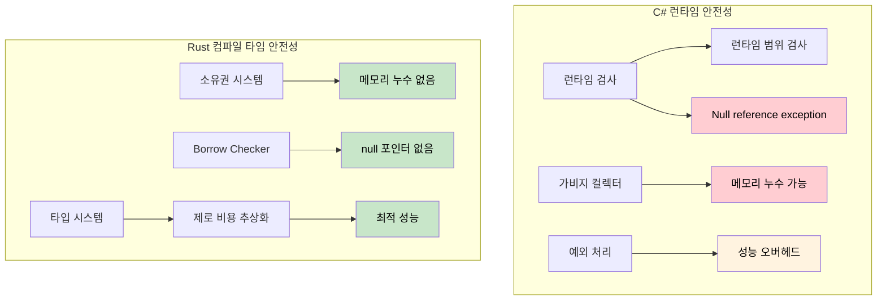

<a id="references-vs-pointers"></a>
## 참조와 포인터

> **이 장에서 배울 내용:** Rust 참조와 C# 포인터/unsafe 컨텍스트의 차이, 라이프타임의 기초,
> 그리고 컴파일 타임 안전성 증명이 왜 C#의 런타임 검사(범위 검사, null 가드)보다 더 강력한지.
>
> **난이도:** 🟡 중급

### C# 포인터(unsafe 컨텍스트)
```csharp
// C# unsafe 포인터(드물게 사용)
unsafe void UnsafeExample()
{
    int value = 42;
    int* ptr = &value;  // 값을 가리키는 포인터
    *ptr = 100;         // 역참조 후 수정
    Console.WriteLine(value);  // 100
}
```

### Rust 참조(기본적으로 안전)
```rust
// Rust 참조(항상 안전)
fn safe_example() {
    let mut value = 42;
    let ptr = &mut value;  // 가변 참조
    *ptr = 100;            // 역참조 후 수정
    println!("{}", value); // 100
}

// "unsafe" 키워드는 필요 없다 - borrow checker가 안전성을 보장한다
```

### C# 개발자를 위한 라이프타임 기초
```csharp
// C# - 무효가 될 수 있는 참조를 반환할 수도 있다
public class LifetimeIssues
{
    public string GetFirstWord(string input)
    {
        return input.Split(' ')[0];  // 새 문자열을 반환하므로 안전하다
    }
    
    public unsafe char* GetFirstChar(string input)
    {
        // 이것은 위험하다 - 관리 메모리에 대한 포인터를 반환한다
        fixed (char* ptr = input)
            return ptr;  // ❌ 잘못된 예: 메서드가 끝나면 ptr는 무효가 된다
    }
}
```

```rust
// Rust - 라이프타임 검사가 dangling reference를 막아 준다
fn get_first_word(input: &str) -> &str {
    input.split_whitespace().next().unwrap_or("")
    // ✅ 안전: 반환된 참조는 입력과 같은 라이프타임을 가진다
}

fn invalid_reference() -> &str {
    let temp = String::from("hello");
    &temp  // ❌ 컴파일 오류: temp가 충분히 오래 살지 않는다
    // temp는 함수 끝에서 drop된다
}

fn valid_reference() -> String {
    let temp = String::from("hello");
    temp  // ✅ 정상 동작: 소유권이 호출자로 이동한다
}
```

***

<a id="memory-safety-runtime-checks-vs-compile-time-proofs"></a>
## 메모리 안전성: 런타임 검사 vs 컴파일 타임 증명

### C# - 런타임 안전망
```csharp
// C#은 런타임 검사와 GC에 의존한다
public class Buffer
{
    private byte[] data;
    
    public Buffer(int size)
    {
        data = new byte[size];
    }
    
    public void ProcessData(int index)
    {
        // 런타임 범위 검사
        if (index >= data.Length)
            throw new IndexOutOfRangeException();
            
        data[index] = 42;  // 안전하지만 런타임 검사가 필요하다
    }
    
    // 이벤트/static 참조로 메모리 누수는 여전히 가능하다
    public static event Action<string> GlobalEvent;
    
    public void Subscribe()
    {
        GlobalEvent += HandleEvent;  // 메모리 누수를 만들 수 있다
        // 구독 해제를 깜빡하면 객체가 수거되지 않는다
    }
    
    private void HandleEvent(string message) { /* ... */ }
    
    // Null reference exception도 여전히 가능하다
    public void ProcessUser(User user)
    {
        Console.WriteLine(user.Name.ToUpper());  // user.Name이 null이면 NullReferenceException
    }
    
    // 배열 접근은 런타임에 실패할 수 있다
    public int GetValue(int[] array, int index)
    {
        return array[index];  // IndexOutOfRangeException 가능
    }
}
```

### Rust - 컴파일 타임 보장
```rust
struct Buffer {
    data: Vec<u8>,
}

impl Buffer {
    fn new(size: usize) -> Self {
        Buffer {
            data: vec![0; size],
        }
    }
    
    fn process_data(&mut self, index: usize) {
        // 안전하다고 증명되면 컴파일러가 범위 검사를 제거할 수도 있다
        if let Some(item) = self.data.get_mut(index) {
            *item = 42;  // 안전한 접근
        }
        // 또는 명시적인 범위 검사와 함께 인덱싱을 사용할 수 있다:
        // self.data[index] = 42;  // 범위를 벗어나면 패닉이 나지만 메모리 안전하다
    }
    
    // 메모리 누수는 불가능하다 - 소유권 시스템이 이를 막아 준다
    fn process_with_closure<F>(&mut self, processor: F) 
    where F: FnOnce(&mut Vec<u8>)
    {
        processor(&mut self.data);
        // processor가 스코프를 벗어나면 자동으로 정리된다
        // dangling reference나 메모리 누수를 만들 방법이 없다
    }
    
    // null 포인터 역참조는 불가능하다 - null 포인터가 없다!
    fn process_user(&self, user: &User) {
        println!("{}", user.name.to_uppercase());  // user.name은 null일 수 없다
    }
    
    // 배열 접근은 범위 검사를 거치거나 명시적으로 unsafe로 처리한다
    fn get_value(array: &[i32], index: usize) -> Option<i32> {
        array.get(index).copied()  // 범위를 벗어나면 None 반환
    }
    
    // 또는 스스로 안전함을 증명할 수 있다면 명시적으로 unsafe:
    unsafe fn get_value_unchecked(array: &[i32], index: usize) -> i32 {
        *array.get_unchecked(index)  // 빠르지만 범위는 직접 증명해야 한다
    }
}

struct User {
    name: String,  // Rust에서 String은 null이 될 수 없다
}

// 소유권은 use-after-free를 막아 준다
fn ownership_example() {
    let data = vec![1, 2, 3, 4, 5];
    let reference = &data[0];  // data를 borrow
    
    // drop(data);  // 오류: borrow 중에는 drop할 수 없다
    println!("{}", reference);  // 이것은 안전하다고 보장된다
}

// Borrowing은 data race를 막아 준다
fn borrowing_example(data: &mut Vec<i32>) {
    let first = &data[0];  // 불변 borrow
    // data.push(6);  // 오류: 불변 borrow 중에는 가변 borrow할 수 없다
    println!("{}", first);  // data race가 없다고 보장된다
}
```



---

## 연습문제

<details>
<summary><strong>🏋️ 연습문제: 안전성 버그 찾기</strong> (펼쳐서 보기)</summary>

이 C# 코드에는 미묘한 안전성 버그가 있습니다. 무엇이 문제인지 찾은 뒤, Rust로 등가 코드를 작성하고 왜 Rust 버전은 **컴파일되지 않는지** 설명해 보세요.

```csharp
public List<int> GetEvenNumbers(List<int> numbers)
{
    var result = new List<int>();
    foreach (var n in numbers)
    {
        if (n % 2 == 0)
        {
            result.Add(n);
            numbers.Remove(n);  // 버그: 순회 중인 컬렉션을 수정함
        }
    }
    return result;
}
```

<details>
<summary>🔑 해설</summary>

**C#의 버그**: 순회 중에 `numbers`를 수정하면 *런타임*에 `InvalidOperationException`이 발생합니다. 코드 리뷰에서 놓치기 쉽습니다.

```rust
fn get_even_numbers(numbers: &mut Vec<i32>) -> Vec<i32> {
    let mut result = Vec::new();
    for &n in numbers.iter() {
        if n % 2 == 0 {
            result.push(n);
            // numbers.retain(|&x| x != n);
            // ❌ 오류: `numbers`는 반복자가 이미 불변 borrow 중이므로
            //    가변으로 다시 borrow할 수 없다
        }
    }
    result
}

// Rust다운 방식: partition 또는 retain 사용
fn get_even_numbers_idiomatic(numbers: &mut Vec<i32>) -> Vec<i32> {
    let evens: Vec<i32> = numbers.iter().copied().filter(|n| n % 2 == 0).collect();
    numbers.retain(|n| n % 2 != 0); // 순회가 끝난 뒤 짝수를 제거
    evens
}

fn main() {
    let mut nums = vec![1, 2, 3, 4, 5, 6];
    let evens = get_even_numbers_idiomatic(&mut nums);
    assert_eq!(evens, vec![2, 4, 6]);
    assert_eq!(nums, vec![1, 3, 5]);
}
```

**핵심 통찰**: Rust의 borrow checker는 "순회 중 변경"이라는 버그 범주 전체를 컴파일 타임에 막습니다. C#은 이를 런타임에 잡고, 많은 언어는 아예 잡지 못합니다.

</details>
</details>

***
