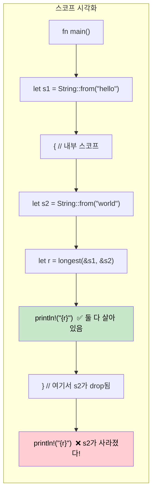

<a id="lifetimes-telling-the-compiler-how-long-references-live"></a>
## 라이프타임: 참조가 얼마나 오래 살아 있는지 컴파일러에 알려주기

> **이 장에서 배울 내용:** 라이프타임이 왜 필요한지(GC가 없기 때문에 컴파일러가 증명이 필요함), 라이프타임 표기 문법,
> 생략 규칙, 구조체의 라이프타임, `'static` 라이프타임, 그리고 흔한 borrow checker 오류와 해결 방법.
>
> **난이도:** 🔴 고급

C# 개발자는 참조의 수명을 거의 의식하지 않습니다. 가비지 컬렉터가 도달 가능성을 처리해 주기 때문입니다. Rust에서는 컴파일러가 모든 참조가 사용되는 동안 유효하다는 *증거*가 필요합니다. 라이프타임이 바로 그 증거입니다.

### 라이프타임이 필요한 이유
```rust
// 이 코드는 컴파일되지 않는다 - 컴파일러가 반환된 참조의 유효성을 증명할 수 없다
fn longest(a: &str, b: &str) -> &str {
    if a.len() > b.len() { a } else { b }
}
// 오류: lifetime specifier가 없다 - 컴파일러는 반환값이
// `a`를 borrow하는지 `b`를 borrow하는지 알 수 없다
```

### 라이프타임 표기
```rust
// 라이프타임 'a는 "반환값은 두 입력이 공통으로 유효한 동안 살아 있다"는 뜻
fn longest<'a>(a: &'a str, b: &'a str) -> &'a str {
    if a.len() > b.len() { a } else { b }
}

fn main() {
    let result;
    let string1 = String::from("long string");
    {
        let string2 = String::from("xyz");
        result = longest(&string1, &string2);
        println!("Longest: {result}"); // ✅ 여기서는 두 참조 모두 유효하다
    }
    // println!("{result}"); // ❌ 오류: string2가 충분히 오래 살지 않는다
}
```

### C#와 비교
```csharp
// C# - 어떤 참조라도 남아 있으면 GC가 객체를 살려 둔다
string Longest(string a, string b) => a.Length > b.Length ? a : b;

// 라이프타임 문제를 신경 쓸 필요가 없다 - GC가 도달 가능성을 자동으로 추적한다
// 하지만 GC 정지 시간, 예측 불가능한 메모리 사용, 컴파일 타임 증명 부재라는 대가가 있다
```

### 라이프타임 생략 규칙

대부분의 경우에는 **라이프타임 표기를 직접 쓸 필요가 없습니다**. 컴파일러가 다음 세 규칙을 자동으로 적용합니다.

| 규칙 | 설명 | 예시 |
|------|------|------|
| **규칙 1** | 각 참조 매개변수는 자기만의 라이프타임을 가진다 | `fn foo(x: &str, y: &str)` → `fn foo<'a, 'b>(x: &'a str, y: &'b str)` |
| **규칙 2** | 입력 라이프타임이 정확히 하나면, 모든 출력 라이프타임에 그 라이프타임이 적용된다 | `fn first(s: &str) -> &str` → `fn first<'a>(s: &'a str) -> &'a str` |
| **규칙 3** | 입력 중 하나가 `&self` 또는 `&mut self`면, 그 라이프타임이 모든 출력에 적용된다 | `fn name(&self) -> &str` → `&self` 때문에 동작 |

```rust
// 다음 두 함수는 동일하다 - 컴파일러가 라이프타임을 자동으로 넣어 준다:
fn first_word(s: &str) -> &str { /* ... */ }            // 생략된 버전
fn first_word<'a>(s: &'a str) -> &'a str { /* ... */ } // 명시한 버전

// 하지만 이 경우는 명시가 필요하다 - 입력이 둘인데 반환값이 어느 쪽을 borrow하는가?
fn longest<'a>(a: &'a str, b: &'a str) -> &'a str { /* ... */ }
```

### 구조체의 라이프타임
```rust
// 데이터를 소유하지 않고 borrow하는 구조체
struct Excerpt<'a> {
    text: &'a str,  // 이 구조체보다 오래 살아야 하는 어떤 String을 borrow한다
}

impl<'a> Excerpt<'a> {
    fn new(text: &'a str) -> Self {
        Excerpt { text }
    }

    fn first_sentence(&self) -> &str {
        self.text.split('.').next().unwrap_or(self.text)
    }
}

fn main() {
    let novel = String::from("Call me Ishmael. Some years ago...");
    let excerpt = Excerpt::new(&novel); // excerpt는 novel을 borrow한다
    println!("First sentence: {}", excerpt.first_sentence());
    // excerpt가 존재하는 동안 novel은 살아 있어야 한다
}
```

```csharp
// C#에 대응되는 코드 - 라이프타임 걱정은 없지만 컴파일 타임 보장도 없다
class Excerpt
{
    public string Text { get; }
    public Excerpt(string text) => Text = text;
    public string FirstSentence() => Text.Split('.')[0];
}
// 참조 대상이 다른 곳에서 바뀌더라도 컴파일 타임에 검증되지는 않는다.
```

### `'static` 라이프타임
```rust
// 'static은 "프로그램 전체 실행 시간 동안 살아 있다"는 뜻
let s: &'static str = "I'm a string literal"; // 바이너리에 저장되므로 항상 유효하다

// 'static을 자주 보는 곳:
// 1. 문자열 리터럴
// 2. 전역 상수
// 3. Thread::spawn은 'static을 요구한다(스레드가 호출자보다 오래 살 수 있기 때문)
std::thread::spawn(move || {
    // 스레드로 보내는 클로저는 데이터를 소유하거나 'static 참조를 써야 한다
    println!("{s}"); // OK: &'static str
});

// 'static은 "불멸"을 뜻하지 않는다 - "필요하다면 영원히 살 수 있다"는 뜻이다
let owned = String::from("hello");
// owned는 'static이 아니지만, 스레드로 move할 수는 있다(소유권 이전)
```

### 흔한 Borrow Checker 오류와 해결법

| 오류 | 원인 | 해결법 |
|------|------|--------|
| `missing lifetime specifier` | 입력 참조가 여러 개라 출력이 어느 것을 borrow하는지 모호함 | 출력이 어떤 입력과 연결되는지 `<'a>` 표기를 추가한다 |
| `does not live long enough` | 참조가 가리키는 데이터보다 오래 살아남음 | 데이터의 스코프를 늘리거나, 참조 대신 소유한 값을 반환한다 |
| `cannot borrow as mutable` | 불변 borrow가 아직 살아 있음 | 변경 전에 불변 참조를 먼저 사용하거나, 코드를 재구성한다 |
| `cannot move out of borrowed content` | borrow된 데이터의 소유권을 가져가려 함 | `.clone()`을 쓰거나, move가 필요 없도록 구조를 바꾼다 |
| `lifetime may not live long enough` | 구조체의 borrow가 원본 데이터보다 오래 남으려 함 | 원본 데이터의 스코프가 구조체 사용 전체를 감싸도록 보장한다 |

### 라이프타임 스코프 시각화



### 여러 라이프타임 매개변수

때로는 서로 다른 출처에서 온 참조가 서로 다른 라이프타임을 가집니다.

```rust
// 두 개의 독립된 라이프타임: 반환값은 'a에서만 borrow하고 'b에서는 borrow하지 않는다
fn first_with_context<'a, 'b>(data: &'a str, _context: &'b str) -> &'a str {
    // 반환값은 data만 borrow한다 - context는 더 짧아도 된다
    data.split(',').next().unwrap_or(data)
}

fn main() {
    let data = String::from("alice,bob,charlie");
    let result;
    {
        let context = String::from("user lookup"); // 더 짧은 라이프타임
        result = first_with_context(&data, &context);
    } // context는 drop되지만 result는 data만 borrow하므로 안전하다 ✅
    println!("{result}");
}
```

```csharp
// C# - 라이프타임 추적이 없으므로 "A에서는 borrow하지만 B에서는 아니다"를 표현할 수 없다
string FirstWithContext(string data, string context) => data.Split(',')[0];
// GC 언어에서는 괜찮지만, Rust는 GC 없이도 안전함을 증명할 수 있다
```

### 실전에서 자주 보는 라이프타임 패턴

**패턴 1: 참조를 반환하는 파서**
```rust
// 입력에서 borrow한 슬라이스를 담아 돌려주는 파서
struct CsvRow<'a> {
    fields: Vec<&'a str>,
}

fn parse_csv_line(line: &str) -> CsvRow<'_> {
    // '_'는 "입력으로부터 라이프타임을 추론하라"는 뜻이다
    CsvRow {
        fields: line.split(',').collect(),
    }
}
```

**패턴 2: "애매하면 소유한 값을 반환하기"**
```rust
// 라이프타임이 복잡해지면 소유한 값을 반환하는 것이 실용적인 해법이다
fn format_greeting(first: &str, last: &str) -> String {
    // 소유한 String을 반환하므로 라이프타임 표기가 필요 없다
    format!("Hello, {first} {last}!")
}

// borrow는 다음 경우에만 고려하라:
// 1. 성능이 중요하다(할당을 피하고 싶다)
// 2. 입력과 출력의 라이프타임 관계가 명확하다
```

**패턴 3: 제네릭에 대한 라이프타임 바운드**
```rust
// "T는 적어도 'a만큼은 살아 있어야 한다"
fn store_reference<'a, T: 'a>(cache: &mut Vec<&'a T>, item: &'a T) {
    cache.push(item);
}

// trait object에서 흔히 보인다: Box<dyn Display + 'a>
fn make_printer<'a>(text: &'a str) -> Box<dyn std::fmt::Display + 'a> {
    Box::new(text)
}
```

### 언제 `'static`을 써야 할까

| 상황 | `'static` 사용? | 대안 |
|------|:--------------:|------|
| 문자열 리터럴 | ✅ 예 - 항상 `'static`이다 | — |
| `thread::spawn` 클로저 | 자주 사용 - 스레드가 호출자보다 오래 살 수 있음 | borrow한 데이터에는 `thread::scope` 사용 |
| 전역 설정 | ✅ `lazy_static!` 또는 `OnceLock` | 매개변수로 참조 전달 |
| 오래 저장하는 trait object | 자주 사용 - `Box<dyn Trait + 'static>` | 컨테이너를 `'a`로 매개변수화 |
| 일시적인 borrow | ❌ 사용하지 말 것 - 제약이 과해진다 | 실제 라이프타임을 사용 |

<details>
<summary><strong>🏋️ 연습문제: 라이프타임 표기</strong> (펼쳐서 보기)</summary>

**도전 과제**: 아래 코드가 컴파일되도록 올바른 라이프타임 표기를 추가해 보세요.

```rust
struct Config {
    db_url: String,
    api_key: String,
}

// TODO: 라이프타임 표기를 추가해 보세요
fn get_connection_info(config: &Config) -> (&str, &str) {
    (&config.db_url, &config.api_key)
}

// TODO: 이 구조체는 Config를 borrow한다 - 라이프타임 매개변수를 추가하라
struct ConnectionInfo {
    db_url: &str,
    api_key: &str,
}
```

<details>
<summary>🔑 해설</summary>

```rust
struct Config {
    db_url: String,
    api_key: String,
}

// 규칙 3은 적용되지 않는다(&self가 아님), 규칙 2가 적용된다(입력이 하나이므로 출력도 그 라이프타임을 따른다)
// 따라서 함수에는 별도 표기가 필요 없다!
fn get_connection_info(config: &Config) -> (&str, &str) {
    (&config.db_url, &config.api_key)
}

// 구조체에는 라이프타임 표기가 필요하다:
struct ConnectionInfo<'a> {
    db_url: &'a str,
    api_key: &'a str,
}

fn make_info<'a>(config: &'a Config) -> ConnectionInfo<'a> {
    ConnectionInfo {
        db_url: &config.db_url,
        api_key: &config.api_key,
    }
}
```

**핵심 요점**: 함수에서는 라이프타임 생략 규칙 덕분에 표기를 안 써도 되는 경우가 많지만, 데이터를 borrow하는 구조체에는 항상 명시적인 `<'a>`가 필요합니다.

</details>
</details>

***
