<a id="smart-pointers-when-single-ownership-isnt-enough"></a>
## 스마트 포인터: 단일 소유권만으로는 부족할 때

> **이 장에서 배울 내용:** `Box<T>`, `Rc<T>`, `Arc<T>`, `Cell<T>`, `RefCell<T>`, `Cow<'a, T>`를 언제 써야 하는지,
> C#의 GC가 관리하는 참조와 어떻게 다른지, Rust의 `IDisposable`에 해당하는 `Drop`,
> `Deref` 강제 변환, 그리고 올바른 스마트 포인터를 고르는 결정 트리.
>
> **난이도:** 🔴 고급

C#에서는 거의 모든 객체가 GC가 관리하는 참조처럼 동작합니다. Rust에서는 단일 소유권이 기본이지만, 때로는 공유 소유권, 힙 할당, 내부 가변성이 필요합니다. 그런 상황에서 스마트 포인터를 사용합니다.

### Box&lt;T&gt; — 단순한 힙 할당
```rust
// 스택 할당(Rust의 기본)
let x = 42;            // 스택에 저장

// Box를 이용한 힙 할당
let y = Box::new(42);  // 힙에 저장, C#의 `new int(42)`처럼 boxing된 상태와 유사
println!("{}", y);     // 자동 역참조: 42 출력

// 흔한 용도: 재귀 타입(컴파일 타임에 크기를 알 수 없음)
#[derive(Debug)]
enum List {
    Cons(i32, Box<List>),  // Box 덕분에 포인터 크기로 고정된다
    Nil,
}

let list = List::Cons(1, Box::new(List::Cons(2, Box::new(List::Nil))));
```

```csharp
// C# - 참조 타입은 원래 힙에 올라간다
// Rust에서만 스택이 기본이기 때문에 Box<T>가 필요하다
var list = new LinkedListNode<int>(1);  // 항상 힙 할당
```

### Rc&lt;T&gt; — 공유 소유권(단일 스레드)
```rust
use std::rc::Rc;

// 같은 데이터를 여러 소유자가 가질 수 있다 - C#의 여러 참조와 비슷하다
let shared = Rc::new(vec![1, 2, 3]);
let clone1 = Rc::clone(&shared); // 참조 카운트: 2
let clone2 = Rc::clone(&shared); // 참조 카운트: 3

println!("Count: {}", Rc::strong_count(&shared)); // 3
// 마지막 Rc가 스코프를 벗어날 때 데이터가 drop된다

// 흔한 용도: 공유 설정, 그래프 노드, 트리 구조
```

### Arc&lt;T&gt; — 공유 소유권(스레드 안전)
```rust
use std::sync::Arc;
use std::thread;

// Arc = Atomic Reference Counting - 스레드 간 공유 가능
let data = Arc::new(vec![1, 2, 3]);

let handles: Vec<_> = (0..3).map(|i| {
    let data = Arc::clone(&data);
    thread::spawn(move || {
        println!("Thread {i}: {:?}", data);
    })
}).collect();

for h in handles { h.join().unwrap(); }
```

```csharp
// C# - 참조는 기본적으로 스레드 간 전달할 수 있다(GC가 관리)
var data = new List<int> { 1, 2, 3 };
// 자유롭게 공유할 수 있지만, 변경 자체가 안전해지는 것은 아니다!
```

### Cell&lt;T&gt;와 RefCell&lt;T&gt; — 내부 가변성
```rust
use std::cell::RefCell;

// 공유 참조 뒤에 있는 데이터를 바꿔야 할 때가 있다.
// RefCell은 borrow 검사를 컴파일 타임이 아니라 런타임으로 옮긴다.
struct Logger {
    entries: RefCell<Vec<String>>,
}

impl Logger {
    fn new() -> Self {
        Logger { entries: RefCell::new(Vec::new()) }
    }

    fn log(&self, msg: &str) { // &mut self가 아니라 &self!
        self.entries.borrow_mut().push(msg.to_string());
    }

    fn dump(&self) {
        for entry in self.entries.borrow().iter() {
            println!("{entry}");
        }
    }
}
// ⚠️ RefCell은 borrow 규칙을 어기면 런타임에 panic한다
// 가급적 적게 사용하고, 가능하면 컴파일 타임 검사를 우선하라
```

### Cow&lt;'a, str&gt; — 쓰기 시 복사(Clone on Write)
```rust
use std::borrow::Cow;

// 어떤 &str은 수정이 필요할 수도 있고 아닐 수도 있다
fn normalize(input: &str) -> Cow<'_, str> {
    if input.contains('\t') {
        // 수정이 필요할 때만 할당한다
        Cow::Owned(input.replace('\t', "    "))
    } else {
        // 원본을 borrow - 할당 없음
        Cow::Borrowed(input)
    }
}

let clean = normalize("hello");           // Cow::Borrowed - 할당 없음
let dirty = normalize("hello\tworld");    // Cow::Owned - 할당 발생
// 둘 다 Deref를 통해 &str처럼 사용할 수 있다
println!("{clean} / {dirty}");
```

<a id="drop-rusts-idisposable"></a>
### Drop: Rust의 `IDisposable`

C#에서는 `IDisposable`과 `using`으로 리소스를 정리합니다. Rust에서 이에 해당하는 것은 `Drop` 트레잇인데, **수동으로 기억해서 적용하는 방식이 아니라 자동**이라는 차이가 있습니다.

```csharp
// C# - 'using'을 쓰거나 Dispose()를 직접 호출해야 한다
using var file = File.OpenRead("data.bin");
// 스코프가 끝나면 Dispose() 호출

// 'using'을 잊으면 리소스 누수!
var file2 = File.OpenRead("data.bin");
// GC가 언젠가는 finalize할 수 있지만 시점은 예측할 수 없다
```

```rust
// Rust - 값이 스코프를 벗어나면 Drop이 자동으로 실행된다
{
    let file = File::open("data.bin")?;
    // file 사용...
}   // 여기서 file.drop() 호출 - 결정적이며 'using'이 필요 없다

// 사용자 정의 Drop(C#에서 IDisposable 구현과 유사)
struct TempFile {
    path: std::path::PathBuf,
}

impl Drop for TempFile {
    fn drop(&mut self) {
        // TempFile이 스코프를 벗어나면 반드시 실행된다
        let _ = std::fs::remove_file(&self.path);
        println!("Cleaned up {:?}", self.path);
    }
}

fn main() {
    let tmp = TempFile { path: "scratch.tmp".into() };
    // ... tmp 사용 ...
}   // 여기서 scratch.tmp가 자동으로 삭제된다
```

**C#과의 핵심 차이**: Rust에서는 *모든* 타입이 결정적인 정리를 가질 수 있습니다. `using`을 깜빡할 일이 없습니다. 깜빡할 대상 자체가 없기 때문입니다. 소유자가 스코프를 벗어나면 `Drop`이 실행됩니다. 이 패턴을 **RAII**(Resource Acquisition Is Initialization)라고 합니다.

> **규칙**: 파일 핸들, 네트워크 연결, 락 가드, 임시 파일처럼 리소스를 잡고 있는 타입이라면 `Drop` 구현을 고려하세요. 소유권 시스템이 정확히 한 번 실행되도록 보장합니다.

### Deref 강제 변환: 스마트 포인터 자동 풀기

Rust는 메서드를 호출하거나 함수를 넘길 때 스마트 포인터를 자동으로 "풀어" 줍니다. 이를 **Deref 강제 변환**이라고 합니다.

```rust
let boxed: Box<String> = Box::new(String::from("hello"));

// Deref 강제 변환 체인: Box<String> → String → str
println!("Length: {}", boxed.len());   // str::len() 호출 - 자동 역참조!

fn greet(name: &str) {
    println!("Hello, {name}");
}

let s = String::from("Alice");
greet(&s);       // &String → &str
greet(&boxed);   // &Box<String> → &String → &str - 두 단계!
```

```csharp
// C#에는 직접 대응되는 기능이 없다 - 명시적 캐스트나 .ToString()이 필요하다
// 가장 비슷한 것은 암시적 변환 연산자지만, 그것도 직접 정의해야 한다
```

**왜 중요한가?** `&str`을 기대하는 곳에 `&String`을, `&[T]`를 기대하는 곳에 `&Vec<T>`를, `&T`를 기대하는 곳에 `&Box<T>`를 명시적 변환 없이 넘길 수 있기 때문입니다. 그래서 Rust API는 보통 `&String`이나 `&Vec<T>`보다 `&str`, `&[T]`를 받도록 설계됩니다.

### Rc vs Arc: 언제 무엇을 쓸까

| | `Rc<T>` | `Arc<T>` |
|---|---|---|
| **스레드 안전성** | ❌ 단일 스레드 전용 | ✅ 스레드 안전(원자적 연산) |
| **오버헤드** | 낮음(비원자 참조 카운트) | 높음(원자 참조 카운트) |
| **컴파일러 강제** | `thread::spawn`에 넘기면 컴파일되지 않음 | 어디서나 사용 가능 |
| **함께 쓰는 타입** | 변경이 필요하면 `RefCell<T>` | 변경이 필요하면 `Mutex<T>` 또는 `RwLock<T>` |

**실전 감각**: 우선 `Rc`부터 생각하세요. 정말 `Arc`가 필요하면 컴파일러가 알려 줍니다.

### 결정 트리: 어떤 스마트 포인터를 써야 할까?

```mermaid
graph TD
    START["공유 소유권이나<br/>힙 할당이 필요한가?"]
    HEAP["힙 할당만 필요하나?"]
    SHARED["공유 소유권이 필요한가?"]
    THREADED["스레드 간 공유인가?"]
    MUTABLE["내부 가변성이 필요한가?"]
    MAYBE_OWN["어떤 때는 borrow,<br/>어떤 때는 own인가?"]

    BOX["Box&lt;T&gt; 사용"]
    RC["Rc&lt;T&gt; 사용"]
    ARC["Arc&lt;T&gt; 사용"]
    REFCELL["RefCell&lt;T&gt; 사용<br/>(또는 Rc&lt;RefCell&lt;T&gt;&gt;)"]
    MUTEX["Arc&lt;Mutex&lt;T&gt;&gt; 사용"]
    COW["Cow&lt;'a, T&gt; 사용"]
    OWN["소유 타입 사용<br/>(String, Vec 등)"]

    START -->|예| HEAP
    START -->|아니오| OWN
    HEAP -->|예| BOX
    HEAP -->|공유 필요| SHARED
    SHARED -->|단일 스레드| RC
    SHARED -->|멀티스레드| THREADED
    THREADED -->|읽기 전용| ARC
    THREADED -->|읽기 + 쓰기| MUTEX
    RC -->|변경 필요?| MUTABLE
    MUTABLE -->|예| REFCELL
    MAYBE_OWN -->|예| COW

    style BOX fill:#e3f2fd,color:#000
    style RC fill:#e8f5e8,color:#000
    style ARC fill:#c8e6c9,color:#000
    style REFCELL fill:#fff3e0,color:#000
    style MUTEX fill:#fff3e0,color:#000
    style COW fill:#e3f2fd,color:#000
    style OWN fill:#f5f5f5,color:#000
```



<details>
<summary><strong>🏋️ 연습문제: 상황에 맞는 스마트 포인터 고르기</strong> (펼쳐서 보기)</summary>

**도전 과제**: 각 상황에 맞는 스마트 포인터를 고르고, 이유를 설명해 보세요.

1. 재귀적인 트리 자료구조
2. 여러 컴포넌트가 읽기만 하는 공유 설정 객체(단일 스레드)
3. HTTP 핸들러 스레드 간에 공유되는 요청 카운터
4. borrow한 문자열 또는 소유한 문자열을 상황에 따라 반환할 수 있는 캐시
5. 공유 참조를 통해서도 변경이 필요한 로깅 버퍼

<details>
<summary>🔑 해설</summary>

1. **`Box<T>`** — 재귀 타입은 컴파일 타임에 크기를 고정하려면 간접 참조가 필요하다
2. **`Rc<T>`** — 단일 스레드에서 읽기 전용 공유이므로 `Arc` 오버헤드가 필요 없다
3. **`Arc<Mutex<u64>>`** — 스레드 간 공유(`Arc`)와 변경(`Mutex`)이 모두 필요하다
4. **`Cow<'a, str>`** — 캐시 히트면 `&str`, 미스면 `String`을 반환할 수 있다
5. **`RefCell<Vec<String>>`** — `&self` 뒤에서 내부 가변성이 필요하다(단일 스레드)

**실전 감각**: 먼저 소유 타입부터 생각하세요. 간접 참조가 필요하면 `Box`, 공유가 필요하면 `Rc`/`Arc`, 내부 가변성이 필요하면 `RefCell`/`Mutex`, 흔한 경우에 복사를 피하고 싶으면 `Cow`를 사용합니다.

</details>
</details>

***
