```mermaid
graph TD
    subgraph "C# 메모리 관리"
        CS_ALLOC["객체 할당<br/>new Person()"]
        CS_HEAP["관리 힙"]
        CS_REF["참조가 힙을 가리킴"]
        CS_GC_CHECK["GC가 주기적으로<br/>도달 불가능 객체를 검사"]
        CS_SWEEP["마크 앤 스윕<br/>수집"]
        CS_PAUSE["[오류] GC 일시 정지 시간"]
        
        CS_ALLOC --> CS_HEAP
        CS_HEAP --> CS_REF
        CS_REF --> CS_GC_CHECK
        CS_GC_CHECK --> CS_SWEEP
        CS_SWEEP --> CS_PAUSE
        
        CS_ISSUES["[오류] 비결정적 정리<br/>[오류] 메모리 압박<br/>[오류] 종료 처리의 복잡성<br/>[좋음] 사용은 쉬움"]
    end
    
    subgraph "Rust 소유권 시스템"
        RUST_ALLOC["값 생성<br/>Person { ... }"]
        RUST_OWNER["단일 소유자<br/>스택 또는 힙"]
        RUST_BORROW["대여 시스템<br/>&T, &mut T"]
        RUST_SCOPE["스코프 기반 정리<br/>Drop 트레잇"]
        RUST_COMPILE["컴파일 타임 검증"]
        
        RUST_ALLOC --> RUST_OWNER
        RUST_OWNER --> RUST_BORROW
        RUST_BORROW --> RUST_SCOPE
        RUST_SCOPE --> RUST_COMPILE
        
        RUST_BENEFITS["[좋음] 결정적 정리<br/>[좋음] 런타임 비용 0<br/>[좋음] 메모리 누수 없음<br/>[오류] 학습 곡선"]
    end
    
    style CS_ISSUES fill:#ffebee,color:#000
    style RUST_BENEFITS fill:#e8f5e8,color:#000
    style CS_PAUSE fill:#ffcdd2,color:#000
    style RUST_COMPILE fill:#c8e6c9,color:#000
```

<a id="understanding-ownership"></a>
## 소유권 이해하기

> **이 장에서 배울 내용:** Rust의 소유권 시스템, 왜 `let s2 = s1`이 `s1`을 무효화하는지(C#의 참조 복사와 달리),
> 세 가지 소유권 규칙, `Copy` 타입과 `Move` 타입의 차이, `&`와 `&mut`를 이용한 borrowing,
> 그리고 borrow checker가 가비지 컬렉션을 어떻게 대체하는지.
>
> **난이도:** 🟡 중급

소유권은 Rust의 가장 독특한 기능이자 C# 개발자에게 가장 큰 개념적 전환점입니다. 차근차근 살펴봅시다.

### C# 메모리 모델 복습
```csharp
// C# - 자동 메모리 관리
public void ProcessData()
{
    var data = new List<int> { 1, 2, 3, 4, 5 };
    ProcessList(data);
    // 여기서도 data에 계속 접근할 수 있다
    Console.WriteLine(data.Count);  // 정상 동작
    
    // 더 이상 참조가 남지 않으면 GC가 정리한다
}

public void ProcessList(List<int> list)
{
    list.Add(6);  // 원본 리스트를 수정한다
}
```

### Rust 소유권 규칙
1. **각 값은 정확히 하나의 소유자만 가집니다** (`Rc<T>`/`Arc<T>`로 공유 소유권을 명시적으로 선택하지 않는 한. [스마트 포인터](ch07-3-smart-pointers-beyond-single-ownership.md) 참고)
2. **소유자가 스코프를 벗어나면 값이 drop됩니다** (결정적 정리. [Drop](ch07-3-smart-pointers-beyond-single-ownership.md#drop-rusts-idisposable) 참고)
3. **소유권은 다른 곳으로 이전(move)될 수 있습니다**

```rust
// Rust - 명시적인 소유권 관리
fn process_data() {
    let data = vec![1, 2, 3, 4, 5];  // data가 벡터를 소유한다
    process_list(data);              // 소유권이 함수로 이동한다
    // println!("{:?}", data);       // ❌ 오류: 여기서는 더 이상 data를 소유하지 않는다
}

fn process_list(mut list: Vec<i32>) {  // 이제 list가 벡터를 소유한다
    list.push(6);
    // 함수가 끝나면 여기서 list가 drop된다
}
```

### C# 개발자를 위한 "Move" 이해하기
```csharp
// C# - 참조는 복사되고, 객체는 제자리에 남는다
// (이 동작은 참조 타입, 즉 class에 해당한다.
//  C#의 값 타입인 struct는 다르게 동작한다)
var original = new List<int> { 1, 2, 3 };
var reference = original;  // 두 변수 모두 같은 객체를 가리킨다
original.Add(4);
Console.WriteLine(reference.Count);  // 4 - 같은 객체
```

```rust
// Rust - 소유권이 이전된다
let original = vec![1, 2, 3];
let moved = original;       // 소유권 이전
// println!("{:?}", original);  // ❌ 오류: original은 더 이상 데이터를 소유하지 않는다
println!("{:?}", moved);    // ✅ 정상 동작: 이제 moved가 데이터를 소유한다
```

### Copy 타입과 Move 타입
```rust
// Copy 타입(C# 값 타입과 유사) - 이동이 아니라 복사된다
let x = 5;         // i32는 Copy를 구현한다
let y = x;         // x가 y로 복사된다
println!("{}", x); // ✅ 정상 동작: x는 여전히 유효하다

// Move 타입(C# 참조 타입과 유사) - 복사가 아니라 이동된다
let s1 = String::from("hello");  // String은 Copy를 구현하지 않는다
let s2 = s1;                     // s1이 s2로 이동한다
// println!("{}", s1);           // ❌ 오류: s1은 더 이상 유효하지 않다
```

### 실전 예제: 값 교환하기
```csharp
// C# - 단순한 참조 교환
public void SwapLists(ref List<int> a, ref List<int> b)
{
    var temp = a;
    a = b;
    b = temp;
}
```

```rust
// Rust - 소유권을 고려한 교환
fn swap_vectors(a: &mut Vec<i32>, b: &mut Vec<i32>) {
    std::mem::swap(a, b);  // 내장 swap 함수
}

// 또는 수동 방식
fn manual_swap() {
    let mut a = vec![1, 2, 3];
    let mut b = vec![4, 5, 6];
    
    let temp = a;  // a를 temp로 이동
    a = b;         // b를 a로 이동
    b = temp;      // temp를 b로 이동
    
    println!("a: {:?}, b: {:?}", a, b);
}
```

***

<a id="borrowing-basics"></a>
## 대여(Borrowing) 기초

Borrowing은 C#에서 참조를 얻는 것과 비슷하지만, 컴파일 타임 안전성 보장이 함께합니다.

### C# 참조 매개변수
```csharp
// C# - ref와 out 매개변수
public void ModifyValue(ref int value)
{
    value += 10;
}

public void ReadValue(in int value)  // 읽기 전용 참조
{
    Console.WriteLine(value);
}

public bool TryParse(string input, out int result)
{
    return int.TryParse(input, out result);
}
```

### Rust의 Borrowing
```rust
// Rust - &와 &mut를 이용한 borrowing
fn modify_value(value: &mut i32) {  // 가변 대여
    *value += 10;
}

fn read_value(value: &i32) {        // 불변 대여
    println!("{}", value);
}

fn main() {
    let mut x = 5;
    
    read_value(&x);       // 불변으로 대여
    modify_value(&mut x); // 가변으로 대여
    
    println!("{}", x);    // 여기서도 x는 여전히 소유된다
}
```

### Borrowing 규칙(컴파일 타임에 강제됨!)
```rust
fn borrowing_rules() {
    let mut data = vec![1, 2, 3];
    
    // 규칙 1: 여러 개의 불변 대여는 괜찮다
    let r1 = &data;
    let r2 = &data;
    println!("{:?} {:?}", r1, r2);  // ✅ 정상 동작
    
    // 규칙 2: 한 번에 하나의 가변 대여만 가능하다
    let r3 = &mut data;
    // let r4 = &mut data;  // ❌ 오류: 동시에 두 번 가변 대여할 수 없다
    // let r5 = &data;      // ❌ 오류: 가변 대여 중에는 불변 대여할 수 없다
    
    r3.push(4);  // 가변 대여 사용
    // 여기서 r3의 스코프가 끝난다
    
    // 규칙 3: 이전 대여가 끝난 뒤에는 다시 대여할 수 있다
    let r6 = &data;  // ✅ 이제는 가능
    println!("{:?}", r6);
}
```

### C# vs Rust: 참조 안전성
```csharp
// C# - 런타임에서 문제가 생길 수 있다
public class ReferenceSafety
{
    private List<int> data = new List<int>();
    
    public List<int> GetData() => data;  // 내부 데이터를 가리키는 참조 반환
    
    public void UnsafeExample()
    {
        var reference = GetData();
        
        // 다른 스레드가 여기서 data를 바꿔버릴 수도 있다!
        Thread.Sleep(1000);
        
        // reference가 바뀌었거나 기대와 다를 수 있다
        reference.Add(42);  // 잠재적인 경쟁 상태
    }
}
```

```rust
// Rust - 컴파일 타임 안전성
pub struct SafeContainer {
    data: Vec<i32>,
}

impl SafeContainer {
    // 불변 대여를 반환 - 호출자는 수정할 수 없다
    // &Vec<i32>보다 &[i32]를 선호하라 - 더 넓은 타입을 받는다
    pub fn get_data(&self) -> &[i32] {
        &self.data
    }
    
    // 가변 대여를 반환 - 배타적 접근이 보장된다
    pub fn get_data_mut(&mut self) -> &mut Vec<i32> {
        &mut self.data
    }
}

fn safe_example() {
    let mut container = SafeContainer { data: vec![1, 2, 3] };
    
    let reference = container.get_data();
    // container.get_data_mut();  // ❌ 오류: 불변 대여 중에는 가변 대여할 수 없다
    
    println!("{:?}", reference);  // 불변 참조 사용
    // 여기서 reference의 스코프가 끝난다
    
    let mut_reference = container.get_data_mut();  // ✅ 이제는 가능
    mut_reference.push(4);
}
```

***

<a id="move-semantics"></a>
## 이동 의미론(Move Semantics)

### C# 값 타입과 참조 타입
```csharp
// C# - 값 타입은 복사된다
struct Point
{
    public int X { get; set; }
    public int Y { get; set; }
}

var p1 = new Point { X = 1, Y = 2 };
var p2 = p1;  // 복사
p2.X = 10;
Console.WriteLine(p1.X);  // 여전히 1

// C# - 참조 타입은 같은 객체를 공유한다
var list1 = new List<int> { 1, 2, 3 };
var list2 = list1;  // 참조 복사
list2.Add(4);
Console.WriteLine(list1.Count);  // 4 - 같은 객체
```

### Rust의 이동 의미론
```rust
// Rust - non-Copy 타입은 기본적으로 move된다
#[derive(Debug)]
struct Point {
    x: i32,
    y: i32,
}

fn move_example() {
    let p1 = Point { x: 1, y: 2 };
    let p2 = p1;  // 이동(복사 아님)
    // println!("{:?}", p1);  // ❌ 오류: p1은 이동되었다
    println!("{:?}", p2);    // ✅ 정상 동작
}

// 복사를 가능하게 하려면 Copy 트레잇을 구현한다
#[derive(Debug, Copy, Clone)]
struct CopyablePoint {
    x: i32,
    y: i32,
}

fn copy_example() {
    let p1 = CopyablePoint { x: 1, y: 2 };
    let p2 = p1;  // 복사(Copy를 구현했기 때문)
    println!("{:?}", p1);  // ✅ 정상 동작
    println!("{:?}", p2);  // ✅ 정상 동작
}
```

### 값이 이동되는 경우
```rust
fn demonstrate_moves() {
    let s = String::from("hello");
    
    // 1. 대입은 move를 일으킨다
    let s2 = s;  // s가 s2로 이동
    
    // 2. 함수 호출은 move를 일으킨다
    take_ownership(s2);  // s2가 함수 안으로 이동
    
    // 3. 함수에서 반환될 때도 move된다
    let s3 = give_ownership();  // 반환값이 s3로 이동
    
    println!("{}", s3);  // s3는 유효하다
}

fn take_ownership(s: String) {
    println!("{}", s);
    // 여기서 s가 drop된다
}

fn give_ownership() -> String {
    String::from("yours")  // 소유권이 호출자로 이동
}
```

### Borrowing으로 이동 피하기
```rust
fn demonstrate_borrowing() {
    let s = String::from("hello");
    
    // move 대신 borrow
    let len = calculate_length(&s);  // s는 대여되었다
    println!("'{}' has length {}", s, len);  // s는 여전히 유효하다
}

fn calculate_length(s: &String) -> usize {
    s.len()  // s를 소유하지 않으므로 drop되지 않는다
}
```

***

<a id="memory-management-gc-vs-raii"></a>
## 메모리 관리: GC vs RAII

### C# 가비지 컬렉션
```csharp
// C# - 자동 메모리 관리
public class Person
{
    public string Name { get; set; }
    public List<string> Hobbies { get; set; } = new List<string>();
    
    public void AddHobby(string hobby)
    {
        Hobbies.Add(hobby);  // 메모리가 자동으로 할당된다
    }
    
    // 명시적인 정리는 필요 없다 - GC가 처리한다
    // 하지만 리소스에는 IDisposable 패턴을 사용한다
}

using var file = new FileStream("data.txt", FileMode.Open);
// 'using'은 Dispose() 호출을 보장한다
```

### Rust의 소유권과 RAII
```rust
// Rust - 컴파일 타임 메모리 관리
pub struct Person {
    name: String,
    hobbies: Vec<String>,
}

impl Person {
    pub fn add_hobby(&mut self, hobby: String) {
        self.hobbies.push(hobby);  // 메모리 관리는 컴파일 타임에 추적된다
    }
    
    // Drop 트레잇은 자동으로 구현되며, 정리는 보장된다
    // C#의 IDisposable과 비교하면:
    //   C#:   using var file = new FileStream(...)    // using 블록이 끝나면 Dispose() 호출
    //   Rust: let file = File::open(...)?             // 스코프가 끝나면 drop() 호출 - 'using' 불필요
}

// RAII - Resource Acquisition Is Initialization
{
    let file = std::fs::File::open("data.txt")?;
    // 'file'이 스코프를 벗어나면 파일이 자동으로 닫힌다
    // 'using' 문은 필요 없다 - 타입 시스템이 처리한다
}
```



***

<details>
<summary><strong>🏋️ 연습문제: Borrow Checker 오류 고치기</strong> (펼쳐서 보기)</summary>

**도전 과제**: 아래 각 코드 조각에는 borrow checker 오류가 있습니다. 출력은 바꾸지 말고 고쳐 보세요.

```rust
// 1. 사용 후 move
fn problem_1() {
    let name = String::from("Alice");
    let greeting = format!("Hello, {name}!");
    let upper = name.to_uppercase();  // 힌트: move 대신 borrow
    println!("{greeting} — {upper}");
}

// 2. 가변 borrow와 불변 borrow가 겹침
fn problem_2() {
    let mut numbers = vec![1, 2, 3];
    let first = &numbers[0];
    numbers.push(4);            // 힌트: 연산 순서를 바꿔 보세요
    println!("first = {first}");
}

// 3. 지역 변수에 대한 참조 반환
fn problem_3() -> String {
    let s = String::from("hello");
    s   // 힌트: &str이 아니라 소유한 값을 반환하세요
}
```

<details>
<summary>🔑 해설</summary>

```rust
// 1. format!은 이미 borrow를 사용한다 - 즉, format!은 참조를 받는다.
//    원래 코드는 실제로 컴파일된다! 하지만 `let greeting = name;`이었다면
//    &name을 사용해 고쳐야 한다.
fn solution_1() {
    let name = String::from("Alice");
    let greeting = format!("Hello, {}!", &name); // borrow
    let upper = name.to_uppercase();             // name은 여전히 유효하다
    println!("{greeting} — {upper}");
}

// 2. 가변 연산 전에 불변 borrow를 먼저 사용한다:
fn solution_2() {
    let mut numbers = vec![1, 2, 3];
    let first = numbers[0]; // i32는 Copy이므로 값을 복사한다
    numbers.push(4);
    println!("first = {first}");
}

// 3. 소유한 String을 반환한다(이미 정답이었다 - 초보자가 자주 헷갈리는 부분):
fn solution_3() -> String {
    let s = String::from("hello");
    s // 소유권이 호출자로 이동한다 - 이것이 올바른 패턴이다
}
```

**핵심 요점**:
- `format!()`은 인자를 borrow합니다 - move하지 않습니다
- `i32` 같은 기본 타입은 `Copy`를 구현하므로 인덱싱 시 값이 복사됩니다
- 소유한 값을 반환하면 소유권이 호출자로 이동하므로 라이프타임 문제가 생기지 않습니다

</details>
</details>
