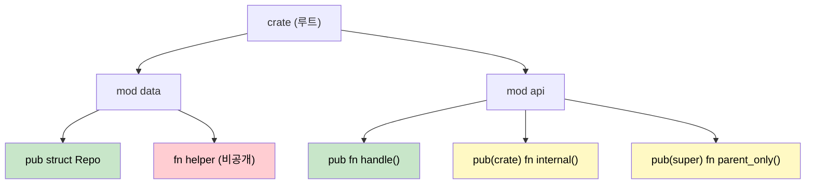

## 모듈과 크레이트: 코드 구성

> **이 장에서 배울 내용:** Rust의 모듈 시스템과 C# 네임스페이스/어셈블리의 차이, `pub`/`pub(crate)`/`pub(super)` 가시성,
> 파일 기반 모듈 구성, 그리고 크레이트가 .NET 어셈블리에 어떻게 대응되는지.
>
> **난이도:** 🟢 초급

코드를 체계적으로 나누고 의존성을 관리하려면 Rust의 모듈 시스템을 이해하는 것이 중요합니다. C# 개발자에게는 네임스페이스, 어셈블리, NuGet 패키지를 이해하는 것과 비슷한 주제입니다.

<a id="rust-modules-vs-c-namespaces"></a>
### Rust 모듈 vs C# 네임스페이스

#### C# 네임스페이스 구성
```csharp
// 파일: Models/User.cs
namespace MyApp.Models
{
    public class User
    {
        public string Name { get; set; }
        public int Age { get; set; }
    }
}

// 파일: Services/UserService.cs
using MyApp.Models;

namespace MyApp.Services
{
    public class UserService
    {
        public User CreateUser(string name, int age)
        {
            return new User { Name = name, Age = age };
        }
    }
}

// 파일: Program.cs
using MyApp.Models;
using MyApp.Services;

namespace MyApp
{
    class Program
    {
        static void Main(string[] args)
        {
            var service = new UserService();
            var user = service.CreateUser("Alice", 30);
        }
    }
}
```

#### Rust 모듈 구성
```rust
// 파일: src/models.rs
pub struct User {
    pub name: String,
    pub age: u32,
}

impl User {
    pub fn new(name: String, age: u32) -> User {
        User { name, age }
    }
}

// 파일: src/services.rs
use crate::models::User;

pub struct UserService;

impl UserService {
    pub fn create_user(name: String, age: u32) -> User {
        User::new(name, age)
    }
}

// 파일: src/lib.rs (또는 main.rs)
pub mod models;
pub mod services;

use models::User;
use services::UserService;

fn main() {
    let service = UserService;
    let user = UserService::create_user("Alice".to_string(), 30);
}
```

### 모듈 계층과 가시성



> 🟢 초록 = 어디서나 public &nbsp;|&nbsp; 🟡 노랑 = 제한된 가시성 &nbsp;|&nbsp; 🔴 빨강 = private

#### C# 가시성 한정자
```csharp
namespace MyApp.Data
{
    // public - 어디서나 접근 가능
    public class Repository
    {
        // private - 이 클래스 안에서만 접근 가능
        private string connectionString;
        
        // internal - 이 어셈블리 내부에서만 접근 가능
        internal void Connect() { }
        
        // protected - 이 클래스와 하위 클래스에서 접근 가능
        protected virtual void Initialize() { }
        
        // public - 어디서나 접근 가능
        public void Save(object data) { }
    }
}
```

#### Rust 가시성 규칙
```rust
// Rust에서는 기본적으로 모든 것이 private이다
mod data {
    struct Repository {  // private 구조체
        connection_string: String,  // private 필드
    }
    
    impl Repository {
        fn new() -> Repository {  // private 함수
            Repository {
                connection_string: "localhost".to_string(),
            }
        }
        
        pub fn connect(&self) {  // public 메서드
            // 이 모듈과 하위 모듈에서 접근할 수 있다
        }
        
        pub(crate) fn initialize(&self) {  // 크레이트 수준 공개
            // 이 크레이트 어디서나 접근할 수 있다
        }
        
        pub(super) fn internal_method(&self) {  // 부모 모듈에 공개
            // 부모 모듈에서 접근할 수 있다
        }
    }
    
    // public 구조체 - 모듈 밖에서도 접근 가능
    pub struct PublicRepository {
        pub data: String,       // public 필드
        private_data: String,   // private 필드(pub 없음)
    }
}

pub use data::PublicRepository;  // 외부 사용을 위해 재노출
```

### 모듈 파일 구성

#### C# 프로젝트 구조
```text
MyApp/
├── MyApp.csproj
├── Models/
│   ├── User.cs
│   └── Product.cs
├── Services/
│   ├── UserService.cs
│   └── ProductService.cs
├── Controllers/
│   └── ApiController.cs
└── Program.cs
```

#### Rust 모듈 파일 구조
```text
my_app/
├── Cargo.toml
└── src/
    ├── main.rs (또는 lib.rs)
    ├── models/
    │   ├── mod.rs        // 모듈 선언
    │   ├── user.rs
    │   └── product.rs
    ├── services/
    │   ├── mod.rs        // 모듈 선언
    │   ├── user_service.rs
    │   └── product_service.rs
    └── controllers/
        ├── mod.rs
        └── api_controller.rs
```

#### 모듈 선언 패턴
```rust
// src/models/mod.rs
pub mod user;      // user.rs를 하위 모듈로 선언
pub mod product;   // product.rs를 하위 모듈로 선언

// 자주 쓰는 타입은 재노출한다
pub use user::User;
pub use product::Product;

// src/main.rs
mod models;     // models/를 모듈로 선언
mod services;   // services/를 모듈로 선언

// 필요한 항목만 가져오기
use models::{User, Product};
use services::UserService;

// 또는 모듈 전체 가져오기
use models::user::*;  // user 모듈의 public 항목 전부 가져오기
```

***

<a id="crates-vs-net-assemblies"></a>
## 크레이트 vs .NET 어셈블리

### 크레이트 이해하기
Rust에서 **크레이트(crate)**는 컴파일과 코드 배포의 기본 단위입니다. .NET에서의 **어셈블리(assembly)**와 비슷한 역할을 합니다.

#### C# 어셈블리 모델
```csharp
// MyLibrary.dll - 컴파일된 어셈블리
namespace MyLibrary
{
    public class Calculator
    {
        public int Add(int a, int b) => a + b;
    }
}

// MyApp.exe - MyLibrary.dll을 참조하는 실행 어셈블리
using MyLibrary;

class Program
{
    static void Main()
    {
        var calc = new Calculator();
        Console.WriteLine(calc.Add(2, 3));
    }
}
```

#### Rust 크레이트 모델
```toml
# 라이브러리 크레이트용 Cargo.toml
[package]
name = "my_calculator"
version = "0.1.0"
edition = "2021"

[lib]
name = "my_calculator"
```

```rust
// src/lib.rs - 라이브러리 크레이트
pub struct Calculator;

impl Calculator {
    pub fn add(&self, a: i32, b: i32) -> i32 {
        a + b
    }
}
```

```toml
# 라이브러리를 사용하는 바이너리 크레이트용 Cargo.toml
[package]
name = "my_app"
version = "0.1.0"
edition = "2021"

[dependencies]
my_calculator = { path = "../my_calculator" }
```

```rust
// src/main.rs - 바이너리 크레이트
use my_calculator::Calculator;

fn main() {
    let calc = Calculator;
    println!("{}", calc.add(2, 3));
}
```

### 크레이트 종류 비교

| C# 개념 | Rust 대응 개념 | 용도 |
|---------|----------------|------|
| 클래스 라이브러리 (`.dll`) | 라이브러리 크레이트 | 재사용 가능한 코드 |
| 콘솔 앱 (`.exe`) | 바이너리 크레이트 | 실행 가능한 프로그램 |
| NuGet 패키지 | 배포된 크레이트 | 배포 단위 |
| 어셈블리 (`.dll`/`.exe`) | 컴파일된 크레이트 | 컴파일 단위 |
| 솔루션 (`.sln`) | 워크스페이스 | 다중 프로젝트 구성 |

### 워크스페이스 vs 솔루션

#### C# 솔루션 구조
```xml
<!-- MySolution.sln 구조 -->
<Solution>
    <Project Include="WebApi/WebApi.csproj" />
    <Project Include="Business/Business.csproj" />
    <Project Include="DataAccess/DataAccess.csproj" />
    <Project Include="Tests/Tests.csproj" />
</Solution>
```

#### Rust 워크스페이스 구조
```toml
# 워크스페이스 루트의 Cargo.toml
[workspace]
members = [
    "web_api",
    "business",
    "data_access",
    "tests"
]

[workspace.dependencies]
serde = "1.0"           # 공통 의존성 버전
tokio = "1.0"
```

```toml
# web_api/Cargo.toml
[package]
name = "web_api"
version = "0.1.0"
edition = "2021"

[dependencies]
business = { path = "../business" }
serde = { workspace = true }    # 워크스페이스 버전 사용
tokio = { workspace = true }
```

---

## 연습문제

<details>
<summary><strong>🏋️ 연습문제: 모듈 트리 설계하기</strong> (펼쳐서 보기)</summary>

다음 C# 프로젝트 레이아웃에 대응되는 Rust 모듈 트리를 설계해 보세요.

```csharp
// C#
namespace MyApp.Services { public class AuthService { } }
namespace MyApp.Services { internal class TokenStore { } }
namespace MyApp.Models { public class User { } }
namespace MyApp.Models { public class Session { } }
```

요구사항:
1. `AuthService`와 두 모델은 모두 public이어야 한다
2. `TokenStore`는 `services` 모듈 내부에서만 private이어야 한다
3. 파일 배치와 함께, `lib.rs`의 `mod` / `pub` 선언도 작성하라

<details>
<summary>🔑 해설</summary>

파일 배치:
```
src/
├── lib.rs
├── services/
│   ├── mod.rs
│   ├── auth_service.rs
│   └── token_store.rs
└── models/
    ├── mod.rs
    ├── user.rs
    └── session.rs
```

```rust,ignore
// src/lib.rs
pub mod services;
pub mod models;

// src/services/mod.rs
mod token_store;          // private - C#의 internal과 유사
pub mod auth_service;     // public

// src/services/auth_service.rs
use super::token_store::TokenStore; // 같은 모듈 안에서는 보인다

pub struct AuthService;

impl AuthService {
    pub fn login(&self) { /* 내부적으로 TokenStore 사용 */ }
}

// src/services/token_store.rs
pub(super) struct TokenStore; // 부모(services)에서만 보인다

// src/models/mod.rs
pub mod user;
pub mod session;

// src/models/user.rs
pub struct User {
    pub name: String,
}

// src/models/session.rs
pub struct Session {
    pub user_id: u64,
}
```

</details>
</details>

***
