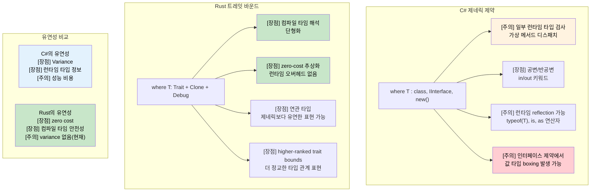

<a id="generic-constraints-where-vs-trait-bounds"></a>
## 제네릭 제약: `where` vs 트레잇 바운드

> **학습할 내용:** Rust의 트레잇 바운드와 C#의 `where` 제약 비교, `where` 절 문법,
> 조건부 트레잇 구현, 연관 타입, 그리고 higher-ranked trait bounds(HRTB)를 살펴봅니다.
>
> **난이도:** 🔴 고급

### C# 제네릭 제약
```csharp
// C#의 where 절 기반 제네릭 제약
public class Repository<T> where T : class, IEntity, new()
{
    public T Create()
    {
        return new T();  // new() 제약 덕분에 매개변수 없는 생성자 호출 가능
    }
    
    public void Save(T entity)
    {
        if (entity.Id == 0)  // IEntity 제약 덕분에 Id 프로퍼티 사용 가능
        {
            entity.Id = GenerateId();
        }
        // Save to database
    }
}

// 제약이 있는 여러 타입 매개변수
public class Converter<TInput, TOutput> 
    where TInput : IConvertible
    where TOutput : class, new()
{
    public TOutput Convert(TInput input)
    {
        var output = new TOutput();
        // Conversion logic using IConvertible
        return output;
    }
}

// 제네릭의 variance
public interface IRepository<out T> where T : IEntity
{
    IEnumerable<T> GetAll();  // 공변 - 더 파생된 타입을 반환할 수 있음
}

public interface IWriter<in T> where T : IEntity
{
    void Write(T entity);  // 반공변 - 더 상위 기반 타입을 받을 수 있음
}
```

### Rust의 트레잇 바운드를 이용한 제네릭 제약
```rust
use std::fmt::{Debug, Display};
use std::clone::Clone;

// 기본 트레잇 바운드
pub struct Repository<T> 
where 
    T: Clone + Debug + Default,
{
    items: Vec<T>,
}

impl<T> Repository<T> 
where 
    T: Clone + Debug + Default,
{
    pub fn new() -> Self {
        Repository { items: Vec::new() }
    }
    
    pub fn create(&self) -> T {
        T::default()  // Default 트레잇이 기본값 제공
    }
    
    pub fn add(&mut self, item: T) {
        println!("Adding item: {:?}", item);  // 출력용 Debug 트레잇
        self.items.push(item);
    }
    
    pub fn get_all(&self) -> Vec<T> {
        self.items.clone()  // 복제를 위한 Clone 트레잇
    }
}

// 서로 다른 문법의 여러 트레잇 바운드
pub fn process_data<T, U>(input: T) -> U 
where 
    T: Display + Clone,
    U: From<T> + Debug,
{
    println!("Processing: {}", input);  // Display 트레잇
    let cloned = input.clone();         // Clone 트레잇
    let output = U::from(cloned);       // 변환용 From 트레잇
    println!("Result: {:?}", output);   // Debug 트레잇
    output
}

// 연관 타입(C#의 제네릭 제약과 비슷한 역할)
pub trait Iterator {
    type Item;  // 제네릭 매개변수 대신 연관 타입 사용
    
    fn next(&mut self) -> Option<Self::Item>;
}

pub trait Collect<T> {
    fn collect<I: Iterator<Item = T>>(iter: I) -> Self;
}

// higher-ranked trait bounds(고급)
fn apply_to_all<F>(items: &[String], f: F) -> Vec<String>
where 
    F: for<'a> Fn(&'a str) -> String,  // 어떤 라이프타임에도 동작하는 함수
{
    items.iter().map(|s| f(s)).collect()
}

// 조건부 트레잇 구현
impl<T> PartialEq for Repository<T> 
where 
    T: PartialEq + Clone + Debug + Default,
{
    fn eq(&self, other: &Self) -> bool {
        self.items == other.items
    }
}
```



---

## 연습문제

<details>
<summary><strong>🏋️ 연습문제: 제네릭 저장소</strong> (펼쳐서 보기)</summary>

다음 C# 제네릭 저장소 인터페이스를 Rust 트레잇으로 옮겨 보세요.

```csharp
public interface IRepository<T> where T : IEntity, new()
{
    T GetById(int id);
    IEnumerable<T> Find(Func<T, bool> predicate);
    void Save(T entity);
}
```

요구사항:
1. `fn id(&self) -> u64`를 가진 `Entity` 트레잇을 정의하세요.
2. `T: Entity + Clone` 조건을 가진 `Repository<T>` 트레잇을 정의하세요.
3. `Vec<T>`에 항목을 저장하는 `InMemoryRepository<T>`를 구현하세요.
4. `find` 메서드는 `impl Fn(&T) -> bool`를 받아야 합니다.

<details>
<summary>🔑 해설</summary>

```rust
trait Entity: Clone {
    fn id(&self) -> u64;
}

trait Repository<T: Entity> {
    fn get_by_id(&self, id: u64) -> Option<&T>;
    fn find(&self, predicate: impl Fn(&T) -> bool) -> Vec<&T>;
    fn save(&mut self, entity: T);
}

struct InMemoryRepository<T> {
    items: Vec<T>,
}

impl<T: Entity> InMemoryRepository<T> {
    fn new() -> Self { Self { items: Vec::new() } }
}

impl<T: Entity> Repository<T> for InMemoryRepository<T> {
    fn get_by_id(&self, id: u64) -> Option<&T> {
        self.items.iter().find(|item| item.id() == id)
    }
    fn find(&self, predicate: impl Fn(&T) -> bool) -> Vec<&T> {
        self.items.iter().filter(|item| predicate(item)).collect()
    }
    fn save(&mut self, entity: T) {
        if let Some(pos) = self.items.iter().position(|e| e.id() == entity.id()) {
            self.items[pos] = entity;
        } else {
            self.items.push(entity);
        }
    }
}

#[derive(Clone, Debug)]
struct User { user_id: u64, name: String }

impl Entity for User {
    fn id(&self) -> u64 { self.user_id }
}

fn main() {
    let mut repo = InMemoryRepository::new();
    repo.save(User { user_id: 1, name: "Alice".into() });
    repo.save(User { user_id: 2, name: "Bob".into() });

    let found = repo.find(|u| u.name.starts_with('A'));
    assert_eq!(found.len(), 1);
}
```

**C#와의 핵심 차이점:** `new()` 제약은 없고 대신 `Default` 트레잇을 씁니다. `Func<T, bool>` 대신 `Fn(&T) -> bool`를 사용합니다. 예외를 던지는 대신 `Option`을 반환합니다.

</details>
</details>

***


