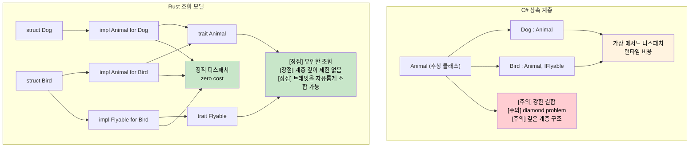

<a id="inheritance-vs-composition"></a>
## 상속 vs 조합

> **학습할 내용:** Rust에 클래스 상속이 없는 이유, 트레잇과 구조체가 깊은 클래스 계층을 어떻게 대체하는지,
> 그리고 조합으로 다형성을 구현하는 실전 패턴을 살펴봅니다.
>
> **난이도:** 🟡 중급

```csharp
// C# - 클래스 기반 상속
public abstract class Animal
{
    public string Name { get; protected set; }
    public abstract void MakeSound();
    
    public virtual void Sleep()
    {
        Console.WriteLine($"{Name} is sleeping");
    }
}

public class Dog : Animal
{
    public Dog(string name) { Name = name; }
    
    public override void MakeSound()
    {
        Console.WriteLine("Woof!");
    }
    
    public void Fetch()
    {
        Console.WriteLine($"{Name} is fetching");
    }
}

// 인터페이스 기반 계약
public interface IFlyable
{
    void Fly();
}

public class Bird : Animal, IFlyable
{
    public Bird(string name) { Name = name; }
    
    public override void MakeSound()
    {
        Console.WriteLine("Tweet!");
    }
    
    public void Fly()
    {
        Console.WriteLine($"{Name} is flying");
    }
}
```

### Rust의 조합 모델
```rust
// Rust - 트레잇을 이용한 상속보다 조합
pub trait Animal {
    fn name(&self) -> &str;
    fn make_sound(&self);
    
    // 기본 구현(C#의 virtual 메서드와 비슷함)
    fn sleep(&self) {
        println!("{} is sleeping", self.name());
    }
}

pub trait Flyable {
    fn fly(&self);
}

// 데이터와 동작을 분리
#[derive(Debug)]
pub struct Dog {
    name: String,
}

#[derive(Debug)]
pub struct Bird {
    name: String,
    wingspan: f64,
}

// 타입에 동작을 구현
impl Animal for Dog {
    fn name(&self) -> &str {
        &self.name
    }
    
    fn make_sound(&self) {
        println!("Woof!");
    }
}

impl Dog {
    pub fn new(name: String) -> Self {
        Dog { name }
    }
    
    pub fn fetch(&self) {
        println!("{} is fetching", self.name);
    }
}

impl Animal for Bird {
    fn name(&self) -> &str {
        &self.name
    }
    
    fn make_sound(&self) {
        println!("Tweet!");
    }
}

impl Flyable for Bird {
    fn fly(&self) {
        println!("{} is flying with {:.1}m wingspan", self.name, self.wingspan);
    }
}

// 여러 트레잇 바운드(여러 인터페이스와 비슷함)
fn make_flying_animal_sound<T>(animal: &T) 
where 
    T: Animal + Flyable,
{
    animal.make_sound();
    animal.fly();
}
```



---

## 연습문제

<details>
<summary><strong>🏋️ 연습문제: 상속을 트레잇으로 바꾸기</strong> (펼쳐서 보기)</summary>

다음 C# 코드는 상속을 사용합니다. 이를 Rust에서 트레잇 조합으로 다시 작성해 보세요.

```csharp
public abstract class Shape { public abstract double Area(); }
public abstract class Shape3D : Shape { public abstract double Volume(); }
public class Cylinder : Shape3D
{
    public double Radius { get; }
    public double Height { get; }
    public Cylinder(double r, double h) { Radius = r; Height = h; }
    public override double Area() => 2.0 * Math.PI * Radius * (Radius + Height);
    public override double Volume() => Math.PI * Radius * Radius * Height;
}
```

요구사항:
1. `fn area(&self) -> f64`를 가진 `HasArea` 트레잇
2. `fn volume(&self) -> f64`를 가진 `HasVolume` 트레잇
3. 두 트레잇을 모두 구현하는 `Cylinder` 구조체
4. `fn print_shape_info(shape: &(impl HasArea + HasVolume))` 함수 작성 - 상속 없이 트레잇 바운드 조합만으로 표현합니다.

<details>
<summary>🔑 해설</summary>

```rust
use std::f64::consts::PI;

trait HasArea {
    fn area(&self) -> f64;
}

trait HasVolume {
    fn volume(&self) -> f64;
}

struct Cylinder {
    radius: f64,
    height: f64,
}

impl HasArea for Cylinder {
    fn area(&self) -> f64 {
        2.0 * PI * self.radius * (self.radius + self.height)
    }
}

impl HasVolume for Cylinder {
    fn volume(&self) -> f64 {
        PI * self.radius * self.radius * self.height
    }
}

fn print_shape_info(shape: &(impl HasArea + HasVolume)) {
    println!("Area:   {:.2}", shape.area());
    println!("Volume: {:.2}", shape.volume());
}

fn main() {
    let c = Cylinder { radius: 3.0, height: 5.0 };
    print_shape_info(&c);
}
```

**핵심 통찰:** C#에서는 `Shape -> Shape3D -> Cylinder`처럼 3단계 계층이 필요하지만, Rust는 평평한 트레잇 조합을 사용합니다. `impl HasArea + HasVolume`처럼 상속 깊이 없이 필요한 능력만 합칠 수 있습니다.

</details>
</details>

***


