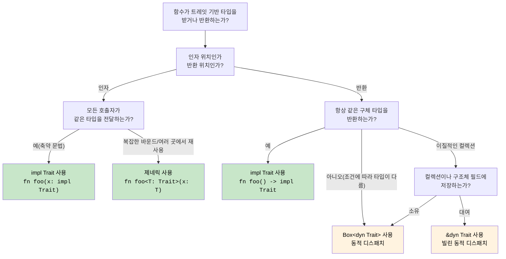

<a id="traits---rusts-interfaces"></a>
## 트레잇 - Rust의 인터페이스

> **학습할 내용:** 트레잇과 C# 인터페이스의 차이, 기본 메서드 구현, 트레잇 객체(`dyn Trait`)와
> 제네릭 바운드(`impl Trait`)의 차이, derive로 자동 구현되는 트레잇, 표준 라이브러리의 대표 트레잇,
> 연관 타입, 그리고 트레잇을 통한 연산자 오버로딩까지 살펴봅니다.
>
> **난이도:** 🟡 중급

트레잇은 Rust에서 공유 동작을 정의하는 방식으로, C#의 인터페이스와 비슷하지만 더 강력합니다.

### C# 인터페이스와 비교
```csharp
// C# 인터페이스 정의
public interface IAnimal
{
    string Name { get; }
    void MakeSound();
    
    // 기본 구현(C# 8+)
    string Describe()
    {
        return $"{Name} makes a sound";
    }
}

// C# 인터페이스 구현
public class Dog : IAnimal
{
    public string Name { get; }
    
    public Dog(string name)
    {
        Name = name;
    }
    
    public void MakeSound()
    {
        Console.WriteLine("Woof!");
    }
    
    // 기본 구현을 재정의할 수 있음
    public string Describe()
    {
        return $"{Name} is a loyal dog";
    }
}

// 제네릭 제약
public void ProcessAnimal<T>(T animal) where T : IAnimal
{
    animal.MakeSound();
    Console.WriteLine(animal.Describe());
}
```

### Rust 트레잇 정의와 구현
```rust
// 트레잇 정의
trait Animal {
    fn name(&self) -> &str;
    fn make_sound(&self);
    
    // 기본 구현
    fn describe(&self) -> String {
        format!("{} makes a sound", self.name())
    }
    
    // 다른 트레잇 메서드를 활용한 기본 구현
    fn introduce(&self) {
        println!("Hi, I'm {}", self.name());
        self.make_sound();
    }
}

// 구조체 정의
#[derive(Debug)]
struct Dog {
    name: String,
    breed: String,
}

impl Dog {
    fn new(name: String, breed: String) -> Dog {
        Dog { name, breed }
    }
}

// 트레잇 구현
impl Animal for Dog {
    fn name(&self) -> &str {
        &self.name
    }
    
    fn make_sound(&self) {
        println!("Woof!");
    }
    
    // Override default implementation
    fn describe(&self) -> String {
        format!("{} is a loyal {} dog", self.name, self.breed)
    }
}

// 또 다른 구현
#[derive(Debug)]
struct Cat {
    name: String,
    indoor: bool,
}

impl Animal for Cat {
    fn name(&self) -> &str {
        &self.name
    }
    
    fn make_sound(&self) {
        println!("Meow!");
    }
    
    // describe() 기본 구현 사용
}

// 트레잇 바운드를 가진 제네릭 함수
fn process_animal<T: Animal>(animal: &T) {
    animal.make_sound();
    println!("{}", animal.describe());
    animal.introduce();
}

// 여러 트레잇 바운드
fn process_animal_debug<T: Animal + std::fmt::Debug>(animal: &T) {
    println!("Debug: {:?}", animal);
    process_animal(animal);
}

fn main() {
    let dog = Dog::new("Buddy".to_string(), "Golden Retriever".to_string());
    let cat = Cat { name: "Whiskers".to_string(), indoor: true };
    
    process_animal(&dog);
    process_animal(&cat);
    
    process_animal_debug(&dog);
}
```

### 트레잇 객체와 동적 디스패치
```csharp
// C# 동적 다형성
public void ProcessAnimals(List<IAnimal> animals)
{
    foreach (var animal in animals)
    {
        animal.MakeSound(); // 동적 디스패치
        Console.WriteLine(animal.Describe());
    }
}

// 사용 예
var animals = new List<IAnimal>
{
    new Dog("Buddy"),
    new Cat("Whiskers"),
    new Dog("Rex")
};

ProcessAnimals(animals);
```

```rust
// 동적 디스패치를 위한 Rust 트레잇 객체
fn process_animals(animals: &[Box<dyn Animal>]) {
    for animal in animals {
        animal.make_sound(); // 동적 디스패치
        println!("{}", animal.describe());
    }
}

// 대안: 참조 사용
fn process_animal_refs(animals: &[&dyn Animal]) {
    for animal in animals {
        animal.make_sound();
        println!("{}", animal.describe());
    }
}

fn main() {
    // Box<dyn Trait> 사용
    let animals: Vec<Box<dyn Animal>> = vec![
        Box::new(Dog::new("Buddy".to_string(), "Golden Retriever".to_string())),
        Box::new(Cat { name: "Whiskers".to_string(), indoor: true }),
        Box::new(Dog::new("Rex".to_string(), "German Shepherd".to_string())),
    ];
    
    process_animals(&animals);
    
    // 참조 사용
    let dog = Dog::new("Buddy".to_string(), "Golden Retriever".to_string());
    let cat = Cat { name: "Whiskers".to_string(), indoor: true };
    
    let animal_refs: Vec<&dyn Animal> = vec![&dog, &cat];
    process_animal_refs(&animal_refs);
}
```

### derive로 자동 구현되는 트레잇
```rust
// 자주 쓰는 트레잇을 자동으로 derive
#[derive(Debug, Clone, PartialEq, Eq, Hash)]
struct Person {
    name: String,
    age: u32,
}

// 실제로 생성되는 내용(단순화)
impl std::fmt::Debug for Person {
    fn fmt(&self, f: &mut std::fmt::Formatter<'_>) -> std::fmt::Result {
        f.debug_struct("Person")
            .field("name", &self.name)
            .field("age", &self.age)
            .finish()
    }
}

impl Clone for Person {
    fn clone(&self) -> Self {
        Person {
            name: self.name.clone(),
            age: self.age,
        }
    }
}

impl PartialEq for Person {
    fn eq(&self, other: &Self) -> bool {
        self.name == other.name && self.age == other.age
    }
}

// 사용 예
fn main() {
    let person1 = Person {
        name: "Alice".to_string(),
        age: 30,
    };
    
    let person2 = person1.clone(); // Clone trait
    
    println!("{:?}", person1); // Debug trait
    println!("Equal: {}", person1 == person2); // PartialEq trait
}
```

<a id="common-standard-library-traits"></a>
### 표준 라이브러리의 대표 트레잇
```rust
use std::collections::HashMap;

// 사람이 읽기 좋은 출력을 위한 Display 트레잇
impl std::fmt::Display for Person {
    fn fmt(&self, f: &mut std::fmt::Formatter<'_>) -> std::fmt::Result {
        write!(f, "{} (age {})", self.name, self.age)
    }
}

// 변환을 위한 From 트레잇
impl From<(String, u32)> for Person {
    fn from((name, age): (String, u32)) -> Self {
        Person { name, age }
    }
}

// From을 구현하면 Into는 자동으로 따라온다
fn create_person() {
    let person: Person = ("Alice".to_string(), 30).into();
    println!("{}", person);
}

// Iterator 트레잇 구현
struct PersonIterator {
    people: Vec<Person>,
    index: usize,
}

impl Iterator for PersonIterator {
    type Item = Person;
    
    fn next(&mut self) -> Option<Self::Item> {
        if self.index < self.people.len() {
            let person = self.people[self.index].clone();
            self.index += 1;
            Some(person)
        } else {
            None
        }
    }
}

impl Person {
    fn iterator(people: Vec<Person>) -> PersonIterator {
        PersonIterator { people, index: 0 }
    }
}

fn main() {
    let people = vec![
        Person::from(("Alice".to_string(), 30)),
        Person::from(("Bob".to_string(), 25)),
        Person::from(("Charlie".to_string(), 35)),
    ];
    
    // 우리가 만든 커스텀 이터레이터 사용
    for person in Person::iterator(people.clone()) {
        println!("{}", person); // Display 트레잇 사용
    }
}
```

***


<details>
<summary><strong>🏋️ 연습문제: 트레잇 기반 그리기 시스템</strong> (펼쳐서 보기)</summary>

**도전 과제:** `area()` 메서드와 기본 메서드 `draw()`를 가진 `Drawable` 트레잇을 구현해 보세요. `Circle`과 `Rect` 구조체를 만들고, `&[Box<dyn Drawable>]`를 받아 총 넓이를 출력하는 함수를 작성하세요.

<details>
<summary>🔑 해설</summary>

```rust
use std::f64::consts::PI;

trait Drawable {
    fn area(&self) -> f64;

    fn draw(&self) {
        println!("Drawing shape with area {:.2}", self.area());
    }
}

struct Circle { radius: f64 }
struct Rect   { w: f64, h: f64 }

impl Drawable for Circle {
    fn area(&self) -> f64 { PI * self.radius * self.radius }
}

impl Drawable for Rect {
    fn area(&self) -> f64 { self.w * self.h }
}

fn total_area(shapes: &[Box<dyn Drawable>]) -> f64 {
    shapes.iter().map(|s| s.area()).sum()
}

fn main() {
    let shapes: Vec<Box<dyn Drawable>> = vec![
        Box::new(Circle { radius: 5.0 }),
        Box::new(Rect { w: 4.0, h: 6.0 }),
        Box::new(Circle { radius: 2.0 }),
    ];
    for s in &shapes { s.draw(); }
    println!("Total area: {:.2}", total_area(&shapes));
}
```

**핵심 요점:**
- `dyn Trait`는 C#의 `IDrawable`처럼 런타임 다형성을 제공합니다.
- `Box<dyn Trait>`는 힙 할당을 사용하며, 이질적인 컬렉션을 담을 때 필요합니다.
- 기본 메서드는 C# 8+의 default interface method와 매우 비슷하게 동작합니다.

</details>
</details>

### 연관 타입: 타입 멤버를 가진 트레잇

C# 인터페이스에는 연관 타입이 없지만 Rust 트레잇에는 있습니다. `Iterator`가 대표적인 예입니다.

```rust
// Iterator 트레잇은 연관 타입 Item을 가진다
trait Iterator {
    type Item;                         // 구현체마다 Item이 무엇인지 정한다
    fn next(&mut self) -> Option<Self::Item>;
}

struct Counter { max: u32, current: u32 }

impl Iterator for Counter {
    type Item = u32;                   // 이 Counter는 u32 값을 생성한다
    fn next(&mut self) -> Option<u32> {
        if self.current < self.max {
            self.current += 1;
            Some(self.current)
        } else {
            None
        }
    }
}
```

C#에서는 `IEnumerator<T>`가 제네릭 매개변수(`T`)로 이 역할을 합니다. Rust의 연관 타입은 다릅니다. `Iterator`는 트레잇 수준의 제네릭 매개변수가 아니라, 각 구현마다 *하나의* `Item` 타입을 가집니다. 덕분에 `impl Iterator<Item = u32>`처럼 트레잇 바운드를 더 간단하게 표현할 수 있습니다.

### 트레잇을 통한 연산자 오버로딩

C#에서는 `public static MyType operator+(MyType a, MyType b)`처럼 정의합니다. Rust에서는 모든 연산자가 `std::ops`의 트레잇에 대응합니다.

```rust
use std::ops::Add;

#[derive(Debug, Clone, Copy)]
struct Vec2 { x: f64, y: f64 }

impl Add for Vec2 {
    type Output = Vec2;
    fn add(self, rhs: Vec2) -> Vec2 {
        Vec2 { x: self.x + rhs.x, y: self.y + rhs.y }
    }
}

let a = Vec2 { x: 1.0, y: 2.0 };
let b = Vec2 { x: 3.0, y: 4.0 };
let c = a + b;  // <Vec2 as Add>::add(a, b)를 호출
```

| C# | Rust | 비고 |
|----|------|-------|
| `operator+` | `impl Add` | `self`를 값으로 받으므로 non-`Copy` 타입은 소비됨 |
| `operator==` | `impl PartialEq` | 보통 `#[derive(PartialEq)]` 사용 |
| `operator<` | `impl PartialOrd` | 보통 `#[derive(PartialOrd)]` 사용 |
| `ToString()` | `impl fmt::Display` | `println!("{}", x)`에서 사용 |
| Implicit conversion | 대응 없음 | Rust에는 암묵적 변환이 없으므로 `From`/`Into` 사용 |

### 일관성(coherence): orphan rule

트레잇을 구현하려면 트레잇이나 타입 중 하나는 반드시 여러분이 소유해야 합니다. 이 규칙은 여러 크레이트에서 충돌하는 구현이 생기는 것을 막아 줍니다.

```rust
// OK - MyType을 내가 소유함
impl Display for MyType { ... }

// OK - MyTrait를 내가 소유함
impl MyTrait for String { ... }

// ERROR - Display도 String도 내가 소유하지 않음
impl Display for String { ... }
```

C#에는 이에 대응하는 제약이 없습니다. 어떤 코드든 어떤 타입에도 확장 메서드를 추가할 수 있으므로, 경우에 따라 모호성이 생길 수 있습니다.

<!-- ch10.0a: impl Trait and Dispatch Strategies -->
<a id="impl-trait-returning-traits-without-boxing"></a>
## `impl Trait`: boxing 없이 트레잇 반환하기

C# 인터페이스는 언제나 반환 타입으로 쓸 수 있습니다. Rust에서는 트레잇을 반환하려면 정적 디스패치(`impl Trait`)와 동적 디스패치(`dyn Trait`) 중 하나를 선택해야 합니다.

### 인자 위치의 `impl Trait`(제네릭 축약 문법)
```rust
// 아래 두 함수는 동등하다
fn print_animal(animal: &impl Animal) { animal.make_sound(); }
fn print_animal<T: Animal>(animal: &T)  { animal.make_sound(); }

// impl Trait는 제네릭 매개변수의 문법적 설탕일 뿐이다
// 컴파일러는 구체 타입마다 특화된 코드를 생성한다(단형화)
```

### 반환 위치의 `impl Trait`(핵심 차이)
```rust
// 구체 타입을 드러내지 않고 이터레이터를 반환
fn even_squares(limit: u32) -> impl Iterator<Item = u32> {
    (0..limit)
        .filter(|n| n % 2 == 0)
        .map(|n| n * n)
}
// 호출자는 "Iterator<Item = u32>를 구현한 어떤 타입"만 본다
// 실제 타입(Filter<Map<Range<u32>, ...>>)은 이름 붙이기 어렵기 때문에 impl Trait가 이를 해결한다.

fn main() {
    for n in even_squares(20) {
        print!("{n} ");
    }
    // 출력: 0 4 16 36 64 100 144 196 256 324
}
```

```csharp
// C# - 인터페이스 반환(항상 동적 디스패치, 힙에 있는 이터레이터 객체)
public IEnumerable<int> EvenSquares(int limit) =>
    Enumerable.Range(0, limit)
        .Where(n => n % 2 == 0)
        .Select(n => n * n);
// 반환 타입은 구체 이터레이터를 IEnumerable 인터페이스 뒤에 감춘다
// Rust의 Box<dyn Trait>와 달리 C#은 boxing을 명시하지 않고, 런타임이 할당을 처리한다
```

### 클로저 반환하기: `impl Fn` vs `Box<dyn Fn>`
```rust
// 클로저를 반환한다 - 클로저 타입에는 이름을 붙일 수 없으므로 impl Fn이 중요하다
fn make_adder(x: i32) -> impl Fn(i32) -> i32 {
    move |y| x + y
}

let add5 = make_adder(5);
println!("{}", add5(3)); // 8

// 조건에 따라 서로 다른 클로저를 반환해야 한다면 Box가 필요하다
fn choose_op(add: bool) -> Box<dyn Fn(i32, i32) -> i32> {
    if add {
        Box::new(|a, b| a + b)
    } else {
        Box::new(|a, b| a * b)
    }
}
// impl Trait는 하나의 구체 타입만 허용한다. 서로 다른 클로저는 서로 다른 타입이다.
```

```csharp
// C# - delegate가 이를 자연스럽게 처리한다(항상 힙 할당)
Func<int, int> MakeAdder(int x) => y => x + y;
Func<int, int, int> ChooseOp(bool add) => add ? (a, b) => a + b : (a, b) => a * b;
```

### 디스패치 선택: `impl Trait` vs `dyn Trait` vs 제네릭

이 선택은 C# 개발자가 Rust에 오면 가장 먼저 마주치는 설계 결정 중 하나입니다. 아래 가이드를 참고하세요.



| 접근법 | 디스패치 | 할당 | 언제 쓰나 |
|----------|----------|------------|-------------|
| `fn foo<T: Trait>(x: T)` | 정적(단형화) | 스택 | 여러 트레잇 바운드, turbofish 필요, 같은 타입 재사용 |
| `fn foo(x: impl Trait)` | 정적(단형화) | 스택 | 단순한 바운드, 더 깔끔한 문법, 일회성 매개변수 |
| `fn foo() -> impl Trait` | 정적 | 스택 | 단일 구체 반환 타입, 이터레이터, 클로저 |
| `fn foo() -> Box<dyn Trait>` | 동적(vtable) | **힙** | 서로 다른 반환 타입, 컬렉션 속 트레잇 객체 |
| `&dyn Trait` / `&mut dyn Trait` | 동적(vtable) | 할당 없음 | 빌린 이질적 참조, 함수 매개변수 |

```rust
// 요약: 가장 빠른 방법에서 가장 유연한 방법 순
fn static_dispatch(x: impl Display)             { /* 가장 빠름, 할당 없음 */ }
fn generic_dispatch<T: Display + Clone>(x: T)    { /* 가장 빠름, 여러 바운드 */ }
fn dynamic_dispatch(x: &dyn Display)             { /* vtable 조회, 할당 없음 */ }
fn boxed_dispatch(x: Box<dyn Display>)           { /* vtable 조회 + 힙 할당 */ }
```

***


