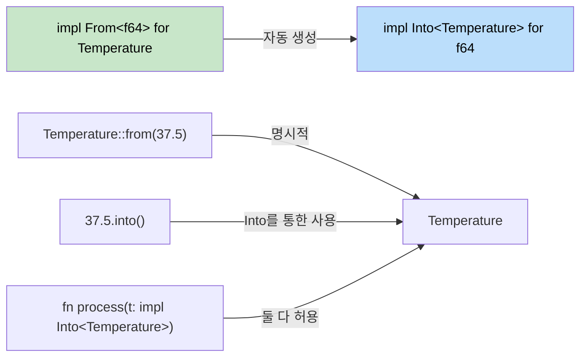

<a id="type-conversions-in-rust"></a>
## Rust에서의 타입 변환

> **학습할 내용:** `From`/`Into` 트레잇과 C#의 암묵적/명시적 연산자 비교,
> 실패 가능한 변환을 위한 `TryFrom`/`TryInto`, 파싱을 위한 `FromStr`,
> 그리고 관용적인 문자열 변환 패턴을 배웁니다.
>
> **난이도:** 🟡 중급

C#은 암묵적/명시적 변환과 캐스팅 연산자를 사용합니다. Rust는 안전하고 명시적인 변환을 위해 `From`과 `Into` 트레잇을 사용합니다.

### C#의 변환 패턴
```csharp
// C#의 암묵적/명시적 변환
public class Temperature
{
    public double Celsius { get; }
    
    public Temperature(double celsius) { Celsius = celsius; }
    
    // Implicit conversion
    public static implicit operator double(Temperature t) => t.Celsius;
    
    // Explicit conversion
    public static explicit operator Temperature(double d) => new Temperature(d);
}

double temp = new Temperature(100.0);  // implicit
Temperature t = (Temperature)37.5;     // explicit
```

<a id="rust-from-and-into"></a>
### Rust의 From과 Into
```rust
#[derive(Debug)]
struct Temperature {
    celsius: f64,
}

impl From<f64> for Temperature {
    fn from(celsius: f64) -> Self {
        Temperature { celsius }
    }
}

impl From<Temperature> for f64 {
    fn from(temp: Temperature) -> f64 {
        temp.celsius
    }
}

fn main() {
    // From
    let temp = Temperature::from(100.0);
    
    // Into(From을 구현하면 자동으로 사용 가능)
    let temp2: Temperature = 37.5.into();
    
    // 함수 인자에서도 사용 가능
    fn process_temp(temp: impl Into<Temperature>) {
        let t: Temperature = temp.into();
        println!("Temperature: {:.1}°C", t.celsius);
    }
    
    process_temp(98.6);
    process_temp(Temperature { celsius: 0.0 });
}
```



> **실전 규칙:** `From`을 구현하면 `Into`는 자동으로 따라옵니다. 호출자는 읽기 좋은 쪽을 선택하면 됩니다.

### 실패 가능한 변환을 위한 `TryFrom`
```rust
use std::convert::TryFrom;

impl TryFrom<i32> for Temperature {
    type Error = String;
    
    fn try_from(value: i32) -> Result<Self, Self::Error> {
        if value < -273 {
            Err(format!("Temperature {}°C is below absolute zero", value))
        } else {
            Ok(Temperature { celsius: value as f64 })
        }
    }
}

fn main() {
    match Temperature::try_from(-300) {
        Ok(t) => println!("Valid: {:?}", t),
        Err(e) => println!("Error: {}", e),
    }
}
```

### 문자열 변환
```rust
// Display 트레잇을 구현하면 ToString 가능
impl std::fmt::Display for Temperature {
    fn fmt(&self, f: &mut std::fmt::Formatter<'_>) -> std::fmt::Result {
        write!(f, "{:.1}°C", self.celsius)
    }
}

// 이제 .to_string()이 자동으로 동작
let s = Temperature::from(100.0).to_string(); // "100.0°C"

// 파싱을 위한 FromStr
use std::str::FromStr;

impl FromStr for Temperature {
    type Err = String;
    
    fn from_str(s: &str) -> Result<Self, Self::Err> {
        let s = s.trim_end_matches("°C").trim();
        let celsius: f64 = s.parse().map_err(|e| format!("Invalid temp: {}", e))?;
        Ok(Temperature { celsius })
    }
}

let t: Temperature = "100.0°C".parse().unwrap();
```

---

## 연습문제

<details>
<summary><strong>🏋️ 연습문제: 통화 변환기</strong> (펼쳐서 보기)</summary>

전체 변환 생태계를 보여 주는 `Money` 구조체를 만들어 보세요.

1. `Money { cents: i64 }` (`부동소수점 문제를 피하려고 센트 단위로 저장`)
2. `From<i64>` 구현 (`입력을 달러 전체 값으로 보고 -> cents = dollars * 100`)
3. `TryFrom<f64>` 구현 - 음수 금액은 거부하고, 가장 가까운 센트로 반올림
4. `Display` 구현 - `"$1.50"` 형식으로 출력
5. `FromStr` 구현 - `"$1.50"` 또는 `"1.50"`을 다시 `Money`로 파싱
6. 값을 모두 더하는 `fn total(items: &[impl Into<Money> + Copy]) -> Money` 함수 작성

<details>
<summary>🔑 해설</summary>

```rust
use std::fmt;
use std::str::FromStr;

#[derive(Debug, Clone, Copy)]
struct Money { cents: i64 }

impl From<i64> for Money {
    fn from(dollars: i64) -> Self {
        Money { cents: dollars * 100 }
    }
}

impl TryFrom<f64> for Money {
    type Error = String;
    fn try_from(value: f64) -> Result<Self, Self::Error> {
        if value < 0.0 {
            Err(format!("negative amount: {value}"))
        } else {
            Ok(Money { cents: (value * 100.0).round() as i64 })
        }
    }
}

impl fmt::Display for Money {
    fn fmt(&self, f: &mut fmt::Formatter<'_>) -> fmt::Result {
        write!(f, "${}.{:02}", self.cents / 100, self.cents.abs() % 100)
    }
}

impl FromStr for Money {
    type Err = String;
    fn from_str(s: &str) -> Result<Self, Self::Err> {
        let s = s.trim_start_matches('$');
        let val: f64 = s.parse().map_err(|e| format!("{e}"))?;
        Money::try_from(val)
    }
}

fn main() {
    let a = Money::from(10);                         // $10.00
    let b = Money::try_from(3.50).unwrap();         // $3.50
    let c: Money = "$7.25".parse().unwrap();        // $7.25
    println!("{a} + {b} + {c}");
}
```

</details>
</details>

***


