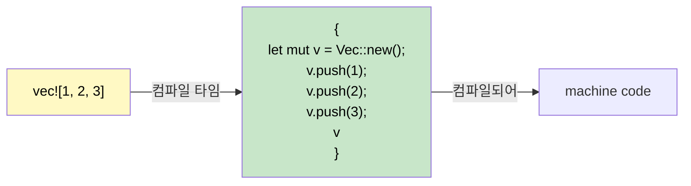

<a id="macros-code-that-writes-code"></a>
## 매크로: 코드를 만드는 코드

> **학습할 내용:** Rust에 매크로가 필요한 이유(오버로딩 없음, 가변 인자 없음),
> `macro_rules!`의 기초, `!` 접미사 규칙, 자주 쓰는 derive 매크로,
> 그리고 빠른 디버깅을 위한 `dbg!()`를 살펴봅니다.
>
> **난이도:** 🟡 중급

C#에는 Rust 매크로에 정확히 대응하는 기능이 없습니다. 왜 매크로가 존재하고 어떻게 동작하는지 이해하면, C# 개발자가 Rust에서 처음 느끼는 큰 혼란 중 하나를 해소할 수 있습니다.

### Rust에 매크로가 필요한 이유



```csharp
// C#에는 매크로가 굳이 필요 없게 만드는 기능이 있다:
Console.WriteLine("Hello");           // Method overloading (1-16 params)
Console.WriteLine("{0}, {1}", a, b);  // Variadic via params array
var list = new List<int> { 1, 2, 3 }; // Collection initializer syntax
```

```rust
// Rust에는 함수 오버로딩도, 가변 인자도, 특별한 문법도 없다.
// 매크로가 이 빈자리를 채운다:
println!("Hello");                    // Macro — handles 0+ args at compile time
println!("{}, {}", a, b);             // Macro — type-checked at compile time
let list = vec![1, 2, 3];            // Macro — expands to Vec::new() + push()
```

### 매크로 알아보기: `!` 접미사

모든 매크로 호출은 `!`로 끝납니다. `!`가 보이면 함수가 아니라 매크로입니다.

```rust
println!("hello");     // 매크로 - 컴파일 타임에 포맷 문자열 코드를 생성
format!("{x}");        // 매크로 - String을 반환하고 포맷을 컴파일 타임에 검사
vec![1, 2, 3];         // 매크로 - Vec를 만들고 값을 채운다
todo!();               // 매크로 - "not yet implemented"로 panic
dbg!(expression);      // 매크로 - file:line + 식 + 값을 출력하고 값을 반환
assert_eq!(a, b);      // 매크로 - a != b면 diff를 보여 주며 panic
cfg!(target_os = "linux"); // 매크로 - 컴파일 타임 플랫폼 감지
```

### `macro_rules!`로 간단한 매크로 작성하기
```rust
// key-value 쌍으로 HashMap을 만드는 매크로 정의
macro_rules! hashmap {
    // 패턴: 쉼표로 구분된 key => value 쌍
    ( $( $key:expr => $value:expr ),* $(,)? ) => {{
        let mut map = std::collections::HashMap::new();
        $( map.insert($key, $value); )*
        map
    }};
}

fn main() {
    let scores = hashmap! {
        "Alice" => 100,
        "Bob"   => 85,
        "Carol" => 92,
    };
    println!("{scores:?}");
}
```

### derive 매크로: 트레잇 자동 구현
```rust
// #[derive]는 트레잇 구현을 생성하는 프로시저 매크로다
#[derive(Debug, Clone, PartialEq, Eq, Hash)]
struct User {
    name: String,
    age: u32,
}
// 컴파일러가 구조체 필드를 보고 Debug::fmt, Clone::clone,
// PartialEq::eq 등을 자동으로 생성한다.
```

```csharp
// C#에 정확히 대응하는 기능은 없다 - 직접 IEquatable, ICloneable 등을 구현해야 한다.
// 또는 record를 사용할 수 있다: public record User(string Name, int Age);
// record는 Equals, GetHashCode, ToString을 자동 생성한다 - 비슷한 아이디어다!
```

### 자주 쓰는 derive 매크로

| Derive | 목적 | C# 대응 |
|--------|---------|---------------|
| `Debug` | `{:?}` 형식 문자열 출력 | `ToString()` override |
| `Clone` | Deep copy via `.clone()` | `ICloneable` |
| `Copy` | 암묵적 비트 단위 복사(`.clone()` 불필요) | 값 타입(`struct`) 의미론 |
| `PartialEq`, `Eq` | `==` comparison | `IEquatable<T>` |
| `PartialOrd`, `Ord` | `<`, `>` 비교 + 정렬 | `IComparable<T>` |
| `Hash` | Hashing for `HashMap` keys | `GetHashCode()` |
| `Default` | Default values via `Default::default()` | Parameterless constructor |
| `Serialize`, `Deserialize` | JSON/TOML/etc. (serde) | `[JsonProperty]` attributes |

> **실전 규칙:** 모든 타입에 우선 `#[derive(Debug)]`를 붙이는 습관을 들이세요. 필요할 때 `Clone`, `PartialEq`를 추가하고, 경계를 넘는 타입(API, 파일, 데이터베이스)에는 `Serialize, Deserialize`를 추가하세요.

### 프로시저 매크로와 attribute 매크로(알아두기)

derive 매크로는 **프로시저 매크로**의 한 종류로, 컴파일 타임에 실행되어 코드를 생성합니다. 이 밖에도 자주 만나게 되는 형태가 두 가지 더 있습니다.

**attribute 매크로** - `#[...]` 형태로 항목에 붙습니다.
```rust
#[tokio::main]          // turns main() into an async runtime entry point
async fn main() { }

#[test]                 // marks a function as a unit test
fn it_works() { assert_eq!(2 + 2, 4); }

#[cfg(test)]            // conditionally compile this module only during testing
mod tests { /* ... */ }
```

**함수형 매크로** - 함수 호출처럼 보입니다.
```rust
// sqlx::query!는 컴파일 타임에 SQL을 데이터베이스와 대조해 검증한다
let users = sqlx::query!("SELECT id, name FROM users WHERE active = $1", true)
    .fetch_all(&pool)
    .await?;
```

> **C# 개발자를 위한 핵심 포인트:** 프로시저 매크로를 직접 *작성하는* 일은 드뭅니다. 주로 라이브러리 작성자가 쓰는 고급 도구입니다. 하지만 `#[derive(...)]`, `#[tokio::main]`, `#[test]`처럼 *사용하는* 일은 매우 흔합니다. C# source generator처럼, 직접 구현하지 않아도 그 혜택을 누린다고 생각하면 됩니다.

### `#[cfg]`를 이용한 조건부 컴파일

Rust의 `#[cfg]` attribute는 C#의 `#if DEBUG` 전처리기 지시문과 비슷하지만, 타입 검사까지 통과해야 합니다.

```rust
// 이 함수는 Linux에서만 컴파일
#[cfg(target_os = "linux")]
fn platform_specific() {
    println!("Running on Linux");
}

// 디버그 전용 assert(C#의 Debug.Assert와 비슷함)
#[cfg(debug_assertions)]
fn expensive_check(data: &[u8]) {
    assert!(data.len() < 1_000_000, "data unexpectedly large");
}

// feature flag(C#의 #if FEATURE_X와 비슷하지만 Cargo.toml에 선언)
#[cfg(feature = "json")]
pub fn to_json<T: Serialize>(val: &T) -> String {
    serde_json::to_string(val).unwrap()
}
```

```csharp
// C# equivalent
#if DEBUG
    Debug.Assert(data.Length < 1_000_000);
#endif
```

### `dbg!()` - 디버깅의 가장 좋은 친구
```rust
fn calculate(x: i32) -> i32 {
    let intermediate = dbg!(x * 2);     // prints: [src/main.rs:3] x * 2 = 10
    let result = dbg!(intermediate + 1); // prints: [src/main.rs:4] intermediate + 1 = 11
    result
}
// dbg!는 stderr에 출력하고, file:line 정보를 포함하며, 값을 그대로 반환한다
// 디버깅용 Console.WriteLine보다 훨씬 유용하다!
```

<details>
<summary><strong>🏋️ 연습문제: `min!` 매크로 작성하기</strong> (펼쳐서 보기)</summary>

**도전 과제:** 2개 이상의 인자를 받아 가장 작은 값을 반환하는 `min!` 매크로를 작성해 보세요.

```rust
// 이런 식으로 동작해야 한다:
let smallest = min!(5, 3, 8, 1, 4); // → 1
let pair = min!(10, 20);             // → 10
```

<details>
<summary>🔑 해설</summary>

```rust
macro_rules! min {
    // 기저 사례: 값 하나
    ($x:expr) => ($x);
    // 재귀: 첫 번째 값과 나머지의 최솟값 비교
    ($x:expr, $($rest:expr),+) => {{
        let first = $x;
        let rest = min!($($rest),+);
        if first < rest { first } else { rest }
    }};
}

fn main() {
    assert_eq!(min!(5, 3, 8, 1, 4), 1);
    assert_eq!(min!(10, 20), 10);
    assert_eq!(min!(42), 42);
    println!("All assertions passed!");
}
```

**핵심 요점:** `macro_rules!`는 token tree에 대한 패턴 매칭을 사용합니다. 값이 아니라 코드 구조를 대상으로 하는 `match`라고 생각하면 이해하기 쉽습니다.

</details>
</details>

***


