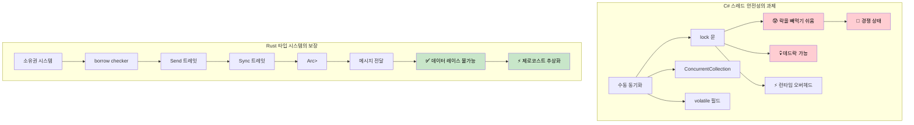

<a id="thread-safety-convention-vs-type-system-guarantees"></a>
## 스레드 안전성: 관례 vs 타입 시스템의 보장

> **이 장에서 배우는 것:** C#의 관례 기반 접근과 달리 Rust가 스레드 안전성을 컴파일 시점에 어떻게 강제하는지, `Arc<Mutex<T>>`와 `lock`의 차이, 채널과 `ConcurrentQueue`의 차이, `Send`/`Sync` 트레잇, scoped thread, 그리고 `async/await`로 이어지는 연결 지점을 배웁니다.
>
> **난이도:** 🔴 고급

> **심화 학습:** 프로덕션 환경의 async 패턴(스트림 처리, graceful shutdown, 커넥션 풀링, cancellation safety)은 별도 가이드인 [Async Rust Training](../../source-docs/ASYNC_RUST_TRAINING.md)을 참고하세요.
>
> **선행 학습:** [소유권과 대여](ch07-ownership-and-borrowing.md), [스마트 포인터](ch07-3-smart-pointers-beyond-single-ownership.md) (`Rc` vs `Arc` 선택 기준).

### C# - 관례에 의존하는 스레드 안전성
```csharp
// C# 컬렉션은 기본적으로 스레드 안전하지 않다
public class UserService
{
    private readonly List<string> items = new();
    private readonly Dictionary<int, User> cache = new();

    // 데이터 레이스를 일으킬 수 있다:
    public void AddItem(string item)
    {
        items.Add(item);  // 스레드 안전하지 않다!
    }

    // 락을 수동으로 사용해야 한다:
    private readonly object lockObject = new();

    public void SafeAddItem(string item)
    {
        lock (lockObject)
        {
            items.Add(item);  // 안전하지만 런타임 오버헤드가 있다
        }
        // 다른 곳에서 락을 빼먹기 쉽다
    }

    // ConcurrentCollection이 도움이 되지만 한계가 있다:
    private readonly ConcurrentBag<string> safeItems = new();
    
    public void ConcurrentAdd(string item)
    {
        safeItems.Add(item);  // 스레드 안전하지만 연산이 제한적이다
    }

    // 복잡한 공유 상태 관리
    private readonly ConcurrentDictionary<int, User> threadSafeCache = new();
    private volatile bool isShutdown = false;
    
    public async Task ProcessUser(int userId)
    {
        if (isShutdown) return;  // 경쟁 상태 가능!
        
        var user = await GetUser(userId);
        threadSafeCache.TryAdd(userId, user);  // 어떤 컬렉션이 안전한지 직접 기억해야 한다
    }

    // 스레드 로컬 저장소도 주의 깊게 관리해야 한다
    private static readonly ThreadLocal<Random> threadLocalRandom = 
        new ThreadLocal<Random>(() => new Random());
        
    public int GetRandomNumber()
    {
        return threadLocalRandom.Value.Next();  // 안전하지만 수동 관리가 필요하다
    }
}

// 경쟁 상태가 생길 수 있는 이벤트 처리
public class EventProcessor
{
    public event Action<string> DataReceived;
    private readonly List<string> eventLog = new();
    
    public void OnDataReceived(string data)
    {
        // 경쟁 상태 - 검사와 호출 사이에 event가 null이 될 수 있다
        if (DataReceived != null)
        {
            DataReceived(data);
        }
        
        // 또 다른 경쟁 상태 - list가 스레드 안전하지 않다
        eventLog.Add($"Processed: {data}");
    }
}
```

### Rust - 타입 시스템이 보장하는 스레드 안전성
```rust
use std::sync::{Arc, Mutex, RwLock};
use std::thread;
use std::collections::HashMap;
use tokio::sync::{mpsc, broadcast};

// Rust는 데이터 레이스를 컴파일 시점에 막는다
pub struct UserService {
    items: Arc<Mutex<Vec<String>>>,
    cache: Arc<RwLock<HashMap<i32, User>>>,
}

impl UserService {
    pub fn new() -> Self {
        UserService {
            items: Arc::new(Mutex::new(Vec::new())),
            cache: Arc::new(RwLock::new(HashMap::new())),
        }
    }
    
    pub fn add_item(&self, item: String) {
        let mut items = self.items.lock().unwrap();
        items.push(item);
        // `items`가 스코프를 벗어나면 락이 자동으로 해제된다
    }
    
    // 여러 읽기, 단일 쓰기 - 자동으로 강제된다
    pub async fn get_user(&self, user_id: i32) -> Option<User> {
        let cache = self.cache.read().unwrap();
        cache.get(&user_id).cloned()
    }
    
    pub async fn cache_user(&self, user_id: i32, user: User) {
        let mut cache = self.cache.write().unwrap();
        cache.insert(user_id, user);
    }
    
    // 스레드 간 공유를 위해 Arc를 복제한다
    pub fn process_in_background(&self) {
        let items = Arc::clone(&self.items);
        
        thread::spawn(move || {
            let items = items.lock().unwrap();
            for item in items.iter() {
                println!("Processing: {}", item);
            }
        });
    }
}

// 채널 기반 통신 - 공유 상태가 필요 없다
pub struct MessageProcessor {
    sender: mpsc::UnboundedSender<String>,
}

impl MessageProcessor {
    pub fn new() -> (Self, mpsc::UnboundedReceiver<String>) {
        let (tx, rx) = mpsc::unbounded_channel();
        (MessageProcessor { sender: tx }, rx)
    }
    
    pub fn send_message(&self, message: String) -> Result<(), mpsc::error::SendError<String>> {
        self.sender.send(message)
    }
}

// 이 코드는 컴파일되지 않는다 - Rust가 가변 데이터를 안전하지 않게 공유하는 것을 막는다:
fn impossible_data_race() {
    let mut items = vec![1, 2, 3];
    
    // 이 코드는 컴파일되지 않는다 - `items`를 여러 클로저로 옮길 수 없다
    /*
    thread::spawn(move || {
        items.push(4);  // 오류: 이동된 값을 사용함
    });
    
    thread::spawn(move || {
        items.push(5);  // 오류: 이동된 값을 사용함
    });
    */
}

// 안전한 동시 데이터 처리
use rayon::prelude::*;

fn parallel_processing() {
    let data = vec![1, 2, 3, 4, 5];
    
    // 병렬 이터레이션 - 스레드 안전성이 보장된다
    let results: Vec<i32> = data
        .par_iter()
        .map(|&x| x * x)
        .collect();
        
    println!("{:?}", results);
}

// 메시지 전달 기반 비동기 동시성
async fn async_message_passing() {
    let (tx, mut rx) = mpsc::channel(100);
    
    // 생산자 태스크
    let producer = tokio::spawn(async move {
        for i in 0..10 {
            if tx.send(i).await.is_err() {
                break;
            }
        }
    });
    
    // 소비자 태스크
    let consumer = tokio::spawn(async move {
        while let Some(value) = rx.recv().await {
            println!("Received: {}", value);
        }
    });
    
    // 두 태스크가 모두 끝날 때까지 기다린다
    let (producer_result, consumer_result) = tokio::join!(producer, consumer);
    producer_result.unwrap();
    consumer_result.unwrap();
}

#[derive(Clone)]
struct User {
    id: i32,
    name: String,
}
```



***


<details>
<summary><strong>🏋️ 연습문제: 스레드 안전 카운터</strong> (클릭하여 펼치기)</summary>

**문제**: 10개의 스레드가 동시에 증가시킬 수 있는 스레드 안전 카운터를 구현하세요. 각 스레드는 1000번씩 증가합니다. 최종 카운트는 정확히 10,000이어야 합니다.

<details>
<summary>🔑 해답</summary>

```rust
use std::sync::{Arc, Mutex};
use std::thread;

fn main() {
    let counter = Arc::new(Mutex::new(0u64));
    let mut handles = vec![];

    for _ in 0..10 {
        let counter = Arc::clone(&counter);
        handles.push(thread::spawn(move || {
            for _ in 0..1000 {
                let mut count = counter.lock().unwrap();
                *count += 1;
            }
        }));
    }

    for h in handles { h.join().unwrap(); }
    assert_eq!(*counter.lock().unwrap(), 10_000);
    println!("Final count: {}", counter.lock().unwrap());
}
```

**또는 atomic 사용(더 빠르고 락이 없음):**
```rust
use std::sync::atomic::{AtomicU64, Ordering};
use std::sync::Arc;
use std::thread;

fn main() {
    let counter = Arc::new(AtomicU64::new(0));
    let handles: Vec<_> = (0..10).map(|_| {
        let counter = Arc::clone(&counter);
        thread::spawn(move || {
            for _ in 0..1000 {
                counter.fetch_add(1, Ordering::Relaxed);
            }
        })
    }).collect();

    for h in handles { h.join().unwrap(); }
    assert_eq!(counter.load(Ordering::SeqCst), 10_000);
}
```

**핵심 요점**: `Arc<Mutex<T>>`가 가장 일반적인 패턴입니다. 단순한 카운터라면 `AtomicU64`를 사용해 락 오버헤드를 완전히 피할 수 있습니다.

</details>
</details>

<a id="why-rust-prevents-data-races-send-and-sync"></a>
### Rust가 데이터 레이스를 막는 이유: `Send`와 `Sync`

Rust는 두 개의 마커 트레잇으로 스레드 안전성을 **컴파일 시점에** 강제합니다. C#에는 정확히 대응되는 개념이 없습니다.

- `Send`: 어떤 타입을 다른 스레드로 안전하게 **전달**할 수 있음 (`thread::spawn`에 넘기는 클로저로 move 가능)
- `Sync`: 어떤 타입을 스레드 간에 (`&T`를 통해) 안전하게 **공유**할 수 있음

대부분의 타입은 자동으로 `Send + Sync`를 만족합니다. 주목할 만한 예외는 다음과 같습니다.
- `Rc<T>`는 `Send`도 `Sync`도 아닙니다. 컴파일러가 이를 `thread::spawn`으로 넘기지 못하게 막습니다. 대신 `Arc<T>`를 사용하세요.
- `Cell<T>`와 `RefCell<T>`는 `Sync`가 아닙니다. 스레드 안전한 interior mutability가 필요하다면 `Mutex<T>`나 `RwLock<T>`를 사용하세요.
- 로 포인터(`*const T`, `*mut T`)는 `Send`도 `Sync`도 아닙니다.

C#에서는 `List<T>`가 스레드 안전하지 않아도 컴파일러가 여러 스레드에서 공유하는 실수를 막지 못합니다. Rust에서는 같은 실수가 런타임 경쟁 상태가 아니라 **컴파일 오류**가 됩니다.

<a id="scoped-threads-borrowing-from-the-stack"></a>
### 스코프 스레드: 스택 데이터 빌려오기

`thread::scope()`를 사용하면 생성한 스레드가 지역 변수를 빌릴 수 있습니다. `Arc`가 필요 없습니다.

```rust
use std::thread;

fn main() {
    let data = vec![1, 2, 3, 4, 5];
    
    // scoped thread는 'data'를 빌릴 수 있다. scope가 모든 스레드가 끝날 때까지 기다린다.
    thread::scope(|s| {
        s.spawn(|| println!("Thread 1: {data:?}"));
        s.spawn(|| println!("Thread 2: sum = {}", data.iter().sum::<i32>()));
    });
    // 여기서도 'data'는 여전히 유효하다. 스레드가 모두 종료되었기 때문이다.
}
```

이 점은 호출한 코드가 완료를 기다린다는 면에서 C#의 `Parallel.ForEach`와 비슷하지만, Rust는 borrow checker가 데이터 레이스가 없음을 컴파일 시점에 **증명**한다는 점이 다릅니다.

<a id="bridging-to-asyncawait"></a>
### `async/await`로 이어지기

C# 개발자는 보통 로 스레드보다 `Task`와 `async/await`를 먼저 떠올립니다. Rust에도 두 패러다임이 모두 있습니다.

| C# | Rust | 언제 쓰나 |
|----|------|-------------|
| `Thread` | `std::thread::spawn` | CPU 바운드 작업, 태스크당 OS 스레드 하나 |
| `Task.Run` | `tokio::spawn` | 런타임 위에서 실행되는 async 태스크 |
| `async/await` | `async/await` | I/O 바운드 동시성 |
| `lock` | `Mutex<T>` | 동기식 상호 배제 |
| `SemaphoreSlim` | `tokio::sync::Semaphore` | 비동기 동시성 제한 |
| `Interlocked` | `std::sync::atomic` | 락 없는 원자적 연산 |
| `CancellationToken` | `tokio_util::sync::CancellationToken` | 협력적 취소 |

> 다음 장인 [Async/Await 심화](ch13-1-asyncawait-deep-dive.md)에서는 Rust의 async 모델과 C#의 `Task` 기반 모델이 어떻게 다른지 자세히 살펴봅니다.

