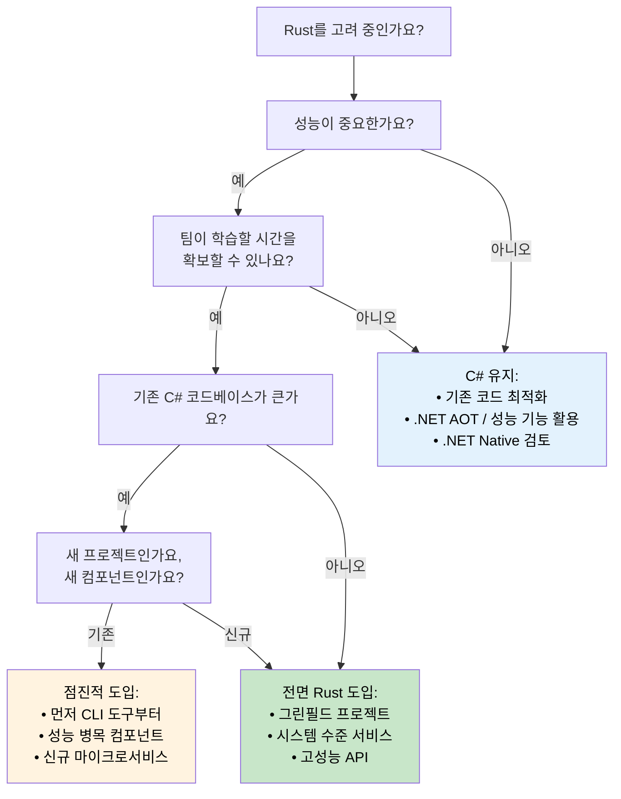

<a id="performance-comparison-managed-vs-native"></a>
## 성능 비교: 관리형 런타임 vs 네이티브

> **이 장에서 배울 내용:** C#과 Rust의 실제 성능 차이, 즉 시작 시간, 메모리 사용량,
> 처리량 벤치마크, CPU 집약적 워크로드, 그리고 언제 마이그레이션하고 언제 C#에 남아야 하는지를
> 판단하는 의사결정 트리를 다룹니다.
>
> **난이도:** 🟡 중급

### 실제 환경에서의 성능 특성

| **항목** | **C# (.NET)** | **Rust** | **성능 영향** |
|----------|---------------|----------|---------------|
| **시작 시간** | 100-500ms (JIT); 5-30ms (.NET 8 AOT) | 1-10ms (네이티브 바이너리) | 🚀 **10-50배 더 빠름** (JIT 대비) |
| **메모리 사용량** | +30-100% (GC 오버헤드 + 메타데이터) | 기준선 수준 (최소 런타임) | 💾 **RAM 30-50% 절감** |
| **GC 일시 중단** | 1-100ms 주기적 pause | 없음 (GC 없음) | ⚡ **일관된 지연 시간** |
| **CPU 사용량** | +10-20% (GC + JIT 오버헤드) | 기준선 수준 (직접 실행) | 🔋 **효율 10-20% 향상** |
| **바이너리 크기** | 30-200MB (런타임 포함); 10-30MB (AOT 트리밍) | 1-20MB (정적 바이너리) | 📦 **더 작은 배포물** |
| **메모리 안전성** | 런타임 검사 | 컴파일 타임 증명 | 🛡️ **오버헤드 없는 안전성** |
| **동시성 성능** | 좋음 (주의 깊은 동기화 필요) | 매우 우수함 (두려움 없는 동시성) | 🏃 **더 뛰어난 확장성** |

> **.NET 8+ AOT 참고:** Native AOT 컴파일은 시작 시간 격차를 크게 줄여줍니다(5-30ms). 하지만 처리량과 메모리 측면에서는 GC 오버헤드와 일시 중단이 여전히 남습니다. 마이그레이션을 평가할 때는 반드시 *자신의 실제 워크로드*를 벤치마크하세요. 눈에 띄는 요약 수치만 보면 오해하기 쉽습니다.

### 벤치마크 예시

```csharp
// C# - JSON 처리 벤치마크
public class JsonProcessor
{
    public async Task<List<User>> ProcessJsonFile(string path)
    {
        var json = await File.ReadAllTextAsync(path);
        var users = JsonSerializer.Deserialize<List<User>>(json);
        
        return users.Where(u => u.Age > 18)
                   .OrderBy(u => u.Name)
                   .Take(1000)
                   .ToList();
    }
}

// 일반적인 성능: 100MB 파일 기준 약 200ms
// 메모리 사용량: 피크 약 500MB (GC 오버헤드 포함)
// 바이너리 크기: 약 80MB (self-contained)
```

```rust
// Rust - 동등한 JSON 처리
use serde::{Deserialize, Serialize};
use tokio::fs;

#[derive(Deserialize, Serialize)]
struct User {
    name: String,
    age: u32,
}

pub async fn process_json_file(path: &str) -> Result<Vec<User>, Box<dyn std::error::Error>> {
    let json = fs::read_to_string(path).await?;
    let mut users: Vec<User> = serde_json::from_str(&json)?;
    
    users.retain(|u| u.age > 18);
    users.sort_by(|a, b| a.name.cmp(&b.name));
    users.truncate(1000);
    
    Ok(users)
}

// 일반적인 성능: 같은 100MB 파일 기준 약 120ms
// 메모리 사용량: 피크 약 200MB (GC 오버헤드 없음)
// 바이너리 크기: 약 8MB (정적 바이너리)
```

### CPU 집약적 워크로드

```csharp
// C# - 수치 계산
public class Mandelbrot
{
    public static int[,] Generate(int width, int height, int maxIterations)
    {
        var result = new int[height, width];
        
        Parallel.For(0, height, y =>
        {
            for (int x = 0; x < width; x++)
            {
                var c = new Complex(
                    (x - width / 2.0) * 4.0 / width,
                    (y - height / 2.0) * 4.0 / height);
                
                result[y, x] = CalculateIterations(c, maxIterations);
            }
        });
        
        return result;
    }
}

// 성능: 약 2.3초 (8코어 머신)
// 메모리: 약 500MB
```

```rust
// Rust - Rayon으로 같은 계산 수행
use rayon::prelude::*;
use num_complex::Complex;

pub fn generate_mandelbrot(width: usize, height: usize, max_iterations: u32) -> Vec<Vec<u32>> {
    (0..height)
        .into_par_iter()
        .map(|y| {
            (0..width)
                .map(|x| {
                    let c = Complex::new(
                        (x as f64 - width as f64 / 2.0) * 4.0 / width as f64,
                        (y as f64 - height as f64 / 2.0) * 4.0 / height as f64,
                    );
                    calculate_iterations(c, max_iterations)
                })
                .collect()
        })
        .collect()
}

// 성능: 약 1.1초 (같은 8코어 머신)
// 메모리: 약 200MB
// 2배 빠르고 메모리는 60% 덜 사용
```

### 어떤 언어를 선택할까

**C#을 선택할 때:**
- **빠른 개발 속도가 중요할 때** - 풍부한 툴링 생태계
- **팀이 .NET에 익숙할 때** - 기존 지식과 역량을 그대로 활용 가능
- **엔터프라이즈 통합이 중요할 때** - Microsoft 생태계를 많이 활용할 때
- **성능 요구가 중간 수준일 때** - 현재 성능으로도 충분할 때
- **풍부한 UI 애플리케이션이 필요할 때** - WPF, WinUI, Blazor 애플리케이션
- **프로토타입과 MVP가 필요할 때** - 시장 출시 속도가 중요할 때

**Rust를 선택할 때:**
- **성능이 핵심일 때** - CPU/메모리 집약적 애플리케이션
- **자원 제약이 중요할 때** - 임베디드, 엣지 컴퓨팅, 서버리스
- **장시간 실행되는 서비스를 만들 때** - 웹 서버, 데이터베이스, 시스템 서비스
- **시스템 수준 프로그래밍이 필요할 때** - OS 구성요소, 드라이버, 네트워크 도구
- **높은 신뢰성이 필요할 때** - 금융 시스템, 안전 필수 애플리케이션
- **동시성/병렬성 워크로드가 클 때** - 고처리량 데이터 처리

### 마이그레이션 전략 의사결정 트리



***


