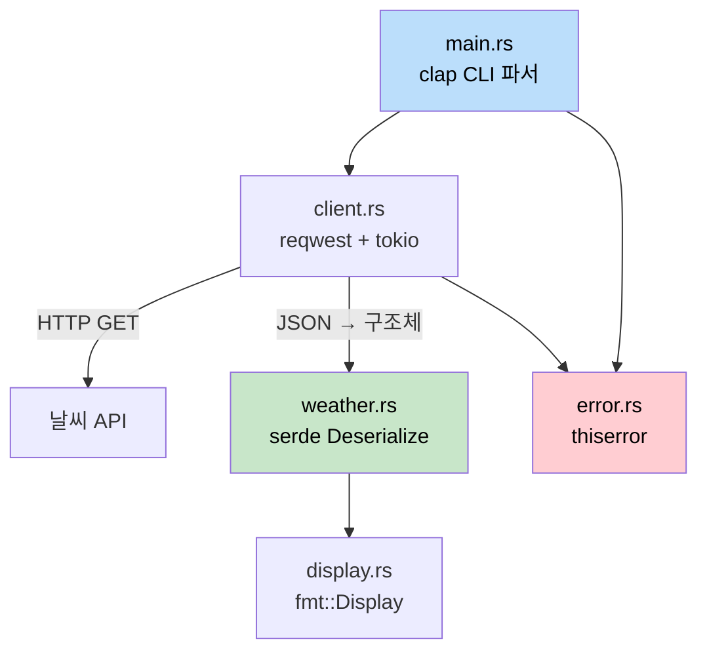

<a id="capstone-project-build-a-cli-weather-tool"></a>
## 캡스톤 프로젝트: CLI 날씨 도구 만들기

> **이 장에서 배울 내용:** 구조체, 트레잇, 에러 처리, async, 모듈, `serde`, CLI 인자 파싱을
> 한데 묶어 실제로 동작하는 Rust 애플리케이션을 만드는 방법을 배웁니다. 이는 C# 개발자가
> `HttpClient`, `System.Text.Json`, `System.CommandLine`으로 만들 법한 도구와 비슷합니다.
>
> **난이도:** 🟡 중급

이 캡스톤은 책 전반에서 배운 개념을 한데 모읍니다. API에서 날씨 데이터를 가져와 출력하는 명령줄 도구 `weather-cli`를 만들어볼 것입니다. 프로젝트는 올바른 모듈 레이아웃, 에러 타입, 테스트를 갖춘 작은 크레이트 형태로 구성됩니다.

### 프로젝트 개요



**만들 결과물:**
```
$ weather-cli --city "Seattle"
🌧  Seattle: 12°C, Overcast clouds
    Humidity: 82%  Wind: 5.4 m/s
```

**이 장에서 함께 쓰는 개념:**
| 책 장 | 여기서 쓰는 개념 |
|---|---|
| Ch05 (구조체) | `WeatherReport`, `Config` 데이터 타입 |
| Ch08 (모듈) | `src/lib.rs`, `src/client.rs`, `src/display.rs` |
| Ch09 (에러) | `thiserror`를 이용한 커스텀 `WeatherError` |
| Ch10 (트레잇) | 출력 포매팅을 위한 `Display` 구현 |
| Ch11 (From/Into) | `serde`를 이용한 JSON 역직렬화 |
| Ch12 (이터레이터) | API 응답 배열 처리 |
| Ch13 (Async) | HTTP 호출을 위한 `reqwest` + `tokio` |
| Ch14-1 (테스트) | 단위 테스트 + 통합 테스트 |

---

### 1단계: 프로젝트 설정

```bash
cargo new weather-cli
cd weather-cli
```

`Cargo.toml`에 의존성을 추가하세요:
```toml
[package]
name = "weather-cli"
version = "0.1.0"
edition = "2021"

[dependencies]
clap = { version = "4", features = ["derive"] }   # CLI 인자 (System.CommandLine과 유사)
reqwest = { version = "0.12", features = ["json"] } # HTTP 클라이언트 (HttpClient와 유사)
serde = { version = "1", features = ["derive"] }    # 직렬화 (System.Text.Json과 유사)
serde_json = "1"
thiserror = "2"                                      # 에러 타입
tokio = { version = "1", features = ["full"] }       # async 런타임
```

```csharp
// C# 쪽 대응 의존성:
// dotnet add package System.CommandLine
// dotnet add package System.Net.Http.Json
// (System.Text.Json과 HttpClient는 기본 제공)
```

### 2단계: 데이터 타입 정의

`src/weather.rs`를 만드세요:
```rust
use serde::Deserialize;

/// Raw API response (matches JSON shape)
#[derive(Deserialize, Debug)]
pub struct ApiResponse {
    pub main: MainData,
    pub weather: Vec<WeatherCondition>,
    pub wind: WindData,
    pub name: String,
}

#[derive(Deserialize, Debug)]
pub struct MainData {
    pub temp: f64,
    pub humidity: u32,
}

#[derive(Deserialize, Debug)]
pub struct WeatherCondition {
    pub description: String,
    pub icon: String,
}

#[derive(Deserialize, Debug)]
pub struct WindData {
    pub speed: f64,
}

/// Our domain type (clean, decoupled from API)
#[derive(Debug, Clone)]
pub struct WeatherReport {
    pub city: String,
    pub temp_celsius: f64,
    pub description: String,
    pub humidity: u32,
    pub wind_speed: f64,
}

impl From<ApiResponse> for WeatherReport {
    fn from(api: ApiResponse) -> Self {
        let description = api.weather
            .first()
            .map(|w| w.description.clone())
            .unwrap_or_else(|| "Unknown".to_string());

        WeatherReport {
            city: api.name,
            temp_celsius: api.main.temp,
            description,
            humidity: api.main.humidity,
            wind_speed: api.wind.speed,
        }
    }
}
```

```csharp
// C# 대응 코드:
// public record ApiResponse(MainData Main, List<WeatherCondition> Weather, ...);
// public record WeatherReport(string City, double TempCelsius, ...);
// 수동 매핑 또는 AutoMapper
```

**핵심 차이:** `#[derive(Deserialize)]` + `From` 구현이 C#의 `JsonSerializer.Deserialize<T>()` + AutoMapper를 대체합니다. Rust에서는 둘 다 리플렉션 없이 컴파일 타임에 결정됩니다.

### 3단계: 에러 타입

`src/error.rs`를 만드세요:
```rust
use thiserror::Error;

#[derive(Error, Debug)]
pub enum WeatherError {
    #[error("HTTP request failed: {0}")]
    Http(#[from] reqwest::Error),

    #[error("City not found: {0}")]
    CityNotFound(String),

    #[error("API key not set — export WEATHER_API_KEY")]
    MissingApiKey,
}

pub type Result<T> = std::result::Result<T, WeatherError>;
```

### 4단계: HTTP 클라이언트

`src/client.rs`를 만드세요:
```rust
use crate::error::{WeatherError, Result};
use crate::weather::{ApiResponse, WeatherReport};

pub struct WeatherClient {
    api_key: String,
    http: reqwest::Client,
}

impl WeatherClient {
    pub fn new(api_key: String) -> Self {
        WeatherClient {
            api_key,
            http: reqwest::Client::new(),
        }
    }

    pub async fn get_weather(&self, city: &str) -> Result<WeatherReport> {
        let url = format!(
            "https://api.openweathermap.org/data/2.5/weather?q={}&appid={}&units=metric",
            city, self.api_key
        );

        let response = self.http.get(&url).send().await?;

        if response.status() == reqwest::StatusCode::NOT_FOUND {
            return Err(WeatherError::CityNotFound(city.to_string()));
        }

        let api_data: ApiResponse = response.json().await?;
        Ok(WeatherReport::from(api_data))
    }
}
```

```csharp
// C# 대응 코드:
// var response = await _httpClient.GetAsync(url);
// if (response.StatusCode == HttpStatusCode.NotFound)
//     throw new CityNotFoundException(city);
// var data = await response.Content.ReadFromJsonAsync<ApiResponse>();
```

**핵심 차이점:**
- `?` 연산자가 `try/catch`를 대신하며, 에러를 `Result`를 통해 자동 전파합니다
- `WeatherReport::from(api_data)`는 AutoMapper 대신 `From` 트레잇을 사용합니다
- `IHttpClientFactory`가 없어도 됩니다. `reqwest::Client`가 내부적으로 연결 풀링을 처리합니다

### 5단계: 출력 포매팅

`src/display.rs`를 만드세요:
```rust
use std::fmt;
use crate::weather::WeatherReport;

impl fmt::Display for WeatherReport {
    fn fmt(&self, f: &mut fmt::Formatter<'_>) -> fmt::Result {
        let icon = weather_icon(&self.description);
        writeln!(f, "{}  {}: {:.0}°C, {}",
            icon, self.city, self.temp_celsius, self.description)?;
        write!(f, "    Humidity: {}%  Wind: {:.1} m/s",
            self.humidity, self.wind_speed)
    }
}

fn weather_icon(description: &str) -> &str {
    let desc = description.to_lowercase();
    if desc.contains("clear") { "☀️" }
    else if desc.contains("cloud") { "☁️" }
    else if desc.contains("rain") || desc.contains("drizzle") { "🌧" }
    else if desc.contains("snow") { "❄️" }
    else if desc.contains("thunder") { "⛈" }
    else { "🌡" }
}
```

### 6단계: 모든 조각 연결하기

`src/lib.rs`:
```rust
pub mod client;
pub mod display;
pub mod error;
pub mod weather;
```

`src/main.rs`:
```rust
use clap::Parser;
use weather_cli::{client::WeatherClient, error::WeatherError};

#[derive(Parser)]
#[command(name = "weather-cli", about = "Fetch weather from the command line")]
struct Cli {
    /// City name to look up
    #[arg(short, long)]
    city: String,
}

#[tokio::main]
async fn main() {
    let cli = Cli::parse();

    let api_key = match std::env::var("WEATHER_API_KEY") {
        Ok(key) => key,
        Err(_) => {
            eprintln!("Error: {}", WeatherError::MissingApiKey);
            std::process::exit(1);
        }
    };

    let client = WeatherClient::new(api_key);

    match client.get_weather(&cli.city).await {
        Ok(report) => println!("{report}"),
        Err(WeatherError::CityNotFound(city)) => {
            eprintln!("City not found: {city}");
            std::process::exit(1);
        }
        Err(e) => {
            eprintln!("Error: {e}");
            std::process::exit(1);
        }
    }
}
```

### 7단계: 테스트

```rust
// src/weather.rs 또는 tests/weather_test.rs 안에 작성
#[cfg(test)]
mod tests {
    use super::*;

    fn sample_api_response() -> ApiResponse {
        serde_json::from_str(r#"{
            "main": {"temp": 12.3, "humidity": 82},
            "weather": [{"description": "overcast clouds", "icon": "04d"}],
            "wind": {"speed": 5.4},
            "name": "Seattle"
        }"#).unwrap()
    }

    #[test]
    fn api_response_to_weather_report() {
        let report = WeatherReport::from(sample_api_response());
        assert_eq!(report.city, "Seattle");
        assert!((report.temp_celsius - 12.3).abs() < 0.01);
        assert_eq!(report.description, "overcast clouds");
    }

    #[test]
    fn display_format_includes_icon() {
        let report = WeatherReport {
            city: "Test".into(),
            temp_celsius: 20.0,
            description: "clear sky".into(),
            humidity: 50,
            wind_speed: 3.0,
        };
        let output = format!("{report}");
        assert!(output.contains("☀️"));
        assert!(output.contains("20°C"));
    }

    #[test]
    fn empty_weather_array_defaults_to_unknown() {
        let json = r#"{
            "main": {"temp": 0.0, "humidity": 0},
            "weather": [],
            "wind": {"speed": 0.0},
            "name": "Nowhere"
        }"#;
        let api: ApiResponse = serde_json::from_str(json).unwrap();
        let report = WeatherReport::from(api);
        assert_eq!(report.description, "Unknown");
    }
}
```

---

### 최종 파일 레이아웃

```
weather-cli/
├── Cargo.toml
├── src/
│   ├── main.rs        # CLI 진입점 (clap)
│   ├── lib.rs         # 모듈 선언
│   ├── client.rs      # HTTP 클라이언트 (reqwest + tokio)
│   ├── weather.rs     # 데이터 타입 + From 구현 + 테스트
│   ├── display.rs     # Display 포매팅
│   └── error.rs       # WeatherError + Result 별칭
└── tests/
    └── integration.rs # 통합 테스트
```

C# 쪽 구조와 비교하면:
```
WeatherCli/
├── WeatherCli.csproj
├── Program.cs
├── Services/
│   └── WeatherClient.cs
├── Models/
│   ├── ApiResponse.cs
│   └── WeatherReport.cs
└── Tests/
    └── WeatherTests.cs
```

**Rust 버전도 구조적으로는 놀랄 만큼 비슷합니다.** 주요 차이는 다음과 같습니다.
- namespace 대신 `mod` 선언을 사용합니다
- 예외 대신 `Result<T, E>`를 사용합니다
- AutoMapper 대신 `From` 트레잇을 사용합니다
- 내장 async 런타임 대신 명시적인 `#[tokio::main]`을 사용합니다

### 보너스: 통합 테스트 스텁

실제 서버를 치지 않고 공개 API를 테스트하려면 `tests/integration.rs`를 만들어 보세요:

```rust
// tests/integration.rs
use weather_cli::weather::WeatherReport;

#[test]
fn weather_report_display_roundtrip() {
    let report = WeatherReport {
        city: "Seattle".into(),
        temp_celsius: 12.3,
        description: "overcast clouds".into(),
        humidity: 82,
        wind_speed: 5.4,
    };

    let output = format!("{report}");
    assert!(output.contains("Seattle"));
    assert!(output.contains("12°C"));
    assert!(output.contains("82%"));
}
```

`cargo test`로 실행해보세요. Rust는 `src/` 안의 `#[cfg(test)]` 모듈과 `tests/` 안의 통합 테스트를 모두 자동으로 발견합니다. 별도 테스트 프레임워크 설정이 필요 없다는 점은 C#에서 xUnit/NUnit 환경을 따로 맞추는 것과 비교해보면 차이가 분명합니다.

---

### 확장 과제

동작하는 버전을 만들었다면, 아래 과제로 실력을 더 끌어올려 보세요.

1. **캐시 추가하기** — 마지막 API 응답을 파일에 저장하세요. 시작 시점에 10분보다 오래되지 않았다면 HTTP 호출을 건너뛰세요. `std::fs`, `serde_json::to_writer`, `SystemTime` 연습이 됩니다.

2. **여러 도시 지원하기** — `--city "Seattle,Portland,Vancouver"`를 받아서 `tokio::join!`으로 모두 동시에 가져오세요. 동시 async를 연습할 수 있습니다.

3. **`--format json` 플래그 추가하기** — 사람이 읽는 텍스트 대신 `serde_json::to_string_pretty`로 보고서를 JSON으로 출력하세요. 조건부 포매팅과 `Serialize`를 연습할 수 있습니다.

4. **통합 테스트 작성하기** — `wiremock`을 사용한 mock HTTP 서버로 전체 흐름을 검증하는 `tests/integration.rs`를 만들어 보세요. ch14-1에서 본 `tests/` 디렉터리 패턴을 다시 써보게 됩니다.

***
