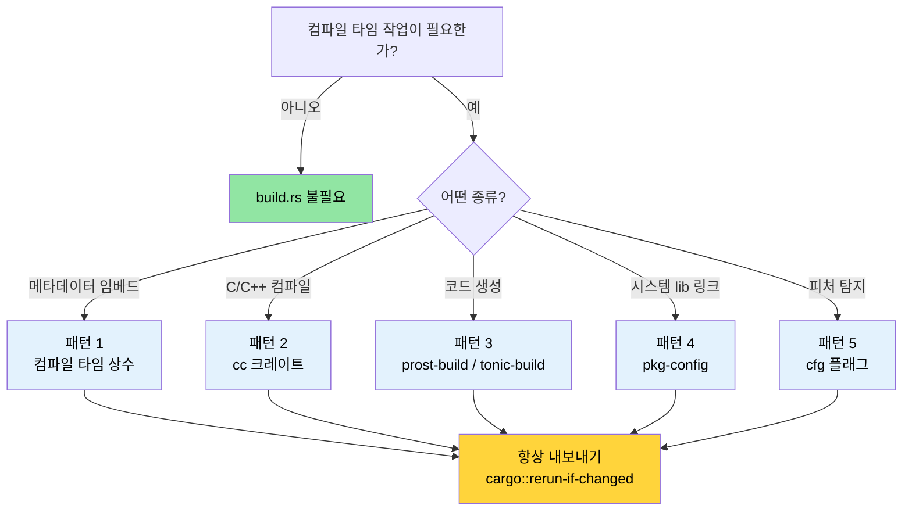

<a id="build-scripts-buildrs-in-depth"></a>
# 빌드 스크립트 — `build.rs` 심화 🟢

> **이 장에서 배울 내용:**
> - `build.rs`가 Cargo 빌드 파이프라인에 끼어드는 방식과 실행 시점
> - 프로덕션 패턴 다섯 가지: 컴파일 타임 상수, C/C++ 컴파일, protobuf 코드 생성, `pkg-config` 링크, 피처 탐지
> - 빌드를 느리게 하거나 크로스 컴파일을 깨뜨리는 안티패턴
> - 재현 가능한 빌드와 추적 가능성 사이의 균형 잡기
>
> **교차 참고:** [크로스 컴파일](ch02-cross-compilation-one-source-many-target.md)은 타깃을 고려한 빌드에 빌드 스크립트를 사용합니다 · [`no_std`와 피처](ch09-no-std-and-feature-verification.md)는 여기서 설정한 `cfg` 플래그를 확장합니다 · [CI/CD 파이프라인](ch11-putting-it-all-together-a-production-cic.md)은 자동화에서 빌드 스크립트를 조율합니다

모든 Cargo 패키지는 크레이트 루트에 `build.rs`라는 이름의 파일을 둘 수 있습니다.
Cargo는 크레이트를 컴파일하기 *전에* 이 파일을 컴파일하고 실행합니다. 빌드
스크립트는 표준 출력의 `println!` 지시로 Cargo와 통신합니다.

<a id="what-buildrs-is-and-when-it-runs"></a>
### `build.rs`란 무엇이며 언제 실행되는가

```text
┌─────────────────────────────────────────────────────────┐
│                    Cargo 빌드 파이프라인                  │
│                                                         │
│  1. 의존성 해석                                         │
│  2. 크레이트 다운로드                                   │
│  3. build.rs 컴파일  ← 일반 Rust, HOST에서 실행         │
│  4. build.rs 실행   ← stdout → Cargo 지시               │
│  5. 크레이트 컴파일 (4단계 지시 사용)                   │
│  6. 링크                                                │
└─────────────────────────────────────────────────────────┘
```

핵심 사실:
- `build.rs`는 **타깃**이 아니라 **호스트**에서 실행됩니다. 크로스 컴파일 시에도
  최종 바이너리가 다른 아키텍처를 겨냥하더라도 빌드 스크립트는 개발 머신에서
  돌아갑니다.
- 빌드 스크립트의 범위는 자기 패키지로 한정됩니다. 다른 크레이트의 컴파일 방식을
  바꿀 수는 없습니다 — 단, `Cargo.toml`에 `links` 키를 선언해
  `cargo::metadata=KEY=VALUE`로 의존 크레이트에 메타데이터를 넘기는 경우는 예외입니다.
- Cargo가 변경을 감지할 때마다 **매번** 실행됩니다 — `cargo::rerun-if-changed`
  지시로 재실행을 제한하지 않는 한.

> **참고 (Rust 1.71+)**: Rust 1.71부터 Cargo는 컴파일된 `build.rs` 바이너리에
> 지문을 남깁니다 — 바이너리가 동일하면 소스 타임스탬프가 바뀌어도 재실행하지
> 않습니다. 그러나 `cargo::rerun-if-changed=build.rs`는
> 여전히 가치가 있습니다: *어떤* `rerun-if-changed` 지시도 없으면 Cargo는
> `build.rs`뿐 아니라 패키지 안의 **어떤 파일이든** 바뀔 때마다 `build.rs`를
> 다시 실행합니다.
> `cargo::rerun-if-changed=build.rs`를 내보내면 재실행이 `build.rs` 자체가
> 바뀔 때로만 제한되어 큰 크레이트에서 컴파일 시간을 크게 줄일 수 있습니다.
- *cfg 플래그*, *환경 변수*, *링커 인자*, 메인 크레이트가 소비하는 *파일 경로*를
  내보낼 수 있습니다.

최소 `Cargo.toml` 항목:

```toml
[package]
name = "my-crate"
version = "0.1.0"
edition = "2021"
build = "build.rs"       # 기본값 — Cargo가 자동으로 build.rs를 찾음
# build = "src/build.rs" # 또는 다른 위치에 둘 수 있음
```

<a id="the-cargo-instruction-protocol"></a>
### Cargo 지시 프로토콜

빌드 스크립트는 표준 출력에 지시를 출력해 Cargo와 통신합니다.
Rust 1.77부터 권장 접두사는 `cargo::`입니다(이전의 `cargo:` 한 콜론 형식을 대체).

| 지시 | 용도 |
|-------------|---------|
| `cargo::rerun-if-changed=PATH` | PATH가 바뀔 때만 build.rs 재실행 |
| `cargo::rerun-if-env-changed=VAR` | 환경 변수 VAR이 바뀔 때만 재실행 |
| `cargo::rustc-link-lib=NAME` | 네이티브 라이브러리 NAME에 링크 |
| `cargo::rustc-link-search=PATH` | PATH를 라이브러리 검색 경로에 추가 |
| `cargo::rustc-cfg=KEY` | 조건부 컴파일용 `#[cfg(KEY)]` 플래그 설정 |
| `cargo::rustc-cfg=KEY="VALUE"` | `#[cfg(KEY = "VALUE")]` 플래그 설정 |
| `cargo::rustc-env=KEY=VALUE` | `env!()`로 접근 가능한 환경 변수 설정 |
| `cargo::rustc-cdylib-link-arg=FLAG` | cdylib 타깃에 링커에 FLAG 전달 |
| `cargo::warning=MESSAGE` | 컴파일 중 경고 표시 |
| `cargo::metadata=KEY=VALUE` | 의존 크레이트가 읽을 수 있는 메타데이터 저장 |

```rust
// build.rs — 최소 예제
fn main() {
    // build.rs 자체가 바뀔 때만 재실행
    println!("cargo::rerun-if-changed=build.rs");

    // 컴파일 타임 환경 변수 설정
    let timestamp = std::time::SystemTime::now()
        .duration_since(std::time::UNIX_EPOCH)
        .map(|d| d.as_secs().to_string())
        .unwrap_or_else(|_| "0".into());
    println!("cargo::rustc-env=BUILD_TIMESTAMP={timestamp}");
}
```

<a id="pattern-1-compile-time-constants"></a>
### 패턴 1: 컴파일 타임 상수

가장 흔한 용도: 빌드 메타데이터를 바이너리에 박아 런타임에 보고하는 것
(git 해시, 빌드 날짜, CI 잡 ID).

```rust
// build.rs
use std::process::Command;

fn main() {
    println!("cargo::rerun-if-changed=.git/HEAD");
    println!("cargo::rerun-if-changed=.git/refs");

    // Git 커밋 해시
    let output = Command::new("git")
        .args(["rev-parse", "--short", "HEAD"])
        .output()
        .expect("git not found");
    let git_hash = String::from_utf8_lossy(&output.stdout).trim().to_string();
    println!("cargo::rustc-env=GIT_HASH={git_hash}");

    // 빌드 프로파일 (debug 또는 release)
    let profile = std::env::var("PROFILE").unwrap_or_else(|_| "unknown".into());
    println!("cargo::rustc-env=BUILD_PROFILE={profile}");

    // 타깃 트리플
    let target = std::env::var("TARGET").unwrap_or_else(|_| "unknown".into());
    println!("cargo::rustc-env=BUILD_TARGET={target}");
}
```

```rust
// src/main.rs — 빌드 타임 값 소비
fn print_version() {
    println!(
        "{} {} (git:{} target:{} profile:{})",
        env!("CARGO_PKG_NAME"),
        env!("CARGO_PKG_VERSION"),
        env!("GIT_HASH"),
        env!("BUILD_TARGET"),
        env!("BUILD_PROFILE"),
    );
}
```

> **Cargo가 기본 제공하는 환경 변수** — build.rs 없이도 사용 가능:
> `CARGO_PKG_NAME`, `CARGO_PKG_VERSION`, `CARGO_PKG_AUTHORS`,
> `CARGO_PKG_DESCRIPTION`, `CARGO_MANIFEST_DIR`.
> [전체 목록](https://doc.rust-lang.org/cargo/reference/environment-variables.html#environment-variables-cargo-sets-for-crates)을 참고하세요.

<a id="pattern-2-compiling-cc-code-with-the-cc-crate"></a>
### 패턴 2: `cc` 크레이트로 C/C++ 코드 컴파일

Rust 크레이트가 C 라이브러리를 감싸거나 작은 C 헬퍼가 필요할 때(하드웨어 인터페이스에서 흔함),
[`cc`](https://docs.rs/cc) 크레이트가 build.rs 안에서의 컴파일을 단순화합니다.

```toml
# Cargo.toml
[build-dependencies]
cc = "1.0"
```

```rust
// build.rs
fn main() {
    println!("cargo::rerun-if-changed=csrc/");

    cc::Build::new()
        .file("csrc/ipmi_raw.c")
        .file("csrc/smbios_parser.c")
        .include("csrc/include")
        .flag("-Wall")
        .flag("-Wextra")
        .opt_level(2)
        .compile("diag_helpers");
    // libdiag_helpers.a를 만들고 적절한
    // cargo::rustc-link-lib 및 cargo::rustc-link-search 지시를 내보냅니다.
}
```

```rust
// src/lib.rs — 컴파일된 C 코드에 대한 FFI 바인딩
extern "C" {
    fn ipmi_raw_command(
        netfn: u8,
        cmd: u8,
        data: *const u8,
        data_len: usize,
        response: *mut u8,
        response_len: *mut usize,
    ) -> i32;
}

/// 원시 IPMI 명령 인터페이스를 감싼 안전한 래퍼.
/// 가정: enum IpmiError { CommandFailed(i32), ... }
pub fn send_ipmi_command(netfn: u8, cmd: u8, data: &[u8]) -> Result<Vec<u8>, IpmiError> {
    let mut response = vec![0u8; 256];
    let mut response_len: usize = response.len();

    // SAFETY: response 버퍼는 충분히 크고 response_len은 올바르게 초기화됨.
    let rc = unsafe {
        ipmi_raw_command(
            netfn,
            cmd,
            data.as_ptr(),
            data.len(),
            response.as_mut_ptr(),
            &mut response_len,
        )
    };

    if rc != 0 {
        return Err(IpmiError::CommandFailed(rc));
    }
    response.truncate(response_len);
    Ok(response)
}
```

C++ 코드에는 `.cpp(true)`와 `.flag("-std=c++17")`를 사용합니다:

```rust
// build.rs — C++ 변형
fn main() {
    println!("cargo::rerun-if-changed=cppsrc/");

    cc::Build::new()
        .cpp(true)
        .file("cppsrc/vendor_parser.cpp")
        .flag("-std=c++17")
        .flag("-fno-exceptions")    // Rust의 예외 없음 모델에 맞춤
        .compile("vendor_helpers");
}
```

<a id="pattern-3-protocol-buffers-and-code-generation"></a>
### 패턴 3: Protocol Buffers와 코드 생성

빌드 스크립트는 코드 생성에 강합니다 — `.proto`, `.fbs`, `.json`
스키마를 컴파일 타임에 Rust 소스로 바꿉니다. [`prost-build`](https://docs.rs/prost-build)를
쓰는 protobuf 패턴은 다음과 같습니다:

```toml
# Cargo.toml
[build-dependencies]
prost-build = "0.13"
```

```rust
// build.rs
fn main() {
    println!("cargo::rerun-if-changed=proto/");

    prost_build::compile_protos(
        &["proto/diagnostics.proto", "proto/telemetry.proto"],
        &["proto/"],
    )
    .expect("Failed to compile protobuf definitions");
}
```

```rust
// src/lib.rs — 생성된 코드 포함
pub mod diagnostics {
    include!(concat!(env!("OUT_DIR"), "/diagnostics.rs"));
}

pub mod telemetry {
    include!(concat!(env!("OUT_DIR"), "/telemetry.rs"));
}
```

> **`OUT_DIR`**은 빌드 스크립트가 생성 파일을 둘 Cargo 제공 디렉터리입니다.
> 크레이트마다 `target/` 아래 자신만의 `OUT_DIR`을 갖습니다.

<a id="pattern-4-linking-system-libraries-with-pkg-config"></a>
### 패턴 4: `pkg-config`로 시스템 라이브러리 링크

`.pc` 파일을 제공하는 시스템 라이브러리(systemd, OpenSSL, libpci)에는
[`pkg-config`](https://docs.rs/pkg-config) 크레이트가 시스템을 탐색해
올바른 링크 지시를 내보냅니다:

```toml
# Cargo.toml
[build-dependencies]
pkg-config = "0.3"
```

```rust
// build.rs
fn main() {
    // libpci 탐색 (PCIe 장치 열거에 사용)
    pkg_config::Config::new()
        .atleast_version("3.6.0")
        .probe("libpci")
        .expect("libpci >= 3.6.0 not found — install pciutils-dev");

    // libsystemd 탐색 (선택 — sd_notify 연동용)
    if pkg_config::probe_library("libsystemd").is_ok() {
        println!("cargo::rustc-cfg=has_systemd");
    }
}
```

```rust
// src/lib.rs — pkg-config 탐색에 따른 조건부 컴파일
#[cfg(has_systemd)]
mod systemd_notify {
    extern "C" {
        fn sd_notify(unset_environment: i32, state: *const std::ffi::c_char) -> i32;
    }

    pub fn notify_ready() {
        let state = std::ffi::CString::new("READY=1").unwrap();
        // SAFETY: state는 유효한 null 종료 C 문자열입니다.
        unsafe { sd_notify(0, state.as_ptr()) };
    }
}

#[cfg(not(has_systemd))]
mod systemd_notify {
    pub fn notify_ready() {
        // systemd가 없는 시스템에서는 no-op
    }
}
```

<a id="pattern-5-feature-detection-and-conditional-compilation"></a>
### 패턴 5: 피처 탐지와 조건부 컴파일

빌드 스크립트는 컴파일 환경을 탐색하고 메인 크레이트가 조건부 코드 경로에
쓰는 cfg 플래그를 설정할 수 있습니다.

**CPU 아키텍처와 OS 탐지** (안전 — 컴파일 타임 상수입니다):

```rust
// build.rs — CPU 피처와 OS 기능 탐지
fn main() {
    println!("cargo::rerun-if-changed=build.rs");

    let target = std::env::var("TARGET").unwrap();
    let target_os = std::env::var("CARGO_CFG_TARGET_OS").unwrap();

    // x86_64에서 AVX2 최적화 경로 활성화
    if target.starts_with("x86_64") {
        println!("cargo::rustc-cfg=has_x86_64");
    }

    // aarch64에서 ARM NEON 경로 활성화
    if target.starts_with("aarch64") {
        println!("cargo::rustc-cfg=has_aarch64");
    }

    // /dev/ipmi0 사용 가능 여부 (빌드 타임 검사)
    if target_os == "linux" && std::path::Path::new("/dev/ipmi0").exists() {
        println!("cargo::rustc-cfg=has_ipmi_device");
    }
}
```

> ⚠️ **안티패턴 시연** — 아래 코드는 당장 쓰고 싶어지지만
> 문제가 될 수 있는 접근입니다. **프로덕션에서는 사용하지 마세요.**

```rust
// build.rs — 나쁜 예: 빌드 타임에 하는 런타임 하드웨어 탐지
fn main() {
    // ANTI-PATTERN: 바이너리가 빌드 머신의 하드웨어에 고정됩니다.
    // GPU가 있는 머신에서 빌드해 GPU 없는 곳에 배포하면,
    // 바이너리는 조용히 GPU가 있다고 가정합니다.
    if std::process::Command::new("accel-query")
        .arg("--query-gpu=name")
        .arg("--format=csv,noheader")
        .output()
        .is_ok()
    {
        println!("cargo::rustc-cfg=has_accel_device");
    }
}
```

```rust
// src/gpu.rs — 빌드 타임 탐지에 맞춰 동작하는 코드
pub fn query_gpu_info() -> GpuResult {
    #[cfg(has_accel_device)]
    {
        run_accel_query()
    }

    #[cfg(not(has_accel_device))]
    {
        GpuResult::NotAvailable("accel-query not found at build time".into())
    }
}
```

> ⚠️ **왜 잘못되었는가**: 선택적 하드웨어는 빌드 타임 탐지보다 **런타임** 탐지가
> 거의 항상 낫습니다. 위에서 만든 바이너리는 *빌드 머신의 하드웨어 구성*에 묶여
> 배포 대상에서 다르게 동작합니다. 아키텍처, OS, 라이브러리 가용성처럼
> 진짜로 컴파일 타임에 고정되는 능력에만 빌드 타임 탐지를 쓰세요.
> GPU 같은 하드웨어는 `which accel-query`나 `accel-mgmt` 탐색으로 런타임에 감지하세요.

<a id="anti-patterns-and-pitfalls"></a>
### 안티패턴과 함정

| 안티패턴 | 왜 나쁜가 | 해결 |
|-------------|-------------|-----|
| `rerun-if-changed` 없음 | build.rs가 *매* 빌드마다 실행되어 반복 작업이 느려짐 | 최소한 `cargo::rerun-if-changed=build.rs`는 항상 내보내기 |
| build.rs에서 네트워크 호출 | 오프라인에서 빌드 실패, 재현 불가 | 파일을 벤더하거나 별도 fetch 단계 사용 |
| `src/`에 쓰기 | Cargo는 빌드 중 소스 변경을 기대하지 않음 | `OUT_DIR`에 쓰고 `include!()` 사용 |
| 무거운 연산 | 매 `cargo build`마다 느려짐 | `OUT_DIR`에 결과 캐시, `rerun-if-changed`로 게이트 |
| 크로스 컴파일 무시 | `$CC`를 무시하고 `Command::new("gcc")` 사용 | 크로스 툴체인을 다루는 `cc` 크레이트 사용 |
| 맥락 없이 패닉 | `unwrap()`이 모호한 "build script failed"만 줌 | `.expect("설명 메시지")` 또는 `cargo::warning=` 출력 |

<a id="application-embedding-build-metadata"></a>
### 적용: 빌드 메타데이터 임베딩

프로젝트는 버전 보고에 현재 `env!("CARGO_PKG_VERSION")`를 씁니다. 빌드 스크립트로
이를 더 풍부한 메타데이터로 확장할 수 있습니다:

```rust
// build.rs — 제안되는 추가
fn main() {
    println!("cargo::rerun-if-changed=.git/HEAD");
    println!("cargo::rerun-if-changed=.git/refs");
    println!("cargo::rerun-if-changed=build.rs");

    // 진단 보고서 추적을 위해 git 해시 임베드
    if let Ok(output) = std::process::Command::new("git")
        .args(["rev-parse", "--short=10", "HEAD"])
        .output()
    {
        let hash = String::from_utf8_lossy(&output.stdout).trim().to_string();
        println!("cargo::rustc-env=APP_GIT_HASH={hash}");
    } else {
        println!("cargo::rustc-env=APP_GIT_HASH=unknown");
    }

    // 보고 상관을 위한 빌드 타임스탬프 임베드
    let timestamp = std::time::SystemTime::now()
        .duration_since(std::time::UNIX_EPOCH)
        .map(|d| d.as_secs().to_string())
        .unwrap_or_else(|_| "0".into());
    println!("cargo::rustc-env=APP_BUILD_EPOCH={timestamp}");

    // 타깃 트리플 내보내기 — 멀티 아키 배포에 유용
    let target = std::env::var("TARGET").unwrap_or_else(|_| "unknown".into());
    println!("cargo::rustc-env=APP_TARGET={target}");
}
```

```rust
// src/version.rs — 메타데이터 소비
pub struct BuildInfo {
    pub version: &'static str,
    pub git_hash: &'static str,
    pub build_epoch: &'static str,
    pub target: &'static str,
}

pub const BUILD_INFO: BuildInfo = BuildInfo {
    version: env!("CARGO_PKG_VERSION"),
    git_hash: env!("APP_GIT_HASH"),
    build_epoch: env!("APP_BUILD_EPOCH"),
    target: env!("APP_TARGET"),
};

impl BuildInfo {
    /// 필요할 때 런타임에 epoch 파싱 (const &str → u64는
    /// stable Rust에 const fn이 없어 불가능).
    pub fn build_epoch_secs(&self) -> u64 {
        self.build_epoch.parse().unwrap_or(0)
    }
}

impl std::fmt::Display for BuildInfo {
    fn fmt(&self, f: &mut std::fmt::Formatter<'_>) -> std::fmt::Result {
        write!(
            f,
            "DiagTool v{} (git:{} target:{})",
            self.version, self.git_hash, self.target
        )
    }
}
```

> **프로젝트에서의 핵심**: 코드베이스는 순수 Rust이고 C 의존성·코드 생성·
> 시스템 라이브러리 링크가 없어 수많은 크레이트 전체에 `build.rs`가 **하나도** 없습니다.
> 이런 게 필요할 때 `build.rs`가 도구입니다 — 하지만 "그냥" 추가하지 마세요.
> 큰 코드베이스에 빌드 스크립트가 없다는 것은 결핍이 아니라 **장점**입니다.
> 커스텀 빌드 로직 없이 공급망을 어떻게 관리하는지는 [의존성 관리](ch06-dependency-management-and-supply-chain-s.md)를
> 참고하세요. 빌드 스크립트 부재는 깨끗한 아키텍처의 **긍정적** 신호입니다.

<a id="try-it-yourself"></a>
### 직접 해 보기

1. **git 메타데이터 임베드**: `APP_GIT_HASH`와 `APP_BUILD_EPOCH`를 환경 변수로
   내보내는 `build.rs`를 만드세요. `main.rs`에서 `env!()`로 소비하고 빌드 정보를
   출력하세요. 커밋 후 해시가 바뀌는지 확인하세요.

2. **시스템 라이브러리 탐색**: `pkg-config`로 `libz`(zlib)를 탐색하는 `build.rs`를
   작성하세요. 찾으면 `cargo::rustc-cfg=has_zlib`를 내보냅니다. `main.rs`에서
   cfg 플래그에 따라 "zlib available" 또는 "zlib not found"를 조건부로 출력하세요.

3. **의도적으로 빌드 실패 유발**: `build.rs`에서 `rerun-if-changed` 줄을 제거하고
   `cargo build`와 `cargo test` 동안 몇 번이나 다시 실행되는지 관찰하세요. 그다음
   다시 넣고 비교하세요.

<a id="reproducible-builds"></a>
### 재현 가능한 빌드

1장은 타임스탬프와 git 해시를 바이너리에 넣는 법을 가르칩니다. 추적에는 유용하지만
**재현 가능한 빌드** — 같은 소스로 항상 같은 바이너리가 나오는 성질 — 와는
**충돌**합니다.

**긴장 관계:**

| 목표 | 달성 | 비용 |
|------|-------------|------|
| 추적 가능성 | 바이너리에 `APP_BUILD_EPOCH` | 매 빌드가 유일 — 무결성 검증 불가 |
| 재현성 | `cargo build --locked`가 항상 같은 출력 | 빌드 타임 메타데이터 없음 |

**실무적 타협:**

```bash
# 1. CI에서는 항상 --locked 사용 (Cargo.lock 준수)
cargo build --release --locked
# Cargo.lock이 없거나 오래되면 실패 — "내 머신에서만 된다"를 잡아냄

# 2. 재현성이 중요한 빌드에는 SOURCE_DATE_EPOCH 설정
SOURCE_DATE_EPOCH=$(git log -1 --format=%ct) cargo build --release --locked
# "지금" 대신 마지막 커밋 시각 사용 — 같은 커밋 = 같은 바이너리
```

```rust
// build.rs: 재현성을 위해 SOURCE_DATE_EPOCH 존중
let timestamp = std::env::var("SOURCE_DATE_EPOCH")
    .unwrap_or_else(|_| {
        std::time::SystemTime::now()
            .duration_since(std::time::UNIX_EPOCH)
            .map(|d| d.as_secs().to_string())
            .unwrap_or_else(|_| "0".into())
    });
println!("cargo::rustc-env=APP_BUILD_EPOCH={timestamp}");
```

> **모범 사례**: 릴리스 빌드가 재현 가능하도록(`git-hash + locked deps + 결정적 타임스탬프 = 같은 바이너리`)
> 빌드 스크립트에서 `SOURCE_DATE_EPOCH`를 쓰고, 개발 빌드는 편의를 위해
> 여전히 실시간 타임스탬프를 쓰게 하세요.

<a id="build-pipeline-decision-diagram"></a>
### 빌드 파이프라인 의사결정 다이어그램



<a id="exercises"></a>
### 🏋️ 연습문제

<a id="exercise-1-version-stamp"></a>
#### 🟢 연습문제 1: 버전 스탬프

git 해시와 빌드 프로파일을 환경 변수로 임베드하는 `build.rs`가 있는 최소 크레이트를
만드세요. `main()`에서 출력하세요. debug와 release 빌드 사이에 출력이 바뀌는지 확인하세요.

<details>
<summary>해답</summary>

```rust
// build.rs
fn main() {
    println!("cargo::rerun-if-changed=.git/HEAD");
    println!("cargo::rerun-if-changed=build.rs");

    let hash = std::process::Command::new("git")
        .args(["rev-parse", "--short", "HEAD"])
        .output()
        .map(|o| String::from_utf8_lossy(&o.stdout).trim().to_string())
        .unwrap_or_else(|_| "unknown".into());
    println!("cargo::rustc-env=GIT_HASH={hash}");
    println!("cargo::rustc-env=BUILD_PROFILE={}", std::env::var("PROFILE").unwrap_or_default());
}
```

```rust,ignore
// src/main.rs
fn main() {
    println!("{} v{} (git:{} profile:{})",
        env!("CARGO_PKG_NAME"),
        env!("CARGO_PKG_VERSION"),
        env!("GIT_HASH"),
        env!("BUILD_PROFILE"),
    );
}
```

```bash
cargo run          # profile:debug 표시
cargo run --release # profile:release 표시
```
</details>

<a id="exercise-2-conditional-system-library"></a>
#### 🟡 연습문제 2: 조건부 시스템 라이브러리

`pkg-config`로 `libz`와 `libpci`를 모두 탐색하는 `build.rs`를 작성하세요.
찾은 항목마다 `cfg` 플래그를 내보냅니다. `main.rs`에서 빌드 타임에 어떤 라이브러리가
감지됐는지 출력하세요.

<details>
<summary>해답</summary>

```toml
# Cargo.toml
[build-dependencies]
pkg-config = "0.3"
```

```rust,ignore
// build.rs
fn main() {
    println!("cargo::rerun-if-changed=build.rs");
    if pkg_config::probe_library("zlib").is_ok() {
        println!("cargo::rustc-cfg=has_zlib");
    }
    if pkg_config::probe_library("libpci").is_ok() {
        println!("cargo::rustc-cfg=has_libpci");
    }
}
```

```rust
// src/main.rs
fn main() {
    #[cfg(has_zlib)]
    println!("✅ zlib detected");
    #[cfg(not(has_zlib))]
    println!("❌ zlib not found");

    #[cfg(has_libpci)]
    println!("✅ libpci detected");
    #[cfg(not(has_libpci))]
    println!("❌ libpci not found");
}
```
</details>

<a id="key-takeaways"></a>
### 핵심 정리

- `build.rs`는 컴파일 타임에 **호스트**에서 실행됩니다 — 불필요한 재빌드를 막으려면 항상 `cargo::rerun-if-changed`를 내보내세요
- C/C++ 컴파일에는 원시 `gcc` 명령이 아니라 `cc` 크레이트를 쓰세요 — 크로스 컴파일 툴체인을 올바르게 다룹니다
- 생성 파일은 `OUT_DIR`에만 쓰고 `src/`에는 쓰지 마세요 — Cargo는 빌드 중 소스 변경을 기대하지 않습니다
- 선택적 하드웨어는 빌드 타임 탐지보다 런타임 탐지를 선호하세요
- 타임스탬프를 넣을 때는 `SOURCE_DATE_EPOCH`로 빌드를 재현 가능하게 만드세요

---

