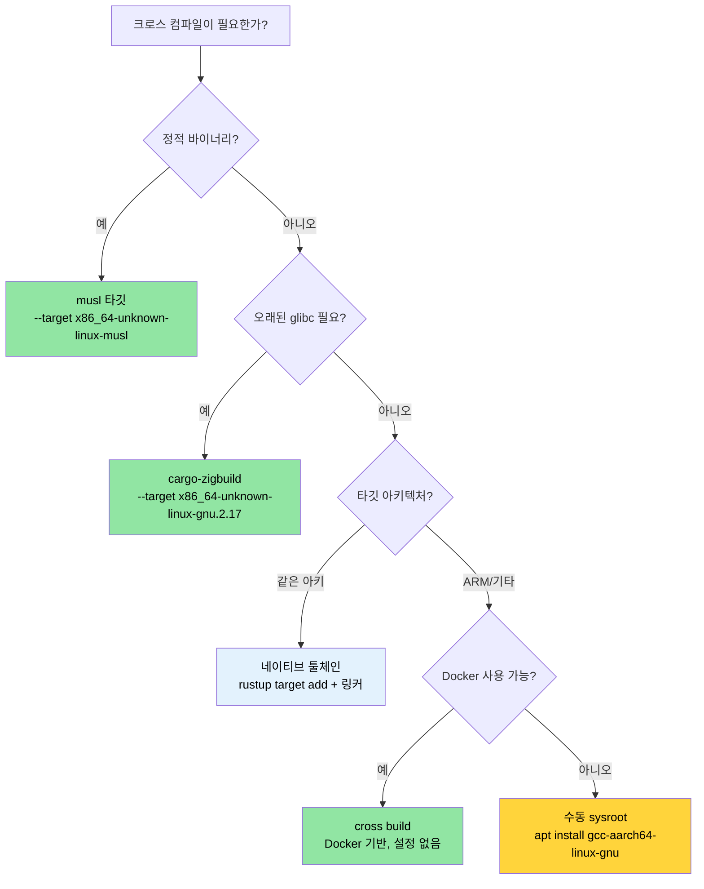

<a id="cross-compilation-one-source-many-target"></a>
# 크로스 컴파일 — 하나의 소스, 여러 타깃 🟡

> **이 장에서 배울 내용:**
> - Rust 타깃 트리플이 어떻게 동작하고 `rustup`으로 어떻게 추가하는지
> - 컨테이너·클라우드 배포를 위한 musl 정적 바이너리 빌드
> - 네이티브 툴체인, `cross`, `cargo-zigbuild`로 ARM(aarch64) 크로스 컴파일
> - 멀티 아키텍처 CI를 위한 GitHub Actions 매트릭스 빌드 설정
>
> **교차 참고:** [빌드 스크립트](ch01-build-scripts-buildrs-in-depth.md) — 크로스 컴파일 시에도 build.rs는 HOST에서 실행됩니다 · [릴리스 프로파일](ch07-release-profiles-and-binary-size.md) — 크로스 컴파일된 릴리스 바이너리의 LTO와 strip 설정 · [Windows](ch10-windows-and-conditional-compilation.md) — Windows 크로스 컴파일과 `no_std` 타깃

크로스 컴파일은 한 머신(**호스트**)에서 실행 파일을 빌드해 다른 머신(**타깃**)에서
돌리는 것을 말합니다. 호스트는 x86_64 노트북이고 타깃은 ARM 서버, musl 기반 컨테이너,
심지어 Windows 머신일 수도 있습니다. Rust는 `rustc`가 이미 크로스 컴파일러이기 때문에
이를 비교적 잘 지원합니다 — 적절한 타깃 라이브러리와 호환 링커만 있으면 됩니다.

<a id="the-target-triple-anatomy"></a>
### 타깃 트리플 구조

모든 Rust 컴파일 타깃은 **타깃 트리플**(이름과 달리 네 부분인 경우가 많음)로 식별됩니다:

```text
<arch>-<vendor>-<os>-<env>

예:
  x86_64  - unknown - linux  - gnu      ← 표준 Linux (glibc)
  x86_64  - unknown - linux  - musl     ← 정적 Linux (musl libc)
  aarch64 - unknown - linux  - gnu      ← ARM 64비트 Linux
  x86_64  - pc      - windows- msvc     ← MSVC용 Windows
  aarch64 - apple   - darwin             ← Apple Silicon macOS
  x86_64  - unknown - none              ← 베어 메탈 (OS 없음)
```

사용 가능한 타깃 전체 나열:

```bash
# rustc가 컴파일할 수 있는 모든 타깃 (~250개)
rustc --print target-list | wc -l

# 시스템에 설치된 타깃 표시
rustup target list --installed

# 현재 기본 타깃 표시
rustc -vV | grep host
```

<a id="installing-toolchains-with-rustup"></a>
### rustup으로 툴체인 설치

```bash
# 타깃 라이브러리 추가 (해당 타깃용 Rust std)
rustup target add x86_64-unknown-linux-musl
rustup target add aarch64-unknown-linux-gnu

# 이제 크로스 컴파일 가능:
cargo build --target x86_64-unknown-linux-musl
cargo build --target aarch64-unknown-linux-gnu  # 링커 필요 — 아래 참고
```

**`rustup target add`가 주는 것**: 해당 타깃용으로 미리 컴파일된 `std`, `core`, `alloc`
라이브러리입니다. C 링커나 C 라이브러리는 주지 **않습니다**. C 툴체인이 필요한
타깃(대부분의 `gnu` 타깃)은 별도로 설치해야 합니다.

```bash
# Ubuntu/Debian — aarch64용 크로스 링커
sudo apt install gcc-aarch64-linux-gnu

# Ubuntu/Debian — 정적 빌드용 musl 툴체인
sudo apt install musl-tools

# Fedora
sudo dnf install gcc-aarch64-linux-gnu
```

<a id="cargoconfigtoml-per-target-configuration"></a>
### `.cargo/config.toml` — 타깃별 설정

매번 `--target`을 넘기지 않고 프로젝트 루트 또는 홈의
`.cargo/config.toml`에 기본값을 둘 수 있습니다:

```toml
# .cargo/config.toml

# 이 프로젝트의 기본 타깃 (선택 — 생략하면 네이티브 기본 유지)
# [build]
# target = "x86_64-unknown-linux-musl"

# aarch64 크로스 컴파일용 링커
[target.aarch64-unknown-linux-gnu]
linker = "aarch64-linux-gnu-gcc"
rustflags = ["-C", "target-feature=+crc"]

# musl 정적 빌드용 링커 (보통 시스템 gcc가 맞음)
[target.x86_64-unknown-linux-musl]
linker = "musl-gcc"
rustflags = ["-C", "target-feature=+crc,+aes"]

# ARM 32비트 (Raspberry Pi, 임베디드)
[target.armv7-unknown-linux-gnueabihf]
linker = "arm-linux-gnueabihf-gcc"

# 모든 타깃에 대한 환경 변수
[env]
# 예: 커스텀 sysroot
# SYSROOT = "/opt/cross/sysroot"
```

**설정 파일 검색 순서** (먼저 매칭된 것이 우선):
1. `<project>/.cargo/config.toml`
2. `<project>/../.cargo/config.toml` (상위 디렉터리로 올라가며)
3. `$CARGO_HOME/config.toml` (보통 `~/.cargo/config.toml`)

<a id="static-binaries-with-musl"></a>
### musl로 정적 바이너리

Alpine, scratch Docker 이미지 같은 최소 컨테이너에 배포하거나 glibc 버전을
통제할 수 없을 때 musl로 빌드합니다:

```bash
# musl 타깃 설치
rustup target add x86_64-unknown-linux-musl
sudo apt install musl-tools  # musl-gcc 제공

# 완전 정적 바이너리 빌드
cargo build --release --target x86_64-unknown-linux-musl

# 정적 링크인지 확인
file target/x86_64-unknown-linux-musl/release/diag_tool
# → ELF 64-bit LSB executable, x86-64, statically linked

ldd target/x86_64-unknown-linux-musl/release/diag_tool
# → not a dynamic executable
```

**정적 vs 동적 트레이드오프:**

| 측면 | glibc (동적) | musl (정적) |
|--------|-----------------|---------------|
| 바이너리 크기 | 더 작음 (공유 lib) | 더 큼 (~5–15 MB 증가) |
| 이식성 | 맞는 glibc 버전 필요 | Linux 어디서나 실행 |
| DNS 해석 | 전체 `nsswitch` 지원 | 기본 리졸버 (mDNS 없음) |
| 배포 | sysroot 또는 컨테이너 필요 | 단일 바이너리, 의존성 없음 |
| 성능 | malloc이 약간 더 빠름 | malloc이 약간 더 느림 |
| `dlopen()` 지원 | 예 | 아니오 |

> **프로젝트 관점**: 호스트 OS 버전을 보장할 수 없는 다양한 서버 하드웨어에
> 배포할 때 정적 musl 빌드가 이상적입니다. 단일 바이너리 배포 모델이
> "내 머신에서만 된다"를 없앱니다.

<a id="cross-compiling-to-arm-aarch64"></a>
### ARM(aarch64)로 크로스 컴파일

데이터센터에서 ARM 서버(AWS Graviton, Ampere Altra, Grace)가 점점 흔해지고 있습니다.
x86_64 호스트에서 aarch64용 크로스 컴파일:

```bash
# 1단계: 타깃 + 크로스 링커 설치
rustup target add aarch64-unknown-linux-gnu
sudo apt install gcc-aarch64-linux-gnu

# 2단계: .cargo/config.toml에 링커 설정 (위 참고)

# 3단계: 빌드
cargo build --release --target aarch64-unknown-linux-gnu

# 4단계: 바이너리 확인
file target/aarch64-unknown-linux-gnu/release/diag_tool
# → ELF 64-bit LSB executable, ARM aarch64
```

**해당 아키텍처용 테스트 실행**에는 다음 중 하나가 필요합니다:
- 실제 ARM 머신
- QEMU 사용자 모드 에뮬레이션

```bash
# QEMU 사용자 모드 (x86_64에서 ARM 바이너리 실행)
sudo apt install qemu-user qemu-user-static binfmt-support

# 이제 cargo test가 크로스 컴파일된 테스트를 QEMU로 실행 가능
cargo test --target aarch64-unknown-linux-gnu
# (느림 — 테스트 바이너리마다 에뮬. 일상 개발보다 CI 검증용.)
```

`.cargo/config.toml`에서 QEMU를 테스트 러너로 설정:

```toml
[target.aarch64-unknown-linux-gnu]
linker = "aarch64-linux-gnu-gcc"
runner = "qemu-aarch64-static -L /usr/aarch64-linux-gnu"
```

<a id="the-cross-tool-docker-based-cross-compilation"></a>
### `cross` 도구 — Docker 기반 크로스 컴파일

[`cross`](https://github.com/cross-rs/cross)는 미리 구성된 Docker 이미지로
설정 없이 크로스 컴파일할 수 있게 해줍니다:

```bash
# cross 설치 (crates.io — 안정 릴리스)
cargo install cross
# 또는 최신 기능용 git (덜 안정):
# cargo install cross --git https://github.com/cross-rs/cross

# 크로스 컴파일 — 툴체인 설정 불필요!
cross build --release --target aarch64-unknown-linux-gnu
cross build --release --target x86_64-unknown-linux-musl
cross build --release --target armv7-unknown-linux-gnueabihf

# 크로스 테스트 — Docker 이미지에 QEMU 포함
cross test --target aarch64-unknown-linux-gnu
```

**동작 방식**: `cross`는 `cargo`를 대체해 빌드를 올바른 크로스 컴파일 툴체인이
미리 설치된 Docker 컨테이너 안에서 실행합니다. 소스는 컨테이너에 마운트되고
출력은 일반 `target/` 디렉터리로 갑니다.

**`Cross.toml`로 Docker 이미지 커스터마이징:**

```toml
# Cross.toml
[target.aarch64-unknown-linux-gnu]
# 추가 시스템 라이브러리가 있는 커스텀 Docker 이미지
image = "my-registry/cross-aarch64:latest"

# 시스템 패키지 사전 설치
pre-build = [
    "dpkg --add-architecture arm64",
    "apt-get update && apt-get install -y libpci-dev:arm64"
]

[target.aarch64-unknown-linux-gnu.env]
# 컨테이너로 환경 변수 전달
passthrough = ["CI", "GITHUB_TOKEN"]
```

`cross`는 Docker(또는 Podman)가 필요하지만 크로스 컴파일러, sysroot, QEMU를
수동 설치할 필요를 없앱니다. CI에는 권장 접근입니다.

<a id="using-zig-as-a-cross-compilation-linker"></a>
### 크로스 컴파일 링커로 Zig 사용

[Zig](https://ziglang.org/)는 C 컴파일러와 크로스 컴파일 sysroot를
단일 ~40 MB 다운로드에 ~40개 타깃까지 묶습니다. Rust의 크로스 링커로
매우 편리합니다:

```bash
# Zig 설치 (단일 바이너리, 패키지 매니저 불필요)
# https://ziglang.org/download/ 에서 다운로드
# 또는 패키지 매니저:
sudo snap install zig --classic --beta  # Ubuntu
brew install zig                          # macOS

# cargo-zigbuild 설치
cargo install cargo-zigbuild
```

**Zig를 쓰는 이유?** 핵심 이점은 **glibc 버전 타깃팅**입니다. Zig는 링크할
glibc 버전을 정확히 지정해 오래된 Linux 배포판에서도 바이너리가 돌아가게 합니다:

```bash
# glibc 2.17 (CentOS 7 / RHEL 7 호환)
cargo zigbuild --release --target x86_64-unknown-linux-gnu.2.17

# glibc 2.28 (Ubuntu 18.04+) aarch64
cargo zigbuild --release --target aarch64-unknown-linux-gnu.2.28

# musl (완전 정적)
cargo zigbuild --release --target x86_64-unknown-linux-musl
```

`.2.17` 접미사는 Zig 확장 — Zig 링커에 glibc 2.17 심볼 버전을 쓰라고 알려
결과 바이너리가 CentOS 7 이상에서 실행됩니다. Docker, sysroot 관리,
크로스 컴파일러 설치가 필요 없습니다.

**비교: cross vs cargo-zigbuild vs 수동:**

| 기능 | 수동 | cross | cargo-zigbuild |
|---------|--------|-------|----------------|
| 설정 노력 | 높음 (타깃마다 툴체인) | 낮음 (Docker 필요) | 낮음 (단일 바이너리) |
| Docker 필요 | 아니오 | 예 | 아니오 |
| glibc 버전 타깃팅 | 아니오 (호스트 glibc 사용) | 아니오 (컨테이너 glibc) | 예 (정확한 버전) |
| 테스트 실행 | QEMU 필요 | 포함 | QEMU 필요 |
| macOS → Linux | 어려움 | 쉬움 | 쉬움 |
| Linux → macOS | 매우 어려움 | 미지원 | 제한적 |
| 바이너리 크기 오버헤드 | 없음 | 없음 | 없음 |

<a id="ci-pipeline-github-actions-matrix"></a>
### CI 파이프라인: GitHub Actions 매트릭스

여러 타깃을 위한 프로덕션급 CI 워크플로:

```yaml
# .github/workflows/cross-build.yml
name: Cross-Platform Build

on: [push, pull_request]

env:
  CARGO_TERM_COLOR: always

jobs:
  build:
    strategy:
      matrix:
        include:
          - target: x86_64-unknown-linux-gnu
            os: ubuntu-latest
            name: linux-x86_64
          - target: x86_64-unknown-linux-musl
            os: ubuntu-latest
            name: linux-x86_64-static
          - target: aarch64-unknown-linux-gnu
            os: ubuntu-latest
            name: linux-aarch64
            use_cross: true
          - target: x86_64-pc-windows-msvc
            os: windows-latest
            name: windows-x86_64

    runs-on: ${{ matrix.os }}
    name: Build (${{ matrix.name }})

    steps:
      - uses: actions/checkout@v4

      - uses: dtolnay/rust-toolchain@stable
        with:
          targets: ${{ matrix.target }}

      - name: Install musl tools
        if: matrix.target == 'x86_64-unknown-linux-musl'
        run: sudo apt-get install -y musl-tools

      - name: Install cross
        if: matrix.use_cross
        run: cargo install cross

      - name: Build (native)
        if: "!matrix.use_cross"
        run: cargo build --release --target ${{ matrix.target }}

      - name: Build (cross)
        if: matrix.use_cross
        run: cross build --release --target ${{ matrix.target }}

      - name: Run tests
        if: "!matrix.use_cross"
        run: cargo test --target ${{ matrix.target }}

      - name: Upload artifact
        uses: actions/upload-artifact@v4
        with:
          name: diag_tool-${{ matrix.name }}
          path: target/${{ matrix.target }}/release/diag_tool*
```

<a id="application-multi-architecture-server-builds"></a>
### 적용: 멀티 아키텍처 서버 빌드

바이너리에는 현재 크로스 컴파일 설정이 없습니다. 다양한 서버 함대에 배포하는
하드웨어 진단 도구라면 권장 추가 사항:

```text
my_workspace/
├── .cargo/
│   └── config.toml          ← 타깃별 링커 설정
├── Cross.toml                ← cross 도구 설정
└── .github/workflows/
    └── cross-build.yml       ← 3개 타깃 CI 매트릭스
```

**권장 `.cargo/config.toml`:**

```toml
# 프로젝트용 .cargo/config.toml

# 릴리스 프로파일 최적화 (이미 Cargo.toml에 있음, 참고용)
# [profile.release]
# lto = true
# codegen-units = 1
# panic = "abort"
# strip = true

# ARM 서버용 aarch64 (Graviton, Ampere, Grace)
[target.aarch64-unknown-linux-gnu]
linker = "aarch64-linux-gnu-gcc"

# 이식 가능한 정적 바이너리용 musl
[target.x86_64-unknown-linux-musl]
linker = "musl-gcc"
```

**권장 빌드 타깃:**

| 타깃 | 사용 사례 | 배포 대상 |
|--------|----------|-----------|
| `x86_64-unknown-linux-gnu` | 기본 네이티브 빌드 | 표준 x86 서버 |
| `x86_64-unknown-linux-musl` | 정적 바이너리, 모든 배포판 | 컨테이너, 최소 호스트 |
| `aarch64-unknown-linux-gnu` | ARM 서버 | Graviton, Ampere, Grace |

> **핵심**: 워크스페이스 루트 `Cargo.toml`의 `[profile.release]`에 이미
> `lto = true`, `codegen-units = 1`, `panic = "abort"`, `strip = true`가
> 있어 크로스 컴파일 배포 바이너리에 이상적인 릴리스 프로파일입니다
> (전체 영향 표는 [릴리스 프로파일](ch07-release-profiles-and-binary-size.md) 참고).
> musl과 함께면 런타임 의존성 없는 ~10 MB 정적 단일 바이너리가 나옵니다.

<a id="troubleshooting-cross-compilation"></a>
### 크로스 컴파일 문제 해결

| 증상 | 원인 | 조치 |
|---------|-------|-----|
| `linker 'aarch64-linux-gnu-gcc' not found` | 크로스 링커 툴체인 없음 | `sudo apt install gcc-aarch64-linux-gnu` |
| `cannot find -lssl` (musl 타깃) | 시스템 OpenSSL이 glibc 링크 | `vendored` 피처: `openssl = { version = "0.10", features = ["vendored"] }` |
| `build.rs`가 잘못된 바이너리 실행 | build.rs는 HOST에서 실행, 타깃 아님 | build.rs에서는 `CARGO_CFG_TARGET_OS` 확인, `cfg!(target_os)` 아님 |
| 로컬에서는 테스트 통과, `cross`에서 실패 | Docker 이미지에 테스트 픽스처 없음 | `Cross.toml`로 테스트 데이터 마운트: `[build.env] volumes = ["./TestArea:/TestArea"]` |
| `undefined reference to __cxa_thread_atexit_impl` | 타깃 glibc가 오래됨 | `cargo-zigbuild`로 glibc 버전 명시: `--target x86_64-unknown-linux-gnu.2.17` |
| ARM에서 바이너리 세그폴트 | 잘못된 ARM 변형으로 컴파일 | 타깃 트리플이 하드웨어와 일치하는지 확인: 64비트 ARM은 `aarch64-unknown-linux-gnu` |
| 런타임에 `GLIBC_2.XX not found` | 빌드 머신 glibc가 더 새로움 | 정적 빌드는 musl, 또는 `cargo-zigbuild`로 glibc 버전 고정 |

<a id="cross-compilation-decision-tree"></a>
### 크로스 컴파일 의사결정 트리



<a id="exercises"></a>
### 🏋️ 연습문제

<a id="exercise-1-static-musl-binary"></a>
#### 🟢 연습문제 1: 정적 musl 바이너리

아무 Rust 바이너리나 `x86_64-unknown-linux-musl`로 빌드하세요. `file`과 `ldd`로
정적으로 링크됐는지 확인하세요.

<details>
<summary>해답</summary>

```bash
rustup target add x86_64-unknown-linux-musl
cargo new hello-static && cd hello-static
cargo build --release --target x86_64-unknown-linux-musl

# 확인
file target/x86_64-unknown-linux-musl/release/hello-static
# 출력: ... statically linked ...

ldd target/x86_64-unknown-linux-musl/release/hello-static
# 출력: not a dynamic executable
```
</details>

<a id="exercise-2-github-actions-cross-build-matrix"></a>
#### 🟡 연습문제 2: GitHub Actions 크로스 빌드 매트릭스

`x86_64-unknown-linux-gnu`, `x86_64-unknown-linux-musl`, `aarch64-unknown-linux-gnu`
세 타깃에 대해 Rust 프로젝트를 빌드하는 GitHub Actions 워크플로를 작성하세요.
매트릭스 전략을 사용하세요.

<details>
<summary>해답</summary>

```yaml
name: Cross-build
on: [push]
jobs:
  build:
    runs-on: ubuntu-latest
    strategy:
      matrix:
        target:
          - x86_64-unknown-linux-gnu
          - x86_64-unknown-linux-musl
          - aarch64-unknown-linux-gnu
    steps:
      - uses: actions/checkout@v4
      - uses: dtolnay/rust-toolchain@stable
        with:
          targets: ${{ matrix.target }}
      - name: Install cross
        run: cargo install cross --locked
      - name: Build
        run: cross build --release --target ${{ matrix.target }}
      - uses: actions/upload-artifact@v4
        with:
          name: binary-${{ matrix.target }}
          path: target/${{ matrix.target }}/release/my-binary
```
</details>

<a id="key-takeaways"></a>
### 핵심 정리

- Rust의 `rustc`는 이미 크로스 컴파일러입니다 — 올바른 타깃과 링커만 있으면 됩니다
- **musl**은 런타임 의존성 없는 완전 정적 바이너리를 만듭니다 — 컨테이너에 적합
- **`cargo-zigbuild`**는 엔터프라이즈 Linux 타깃의 "어느 glibc 버전인가" 문제를 해결합니다
- **`cross`**는 ARM 등 이색 타깃에 가장 쉬운 경로입니다 — Docker가 sysroot를 처리합니다
- 배포 타깃과 맞는지 `file`과 `ldd`로 항상 검증하세요

---

