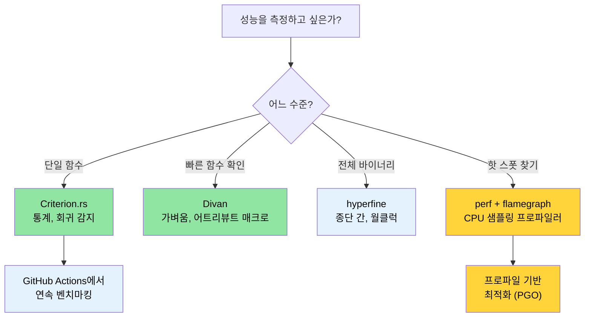

<a id="benchmarking-measuring-what-matters"></a>
# 벤치마킹 — 중요한 것을 측정하기 🟡

> **이 장에서 배울 내용:**
> - `Instant::now()`만으로 측정하면 왜 결과가 불안정한지
> - Criterion.rs와 더 가벼운 대안 Divan으로 통계적 벤치마킹
> - `perf`, flamegraph, PGO로 핫 스폿 프로파일링
> - CI에서 연속 벤치마킹으로 회귀를 자동으로 잡는 설정
>
> **교차 참고:** [릴리스 프로파일](ch07-release-profiles-and-binary-size.md) — 핫 스폿을 찾은 뒤 바이너리 최적화 · [CI/CD 파이프라인](ch11-putting-it-all-together-a-production-cic.md) — 파이프라인의 벤치마크 잡 · [코드 커버리지](ch04-code-coverage-seeing-what-tests-miss.md) — 커버리지는 무엇이 테스트됐는지, 벤치마크는 무엇이 빠른지 알려 줍니다

"작은 효율은 대부분의 경우, 97% 정도는 잊어버려야 한다: 조기 최적화는 모든 악의 근원이다.
그러나 나머지 결정적인 3%의 기회를 놓쳐서는 안 된다." — Donald Knuth

어려운 부분은 벤치마크를 *작성*하는 것이 아니라 **의미 있고, 재현 가능하며, 행동으로 이어지는**
숫자를 내는 벤치마크를 만드는 것입니다. 이 장은 "빠른 것 같다"에서
"PR #347이 파싱 처리량을 4.2% 퇴보시켰다는 통계적 근거가 있다"까지 가는 도구와 기법을 다룹니다.

<a id="why-not-stdtimeinstant"></a>
### 왜 `std::time::Instant`가 아닌가?

유혹되는 코드:

```rust
// ❌ 순진한 벤치마킹 — 신뢰할 수 없는 결과
use std::time::Instant;

fn main() {
    let start = Instant::now();
    let result = parse_device_query_output(&sample_data);
    let elapsed = start.elapsed();
    println!("Parsing took {:?}", elapsed);
    // 문제 1: 컴파일러가 result를 최적화해 없앨 수 있음 (데드 코드 제거)
    // 문제 2: 단일 샘플 — 통계적 유의성 없음
    // 문제 3: CPU 주파수 스케일링, 열 스로틀링, 다른 프로세스
    // 문제 4: 콜드 캐시 vs 웜 캐시 미통제
}
```

수동 타이밍의 문제:
1. **데드 코드 제거** — 결과를 쓰지 않으면 컴파일러가 계산 전체를 건너뛸 수 있습니다.
2. **웜업 없음** — 첫 실행은 캐시 미스, (Rust에는 해당 없지만) OS 페이지 폴트와 지연 초기화를 포함합니다.
3. **통계 분석 없음** — 한 번 측정으로 분산, 이상치, 신뢰 구간을 알 수 없습니다.
4. **회귀 감지 없음** — 이전 실행과 비교할 수 없습니다.

<a id="criterionrs-statistical-benchmarking"></a>
### Criterion.rs — 통계적 벤치마킹

[Criterion.rs](https://bheisler.github.io/criterion.rs/book/)는 Rust 마이크로 벤치마크의
사실상 표준입니다. 통계 방법으로 신뢰할 만한 측정을 내고 성능 회귀를 자동으로 감지합니다.

**설정:**

```toml
# Cargo.toml
[dev-dependencies]
criterion = { version = "0.5", features = ["html_reports", "cargo_bench_support"] }

[[bench]]
name = "parsing_bench"
harness = false  # Criterion 하네스 사용, 내장 테스트 하네스 아님
```

**완전한 벤치마크:**

```rust
// benches/parsing_bench.rs
use criterion::{black_box, criterion_group, criterion_main, Criterion, BenchmarkId};

/// 파싱된 GPU 정보용 데이터 타입
#[derive(Debug, Clone)]
struct GpuInfo {
    index: u32,
    name: String,
    temp_c: u32,
    power_w: f64,
}

/// 테스트 대상 함수 — device-query CSV 출력 파싱 시뮬레이션
fn parse_gpu_csv(input: &str) -> Vec<GpuInfo> {
    input
        .lines()
        .filter(|line| !line.starts_with('#'))
        .filter_map(|line| {
            let fields: Vec<&str> = line.split(", ").collect();
            if fields.len() >= 4 {
                Some(GpuInfo {
                    index: fields[0].parse().ok()?,
                    name: fields[1].to_string(),
                    temp_c: fields[2].parse().ok()?,
                    power_w: fields[3].parse().ok()?,
                })
            } else {
                None
            }
        })
        .collect()
}

fn bench_parse_gpu_csv(c: &mut Criterion) {
    // 대표 테스트 데이터
    let small_input = "0, Acme Accel-V1-80GB, 32, 65.5\n\
                       1, Acme Accel-V1-80GB, 34, 67.2\n";

    let large_input = (0..64)
        .map(|i| format!("{i}, Acme Accel-X1-80GB, {}, {:.1}\n", 30 + i % 20, 60.0 + i as f64))
        .collect::<String>();

    c.bench_function("parse_2_gpus", |b| {
        b.iter(|| parse_gpu_csv(black_box(small_input)))
    });

    c.bench_function("parse_64_gpus", |b| {
        b.iter(|| parse_gpu_csv(black_box(&large_input)))
    });
}

criterion_group!(benches, bench_parse_gpu_csv);
criterion_main!(benches);
```

**실행 및 결과 읽기:**

```bash
# 모든 벤치마크 실행
cargo bench

# 이름으로 특정 벤치마크만
cargo bench -- parse_64

# 출력:
# parse_2_gpus        time:   [1.2345 µs  1.2456 µs  1.2578 µs]
#                      ▲            ▲           ▲
#                      │       신뢰 구간
#                   하한 95%    중앙값    상한 95%
#
# parse_64_gpus       time:   [38.123 µs  38.456 µs  38.812 µs]
#                     change: [-1.2345% -0.5678% +0.1234%] (p = 0.12 > 0.05)
#                     No change in performance detected.
```

**`black_box()`의 역할**: 컴파일러 힌트로 데드 코드 제거와 과도한 상수 폴딩을 막습니다.
컴파일러는 `black_box` 뒤를 볼 수 없으므로 결과를 실제로 계산해야 합니다.

<a id="parameterized-benchmarks-and-benchmark-groups"></a>
### 매개변수화 벤치마크와 벤치마크 그룹

여러 구현이나 입력 크기를 비교:

```rust
// benches/comparison_bench.rs
use criterion::{criterion_group, criterion_main, Criterion, BenchmarkId, Throughput};

fn bench_parsing_strategies(c: &mut Criterion) {
    let mut group = c.benchmark_group("csv_parsing");

    // 다양한 입력 크기로 테스트
    for num_gpus in [1, 8, 32, 64, 128] {
        let input = generate_gpu_csv(num_gpus);

        // 초당 바이트 처리량 보고용
        group.throughput(Throughput::Bytes(input.len() as u64));

        group.bench_with_input(
            BenchmarkId::new("split_based", num_gpus),
            &input,
            |b, input| b.iter(|| parse_split(input)),
        );

        group.bench_with_input(
            BenchmarkId::new("regex_based", num_gpus),
            &input,
            |b, input| b.iter(|| parse_regex(input)),
        );

        group.bench_with_input(
            BenchmarkId::new("nom_based", num_gpus),
            &input,
            |b, input| b.iter(|| parse_nom(input)),
        );
    }
    group.finish();
}

criterion_group!(benches, bench_parsing_strategies);
criterion_main!(benches);
```

**출력**: Criterion이 `target/criterion/report/index.html`에 HTML 리포트를 생성합니다 —
바이올린 플롯, 비교 차트, 회귀 분석 포함 — 브라우저에서 열어보세요.

<a id="divan-a-lighter-alternative"></a>
### Divan — 더 가벼운 대안

[Divan](https://github.com/nvzqz/divan)은 Criterion의 매크로 DSL 대신
어트리뷰트 매크로를 쓰는 더 새 벤치마크 프레임워크입니다:

```toml
# Cargo.toml
[dev-dependencies]
divan = "0.1"

[[bench]]
name = "parsing_bench"
harness = false
```

```rust
// benches/parsing_bench.rs
use divan::black_box;

const SMALL_INPUT: &str = "0, Acme Accel-V1-80GB, 32, 65.5\n\
                          1, Acme Accel-V1-80GB, 34, 67.2\n";

fn generate_gpu_csv(n: usize) -> String {
    (0..n)
        .map(|i| format!("{i}, Acme Accel-X1-80GB, {}, {:.1}\n", 30 + i % 20, 60.0 + i as f64))
        .collect()
}

fn main() {
    divan::main();
}

#[divan::bench]
fn parse_2_gpus() -> Vec<GpuInfo> {
    parse_gpu_csv(black_box(SMALL_INPUT))
}

#[divan::bench(args = [1, 8, 32, 64, 128])]
fn parse_n_gpus(n: usize) -> Vec<GpuInfo> {
    let input = generate_gpu_csv(n);
    parse_gpu_csv(black_box(&input))
}

// Divan 출력은 깔끔한 표:
// ╰─ parse_2_gpus   fastest  │ slowest  │ median   │ mean     │ samples │ iters
//                   1.234 µs │ 1.567 µs │ 1.345 µs │ 1.350 µs │ 100     │ 1600
```

**Criterion 대신 Divan을 고를 때:**
- 더 단순한 API (어트리뷰트 매크로, 보일러플레이트 적음)
- 더 빠른 컴파일 (의존성 적음)
- 개발 중 빠른 성능 체크에 적합

**Criterion을 고를 때:**
- 실행 간 통계적 회귀 감지
- 차트가 있는 HTML 리포트
- 검증된 생태계, CI 연동이 더 많음

<a id="profiling-with-perf-and-flamegraphs"></a>
### `perf`와 flamegraph로 프로파일링

벤치마크는 *얼마나 빠른지* 알려 주고, 프로파일링은 *시간이 어디로 가는지* 알려 줍니다.

```bash
# 1단계: 디버그 정보로 빌드 (릴리스 속도, 디버그 심볼)
cargo build --release
# 디버그 정보 확보:
# [profile.release]
# debug = true          # 프로파일링용으로 임시로 추가

# 2단계: perf로 기록
perf record -g --call-graph=dwarf ./target/release/diag_tool --run-diagnostics

# 3단계: flamegraph 생성
# 설치: cargo install flamegraph
cargo flamegraph --root -- --run-diagnostics
# 대화형 SVG flamegraph 열림

# 대안: perf + inferno
perf script | inferno-collapse-perf | inferno-flamegraph > flamegraph.svg
```

**flamegraph 읽기:**
- **너비** = 해당 함수에 쓴 시간 (넓을수록 느림)
- **높이** = 호출 스택 깊이 (높다고 더 느린 것은 아님, 단지 더 깊음)
- **아래** = 진입점, **위** = 실제 일을 하는 리프 함수
- 위쪽에서 넓은 평지를 찾으세요 — 그게 핫 스폿입니다

**프로파일 기반 최적화(PGO):**

```bash
# 1단계: 계측으로 빌드
RUSTFLAGS="-Cprofile-generate=/tmp/pgo-data" cargo build --release

# 2단계: 대표 워크로드 실행
./target/release/diag_tool --run-full   # 프로파일 데이터 생성

# 3단계: 프로파일 데이터 병합
# rustc LLVM 버전과 맞는 llvm-profdata 사용:
# $(rustc --print sysroot)/lib/rustlib/x86_64-unknown-linux-gnu/bin/llvm-profdata
# 또는 llvm-tools 설치 시: rustup component add llvm-tools
llvm-profdata merge -o /tmp/pgo-data/merged.profdata /tmp/pgo-data/

# 4단계: 피드백으로 재빌드
RUSTFLAGS="-Cprofile-use=/tmp/pgo-data/merged.profdata" cargo build --release
# 전형적 개선: 계산 위주 코드(파싱, 암호, 코드 생성)에서 5–20%
# I/O·syscall 위주 코드(큰 프로젝트처럼)는 CPU가 대기하는 경우가 많아
# 이득이 훨씬 적습니다.
```

> **팁**: PGO에 시간 쓰기 전에 [릴리스 프로파일](ch07-release-profiles-and-binary-size.md)에
> 이미 LTO가 켜져 있는지 확인하세요 — 보통 더 적은 노력으로 더 큰 이득입니다.

<a id="hyperfine-quick-end-to-end-timing"></a>
### `hyperfine` — 빠른 종단 간 타이밍

[`hyperfine`](https://github.com/sharkdp/hyperfine)은 전체 명령을 벤치마크하며
개별 함수가 아닙니다. 전체 바이너리 성능 측정에 적합합니다:

```bash
# 설치
cargo install hyperfine
# 또는: sudo apt install hyperfine  (Ubuntu 23.04+)

# 기본 벤치마크
hyperfine './target/release/diag_tool --run-diagnostics'

# 두 구현 비교
hyperfine './target/release/diag_tool_v1 --run-diagnostics' \
          './target/release/diag_tool_v2 --run-diagnostics'

# 웜업 실행 + 최소 반복
hyperfine --warmup 3 --min-runs 10 './target/release/diag_tool --run-all'

# CI 비교용 JSON 내보내기
hyperfine --export-json bench.json './target/release/diag_tool --run-all'
```

**`hyperfine` vs Criterion:**
- `hyperfine`: 전체 바이너리 타이밍, 리팩터 전후 비교, I/O 위주 워크로드
- Criterion: 개별 함수 마이크로 벤치마크, 통계적 회귀 감지

<a id="continuous-benchmarking-in-ci"></a>
### CI에서 연속 벤치마킹

배포 전에 성능 회귀를 잡습니다:

```yaml
# .github/workflows/bench.yml
name: Benchmarks

on:
  pull_request:
    paths: ['**/*.rs', 'Cargo.toml', 'Cargo.lock']

jobs:
  benchmark:
    runs-on: ubuntu-latest
    steps:
      - uses: actions/checkout@v4

      - uses: dtolnay/rust-toolchain@stable

      - name: Run benchmarks
        # --output-format에는 criterion = { features = ["cargo_bench_support"] } 필요
        run: cargo bench -- --output-format bencher | tee bench_output.txt

      - name: Store benchmark result
        uses: benchmark-action/github-action-benchmark@v1
        with:
          tool: 'cargo'
          output-file-path: bench_output.txt
          github-token: ${{ secrets.GITHUB_TOKEN }}
          auto-push: true
          alert-threshold: '120%'    # 20% 느려지면 알림
          comment-on-alert: true
          fail-on-alert: true        # 회귀 시 PR 차단
```

**CI에서 고려할 점:**
- 일관된 결과를 위해 **전용 벤치마크 러너** 사용 (공유 CI 아님)
- 클라우드 CI면 머신 타입을 고정
- 점진적 회귀를 잡으려면 이력 저장
- 워크로드 허용치에 맞게 임계값 설정 (핫 경로 5%, 콜드 경로 20%)

<a id="application-parsing-performance"></a>
### 적용: 파싱 성능

프로젝트에는 벤치마크로 이득이 될 성능이 민감한 파싱 경로가 여럿 있습니다:

| 파싱 핫 스폿 | 크레이트 | 중요한 이유 |
|------------------|-------|----------------|
| accelerator-query CSV/XML 출력 | `device_diag` | GPU당 호출, 실행당 최대 8회 |
| 센서 이벤트 파싱 | `event_log` | 바쁜 서버에서 수천 건 |
| PCIe 토폴로지 JSON | `topology_lib` | 중첩 구조, 골든 파일 검증 |
| 보고 JSON 직렬화 | `diag_framework` | 최종 보고 출력, 크기 민감 |
| 설정 JSON 로딩 | `config_loader` | 시작 지연 |

**권장 첫 벤치마크** — 이미 골든 파일 테스트 데이터가 있는 토폴로지 파서:

```rust
// topology_lib/benches/parse_bench.rs (제안)
use criterion::{criterion_group, criterion_main, Criterion, Throughput};
use std::fs;

fn bench_topology_parse(c: &mut Criterion) {
    let mut group = c.benchmark_group("topology_parse");

    for golden_file in ["S2001", "S1015", "S1035", "S1080"] {
        let path = format!("tests/test_data/{golden_file}.json");
        let data = fs::read_to_string(&path).expect("golden file not found");
        group.throughput(Throughput::Bytes(data.len() as u64));

        group.bench_function(golden_file, |b| {
            b.iter(|| {
                topology_lib::TopologyProfile::from_json_str(
                    criterion::black_box(&data)
                )
            });
        });
    }
    group.finish();
}

criterion_group!(benches, bench_topology_parse);
criterion_main!(benches);
```

<a id="try-it-yourself"></a>
### 직접 해 보기

1. **Criterion 벤치마크 작성**: 코드베이스의 아무 파싱 함수나 고르세요.
   `benches/` 디렉터리를 만들고 초당 바이트 처리량을 측정하는 Criterion 벤치마크를
   설정하세요. `cargo bench`를 실행하고 HTML 리포트를 살펴보세요.

2. **flamegraph 생성**: `[profile.release]`에 `debug = true`로 프로젝트를 빌드한 뒤
   `cargo flamegraph -- <인자>`를 실행하세요. flamegraph 위쪽에서 가장 넓은
   스택 세 개를 찾으세요 — 그게 핫 스폿입니다.

3. **`hyperfine`으로 비교**: `hyperfine`을 설치하고 플래그가 다른 바이너리 전체
   실행 시간을 측정하세요. Criterion의 함수별 시간과 비교하세요. Criterion이
   못 보는 시간은 어디로 갔나요? (답: I/O, syscall, 프로세스 기동.)

<a id="benchmark-tool-selection"></a>
### 벤치마크 도구 선택



<a id="exercises"></a>
### 🏋️ 연습문제

<a id="exercise-1-first-criterion-benchmark"></a>
#### 🟢 연습문제 1: 첫 Criterion 벤치마크

10,000개 난수 `Vec<u64>`를 정렬하는 함수가 있는 크레이트를 만드세요.
Criterion 벤치마크를 작성한 뒤 `.sort_unstable()`로 바꾸고 HTML 리포트에서
성능 차이를 확인하세요.

<details>
<summary>해답</summary>

```toml
# Cargo.toml
[[bench]]
name = "sort_bench"
harness = false

[dev-dependencies]
criterion = { version = "0.5", features = ["html_reports"] }
rand = "0.8"
```

```rust
// benches/sort_bench.rs
use criterion::{black_box, criterion_group, criterion_main, Criterion};
use rand::Rng;

fn generate_data(n: usize) -> Vec<u64> {
    let mut rng = rand::thread_rng();
    (0..n).map(|_| rng.gen()).collect()
}

fn bench_sort(c: &mut Criterion) {
    let mut group = c.benchmark_group("sort-10k");
    
    group.bench_function("stable", |b| {
        b.iter_batched(
            || generate_data(10_000),
            |mut data| { data.sort(); black_box(&data); },
            criterion::BatchSize::SmallInput,
        )
    });
    
    group.bench_function("unstable", |b| {
        b.iter_batched(
            || generate_data(10_000),
            |mut data| { data.sort_unstable(); black_box(&data); },
            criterion::BatchSize::SmallInput,
        )
    });
    
    group.finish();
}

criterion_group!(benches, bench_sort);
criterion_main!(benches);
```

```bash
cargo bench
open target/criterion/sort-10k/report/index.html
```
</details>

<a id="exercise-2-flamegraph-hot-spot"></a>
#### 🟡 연습문제 2: flamegraph 핫 스폿

`[profile.release]`에 `debug = true`로 프로젝트를 빌드한 뒤 flamegraph를
생성하세요. 가장 넓은 스택 상위 3개를 찾으세요.

<details>
<summary>해답</summary>

```toml
# Cargo.toml
[profile.release]
debug = true  # flamegraph용 심볼 유지
```

```bash
cargo install flamegraph
cargo flamegraph --release -- <your-args>
# 브라우저에서 flamegraph.svg 열림
# 위쪽에서 가장 넓은 스택이 핫 스폿
```
</details>

<a id="key-takeaways"></a>
### 핵심 정리

- `Instant::now()`로 벤치마크하지 마세요 — 통계적 엄밀함과 회귀 감지에는 Criterion.rs를 쓰세요
- `black_box()`는 컴파일러가 벤치마크 대상을 최적화해 없애지 못하게 합니다
- `hyperfine`은 전체 바이너리의 월클럭 시간을 측정하고, Criterion은 개별 함수를 측정합니다 — 둘 다 쓰세요
- flamegraph는 시간이 *어디에* 쓰이는지 보여 주고, 벤치마크는 *얼마나* 쓰이는지 보여 줍니다
- CI에서 연속 벤치마킹으로 성능 회귀를 배포 전에 잡습니다

---

