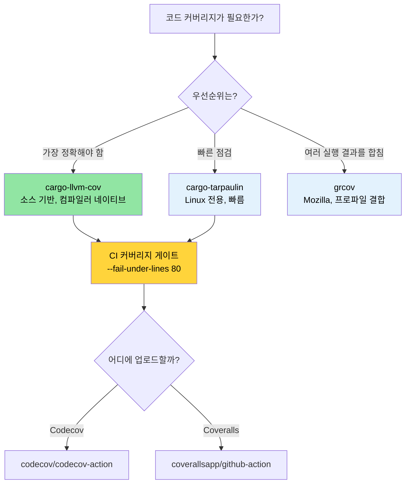

<a id="code-coverage-seeing-what-tests-miss"></a>
# 코드 커버리지 — 테스트가 놓친 것을 보기 🟢

> **이 장에서 배우는 것:**
> - `cargo-llvm-cov`를 이용한 소스 기반 커버리지(Rust에서 가장 정확한 커버리지 도구)
> - `cargo-tarpaulin`과 Mozilla의 `grcov`로 빠르게 커버리지를 점검하는 방법
> - Codecov와 Coveralls를 사용해 CI에 커버리지 게이트를 설정하는 방법
> - 위험도가 높은 사각지대를 우선하는 커버리지 기반 테스트 전략
>
> **교차 참고:** [Miri와 Sanitizer](ch05-miri-valgrind-and-sanitizers-verifying-u.md) — 커버리지는 테스트되지 않은 코드를 찾고, Miri는 테스트된 코드 안의 UB를 찾습니다 · [벤치마킹](ch03-benchmarking-measuring-what-matters.md) — 커버리지는 *무엇이 테스트됐는지* 보여 주고, 벤치마크는 *무엇이 빠른지* 보여 줍니다 · [CI/CD 파이프라인](ch11-putting-it-all-together-a-production-cic.md) — 파이프라인에서 커버리지 게이트를 적용합니다

코드 커버리지는 테스트가 실제로 어떤 줄, 분기, 함수를 실행하는지 측정합니다. 커버리지가 정확성을 증명해 주지는 않습니다(커버된 줄에도 여전히 버그가 있을 수 있습니다). 하지만 **사각지대** — 어떤 테스트도 전혀 지나가지 않는 코드 경로 — 는 매우 안정적으로 드러내 줍니다.

이 프로젝트는 여러 크레이트에 걸쳐 1,006개의 테스트를 가지고 있으므로, 테스트 투자 규모가 상당합니다. 커버리지 분석이 답해 주는 질문은 이것입니다. "그 투자가 정말 중요한 코드까지 도달하고 있는가?"

<a id="source-based-coverage-with-llvm-cov"></a>
### `llvm-cov`를 이용한 소스 기반 커버리지

Rust는 LLVM을 사용하며, LLVM은 현재 사용할 수 있는 가장 정확한 방식인 소스 기반 커버리지 계측을 제공합니다. 권장 도구는 [`cargo-llvm-cov`](https://github.com/taiki-e/cargo-llvm-cov)입니다.

```bash
# 설치
cargo install cargo-llvm-cov

# 또는 rustup 컴포넌트로 원시 llvm 도구 설치
rustup component add llvm-tools-preview
```

**기본 사용법:**

```bash
# 테스트를 실행하고 파일별 커버리지 요약 표시
cargo llvm-cov

# HTML 리포트 생성(브라우저에서 줄 단위 강조 표시 가능)
cargo llvm-cov --html
# 출력: target/llvm-cov/html/index.html

# LCOV 형식 생성(CI 연동용)
cargo llvm-cov --lcov --output-path lcov.info

# 워크스페이스 전체 커버리지(모든 크레이트)
cargo llvm-cov --workspace

# 특정 패키지만 포함
cargo llvm-cov --package accel_diag --package topology_lib

# 문서 테스트까지 포함한 커버리지
cargo llvm-cov --doctests
```

**HTML 리포트 읽는 법:**

```text
target/llvm-cov/html/index.html
├── Filename          │ Function │ Line   │ Branch │ Region
├─ accel_diag/src/lib.rs │  78.5%  │ 82.3% │ 61.2% │  74.1%
├─ sel_mgr/src/parse.rs│  95.2%  │ 96.8% │ 88.0% │  93.5%
├─ topology_lib/src/.. │  91.0%  │ 93.4% │ 79.5% │  89.2%
└─ ...

초록 = 커버됨    빨강 = 커버되지 않음    노랑 = 부분 커버됨(분기)
```

**커버리지 종류 설명:**

| 종류 | 무엇을 측정하나 | 의미 |
|------|-----------------|------|
| **라인 커버리지** | 어떤 소스 줄이 실행됐는가 | 가장 기본적인 "이 코드에 도달했는가?" |
| **분기 커버리지** | 어떤 `if`/`match` 팔이 선택됐는가 | 테스트되지 않은 조건을 잡아냄 |
| **함수 커버리지** | 어떤 함수가 호출됐는가 | 죽은 코드를 찾는 데 유용함 |
| **리전 커버리지** | 어떤 코드 리전(부분 식)이 실행됐는가 | 가장 세밀한 수준 |

<a id="cargo-tarpaulin-the-quick-path"></a>
### `cargo-tarpaulin` — 빠르게 확인하는 경로

[`cargo-tarpaulin`](https://github.com/xd009642/tarpaulin)은 Linux 전용 커버리지 도구로, 설정이 더 간단합니다(LLVM 컴포넌트가 필요 없음).

```bash
# 설치
cargo install cargo-tarpaulin

# 기본 커버리지 리포트
cargo tarpaulin

# HTML 출력
cargo tarpaulin --out Html

# 세부 옵션과 함께 실행
cargo tarpaulin \
    --workspace \
    --timeout 120 \
    --out Xml Html \
    --output-dir coverage/ \
    --exclude-files "*/tests/*" "*/benches/*" \
    --ignore-panics

# 특정 크레이트 건너뛰기
cargo tarpaulin --workspace --exclude diag_tool  # 바이너리 크레이트 제외
```

**`tarpaulin`과 `llvm-cov` 비교:**

| 항목 | `cargo-llvm-cov` | `cargo-tarpaulin` |
|------|------------------|-------------------|
| 정확도 | 소스 기반(가장 정확함) | `ptrace` 기반(가끔 과대 집계) |
| 플랫폼 | 어디서나 가능(LLVM 기반) | Linux 전용 |
| 분기 커버리지 | 지원 | 제한적 |
| 문서 테스트 | 지원 | 미지원 |
| 설정 | `llvm-tools-preview` 필요 | 자체 포함형 |
| 속도 | 더 빠름(컴파일 시 계측) | 더 느림(`ptrace` 오버헤드) |
| 안정성 | 매우 안정적 | 가끔 거짓 양성 발생 |

**권장 사항**: 정확성이 중요하면 `cargo-llvm-cov`를 사용하세요. LLVM 도구를 설치하지 않고 빠르게 한 번 점검해야 한다면 `cargo-tarpaulin`이 적합합니다.

<a id="grcov-mozillas-coverage-tool"></a>
### `grcov` — Mozilla의 커버리지 도구

[`grcov`](https://github.com/mozilla/grcov)은 Mozilla의 커버리지 집계 도구입니다. 원시 LLVM 프로파일링 데이터를 입력으로 받아 여러 형식의 리포트를 생성합니다.

```bash
# 설치
cargo install grcov

# 1단계: 커버리지 계측을 켜고 빌드
export RUSTFLAGS="-Cinstrument-coverage"
export LLVM_PROFILE_FILE="target/coverage/%p-%m.profraw"
cargo build --tests

# 2단계: 테스트 실행(.profraw 파일 생성)
cargo test

# 3단계: grcov로 집계
grcov target/coverage/ \
    --binary-path target/debug/ \
    --source-dir . \
    --output-types html,lcov \
    --output-path target/coverage/report \
    --branch \
    --ignore-not-existing \
    --ignore "*/tests/*" \
    --ignore "*/.cargo/*"

# 4단계: 리포트 열기
open target/coverage/report/html/index.html
```

**언제 `grcov`를 쓸까?** **여러 번의 테스트 실행 결과를 하나의 리포트로 합쳐야 할 때** 가장 유용합니다. 예를 들어 단위 테스트 + 통합 테스트 + 퍼즈 테스트를 하나의 커버리지 결과로 묶고 싶을 때 적합합니다.

<a id="coverage-in-ci-codecov-and-coveralls"></a>
### CI에서의 커버리지: Codecov와 Coveralls

커버리지 데이터를 추적 서비스에 업로드하면 과거 추세를 볼 수 있고, PR 주석도 자동으로 달 수 있습니다.

```yaml
# .github/workflows/coverage.yml
name: Code Coverage

on: [push, pull_request]

jobs:
  coverage:
    runs-on: ubuntu-latest
    steps:
      - uses: actions/checkout@v4
      - uses: dtolnay/rust-toolchain@stable
        with:
          components: llvm-tools-preview

      - name: Install cargo-llvm-cov
        uses: taiki-e/install-action@cargo-llvm-cov

      - name: Generate coverage
        run: cargo llvm-cov --workspace --lcov --output-path lcov.info

      - name: Upload to Codecov
        uses: codecov/codecov-action@v4
        with:
          files: lcov.info
          token: ${{ secrets.CODECOV_TOKEN }}
          fail_ci_if_error: true

      # 선택 사항: 최소 커버리지 강제
      - name: Check coverage threshold
        run: |
          cargo llvm-cov --workspace --fail-under-lines 80
          # 라인 커버리지가 80% 아래로 떨어지면 빌드 실패
```

**커버리지 게이트** — JSON 출력을 읽어 크레이트별 최소 기준을 강제할 수도 있습니다.

```bash
# 크레이트별 커버리지를 JSON으로 가져오기
cargo llvm-cov --workspace --json | jq '.data[0].totals.lines.percent'

# 기준 미달이면 실패
cargo llvm-cov --workspace --fail-under-lines 80
cargo llvm-cov --workspace --fail-under-functions 70
cargo llvm-cov --workspace --fail-under-regions 60
```

<a id="coverage-guided-testing-strategy"></a>
### 커버리지 기반 테스트 전략

전략 없이 숫자만 보는 커버리지는 큰 의미가 없습니다. 커버리지 데이터를 실제로 유용하게 쓰는 방법은 다음과 같습니다.

**1단계: 위험도 기준으로 분류하기**

```text
높은 커버리지, 높은 위험도     → ✅ 좋음 — 계속 유지
높은 커버리지, 낮은 위험도     → 🔄 과도하게 테스트됐을 수 있음 — 느리면 생략 검토
낮은 커버리지, 높은 위험도     → 🔴 지금 바로 테스트 작성 — 버그가 숨어 있는 곳
낮은 커버리지, 낮은 위험도     → 🟡 추적은 하되 과민 반응은 금물
```

**2단계: 라인 커버리지보다 분기 커버리지에 집중하기**

```rust
// 라인 커버리지는 100%, 분기 커버리지는 50% — 여전히 위험할 수 있다!
pub fn classify_temperature(temp_c: i32) -> ThermalState {
    if temp_c > 105 {         // ← temp=110 테스트됨 → Critical
        ThermalState::Critical
    } else if temp_c > 85 {   // ← temp=90 테스트됨 → Warning
        ThermalState::Warning
    } else if temp_c < -10 {  // ← 전혀 테스트되지 않음 → 센서 오류 케이스 누락
        ThermalState::SensorError
    } else {
        ThermalState::Normal  // ← temp=25 테스트됨 → Normal
    }
}
```

**3단계: 잡음을 제외하기**

```bash
# 테스트 코드는 커버리지에서 제외(항상 "커버됨"으로 나오기 때문)
cargo llvm-cov --workspace --ignore-filename-regex 'tests?\.rs$|benches/'

# 생성된 코드 제외
cargo llvm-cov --workspace --ignore-filename-regex 'target/'
```

코드 안에서는 테스트할 수 없는 구간을 표시할 수 있습니다.

```rust
// 커버리지 도구가 인식하는 패턴
#[cfg(not(tarpaulin_include))]  // tarpaulin
fn unreachable_hardware_path() {
    // 이 경로는 실제 GPU 하드웨어가 있어야만 트리거된다
}

// llvm-cov에서는 더 표적화된 접근을 쓰는 편이 좋다:
// 일부 경로는 단위 테스트가 아니라 통합/하드웨어 테스트가 필요하다는 점을 받아들이고,
// 커버리지 예외 목록으로 추적하라.
```

<a id="complementary-testing-tools"></a>
### 함께 쓰면 좋은 테스트 도구

**`proptest` — 속성 기반 테스트**는 손으로 작성한 테스트가 놓치는 경계 조건을 찾아냅니다.

```toml
[dev-dependencies]
proptest = "1"
```

```rust
use proptest::prelude::*;

proptest! {
    #[test]
    fn parse_never_panics(input in "\\PC*") {
        // proptest는 수천 개의 랜덤 문자열을 생성한다
        // 어떤 입력에서든 parse_gpu_csv가 panic하면 테스트가 실패하고,
        // 실패 케이스를 최소화해서 재현하기 쉬운 입력으로 줄여 준다.
        let _ = parse_gpu_csv(&input);
    }

    #[test]
    fn temperature_roundtrip(raw in 0u16..4096) {
        let temp = Temperature::from_raw(raw);
        let md = temp.millidegrees_c();
        // 속성: millidegrees 값은 항상 raw로부터 계산 가능해야 한다
        assert_eq!(md, (raw as i32) * 625 / 10);
    }
}
```

**`insta` — 스냅샷 테스트**는 큰 구조화 출력(JSON, 텍스트 리포트)에 적합합니다.

```toml
[dev-dependencies]
insta = { version = "1", features = ["json"] }
```

```rust
#[test]
fn test_der_report_format() {
    let report = generate_der_report(&test_results);
    // 첫 실행에서는 스냅샷 파일을 만들고, 이후 실행에서는 그 파일과 비교한다.
    // 변경을 반영하려면 `cargo insta review`를 실행해 대화형으로 승인한다.
    insta::assert_json_snapshot!(report);
}
```

> **언제 `proptest`/`insta`를 추가할까?** 단위 테스트가 모두 "행복 경로" 예제뿐이라면, `proptest`가 놓친 경계 조건을 찾아줍니다. 큰 출력 형식(JSON 리포트, DER 레코드)을 검증하는 경우에는 손으로 일일이 assertion을 쓰는 것보다 `insta` 스냅샷이 더 빠르게 작성되고 유지보수도 쉽습니다.

<a id="application-1000-tests-coverage-map"></a>
### 적용 예시: 1,000개 이상 테스트의 커버리지 지도

이 프로젝트에는 테스트가 1,000개 넘게 있지만, 아직 커버리지를 추적하고 있지 않습니다. 커버리지를 도입하면 테스트 투자가 어디에 분포되어 있는지 보이게 됩니다. 커버되지 않은 경로는 [Miri와 Sanitizer](ch05-miri-valgrind-and-sanitizers-verifying-u.md) 검증을 추가하기에 가장 좋은 후보입니다.

**권장 커버리지 설정:**

```bash
# 빠른 워크스페이스 커버리지(제안하는 CI 명령)
cargo llvm-cov --workspace \
    --ignore-filename-regex 'tests?\.rs$' \
    --fail-under-lines 75 \
    --html

# 크레이트별 커버리지 측정(집중 개선용)
for crate in accel_diag event_log topology_lib network_diag compute_diag fan_diag; do
    echo "=== $crate ==="
    cargo llvm-cov --package "$crate" --json 2>/dev/null | \
        jq -r '.data[0].totals | "Lines: \(.lines.percent | round)%  Branches: \(.branches.percent | round)%"'
done
```

**높은 커버리지가 기대되는 크레이트**(테스트 밀도 기준):
- `topology_lib` — 922줄 규모의 골든 파일 테스트 스위트
- `event_log` — `create_test_record()` 헬퍼가 있는 레지스트리
- `cable_diag` — `make_test_event()` / `make_test_context()` 패턴

**커버리지 공백이 예상되는 부분**(코드 점검 기준):
- IPMI 통신 경로의 에러 처리 분기
- GPU 하드웨어 전용 분기(실제 GPU 필요)
- `dmesg` 파싱의 경계 조건(플랫폼 의존 출력)

> **커버리지의 80/20 법칙**: 0%에서 80%까지 올리는 것은 비교적 쉽습니다. 80%에서 95%로 가려면 점점 더 인위적인 테스트 시나리오가 필요합니다. 95%에서 100%로 가려면 `#[cfg(not(...))]` 같은 예외 처리가 필요해지는 경우가 많고, 그만한 가치가 없는 경우가 대부분입니다. 실용적인 하한선으로는 **라인 커버리지 80%, 분기 커버리지 70%**를 목표로 하세요.

<a id="troubleshooting-coverage"></a>
### 커버리지 문제 해결

| 증상 | 원인 | 해결 방법 |
|------|------|-----------|
| `llvm-cov`가 모든 파일에 대해 0%를 표시함 | 계측이 적용되지 않음 | `cargo test`와 `llvm-cov`를 따로 돌리지 말고 반드시 `cargo llvm-cov`를 실행하세요 |
| 커버리지가 `unreachable!()`를 미커버 상태로 계산함 | 해당 분기가 컴파일된 코드에는 존재함 | `#[cfg(not(tarpaulin_include))]`를 사용하거나 제외 정규식을 추가하세요 |
| 커버리지 실행 중 테스트 바이너리가 크래시함 | 계측과 sanitizer가 충돌함 | `cargo llvm-cov`와 `-Zsanitizer=address`를 함께 쓰지 말고 별도로 실행하세요 |
| `llvm-cov`와 `tarpaulin`의 결과가 다름 | 계측 방식이 다름 | 컴파일러 네이티브인 `llvm-cov`를 기준값으로 삼고, 큰 차이가 나면 이슈를 제기하세요 |
| `error: profraw file is malformed` | 테스트 바이너리가 실행 도중 크래시함 | 먼저 테스트 실패를 고치세요. 프로세스가 비정상 종료되면 profraw 파일이 손상됩니다 |
| 분기 커버리지가 말도 안 되게 낮아 보임 | 최적화기가 `match` 팔, `unwrap` 등에도 분기를 만듦 | 실용적 임계값은 *라인* 커버리지 위주로 잡으세요. 분기 커버리지는 본질적으로 더 낮게 나옵니다 |

<a id="try-it-yourself"></a>
### 직접 해보기

1. **프로젝트에서 커버리지를 측정해 보세요**: `cargo llvm-cov --workspace --html`를 실행하고 리포트를 열어 보세요. 가장 커버리지가 낮은 파일 3개를 찾아보세요. 정말 테스트가 없는 것인가요, 아니면 하드웨어 의존 코드처럼 원래 테스트하기 어려운 것인가요?

2. **커버리지 게이트를 설정해 보세요**: CI에 `cargo llvm-cov --workspace --fail-under-lines 60`을 추가하세요. 일부러 테스트 하나를 주석 처리해 CI가 실패하는지 확인해 보세요. 그다음 임계값을 현재 프로젝트의 실제 커버리지보다 2% 낮은 값까지 올려 보세요.

3. **분기 커버리지와 라인 커버리지를 비교해 보세요**: 3개 팔을 가진 `match` 함수를 만들고, 그중 2개 팔만 테스트해 보세요. 라인 커버리지(예: 66%)와 분기 커버리지(예: 50%)를 비교해 보세요. 여러분의 프로젝트에는 어느 지표가 더 유용한가요?

<a id="coverage-tool-selection"></a>
### 커버리지 도구 선택



<a id="exercises"></a>
### 🏋️ 연습문제

<a id="exercise-1-first-coverage-report"></a>
#### 🟢 연습문제 1: 첫 커버리지 리포트

`cargo-llvm-cov`를 설치하고, 아무 Rust 프로젝트에 실행한 뒤 HTML 리포트를 열어 보세요. 라인 커버리지가 가장 낮은 파일 3개를 찾아보세요.

<details>
<summary>해답</summary>

```bash
cargo install cargo-llvm-cov
cargo llvm-cov --workspace --html --open
# 리포트는 커버리지 순으로 파일을 정렬한다. 가장 낮은 항목은 아래쪽에 있다
# 50% 아래 파일을 찾아보라. 그런 파일이 바로 사각지대다
```
</details>

<a id="exercise-2-ci-coverage-gate"></a>
#### 🟡 연습문제 2: CI 커버리지 게이트

라인 커버리지가 60% 아래로 떨어지면 실패하는 커버리지 게이트를 GitHub Actions 워크플로에 추가해 보세요. 테스트 하나를 주석 처리해 실제로 동작하는지 확인해 보세요.

<details>
<summary>해답</summary>

```yaml
# .github/workflows/coverage.yml
name: Coverage
on: [push, pull_request]
jobs:
  coverage:
    runs-on: ubuntu-latest
    steps:
      - uses: actions/checkout@v4
      - uses: dtolnay/rust-toolchain@stable
        with:
          components: llvm-tools-preview
      - run: cargo install cargo-llvm-cov
      - run: cargo llvm-cov --workspace --fail-under-lines 60
```

테스트 하나를 주석 처리하고 push한 뒤, 워크플로가 실패하는지 확인해 보세요.
</details>

<a id="key-takeaways"></a>
### 핵심 정리

- `cargo-llvm-cov`는 Rust에서 가장 정확한 커버리지 도구이며, 컴파일러 자체 계측을 사용합니다
- 커버리지는 정확성을 증명하지 않지만, **커버리지가 0%라는 사실은 테스트도 0%라는 뜻**입니다. 사각지대를 찾는 데 활용하세요
- 회귀를 막으려면 CI에 커버리지 게이트(예: `--fail-under-lines 80`)를 설정하세요
- 100% 커버리지를 맹목적으로 좇지 말고, 위험도가 높은 경로(에러 처리, unsafe, 파싱)에 집중하세요
- 커버리지 계측과 sanitizer는 절대 같은 실행에서 함께 쓰지 마세요

---

