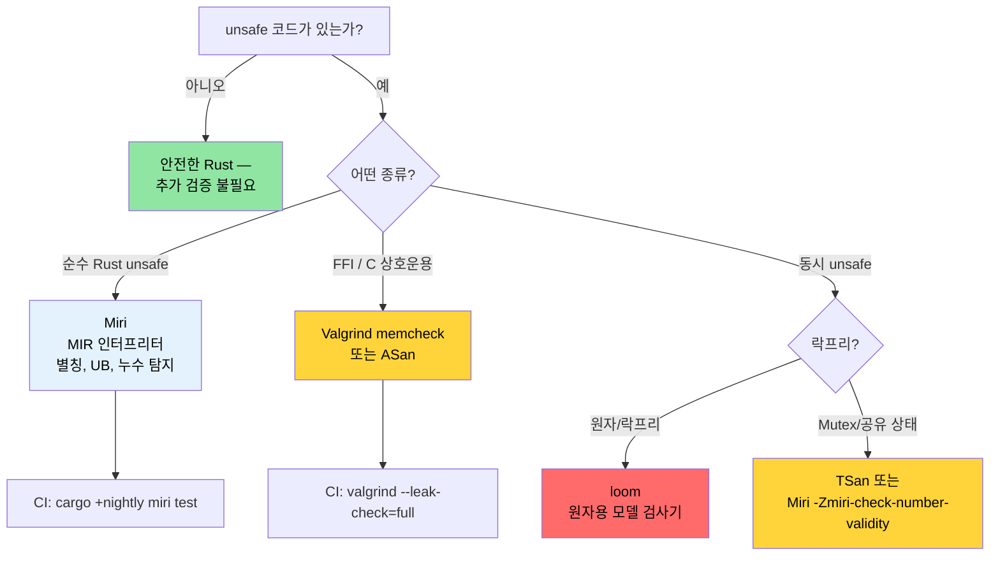

<a id="miri-valgrind-and-sanitizers-verifying-unsafe-code"></a>
# Miri, Valgrind, Sanitizer — unsafe 코드 검증하기 🔴

> **이 장에서 배우는 것:**
> - MIR 인터프리터로서의 Miri — 무엇을 잡는지(별칭, UB, 누수)와 무엇을 못 하는지(FFI, 시스템 콜)
> - Valgrind memcheck, Helgrind(데이터 레이스), Callgrind(프로파일링), Massif(힙)
> - nightly `-Zbuild-std`와 함께 쓰는 LLVM sanitizer: ASan, MSan, TSan, LSan
> - 충돌 탐색용 `cargo-fuzz`와 동시성 모델 검사용 `loom`
> - 적절한 검증 도구를 고르기 위한 의사결정 트리
>
> **교차 참고:** [코드 커버리지](ch04-code-coverage-seeing-what-tests-miss.md) — 커버리지는 테스트되지 않은 경로를 찾고, Miri는 테스트된 경로를 검증합니다 · [`no_std`와 Features](ch09-no-std-and-feature-verification.md) — `no_std` 코드는 종종 Miri로 검증할 수 있는 `unsafe`가 필요합니다 · [CI/CD 파이프라인](ch11-putting-it-all-together-a-production-cic.md) — 파이프라인의 Miri 잡

안전한 Rust는 컴파일 타임에 메모리 안전과 데이터 레이스 없음을 보장합니다. 하지만 FFI, 손으로 짠 자료구조, 성능 트릭을 위해 `unsafe`를 쓰는 순간 그 보장은 *여러분*의 책임이 됩니다. 이 장에서는 `unsafe` 코드가 주장하는 안전 계약을 실제로 지키는지 검증하는 도구를 다룹니다.

<a id="miri-an-interpreter-for-unsafe-rust"></a>
### Miri — unsafe Rust를 위한 인터프리터

[Miri](https://github.com/rust-lang/miri)는 Rust의 Mid-level Intermediate Representation(MIR)을 위한 **인터프리터**입니다. 기계어로 컴파일하는 대신, Miri는 프로그램을 MIR 단계에서 한 단계씩 실행하며 모든 연산에서 정의되지 않은 동작을 철저히 검사합니다.

```bash
# Miri 설치(nightly 전용 컴포넌트)
rustup +nightly component add miri

# 테스트 스위트를 Miri 아래에서 실행
cargo +nightly miri test

# 특정 바이너리를 Miri 아래에서 실행
cargo +nightly miri run

# 특정 테스트만 실행
cargo +nightly miri test -- test_name
```

**Miri 동작 방식:**

```text
소스 → rustc → MIR → Miri가 MIR을 해석
                        │
                        ├─ 모든 포인터의 출처(provenance) 추적
                        ├─ 모든 메모리 접근 검증
                        ├─ 모든 역참조에서 정렬 검사
                        ├─ 해제 후 사용(use-after-free) 탐지
                        ├─ 데이터 레이스 탐지(스레드가 있을 때)
                        └─ Stacked Borrows / Tree Borrows 규칙 강제
```

<a id="what-miri-catches-and-what-it-cannot"></a>
### Miri가 잡는 것(그리고 못 잡는 것)

**Miri가 탐지하는 것:**

| 범주 | 예 | 런타임에서 크래시할까? |
|------|-----|------------------------|
| 범위 밖 접근 | 할당 지나 `ptr.add(100).read()` | 경우에 따라(페이지 배치에 의존) |
| 해제 후 사용 | raw 포인터로 드롭된 `Box` 읽기 | 경우에 따라(할당기에 의존) |
| 이중 해제 | `drop_in_place` 두 번 호출 | 보통 |
| 정렬되지 않은 접근 | 홀수 주소에서 `(ptr as *const u32).read()` | 아키텍처에 따라 |
| 잘못된 값 | `transmute::<u8, bool>(2)` | 조용히 틀림 |
| 댕글링 참조 | ptr이 해제된 뒤 `&*ptr` | 아니오(조용한 손상) |
| 데이터 레이스 | 두 스레드, 한쪽은 쓰기, 동기화 없음 | 간헐적, 재현 어려움 |
| Stacked Borrows 위반 | `&mut` 별칭 | 아니오(조용한 손상) |

**Miri가 탐지하지 않는 것:**

| 한계 | 이유 |
|------|------|
| 논리 버그 | Miri는 메모리 안전만 검사하고, 정확성은 아님 |
| 동시성 데드락 | Miri는 데이터 레이스는 검사하지만 라이브락은 아님 |
| 성능 문제 | 해석 실행은 네이티브보다 10~100배 느림 |
| OS/하드웨어 상호작용 | Miri는 시스템 콜, 장치 I/O를 에뮬레이션할 수 없음 |
| 모든 FFI 호출 | C 코드를 해석할 수 없음(Rust MIR만) |
| 모든 경로 커버리지 | 테스트 스위트가 도달하는 경로만 검사 |

**구체적 예 — 실제로는 “동작하는”데 부정확한 코드 잡기:**

```rust
#[cfg(test)]
mod tests {
    #[test]
    fn test_miri_catches_ub() {
        // 릴리스 빌드에서는 "동작"하지만 정의되지 않은 동작
        let mut v = vec![1, 2, 3];
        let ptr = v.as_ptr();

        // push가 재할당해 ptr을 무효화할 수 있음
        v.push(4);

        // ❌ UB: 재할당 뒤 ptr은 댕글링일 수 있음
        // Miri는 할당기가 버퍼를 옮기지 않았더라도 이를 잡아냄
        // let _val = unsafe { *ptr };
        // 오류: Miri는 다음과 비슷하게 보고함:
        //   "pointer to alloc1234 was dereferenced after this
        //    allocation got freed"
        
        // ✅ 올바름: 변경 후 새 포인터 얻기
        let ptr = v.as_ptr();
        let val = unsafe { *ptr };
        assert_eq!(val, 1);
    }
}
```

<a id="running-miri-on-a-real-crate"></a>
### 실제 크레이트에서 Miri 실행하기

**`unsafe`가 있는 크레이트를 위한 실무 Miri 워크플로:**

```bash
# 1단계: 모든 테스트를 Miri 아래에서 실행
cargo +nightly miri test 2>&1 | tee miri_output.txt

# 2단계: Miri가 오류를 내면 분리해서 재현
cargo +nightly miri test -- failing_test_name

# 3단계: 진단을 위해 Miri 백트레이스 사용
MIRIFLAGS="-Zmiri-backtrace=full" cargo +nightly miri test

# 4단계: borrow 모델 선택
# Stacked Borrows(기본, 더 엄격):
cargo +nightly miri test

# Tree Borrows(실험적, 더 관대):
MIRIFLAGS="-Zmiri-tree-borrows" cargo +nightly miri test
```

**자주 쓰는 시나리오용 Miri 플래그:**

```bash
# 격리 해제(파일 시스템, 환경 변수 접근 허용)
MIRIFLAGS="-Zmiri-disable-isolation" cargo +nightly miri test

# 메모리 누수 검사는 Miri에서 기본으로 켜져 있음.
# 누수 오류를 억제하려면(의도적 누수 등):
# MIRIFLAGS="-Zmiri-ignore-leaks" cargo +nightly miri test

# 무작위 테스트 재현을 위해 RNG 시드 고정
MIRIFLAGS="-Zmiri-seed=42" cargo +nightly miri test

# 엄격한 provenance 검사 켜기
MIRIFLAGS="-Zmiri-strict-provenance" cargo +nightly miri test

# 여러 플래그 조합
MIRIFLAGS="-Zmiri-disable-isolation -Zmiri-backtrace=full -Zmiri-strict-provenance" \
    cargo +nightly miri test
```

**CI에서의 Miri:**

```yaml
# .github/workflows/miri.yml
name: Miri
on: [push, pull_request]

jobs:
  miri:
    runs-on: ubuntu-latest
    steps:
      - uses: actions/checkout@v4
      - uses: dtolnay/rust-toolchain@nightly
        with:
          components: miri

      - name: Run Miri
        run: cargo miri test --workspace
        env:
          MIRIFLAGS: "-Zmiri-backtrace=full"
          # 누수 검사는 기본으로 켜져 있음.
          # Miri가 처리할 수 없는 시스템 콜을 쓰는 테스트는 건너뜀
          # (파일 I/O, 네트워킹 등)
```

> **성능 참고**: Miri는 네이티브 실행보다 10~100배 느립니다. 네이티브에서 5초 걸리는 테스트 스위트가 Miri에서는 5분 걸릴 수 있습니다. CI에서는 Miri를 `unsafe` 코드가 있는 크레이트 등 집중된 부분에만 돌리세요.

<a id="valgrind-and-its-rust-integration"></a>
### Valgrind와 Rust 연동

[Valgrind](https://valgrind.org/)는 고전적인 C/C++ 메모리 검사기입니다. 컴파일된 Rust 바이너리에도 동작하며, 기계어 수준에서 메모리 오류를 검사합니다.

```bash
# Valgrind 설치
sudo apt install valgrind  # Debian/Ubuntu
sudo dnf install valgrind  # Fedora

# 디버그 정보로 빌드(Valgrind에 심볼 필요)
cargo build --tests
# 또는 디버그 정보가 있는 릴리스:
# cargo build --release
# [profile.release]
# debug = true

# 특정 테스트 바이너리를 Valgrind 아래에서 실행
valgrind --tool=memcheck \
    --leak-check=full \
    --show-leak-kinds=all \
    --track-origins=yes \
    ./target/debug/deps/my_crate-abc123 --test-threads=1

# 메인 바이너리 실행
valgrind --tool=memcheck \
    --leak-check=full \
    --error-exitcode=1 \
    ./target/debug/diag_tool --run-diagnostics
```

**memcheck 너머의 Valgrind 도구:**

| 도구 | 명령 | 탐지 내용 |
|------|------|-----------|
| **Memcheck** | `--tool=memcheck` | 메모리 누수, 해제 후 사용, 버퍼 오버플로 |
| **Helgrind** | `--tool=helgrind` | 데이터 레이스와 락 순서 위반 |
| **DRD** | `--tool=drd` | 데이터 레이스(다른 탐지 알고리즘) |
| **Callgrind** | `--tool=callgrind` | CPU 명령 프로파일링(경로 수준) |
| **Massif** | `--tool=massif` | 시간에 따른 힙 메모리 프로파일링 |
| **Cachegrind** | `--tool=cachegrind` | 캐시 미스 분석 |

**Callgrind로 명령 수준 프로파일링:**

```bash
# 명령 수 기록(벽시계보다 안정적)
valgrind --tool=callgrind \
    --callgrind-out-file=callgrind.out \
    ./target/release/diag_tool --run-diagnostics

# KCachegrind로 시각화
kcachegrind callgrind.out
# 또는 텍스트 대안:
callgrind_annotate callgrind.out | head -100
```

**Miri vs Valgrind — 언제 무엇을 쓸까:**

| 측면 | Miri | Valgrind |
|------|------|----------|
| Rust 특유 UB 검사 | ✅ Stacked/Tree Borrows | ❌ Rust 규칙 인지 없음 |
| C FFI 코드 검사 | ❌ C 해석 불가 | ✅ 모든 기계어 검사 |
| nightly 필요 | ✅ 예 | ❌ 아니오 |
| 속도 | 10~100배 느림 | 10~50배 느림 |
| 플랫폼 | 어디서나(MIR 해석) | Linux, macOS(네이티브 코드 실행) |
| 데이터 레이스 탐지 | ✅ 예 | ✅ 예(Helgrind/DRD) |
| 누수 탐지 | ✅ 예 | ✅ 예(더 철저) |
| 오탐 | 매우 드묾 | 가끔(할당기와 함께할 때 특히) |

**둘 다 쓰세요**:
- **Miri**: 순수 Rust `unsafe` 코드(Stacked Borrows, provenance)
- **Valgrind**: FFI가 많은 코드와 전체 프로그램 누수 분석

<a id="addresssanitizer-memorysanitizer-threadsanitizer"></a>
### AddressSanitizer, MemorySanitizer, ThreadSanitizer

LLVM sanitizer는 컴파일 타임에 계측 패스를 넣어 런타임 검사를 삽입합니다. Valgrind보다 빠르고(오버헤드 2~5배 vs 10~50배) 다른 종류의 버그를 잡습니다.

```bash
# 필수: std를 sanitizer 계측으로 다시 빌드하려면 Rust 소스 설치
rustup component add rust-src --toolchain nightly
# AddressSanitizer(ASan) — 버퍼 오버플로, 해제 후 사용, 스택 오버플로
RUSTFLAGS="-Zsanitizer=address" \
    cargo +nightly test -Zbuild-std --target x86_64-unknown-linux-gnu

# MemorySanitizer(MSan) — 초기화되지 않은 메모리 읽기
RUSTFLAGS="-Zsanitizer=memory" \
    cargo +nightly test -Zbuild-std --target x86_64-unknown-linux-gnu

# ThreadSanitizer(TSan) — 데이터 레이스
RUSTFLAGS="-Zsanitizer=thread" \
    cargo +nightly test -Zbuild-std --target x86_64-unknown-linux-gnu

# LeakSanitizer(LSan) — 메모리 누수(ASan에 기본 포함)
RUSTFLAGS="-Zsanitizer=leak" \
    cargo +nightly test --target x86_64-unknown-linux-gnu
```

> **참고**: ASan, MSan, TSan은 표준 라이브러리를 sanitizer 계측으로 다시 빌드하려면 `-Zbuild-std`가 필요합니다. LSan은 필요 없습니다.

**Sanitizer 비교:**

| Sanitizer | 오버헤드 | 잡는 것 | nightly? | `-Zbuild-std`? |
|-----------|----------|---------|----------|----------------|
| **ASan** | 메모리 2배, CPU 2배 | 버퍼 오버플로, 해제 후 사용, 스택 오버플로 | 예 | 예 |
| **MSan** | 메모리 3배, CPU 3배 | 초기화되지 않은 읽기 | 예 | 예 |
| **TSan** | 메모리 5~10배, CPU 5배 | 데이터 레이스 | 예 | 예 |
| **LSan** | 거의 없음 | 메모리 누수 | 예 | 아니오 |

**실무 예 — TSan으로 데이터 레이스 잡기:**

```rust
use std::sync::Arc;
use std::thread;

fn racy_counter() -> u64 {
    // ❌ UB: 동기화 없는 공유 가변 상태
    let data = Arc::new(std::cell::UnsafeCell::new(0u64));
    let mut handles = vec![];

    for _ in 0..4 {
        let data = Arc::clone(&data);
        handles.push(thread::spawn(move || {
            for _ in 0..1000 {
                // SAFETY: 부정확 — 데이터 레이스!
                unsafe {
                    *data.get() += 1;
                }
            }
        }));
    }

    for h in handles {
        h.join().unwrap();
    }

    // 값은 4000이어야 하지만 레이스 때문에 아무 값이나 될 수 있음
    unsafe { *data.get() }
}

// Miri와 TSan 둘 다 이를 잡음:
// Miri:  "Data race detected between (1) write and (2) write"
// TSan:  "WARNING: ThreadSanitizer: data race"
//
// 수정: AtomicU64 또는 Mutex<u64> 사용
```

<a id="related-tools-fuzzing-and-concurrency-verification"></a>
### 관련 도구: 퍼징과 동시성 검증

**`cargo-fuzz` — 커버리지 유도 퍼징**(파서·디코더 충돌 탐색):

```bash
# 설치
cargo install cargo-fuzz

# 퍼징 타깃 초기화
cargo fuzz init
cargo fuzz add parse_gpu_csv
```

```rust
// fuzz/fuzz_targets/parse_gpu_csv.rs
#![no_main]
use libfuzzer_sys::fuzz_target;

fuzz_target!(|data: &[u8]| {
    if let Ok(s) = std::str::from_utf8(data) {
        // 퍼저는 패닉/크래시를 찾기 위해 수백만 입력을 생성함
        let _ = diag_tool::parse_gpu_csv(s);
    }
});
```

```bash
# 퍼저 실행(중단되거나 크래시가 나올 때까지)
cargo +nightly fuzz run parse_gpu_csv -- -max_total_time=300  # 5분

# 크래시 최소화
cargo +nightly fuzz tmin parse_gpu_csv artifacts/parse_gpu_csv/crash-...
```

> **퍼징을 쓸 때**: 신뢰할 수 없거나 반신뢰 입력을 파싱하는 함수(센서 출력, 설정 파일, 네트워크 데이터, JSON/CSV). 퍼징은 주요 Rust 파서 크레이트(serde, regex, image)에서 실제 버그를 찾아 냈습니다.

**`loom` — 동시성 모델 검사기**(원자적 순서를 전부 탐색):

```toml
[dev-dependencies]
loom = "0.7"
```

```rust
#[cfg(loom)]
mod tests {
    use loom::sync::atomic::{AtomicUsize, Ordering};
    use loom::thread;

    #[test]
    fn test_counter_is_atomic() {
        loom::model(|| {
            let counter = loom::sync::Arc::new(AtomicUsize::new(0));
            let c1 = counter.clone();
            let c2 = counter.clone();

            let t1 = thread::spawn(move || { c1.fetch_add(1, Ordering::SeqCst); });
            let t2 = thread::spawn(move || { c2.fetch_add(1, Ordering::SeqCst); });

            t1.join().unwrap();
            t2.join().unwrap();

            // loom은 가능한 모든 스레드 인터리빙을 탐색함
            assert_eq!(counter.load(Ordering::SeqCst), 2);
        });
    }
}
```

> **`loom`을 쓸 때**: 락프리 자료구조나 커스텀 동기화 프리미티브가 있을 때. Loom은 스트레스 테스트가 아니라 가능한 스레드 인터리빙을 전부 탐색하는 모델 검사기입니다. `Mutex`/`RwLock` 기반 코드에는 보통 필요 없습니다.

<a id="when-to-use-which-tool"></a>
### 언제 어떤 도구를 쓸까

```text
unsafe 검증 의사결정 트리:

코드가 순수 Rust인가(FFI 없음)?
├─ 예 → Miri 사용(Rust 특유 UB, Stacked Borrows)
│        CI에서 방어적으로 ASan도 함께
└─ 아니오(C/C++ FFI 호출)
   ├─ 메모리 안전이 걱정?
   │  └─ 예 → Valgrind memcheck와 ASan
   ├─ 동시성이 걱정?
   │  └─ 예 → TSan(더 빠름) 또는 Helgrind(더 철저)
   └─ 메모리 누수가 걱정?
      └─ 예 → Valgrind --leak-check=full
```

**권장 CI 매트릭스:**

```yaml
# 모든 도구를 병렬로 돌려 빠른 피드백
jobs:
  miri:
    runs-on: ubuntu-latest
    steps:
      - uses: dtolnay/rust-toolchain@nightly
        with: { components: miri }
      - run: cargo miri test --workspace

  asan:
    runs-on: ubuntu-latest
    steps:
      - uses: dtolnay/rust-toolchain@nightly
      - run: |
          RUSTFLAGS="-Zsanitizer=address" \
          cargo test -Zbuild-std --target x86_64-unknown-linux-gnu

  valgrind:
    runs-on: ubuntu-latest
    steps:
      - run: sudo apt-get install -y valgrind
      - uses: dtolnay/rust-toolchain@stable
      - run: cargo build --tests
      - run: |
          for test_bin in $(find target/debug/deps -maxdepth 1 -executable -type f ! -name '*.d'); do
            valgrind --error-exitcode=1 --leak-check=full "$test_bin" --test-threads=1
          done
```

<a id="application-zero-unsafe-and-when-youll-need-it"></a>
### 적용: unsafe 제로 — 그리고 필요해질 때

이 프로젝트는 9만 줄이 넘는 Rust 전체에 **`unsafe` 블록이 없습니다**. 시스템 수준 진단 도구로는 이례적인 성과이며, 다음에 대해 안전한 Rust만으로 충분함을 보여 줍니다:
- IPMI 통신(`std::process::Command`로 `ipmitool` 호출)
- GPU 조회(`std::process::Command`로 `accel-query` 호출)
- PCIe 토폴로지 파싱(순수 JSON/텍스트 파싱)
- SEL 레코드 관리(순수 자료구조)
- DER 리포트 생성(JSON 직렬화)

**프로젝트가 `unsafe`를 필요로 하게 되는 경우는?**

`unsafe` 도입이 유력한 트리거:

| 시나리오 | `unsafe`가 필요한 이유 | 권장 검증 |
|----------|------------------------|-----------|
| ioctl 기반 직접 IPMI | `libc::ioctl()`이 `ipmitool` 서브프로세스를 우회 | Miri + Valgrind |
| 직접 GPU 드라이버 조회 | accel-mgmt FFI가 `accel-query` 파싱 대신 | Valgrind(C 라이브러리) |
| 메모리 맵 PCIe 설정 | 설정 공간 직접 읽기용 `mmap` | ASan + Valgrind |
| 락프리 SEL 버퍼 | 동시 이벤트 수집용 `AtomicPtr` | Miri + TSan |
| 임베디드/no_std 변형 | 베어메탈용 raw 포인터 조작 | Miri |

**준비**: `unsafe`를 넣기 전에 CI에 검증 도구를 추가하세요:

```toml
# Cargo.toml — unsafe 최적화용 feature 플래그
[features]
default = []
direct-ipmi = []     # ipmitool 서브프로세스 대신 직접 ioctl IPMI
direct-accel-api = []     # accel-query 파싱 대신 accel-mgmt FFI
```

```rust
// src/ipmi.rs — feature 플래그 뒤에 둠
#[cfg(feature = "direct-ipmi")]
mod direct {
    //! /dev/ipmi0 ioctl을 통한 직접 IPMI 장치 접근
    //!
    //! # Safety
    //! 이 모듈은 ioctl 시스템 콜에 `unsafe`를 사용합니다.
    //! 검증: Miri(가능한 경우), Valgrind memcheck, ASan.

    use std::os::unix::io::RawFd;

    // ... unsafe ioctl 구현 ...
}

#[cfg(not(feature = "direct-ipmi"))]
mod subprocess {
    //! IPMI는 ipmitool 서브프로세스 경로(기본, 완전 안전)
    // ... 현재 구현 ...
}
```

> **핵심**: `unsafe`는 [feature 플래그](ch09-no-std-and-feature-verification.md) 뒤에 두어 독립적으로 검증하세요. [CI](ch11-putting-it-all-together-a-production-cic.md)에서 `cargo +nightly miri test --features direct-ipmi`를 돌려 안전한 기본 빌드에 영향 없이 unsafe 경로를 지속 검증할 수 있습니다.

<a id="cargo-careful-extra-ub-checks-on-stable"></a>
### `cargo-careful` — stable에서 추가 UB 검사

[`cargo-careful`](https://github.com/RalfJung/cargo-careful)은 표준 라이브러리에 추가 검사를 켠 상태로 코드를 실행합니다 — 일반 빌드는 무시하는 UB를 일부 잡으며, nightly나 Miri의 10~100배 느림 없이:

```bash
# 설치(nightly 필요하지만 실행 속도는 거의 네이티브)
cargo install cargo-careful

# 테스트에 추가 UB 검사(초기화되지 않은 메모리, 잘못된 값 등)
cargo +nightly careful test

# 바이너리를 추가 검사와 함께 실행
cargo +nightly careful run -- --run-diagnostics
```

**일반 빌드보다 `cargo-careful`이 추가로 잡는 것:**
- `MaybeUninit`과 `zeroed()`에서 초기화되지 않은 메모리 읽기
- `transmute`로 잘못된 `bool`, `char`, enum 값 만들기
- 정렬되지 않은 포인터 읽기/쓰기
- 겹치는 범위에 대한 `copy_nonoverlapping`

**검증 사다리에서의 위치:**

```text
오버헤드 최소                                              가장 철저
├─ cargo test ──► cargo careful test ──► Miri ──► ASan ──► Valgrind ─┤
│  (0× 오버헤드)  (~1.5× 오버헤드)   (10-100×)  (2×)     (10-50×)   │
│  안전한 Rust만   일부 UB          순수 Rust FFI+Rust FFI+Rust   │
```

> **권장**: CI에 `cargo +nightly careful test`를 빠른 안전 검사로 넣으세요. Miri와 달리 거의 네이티브 속도이며, 안전한 Rust 추상화가 가리는 실제 버그를 잡습니다.

<a id="troubleshooting-miri-and-sanitizers"></a>
### Miri와 Sanitizer 문제 해결

| 증상 | 원인 | 조치 |
|------|------|------|
| `Miri does not support FFI` | Miri는 Rust 인터프리터라 C 코드를 실행할 수 없음 | FFI 코드는 Valgrind나 ASan 사용 |
| `error: unsupported operation: can't call foreign function` | Miri가 `extern "C"` 호출에 도달 | FFI 경계를 모의하거나 `#[cfg(miri)]`로 게이트 |
| `Stacked Borrows violation` | 별칭 규칙 위반 — 코드가 "동작"해도 | Miri가 맞음; `&mut`와 `&` 별칭을 피하도록 리팩터 |
| Sanitizer가 `DEADLYSIGNAL` | ASan이 버퍼 오버플로 탐지 | 배열 인덱싱, 슬라이스, 포인터 산술 확인 |
| `LeakSanitizer: detected memory leaks` | `Box::leak()`, `forget()`, 또는 `drop()` 누락 | 의도적이면 `__lsan_disable()`로 억제; 아니면 누수 수정 |
| Miri가 극도로 느림 | Miri는 해석 실행 — 10~100배 느림 | `--lib` 테스트만 돌리거나 느린 테스트에 `#[cfg_attr(miri, ignore)]` |
| 원자 연산에서 `TSan: false positive` | TSan이 Rust 원자 순서 모델을 완벽히 이해하지 못함 | `TSAN_OPTIONS=suppressions=tsan.supp`로 특정 억제 추가 |

<a id="try-it-yourself"></a>
### 직접 해 보기

1. **Miri UB 탐지 유발**: 같은 `i32`에 대한 두 개의 `&mut` 참조를 만드는 `unsafe` 함수를 작성하세요(별칭 위반). `cargo +nightly miri test`를 실행하고 "Stacked Borrows" 오류를 확인한 뒤, `UnsafeCell`이나 별도 할당으로 고치세요.

2. **의도적 버그로 ASan 실행**: `unsafe`로 범위 밖 배열 접근을 하는 테스트를 만드세요. `RUSTFLAGS="-Zsanitizer=address"`로 빌드하고 ASan 리포트를 확인하세요. 정확한 줄을 가리키는 방식을 기록하세요.

3. **Miri 오버헤드 벤치마크**: 같은 테스트 스위트에 대해 `cargo test --lib`와 `cargo +nightly miri test --lib` 시간을 재고 느려진 배수를 계산하세요. 이를 바탕으로 CI에서 Miri에 돌릴 테스트와 `#[cfg_attr(miri, ignore)]`로 건너뛸 테스트를 정하세요.

<a id="safety-verification-decision-tree"></a>
### 안전 검증 의사결정 트리



### 🏋️ 연습문제

#### 🟡 연습 1: Miri UB 탐지 유발

같은 `i32`에 대한 두 개의 `&mut` 참조(별칭 위반)를 만드는 `unsafe` 함수를 작성하세요. `cargo +nightly miri test`를 실행하고 Stacked Borrows 오류를 관찰한 뒤 고치세요.

<details>
<summary>해답</summary>

```rust
#[cfg(test)]
mod tests {
    #[test]
    fn aliasing_ub() {
        let mut x: i32 = 42;
        let ptr = &mut x as *mut i32;
        unsafe {
            // 버그: 같은 위치에 대한 두 개의 &mut 참조
            let _a = &mut *ptr;
            let _b = &mut *ptr; // Miri: Stacked Borrows 위반!
        }
    }
}
```

수정: 별도 할당이나 `UnsafeCell` 사용:

```rust
use std::cell::UnsafeCell;

#[test]
fn no_aliasing_ub() {
    let x = UnsafeCell::new(42);
    unsafe {
        let a = &mut *x.get();
        *a = 100;
    }
}
```
</details>

#### 🔴 연습 2: ASan 범위 밖 접근 탐지

`unsafe`로 범위 밖 배열 접근을 하는 테스트를 만드세요. nightly에서 `RUSTFLAGS="-Zsanitizer=address"`로 빌드하고 ASan 리포트를 확인하세요.

<details>
<summary>해답</summary>

```rust
#[test]
fn oob_access() {
    let arr = [1u8, 2, 3, 4, 5];
    let ptr = arr.as_ptr();
    unsafe {
        let _val = *ptr.add(10); // 범위 밖!
    }
}
```

```bash
RUSTFLAGS="-Zsanitizer=address" cargo +nightly test -Zbuild-std \
  --target x86_64-unknown-linux-gnu -- oob_access
# ASan 리포트: <정확한 주소>에서 stack-buffer-overflow
```
</details>

### 핵심 정리

- **Miri**는 순수 Rust `unsafe`용 도구 — 컴파일되고 테스트를 통과해도 별칭 위반, 해제 후 사용, 누수를 잡아냄
- **Valgrind**는 FFI/C 상호운용용 — 최종 바이너리에 대해 재컴파일 없이 동작
- **Sanitizer**(ASan, TSan, MSan)는 nightly가 필요하지만 거의 네이티브 속도 — 큰 테스트 스위트에 적합
- **`loom`**은 락프리 동시 자료구조 검증에 특화
- 푸시마다 CI에서 Miri 실행; 메인 파이프라인을 늦추지 않으려면 sanitizer는 야간 일정으로

---
