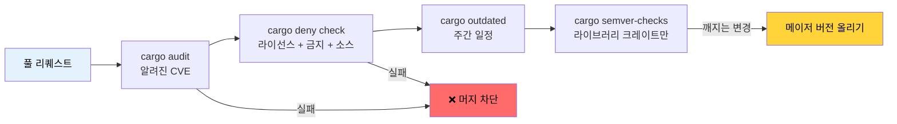

<a id="dependency-management-and-supply-chain-security"></a>
# 의존성 관리와 공급망 보안 🟢

> **이 장에서 배우는 것:**
> - `cargo-audit`으로 알려진 취약점 스캔
> - `cargo-deny`로 라이선스, 권고(advisory), 소스 정책 강제
> - Mozilla `cargo-vet`으로 공급망 신뢰 검증
> - 오래된 의존성 추적과 깨지는 API 변경 탐지
> - 의존성 트리 시각화와 중복 제거
>
> **교차 참고:** [릴리스 프로파일](ch07-release-profiles-and-binary-size.md) — 여기서 찾은 미사용 의존성은 `cargo-udeps`로 정리 · [CI/CD 파이프라인](ch11-putting-it-all-together-a-production-cic.md) — 파이프라인의 audit·deny 잡 · [빌드 스크립트](ch01-build-scripts-buildrs-in-depth.md) — `build-dependencies`도 공급망의 일부

Rust 바이너리에는 여러분의 코드만 들어 있는 것이 아니라 `Cargo.lock`의 모든 전이 의존성이 포함됩니다. 그 트리 어디에서든 취약점, 라이선스 위반, 악의적 크레이트는 *여러분*의 문제가 됩니다. 이 장에서는 의존성 관리를 감사 가능하고 자동화하는 도구를 다룹니다.

<a id="cargo-audit-known-vulnerability-scanning"></a>
### cargo-audit — 알려진 취약점 스캔

[`cargo-audit`](https://github.com/rustsec/rustsec/tree/main/cargo-audit)은 `Cargo.lock`을 [RustSec Advisory Database](https://rustsec.org/)와 대조해, 공개 크레이트의 알려진 취약점을 추적합니다.

```bash
# 설치
cargo install cargo-audit

# 알려진 취약점 스캔
cargo audit

# 출력 예:
# Crate:     chrono
# Version:   0.4.19
# Title:     Potential segfault in localtime_r invocations
# Date:      2020-11-10
# ID:        RUSTSEC-2020-0159
# URL:       https://rustsec.org/advisories/RUSTSEC-2020-0159
# Solution:  Upgrade to >= 0.4.20

# 취약점이 있으면 CI 실패
cargo audit --deny warnings

# 자동 처리용 JSON 출력
cargo audit --json

# Cargo.lock 업데이트로 취약점 수정
cargo audit fix
```

**CI 연동:**

```yaml
# .github/workflows/audit.yml
name: Security Audit
on:
  schedule:
    - cron: '0 0 * * *'  # 매일 — 권고는 계속 추가됨
  push:
    paths: ['Cargo.lock']

jobs:
  audit:
    runs-on: ubuntu-latest
    steps:
      - uses: actions/checkout@v4
      - uses: rustsec/audit-check@v2
        with:
          token: ${{ secrets.GITHUB_TOKEN }}
```

<a id="cargo-deny-comprehensive-policy-enforcement"></a>
### cargo-deny — 포괄적 정책 강제

[`cargo-deny`](https://github.com/EmbarkStudios/cargo-deny)는 취약점 스캔을 넘어, 네 가지 축에서 정책을 강제합니다:

1. **Advisories** — 알려진 취약점(cargo-audit과 유사)
2. **Licenses** — 허용/거부 라이선스 목록
3. **Bans** — 금지 크레이트 또는 중복 버전
4. **Sources** — 허용된 레지스트리와 git 소스

```bash
# 설치
cargo install cargo-deny

# 설정 초기화
cargo deny init
# 문서화된 기본값으로 deny.toml 생성

# 모든 검사 실행
cargo deny check

# 특정 검사만
cargo deny check advisories
cargo deny check licenses
cargo deny check bans
cargo deny check sources
```

**`deny.toml` 예:**

```toml
# deny.toml

[advisories]
vulnerability = "deny"        # 알려진 취약점이면 실패
unmaintained = "warn"         # 유지되지 않는 크레이트는 경고
yanked = "deny"               # yanked 크레이트면 실패
notice = "warn"               # 정보성 권고는 경고

[licenses]
unlicensed = "deny"           # 모든 크레이트에 라이선스 필요
allow = [
    "MIT",
    "Apache-2.0",
    "BSD-2-Clause",
    "BSD-3-Clause",
    "ISC",
    "Unicode-DFS-2016",
]
copyleft = "deny"             # 이 프로젝트에는 GPL/LGPL/AGPL 없음
default = "deny"              # 명시적으로 허용한 것만

[bans]
multiple-versions = "warn"    # 같은 크레이트가 2버전이면 경고
wildcards = "deny"            # path = "*" 의존성 금지
highlight = "all"             # 첫 번째뿐 아니라 모든 중복 표시

# 문제가 되는 특정 크레이트 금지
deny = [
    # openssl-sys는 C OpenSSL을 끌어옴 — rustls 선호
    { name = "openssl-sys", wrappers = ["native-tls"] },
]

# 불가피할 때 특정 중복 버전 허용
[[bans.skip]]
name = "syn"
version = "1.0"               # syn 1.x와 2.x가 자주 공존

[sources]
unknown-registry = "deny"     # crates.io만 허용
unknown-git = "deny"          # 임의 git 의존성 금지
allow-registry = ["https://github.com/rust-lang/crates.io-index"]
```

**라이선스 강제**는 상용 프로젝트에서 특히 가치가 있습니다:

```bash
# 의존성 트리에 어떤 라이선스가 있는지 확인
cargo deny list

# 출력 예:
# MIT          — 127 crates
# Apache-2.0   — 89 crates
# BSD-3-Clause — 12 crates
# MPL-2.0      — 3 crates   ← 법무 검토 필요할 수 있음
# Unicode-DFS  — 1 crate
```

<a id="cargo-vet-supply-chain-trust-verification"></a>
### cargo-vet — 공급망 신뢰 검증

[`cargo-vet`](https://github.com/mozilla/cargo-vet)(Mozilla)은 다른 질문에 답합니다. "이 크레이트에 알려진 버그가 있나?"가 아니라 "신뢰할 수 있는 사람이 이 코드를 실제로 검토했나?"

```bash
# 설치
cargo install cargo-vet

# 초기화(supply-chain/ 디렉터리 생성)
cargo vet init

# 검토가 필요한 크레이트 확인
cargo vet

# 크레이트를 검토한 뒤 인증:
cargo vet certify serde 1.0.203
# 기준에 맞게 serde 1.0.203을 검토했다고 기록

# 신뢰하는 조직의 감사 가져오기
cargo vet import mozilla
cargo vet import google
cargo vet import bytecode-alliance
```

**동작 방식:**

```text
supply-chain/
├── audits.toml       ← 팀의 감사 인증
├── config.toml       ← 신뢰 설정과 기준
└── imports.lock      ← 다른 조직에서 가져온 고정 import
```

`cargo-vet`은 공급망 요구가 엄격한 조직(정부, 금융, 인프라)에 가장 유용합니다. 대부분의 팀에는 `cargo-deny`만으로 충분한 보호가 됩니다.

<a id="cargo-outdated-and-cargo-semver-checks"></a>
### cargo-outdated와 cargo-semver-checks

**`cargo-outdated`** — 더 새 버전이 있는 의존성 찾기:

```bash
cargo install cargo-outdated

cargo outdated --workspace
# 출력 예:
# Name        Project  Compat  Latest   Kind
# serde       1.0.193  1.0.203 1.0.203  Normal
# regex       1.9.6    1.10.4  1.10.4   Normal
# thiserror   1.0.50   1.0.61  2.0.3    Normal  ← 메이저 업그레이드 가능
```

**`cargo-semver-checks`** — 게시 전 깨지는 API 변경 탐지. 라이브러리 크레이트에 필수:

```bash
cargo install cargo-semver-checks

# 변경이 semver와 호환되는지 확인
cargo semver-checks

# 출력 예:
# ✗ Function `parse_gpu_csv` is now private (was public)
#   → This is a BREAKING change. Bump MAJOR version.
#
# ✗ Struct `GpuInfo` has a new required field `power_limit_w`
#   → This is a BREAKING change. Bump MAJOR version.
#
# ✓ Function `parse_gpu_csv_v2` was added (non-breaking)
```

<a id="cargo-tree-dependency-visualization-and-deduplication"></a>
### cargo-tree — 의존성 시각화와 중복 제거

`cargo tree`는 Cargo에 내장되어 있으며(별도 설치 불필요) 의존성 그래프 이해에 매우 유용합니다:

```bash
# 전체 의존성 트리
cargo tree

# 특정 크레이트가 왜 포함됐는지
cargo tree --invert --package openssl-sys
# 크레이트에서 openssl-sys까지의 모든 경로 표시

# 중복 버전 찾기
cargo tree --duplicates
# 출력 예:
# syn v1.0.109
# └── serde_derive v1.0.193
#
# syn v2.0.48
# ├── thiserror-impl v1.0.56
# └── tokio-macros v2.2.0

# 직접 의존성만
cargo tree --depth 1

# 의존성 feature 표시
cargo tree --format "{p} {f}"

# 의존성 개수 세기
cargo tree | wc -l
```

**중복 제거 전략**: `cargo tree --duplicates`에 같은 크레이트가 메이저 두 버전이면, 의존성 체인을 올려 하나로 맞출 수 있는지 확인하세요. 중복마다 컴파일 시간과 바이너리 크기가 늘어납니다.

<a id="application-multi-crate-dependency-hygiene"></a>
### 적용: 멀티 크레이트 의존성 위생

워크스페이스는 중앙 집중식 버전 관리를 위해 `[workspace.dependencies]`를 사용하는 것이 좋습니다. 크기 분석을 위한 [`cargo tree --duplicates`](ch07-release-profiles-and-binary-size.md)와 함께 쓰면 버전 드리프트와 바이너리 비대화를 줄입니다:

```toml
# 루트 Cargo.toml — 버전을 한곳에 고정
[workspace.dependencies]
serde = { version = "1.0", features = ["derive"] }
serde_json = { version = "1.0", features = ["preserve_order"] }
regex = "1.10"
thiserror = "1.0"
anyhow = "1.0"
rayon = "1.8"
```

**프로젝트에 권장하는 추가 사항:**

```bash
# CI 파이프라인에 추가:
cargo deny init              # 일회 설정
cargo deny check             # 모든 PR — 라이선스, 권고, 금지
cargo audit --deny warnings  # 모든 푸시 — 취약점 스캔
cargo outdated --workspace   # 주간 — 업데이트 가능 버전 추적
```

**프로젝트용 권장 `deny.toml`:**

```toml
[advisories]
vulnerability = "deny"
yanked = "deny"

[licenses]
allow = ["MIT", "Apache-2.0", "BSD-2-Clause", "BSD-3-Clause", "ISC", "Unicode-DFS-2016"]
copyleft = "deny"     # 하드웨어 진단 도구 — 카피레프트 없음

[bans]
multiple-versions = "warn"   # 중복 추적, 아직은 블록하지 않음
wildcards = "deny"

[sources]
unknown-registry = "deny"
unknown-git = "deny"
```

<a id="supply-chain-audit-pipeline"></a>
### 공급망 감사 파이프라인



### 🏋️ 연습문제

#### 🟢 연습 1: 의존성 감사

아무 Rust 프로젝트에서 `cargo audit`과 `cargo deny init && cargo deny check`를 실행하세요. 권고가 몇 개 나오나요? 트리에 라이선스 범주는 몇 가지인가요?

<details>
<summary>해답</summary>

```bash
cargo audit
# 권고 확인 — 종종 chrono, time, 오래된 크레이트

cargo deny init
cargo deny list
# 라이선스 분해: MIT (N), Apache-2.0 (N) 등 표시

cargo deny check
# 네 가지 축 전체에 대한 감사 결과
```
</details>

#### 🟡 연습 2: 중복 의존성 찾아 통합

워크스페이스에서 `cargo tree --duplicates`를 실행하세요. 두 버전이 있는 크레이트를 찾고 `Cargo.toml`을 업데이트해 통합할 수 있나요? 컴파일 시간과 바이너리 크기 영향을 측정하세요.

<details>
<summary>해답</summary>

```bash
cargo tree --duplicates
# 전형적: syn 1.x와 syn 2.x

# 옛 버전을 끌어오는 쪽 찾기:
cargo tree --invert --package syn@1.0.109
# 출력: serde_derive 1.0.xxx -> syn 1.0.109

# serde_derive 최신이 syn 2.x를 쓰는지 확인:
cargo update -p serde_derive
cargo tree --duplicates
# syn 1.x가 사라지면 중복 제거됨

# 영향 측정:
time cargo build --release  # 전후
cargo bloat --release --crates | head -20
```
</details>

### 핵심 정리

- `cargo audit`은 알려진 CVE를 잡습니다 — 모든 푸시와 매일 스케줄로 실행하세요
- `cargo deny`는 권고, 라이선스, 금지, 소스 네 가지 정책을 강제합니다
- 멀티 크레이트 워크스페이스에는 `[workspace.dependencies]`로 버전을 중앙 관리하세요
- `cargo tree --duplicates`는 비대화를 드러냅니다; 중복마다 컴파일 시간과 바이너리 크기가 늘어납니다
- `cargo-vet`은 고보안 환경용이고, 대부분의 팀에는 `cargo-deny`로 충분합니다

---
