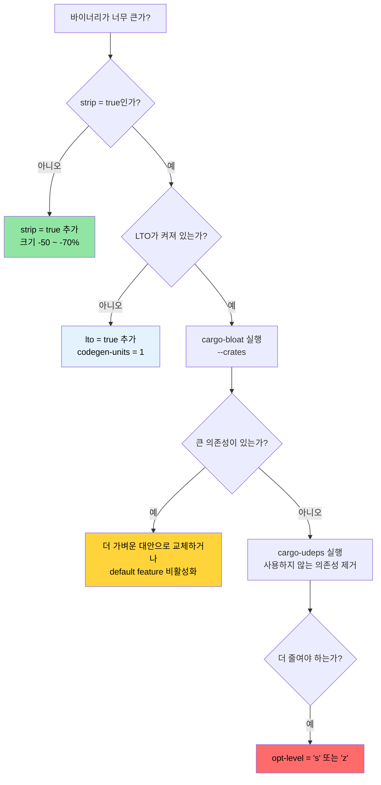

<a id="release-profiles-and-binary-size"></a>
# 릴리스 프로파일과 바이너리 크기 🟡

> **이 장에서 배우는 것:**
> - 릴리스 프로파일의 구성: LTO, codegen-units, panic 전략, strip, opt-level
> - Thin LTO, Fat LTO, 교차 언어 LTO의 트레이드오프
> - `cargo-bloat`를 사용한 바이너리 크기 분석
> - `cargo-udeps`와 `cargo-machete`를 사용한 의존성 다이어트
>
> **교차 참고:** [컴파일 시간과 개발자 도구](ch08-compile-time-and-developer-tools.md) — 최적화의 또 다른 절반 · [벤치마킹](ch03-benchmarking-measuring-what-matters.md) — 최적화 전에 실행 시간을 측정하기 · [의존성 관리](ch06-dependency-management-and-supply-chain-s.md) — 의존성을 줄이면 크기와 컴파일 시간 모두 줄어든다

기본 `cargo build --release`도 이미 충분히 괜찮습니다. 하지만 프로덕션 배포, 특히 수천 대의 서버에 단일 바이너리 도구를 배포하는 상황에서는 "괜찮음"과 "최적화됨" 사이에 꽤 큰 차이가 있습니다. 이 장에서는 프로파일 조정 옵션과 바이너리 크기를 측정하는 도구를 다룹니다.

<a id="release-profile-anatomy"></a>
### 릴리스 프로파일의 구성

Cargo 프로파일은 `rustc`가 코드를 어떻게 컴파일할지를 제어합니다. 기본값은 최대 성능보다 폭넓은 호환성에 맞춰진 보수적인 설정입니다.

```toml
# Cargo.toml — 별도 설정이 없을 때 Cargo가 사용하는 기본값

[profile.release]
opt-level = 3        # 최적화 수준 (0=없음, 1=기본, 2=양호, 3=공격적)
lto = false          # 링크 타임 최적화 OFF
codegen-units = 16   # 병렬 코드 생성 단위 (컴파일은 빠르지만 최적화는 덜 됨)
panic = "unwind"     # panic 시 스택 언와인딩 (바이너리 커짐, catch_unwind 가능)
strip = "none"       # 심볼과 디버그 정보 유지
overflow-checks = false  # 릴리스에서 정수 오버플로 검사 안 함
debug = false        # 릴리스에 디버그 정보 없음
```

**프로덕션 최적화 프로파일**(이 프로젝트가 이미 사용 중인 설정):

```toml
[profile.release]
lto = true           # 크레이트 전체를 가로지르는 최적화
codegen-units = 1    # 단일 codegen 단위 — 최적화 기회 극대화
panic = "abort"      # 언와인딩 오버헤드 제거 — 더 작고 더 빠름
strip = true         # 모든 심볼 제거 — 더 작은 바이너리
```

**각 설정의 영향:**

| 설정 | 기본값 → 최적화값 | 바이너리 크기 | 실행 속도 | 컴파일 시간 |
|------|-------------------|---------------|-----------|-------------|
| `lto = false → true` | — | -10 ~ -20% | +5 ~ +20% | 2~5배 느려짐 |
| `codegen-units = 16 → 1` | — | -5 ~ -10% | +5 ~ +10% | 1.5~2배 느려짐 |
| `panic = "unwind" → "abort"` | — | -5 ~ -10% | 미미함 | 미미함 |
| `strip = "none" → true` | — | -50 ~ -70% | 없음 | 없음 |
| `opt-level = 3 → "s"` | — | -10 ~ -30% | -5 ~ -10% | 비슷함 |
| `opt-level = 3 → "z"` | — | -15 ~ -40% | -10 ~ -20% | 비슷함 |

**추가로 조정할 만한 프로파일 옵션:**

```toml
[profile.release]
# 위 설정에 더해:
overflow-checks = true    # 릴리스에서도 오버플로 검사를 유지 (속도보다 안전성)
debug = "line-tables-only" # 전체 DWARF 없이도 백트레이스를 위한 최소 디버그 정보
rpath = false             # 런타임 라이브러리 경로를 바이너리에 박아 넣지 않음
incremental = false       # 증분 컴파일 비활성화 (더 깔끔한 빌드)

# 크기 최적화 빌드용 (임베디드, WASM):
# opt-level = "z"         # 크기에 강하게 최적화
# strip = "symbols"       # 심볼은 제거하되 디버그 섹션은 유지
```

**크레이트별 프로파일 오버라이드** — 뜨거운 경로만 최적화하고 나머지는 그대로 두기:

```toml
# 개발 빌드: 내 코드는 빠르게 다시 빌드하고, 의존성만 최적화
[profile.dev.package."*"]
opt-level = 2          # 개발 모드에서도 모든 의존성을 최적화

# 릴리스 빌드: 특정 크레이트만 더 강하게 최적화
[profile.release.package.serde_json]
opt-level = 3          # JSON 파싱에 최고 수준 최적화 적용
codegen-units = 1

# 테스트 프로파일: 통합 테스트가 릴리스와 더 비슷하게 동작하도록 설정
[profile.test]
opt-level = 1          # 느린 테스트 타임아웃을 줄이기 위한 약한 최적화
```

<a id="lto-in-depth-thin-vs-fat-vs-cross-language"></a>
### LTO 심화 — Thin, Fat, 교차 언어

링크 타임 최적화(Link-Time Optimization)는 LLVM이 크레이트 경계를 넘어 최적화할 수 있게 해줍니다. 예를 들어 `serde_json`의 함수를 파싱 코드 안으로 인라인하거나, `regex`에서 죽은 코드를 제거할 수 있습니다. LTO가 없으면 각 크레이트는 서로 분리된 최적화 섬처럼 취급됩니다.

```toml
[profile.release]
# 옵션 1: Fat LTO (lto = true일 때 기본 동작)
lto = true
# 모든 코드를 하나의 LLVM 모듈로 합침 → 최적화 극대화
# 컴파일은 가장 느리지만 바이너리는 가장 작고 빠름

# 옵션 2: Thin LTO
lto = "thin"
# 각 크레이트는 분리된 채로 두되 LLVM이 모듈 간 최적화를 수행
# Fat LTO보다 컴파일이 빠르고, 최적화 수준은 거의 비슷함
# 대부분의 프로젝트에서 가장 좋은 절충안

# 옵션 3: LTO 없음
lto = false
# 크레이트 내부 최적화만 수행
# 컴파일은 가장 빠르지만 바이너리는 더 큼

# 옵션 4: 명시적으로 끄기
lto = "off"
# false와 동일
```

**Fat LTO vs Thin LTO:**

| 항목 | Fat LTO (`true`) | Thin LTO (`"thin"`) |
|------|------------------|---------------------|
| 최적화 품질 | 최고 | fat의 약 95% |
| 컴파일 시간 | 느림 (모든 코드가 단일 모듈) | 보통 (모듈 병렬 처리 가능) |
| 메모리 사용량 | 높음 (모든 LLVM IR을 메모리에 유지) | 더 낮음 (스트리밍 가능) |
| 병렬성 | 없음 (단일 모듈) | 좋음 (모듈별 병렬 처리) |
| 추천 용도 | 최종 릴리스 빌드 | CI 빌드, 개발 중 빌드 |

**교차 언어 LTO** — Rust와 C 경계를 넘는 최적화:

```toml
[profile.release]
lto = true

# Cargo.toml — cc 크레이트를 사용하는 경우
[build-dependencies]
cc = "1.0"
```

```rust
// build.rs — 교차 언어(linker-plugin) LTO 활성화
fn main() {
    // cc 크레이트는 환경 변수의 CFLAGS를 존중한다.
    // 교차 언어 LTO를 위해 C 코드는 다음과 같이 컴파일한다:
    //   -flto=thin -O2
    cc::Build::new()
        .file("csrc/fast_parser.c")
        .flag("-flto=thin")
        .opt_level(2)
        .compile("fast_parser");
}
```

```bash
# 링커 플러그인 LTO 활성화 (호환되는 LLD 또는 gold 링커 필요)
RUSTFLAGS="-Clinker-plugin-lto -Clinker=clang -Clink-arg=-fuse-ld=lld" \
    cargo build --release
```

교차 언어 LTO를 사용하면 LLVM이 C 함수를 Rust 호출자 안으로 인라인하고, 반대로 Rust 함수를 C 쪽으로도 인라인할 수 있습니다. 이는 작은 C 함수를 매우 자주 호출하는 FFI 중심 코드(예: IPMI ioctl 래퍼)에서 특히 효과가 큽니다.

<a id="binary-size-analysis-with-cargo-bloat"></a>
### `cargo-bloat`로 바이너리 크기 분석하기

[`cargo-bloat`](https://github.com/RazrFalcon/cargo-bloat)는 다음 질문에 답해 줍니다. "내 바이너리에서 가장 많은 공간을 차지하는 함수와 크레이트는 무엇인가?"

```bash
# 설치
cargo install cargo-bloat

# 가장 큰 함수 보기
cargo bloat --release -n 20
# 출력:
#  File  .text     Size          Crate    Name
#  2.8%   5.1%  78.5KiB  serde_json       serde_json::de::Deserializer::parse_...
#  2.1%   3.8%  58.2KiB  regex_syntax     regex_syntax::ast::parse::ParserI::p...
#  1.5%   2.7%  42.1KiB  accel_diag         accel_diag::vendor::parse_smi_output
#  ...

# 크레이트별 보기 (어떤 의존성이 가장 큰가?)
cargo bloat --release --crates
# 출력:
#  File  .text     Size Crate
# 12.3%  22.1%  340KiB serde_json
#  8.7%  15.6%  240KiB regex
#  6.2%  11.1%  170KiB std
#  5.1%   9.2%  141KiB accel_diag
#  ...

# 두 번의 빌드 비교하기 (최적화 전/후)
cargo bloat --release --crates > before.txt
# ... 변경 적용 ...
cargo bloat --release --crates > after.txt
diff before.txt after.txt
```

**흔한 바이너리 비대화 원인과 대응책:**

| 비대화 원인 | 전형적인 크기 | 대응책 |
|-------------|---------------|--------|
| `regex` (전체 엔진) | 200~400 KB | 유니코드가 필요 없다면 `regex-lite` 사용 |
| `serde_json` (전체 기능) | 200~350 KB | 성능이 중요하면 `simd-json` 또는 `sonic-rs` 고려 |
| 제네릭 단형성화(monomorphization) | 제각각 | API 경계에서 `dyn Trait` 사용 고려 |
| 포매팅 machinery (`Display`, `Debug`) | 50~150 KB | 큰 enum에 `#[derive(Debug)]`를 남발하면 크기가 쌓임 |
| panic 메시지 문자열 | 20~80 KB | `panic = "abort"`는 언와인딩을 제거하고, `strip`은 문자열을 줄임 |
| 사용하지 않는 feature | 제각각 | 기본 feature 끄기: `serde = { version = "1", default-features = false }` |

<a id="trimming-dependencies-with-cargo-udeps"></a>
### `cargo-udeps`로 의존성 다이어트하기

[`cargo-udeps`](https://github.com/est31/cargo-udeps)는 `Cargo.toml`에 선언되어 있지만 코드에서 실제로는 사용하지 않는 의존성을 찾아줍니다.

```bash
# 설치 (nightly 필요)
cargo install cargo-udeps

# 사용하지 않는 의존성 찾기
cargo +nightly udeps --workspace
# 출력:
# unused dependencies:
# `diag_tool v0.1.0`
# └── "tempfile" (dev-dependency)
#
# `accel_diag v0.1.0`
# └── "once_cell"    ← 예전 LazyLock 이전에는 필요했지만 지금은 죽은 의존성
```

사용하지 않는 의존성은 모두 다음 문제를 일으킵니다.
- 컴파일 시간을 늘린다
- 바이너리 크기를 키운다
- 공급망 위험을 더한다
- 라이선스 검토 부담을 늘릴 수 있다

**대안: `cargo-machete`** — 더 빠른 휴리스틱 기반 접근:

```bash
cargo install cargo-machete
cargo machete
# 더 빠르지만 오탐이 있을 수 있음 (컴파일 기반이 아니라 휴리스틱 기반)
```

<a id="size-optimization-decision-tree"></a>
### 크기 최적화 의사결정 트리



<a id="exercises"></a>
### 🏋️ 연습문제

<a id="exercise-1-measure-lto-impact"></a>
#### 🟢 연습문제 1: LTO 영향 측정하기

기본 릴리스 설정으로 프로젝트를 빌드한 뒤, `lto = true` + `codegen-units = 1` + `strip = true`를 적용한 설정으로 다시 빌드해 보세요. 바이너리 크기와 컴파일 시간을 비교해 보세요.

<details>
<summary>해답</summary>

```bash
# 기본 릴리스
cargo build --release
ls -lh target/release/my-binary
time cargo build --release  # 시간 기록

# 최적화 릴리스 — Cargo.toml에 추가:
# [profile.release]
# lto = true
# codegen-units = 1
# strip = true
# panic = "abort"

cargo clean
cargo build --release
ls -lh target/release/my-binary  # 보통 30~50% 더 작아짐
time cargo build --release       # 보통 컴파일은 2~3배 느려짐
```
</details>

<a id="exercise-2-find-your-biggest-crate"></a>
#### 🟡 연습문제 2: 가장 큰 크레이트 찾기

프로젝트에서 `cargo bloat --release --crates`를 실행해 보세요. 가장 큰 의존성을 찾고, 기본 feature를 끄거나 더 가벼운 대안으로 바꿔서 줄일 수 있는지 확인해 보세요.

<details>
<summary>해답</summary>

```bash
cargo install cargo-bloat
cargo bloat --release --crates
# 출력:
#  File  .text     Size Crate
# 12.3%  22.1%  340KiB serde_json
#  8.7%  15.6%  240KiB regex

# regex의 경우 — 유니코드가 필요 없다면 regex-lite를 시도:
# regex-lite = "0.1"  # 전체 regex보다 대략 10배 작음

# serde의 경우 — std가 필요 없다면 기본 feature 비활성화:
# serde = { version = "1", default-features = false, features = ["derive"] }

cargo bloat --release --crates  # 변경 후 다시 비교
```
</details>

<a id="key-takeaways"></a>
### 핵심 정리

- `lto = true` + `codegen-units = 1` + `strip = true` + `panic = "abort"` 조합은 프로덕션용 릴리스 프로파일의 기본축이다
- Thin LTO(`lto = "thin"`)는 Fat LTO 이점의 약 80%를 훨씬 낮은 컴파일 비용으로 제공한다
- `cargo-bloat --crates`는 어떤 의존성이 바이너리 공간을 잡아먹는지 정확히 보여준다
- `cargo-udeps`와 `cargo-machete`는 컴파일 시간과 바이너리 크기를 낭비하는 죽은 의존성을 찾아낸다
- 크레이트별 프로파일 오버라이드는 전체 빌드를 느리게 하지 않고 뜨거운 크레이트만 최적화하게 해준다

---
